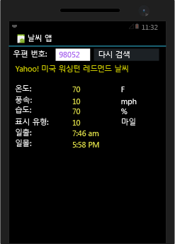
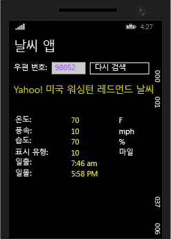

# <a name="build-apps-with-native-ui-using-xamarin-in-visual-studio"></a>Visual Studio에서 Xamarin을 사용하여 네이티브 UI로 앱 빌드
[설정 및 설치](../cross-platform/setup-and-install.md) 및 [Xamarin 환경 확인](../cross-platform/verify-your-xamarin-environment.md)의 단계를 완료했으면 이 연습 과정을 통해 네이티브 UI 레이어로 기본 Xamarin 앱을 빌드하는 방법을 확인합니다(아래 참조). 네이티브 UI에서는 공유 코드가 PCL(이식 가능한 클래스 라이브러리)에 상주하며 개별 플랫폼 프로젝트가 UI 정의를 포함합니다.  
  
   
  
 앱을 빌드하려면 다음 작업을 수행합니다.  
  
-   [솔루션 설정](#solution)  
  
-   [공유 데이터 서비스 코드 작성](#dataservice)  
  
-   [Android용 UI 디자인](#Android)  
  
-   [Windows Phone용 UI 디자인](#Windows)  
  
-   [다음 단계](#next)  
  
> [!TIP]
>  [GitHub의 mobile-samples 리포지토리](https://github.com/xamarin/mobile-samples/tree/master/Weather)에서 이 프로젝트에 대한 전체 소스 코드를 찾을 수 있습니다.
>
>   어려움이 있거나 오류가 발생하면 [forums.xamarin.com](http://forums.xamarin.com)에 질문을 게시하세요. Xamarin에 필요한 최신 SDK로 업데이트하면 많은 오류를 해결할 수 있습니다. 자세한 내용은 각 플랫폼에 대한 [Xamarin 릴리스 정보](https://developer.xamarin.com/releases/)에 설명되어 있습니다.    
  
> [!NOTE]
>  Xamarin 개발자 설명서에서는 아래와 같이 빠른 시작 및 심층 분석 섹션이 둘 다 포함된 여러 가지 연습도 제공합니다. 이러한 모든 페이지에서 Visual Studio 관련 연습을 보려면 페이지 오른쪽 위에서 "Visual Studio"를 선택해야 합니다.  
>   
>  -   네이티브 UI를 사용한 Xamarin 앱:  
>   
>      -   [Hello, Android](https://developer.xamarin.com/guides/android/getting_started/hello,android/) (단일 화면을 사용한 간단한 앱)  
>     -   [Hello, Android 멀티스크린](https://developer.xamarin.com/guides/android/getting_started/hello,android_multiscreen/) (화면 간 탐색을 사용한 앱)  
>     -   [Android 조각 연습](http://developer.xamarin.com/guides/android/platform_features/fragments/fragments_walkthrough/) (마스터/세부 정보 화면에 사용됨)  
>     -   [Hello, iOS](https://developer.xamarin.com/guides/ios/getting_started/hello,_iOS/)  
>     -   [Hello, iOS 멀티스크린](https://developer.xamarin.com/guides/ios/getting_started/hello,_iOS_multiscreen/)  
> -   Xamarin.Forms를 사용한 Xamarin 앱(공유 UI)  
>   
>      -   [Hello, Xamarin.Forms](https://developer.xamarin.com/guides/cross-platform/xamarin-forms/getting-started/hello-xamarin-forms/quickstart/)  
>     -   [Hello, Xamarin.Forms 멀티스크린](https://developer.xamarin.com/guides/cross-platform/xamarin-forms/getting-started/hello-xamarin-forms-multiscreen/)  
  
##  <a name="solution"></a> 솔루션 설정  
 다음 단계에서는 공유 코드에 대한 PCL과 두 개의 추가 NuGet 패키지를 포함하는 네이티브 UI로 Xamarin 솔루션을 만듭니다.  
  
1.  Visual Studio에서 새 **비어 있는 앱(네이티브 이식 가능)** 솔루션을 만들고 **WeatherApp**으로 이름을 지정합니다. 검색 필드에 **네이티브 이식 가능**을 입력하면 이 템플릿을 가장 쉽게 찾을 수 있습니다.  
  
     템플릿이 이 위치에 없으면 Xamarin을 설치하거나 Visual Studio 2015 기능을 사용하도록 설정해야 합니다. [설정 및 설치](../cross-platform/setup-and-install.md)를 참조하세요.  
  
2.  [확인]을 클릭하여 솔루션을 만든 후에는 많은 개별 프로젝트가 만들어집니다.  
  
    -   **WeatherApp(이식 가능)**: 일반적인 비즈니스 논리 및 Xamarin.Forms를 사용하는 UI 코드를 포함하여 플랫폼 간에 공유되는 코드를 작성하는 PCL입니다.  
  
    -   **WeatherApp.Droid**: 네이티브 Android 코드를 포함하는 프로젝트. 이 프로젝트가 기본 시작 프로젝트로 설정됩니다.  
  
    -   **WeatherApp.iOS**: 네이티브 iOS 코드를 포함하는 프로젝트  
  
    -   **WeatherApp.WinPhone(Windows Phone 8.1)**: 네이티브 Windows Phone 코드를 포함하는 프로젝트  
  
     각 네이티브 프로젝트 내에서 해당 플랫폼에 대한 네이티브 디자이너에 액세스하여 플랫폼 특정 화면을 구현할 수 있습니다.  
  
3.  **Newtonsoft.Json** 및 NuGet 패키지를 PCL 프로젝트에 추가합니다. 이 프로젝트는 날씨 데이터 서비스에서 검색된 정보를 처리하는 데 사용됩니다.  
  
    -   솔루션 탐색기에서 **솔루션 'WeatherApp'**을 마우스 오른쪽 단추로 클릭하고 **솔루션에 대한 NuGet 패키지 관리...**를 선택합니다.  
  
         NuGet 창에서 **찾아보기** 탭을 선택하고 **Newtonsoft**를 검색합니다.  
  
    -   **Newtonsoft.Json**을 선택합니다.  
  
    -   창의 오른쪽에서 **WeatherApp** 프로젝트를 선택합니다(패키지를 설치하는 데는 이 프로젝트만 필요함).  
  
    -   **버전** 필드가 **안정적인 최신 버전** 으로 설정되어 있는지 확인합니다.  
  
    -   **설치**를 클릭합니다.  
  
    -     
  
4.  3단계를 반복하여 **Microsoft.Net.Http** 패키지를 찾아서 설치합니다.  
  
5.  솔루션을 빌드하고 빌드 오류가 없는지 확인합니다.  
  
##  <a name="dataservice"></a> 공유 데이터 서비스 코드 작성  
 **WeatherApp(이식 가능)** 프로젝트는 모든 플랫폼에서 공유되는 PCL(이식 가능한 클래스 라이브러리)에 대한 코드를 작성하는 프로젝트입니다. PCL은 iOS, Android, Windows Phone 프로젝트에서 빌드된 앱 패키지에 자동으로 포함됩니다.  
  
 다음 단계에서는 날씨 서비스의 데이터를 액세스하고 저장하기 위한 코드를 PCL에 추가합니다.  
  
1.  이 샘플을 실행하려면 무료 API 키를 위해 [http://openweathermap.org/appid](http://openweathermap.org/appid)에 먼저 등록해야 합니다.  
  
2.  **WeatherApp** 프로젝트를 마우스 오른쪽 단추로 클릭하고 **추가 > 클래스...**를 선택합니다. **새 항목 추가** 대화 상자에서 파일 이름을 **Weather.cs**로 지정합니다. 이 클래스는 날씨 데이터 서비스의 데이터를 저장하는 데 사용합니다.  
  
3.  **Weather.cs** 의 전체 내용을 다음으로 바꿉니다.  
  
    ```c#  
    namespace WeatherApp  
    {  
        public class Weather  
        {  
            public string Title { get; set; }  
            public string Temperature { get; set; }  
            public string Wind { get; set; }  
            public string Humidity { get; set; }  
            public string Visibility { get; set; }  
            public string Sunrise { get; set; }  
            public string Sunset { get; set; }  
  
            public Weather()  
            {  
                //Because labels bind to these values, set them to an empty string to  
                //ensure that the label appears on all platforms by default.  
                this.Title = " ";  
                this.Temperature = " ";  
                this.Wind = " ";  
                this.Humidity = " ";  
                this.Visibility = " ";  
                this.Sunrise = " ";  
                this.Sunset = " ";  
            }  
        }  
    }  
    ```  
  
4.  **DataService.cs**라는 PCL 프로젝트에 다른 클래스를 추가합니다. 이 프로젝트는 날씨 데이터 서비스의 JSON 데이터를 처리하는 데 사용됩니다.  
  
5.  **DataService.cs** 의 전체 내용을 다음 코드로 바꿉니다.  
  
    ```c#  
    using System.Threading.Tasks;  
    using Newtonsoft.Json;  
    using System.Net.Http;  
  
    namespace WeatherApp  
    {  
        public class DataService  
        {  
            public static async Task<dynamic> getDataFromService(string queryString)  
            {  
                HttpClient client = new HttpClient();  
                var response = await client.GetAsync(queryString);  
  
                dynamic data = null;  
                if (response != null)  
                {  
                    string json = response.Content.ReadAsStringAsync().Result;  
                    data = JsonConvert.DeserializeObject(json);  
                }  
  
                return data;  
            }  
        }  
    }  
    ```  
  
6.  **Core**라는 PCL에 세 번째 클래스를 추가합니다. 여기서는 우편 번호를 사용하여 쿼리 문자열을 구성하고, 날씨 데이터 서비스를 호출한 다음 **Weather** 클래스의 인스턴스를 채우는 논리와 같은 공유 비즈니스 논리를 추가하게 됩니다.  
  
7.  그런 후 **Core.cs** 의 내용을 다음으로 바꿉니다.  
  
    ```c#  
    using System;  
    using System.Threading.Tasks;  
  
    namespace WeatherApp  
    {  
        public class Core  
        {  
            public static async Task<Weather> GetWeather(string zipCode)  
            {  
                //Sign up for a free API key at http://openweathermap.org/appid  
                string key = "YOUR KEY HERE";  
                string queryString = "http://api.openweathermap.org/data/2.5/weather?zip="  
                    + zipCode + ",us&appid=" + key + "&units=imperial";  

                //Make sure developers running this sample replaced the API key
                if (key == "YOUR API KEY HERE")
                {
                    throw new ArgumentException("You must obtain an API key from openweathermap.org/appid and save it in the 'key' variable.");
                }
  
                dynamic results = await DataService.getDataFromService(queryString).ConfigureAwait(false);  
  
                if (results["weather"] != null)  
                {  
                    Weather weather = new Weather();  
                    weather.Title = (string)results["name"];                  
                    weather.Temperature = (string)results["main"]["temp"] + " F";  
                    weather.Wind = (string)results["wind"]["speed"] + " mph";                  
                    weather.Humidity = (string)results["main"]["humidity"] + " %";  
                    weather.Visibility = (string)results["weather"][0]["main"];  
  
                    DateTime time = new System.DateTime(1970, 1, 1, 0, 0, 0, 0);  
                    DateTime sunrise = time.AddSeconds((double)results["sys"]["sunrise"]);  
                    DateTime sunset = time.AddSeconds((double)results["sys"]["sunset"]);  
                    weather.Sunrise = sunrise.ToString() + " UTC";  
                    weather.Sunset = sunset.ToString() + " UTC";  
                    return weather;  
                }  
                else  
                {  
                    return null;  
                }  
            }  
        }  
    }  
    ```  
  
8.  코드의 *YOUR KEY HERE*를 1단계에서 얻은 API 키로 바꿉니다(여전히 주위에 따옴표 필요).  
  
9. 사용하지 않을 것이므로 PCL에서 MyClass.cs를 삭제합니다.  
  
10. **WeatherApp** PCL 프로젝트를 빌드하여 코드가 올바른지 확인합니다.  
  
##  <a name="Android"></a> Android용 UI 디자인  
 이제 사용자 인터페이스를 디자인하고 공유 코드에 연결한 후 앱을 실행합니다.  
  
### <a name="design-the-look-and-feel-of-your-app"></a>앱의 모양과 느낌 디자인  
  
1.  **솔루션 탐색기**에서 **WeatherApp.Droid**>**Resources**>**layout** 폴더를 확장하고 **Main.axml**을 엽니다. 비주얼 디자이너에서 파일이 열립니다. Java 관련 오류가 나타나는 경우 이 [블로그 게시물](http://forums.xamarin.com/discussion/32365/connection-to-the-layout-renderer-failed-in-xs-5-7-and-xamarinvs-3-9)을 참조하세요.  
  
    > [!TIP]
    >  프로젝트에는 다른 많은 파일이 있습니다. 이 항목에서는 이러한 파일에 대해 자세히 다루지 않지만 Android 프로젝트의 구조를 좀 더 자세히 알아보려면 xamarin.com의 Hello Android 항목에서 [Part 2 Deep Dive(2부 자세히 알아보기)](http://developer.xamarin.com/guides/android/getting_started/hello,android/hello,android_deepdive/)를 참조하세요.  
  
2.  디자이너에 표시되는 기본 단추를 선택하여 삭제합니다.  
  
3.  **보기 > 다른 창 > 도구 상자**를 선택하여 도구 상자를 엽니다.  
  
4.  **도구 상자**의 **RelativeLayout** 컨트롤을 디자이너로 끕니다. 이 컨트롤을 다른 컨트롤의 부모 컨테이너로 사용하게 됩니다.  
  
    > [!TIP]
    >  레이아웃이 올바르게 표시되지 않는 경우 언제든지 파일을 저장하고 **디자인** 및 **소스** 탭 간에 전환하여 새로 고칩니다.  
  
5.  **속성** 창에서 **배경** 속성(스타일 그룹)을 `#545454`로 설정합니다.  
  
6.  **도구 상자**의 **TextView** 컨트롤을 **RelativeLayout** 컨트롤로 끕니다.  
  
7.  **속성** 창에서 다음 속성을 설정합니다(참고: 속성 창 도구 모음의 정렬 단추를 사용하면 목록을 사전순으로 정렬하는 데 도움이 될 수 있음).  
  
    |속성|값|  
    |--------------|-----------|  
    |**text**|**우편 번호로 검색**|  
    |**id**|`@+id/ZipCodeSearchLabel`|  
    |**layout_marginLeft**|`10dp`|  
    |**textColor**|`@android:color/white`|  
    |**textStyle**|`bold`|  
  
    > [!TIP]
    >  대부분의 속성은 선택 가능한 값이 포함된 드롭다운 목록이 없습니다.  따라서 특정 속성에 어떤 문자열 값을 사용해야 할지 추측하기가 어려울 수 있습니다. 제안 사항을 보려면 [R.attr](http://developer.android.com/reference/android/R.attr.html) 클래스 페이지에서 속성 이름을 검색해 보세요.  
    >   
    >  또한 빠른 웹 검색을 수행하면 [http://stackoverflow.com/](http://stackoverflow.com/) 에서 다른 사용자가 동일한 속성을 사용한 페이지를 종종 찾을 수 있습니다.  
  
     참조용으로, **소스** 보기로 전환하면 이 요소에 대해 다음 코드가 표시됩니다.  
  
    ```xml  
    <TextView  
        android:text="Search by Zip Code"  
        android:layout_width="wrap_content"  
        android:layout_height="wrap_content"  
        android:id="@+id/ZipCodeSearchLabel"  
        android:layout_centerVertical="true"  
        android:layout_marginLeft="10dp"  
        android:textColor="@android:color/white"  
        android:textStyle="bold" />  
  
    ```  
  
8.  **도구 상자**에서 **TextView** 컨트롤을 **RelativeLayout** 컨트롤로 끌어와 ZipCodeSearchLabel 컨트롤 아래에 놓습니다. 새 컨트롤을 기존 컨트롤의 적절한 가장자리에 놓으면 됩니다. 디자이너를 약간 확대하면 도움이 됩니다.  
  
9. **속성** 창에서 다음 속성을 설정합니다.  
  
    |속성|값|  
    |--------------|-----------|  
    |**텍스트**|**우편 번호**|  
    |**ID**|`@+id/ZipCodeLabel`|  
    |**layout_marginLeft**|`10dp`|  
    |**layout_marginTop**|`5dp`|  
  
     **소스** 보기의 코드는 다음과 같습니다.  
  
    ```xml  
    <TextView  
        android:text="Zip Code"  
        android:layout_width="wrap_content"  
        android:layout_height="wrap_content"  
        android:layout_below="@id/ZipCodeSearchLabel"  
        android:id="@+id/ZipCodeLabel"  
        android:layout_marginTop="5dp"  
        android:layout_marginLeft="10dp" />  
    ```  
  
10. **도구 상자**의 **숫자** 컨트롤을 **RelativeLayout**으로 끌고 **Zip Code** 레이블 아래에 배치합니다. 다음 속성을 설정합니다.  
  
    |속성|값|  
    |--------------|-----------|  
    |**ID**|`@+id/zipCodeEntry`|  
    |**layout_marginLeft**|`10dp`|  
    |**layout_marginBottom**|`10dp`|  
    |**width**|`165dp`|  
  
     이제 코드는 다음과 같습니다.  
  
    ```xml  
    <EditText  
        android:inputType="number"  
        android:layout_width="wrap_content"  
        android:layout_height="wrap_content"  
        android:layout_below="@id/ZipCodeLabel"  
        android:id="@+id/zipCodeEntry"  
        android:layout_marginLeft="10dp"  
        android:layout_marginBottom="10dp"  
        android:width="165dp" />  
    ```  
  
11. **도구 상자**에서 **단추**를 **RelativeLayout** 컨트롤로 끌고 zipCodeEntry 컨트롤 오른쪽에 배치합니다. 다음 속성을 설정합니다.  
  
    |속성|값|  
    |--------------|-----------|  
    |**ID**|`@+id/weatherBtn`|  
    |**텍스트**|**날씨 검색**|  
    |**layout_marginLeft**|`20dp`|  
    |**layout_alignBottom**|`@id/zipCodeEntry`|  
    |**width**|`165dp`|  
  
    ```xml  
    <Button    android:text="Get Weather"  
        android:layout_width="wrap_content"  
        android:layout_height="wrap_content"  
        android:layout_toRightOf="@id/zipCodeEntry"  
        android:id="@+id/weatherBtn"  
        android:layout_marginLeft="20dp"  
        android:layout_alignBottom="@id/zipCodeEntry"  
        android:width="165dp" />  
    ```  
  
12. Android 디자이너를 사용하여 기본 UI를 빌드할 수 있을 정도로 충분히 연습했습니다. 페이지의 .asxml 파일에 직접 마크업을 추가하여 UI를 빌드할 수도 있습니다. UI의 나머지를 이런 방식으로 빌드하려면 디자이너에서 소스 보기로 전환하고, `</RelativeLayout>` 태그 *아래에* 다음 마크업을 붙여 넣습니다. 태그 아래입니다. 이러한 요소는 ReleativeLayout에 포함되어 있지 않습니다.  
  
    ```xml  
    <TextView  
            android:text="Location"  
            android:textAppearance="?android:attr/textAppearanceSmall"  
            android:layout_width="match_parent"  
            android:layout_height="wrap_content"  
            android:id="@+id/locationLabel"  
            android:layout_marginLeft="10dp"  
            android:layout_marginTop="10dp" />  
        <TextView  
            android:textAppearance="?android:attr/textAppearanceMedium"  
            android:layout_width="match_parent"  
            android:layout_height="wrap_content"  
            android:id="@+id/locationText"  
            android:layout_marginLeft="20dp"  
            android:layout_marginBottom="10dp" />  
        <TextView  
            android:text="Temperature"  
            android:textAppearance="?android:attr/textAppearanceSmall"  
            android:layout_width="match_parent"  
            android:layout_height="wrap_content"  
            android:id="@+id/tempLabel"  
            android:layout_marginLeft="10dp" />  
        <TextView  
            android:textAppearance="?android:attr/textAppearanceMedium"  
            android:layout_width="match_parent"  
            android:layout_height="wrap_content"  
            android:id="@+id/tempText"  
            android:layout_marginBottom="10dp"  
            android:layout_marginLeft="20dp" />  
        <TextView  
            android:text="Wind Speed"  
            android:textAppearance="?android:attr/textAppearanceSmall"  
            android:layout_width="match_parent"  
            android:layout_height="wrap_content"  
            android:id="@+id/windLabel"  
            android:layout_marginLeft="10dp" />  
        <TextView  
            android:textAppearance="?android:attr/textAppearanceMedium"  
            android:layout_width="match_parent"  
            android:layout_height="wrap_content"  
            android:id="@+id/windText"  
            android:layout_marginBottom="10dp"  
            android:layout_marginLeft="20dp" />  
        <TextView  
            android:text="Humidity"  
            android:textAppearance="?android:attr/textAppearanceSmall"  
            android:layout_width="match_parent"  
            android:layout_height="wrap_content"  
            android:id="@+id/humidtyLabel"  
            android:layout_marginLeft="10dp" />  
        <TextView  
            android:textAppearance="?android:attr/textAppearanceMedium"  
            android:layout_width="match_parent"  
            android:layout_height="wrap_content"  
            android:id="@+id/humidityText"  
            android:layout_marginBottom="10dp"  
            android:layout_marginLeft="20dp" />  
        <TextView  
            android:text="Visibility"  
            android:textAppearance="?android:attr/textAppearanceSmall"  
            android:layout_width="match_parent"  
            android:layout_height="wrap_content"  
            android:id="@+id/visibilityLabel"  
            android:layout_marginLeft="10dp" />  
        <TextView  
            android:textAppearance="?android:attr/textAppearanceMedium"  
            android:layout_width="match_parent"  
            android:layout_height="wrap_content"  
            android:id="@+id/visibilityText"  
            android:layout_marginBottom="10dp"  
            android:layout_marginLeft="20dp" />  
        <TextView  
            android:text="Time of Sunrise"  
            android:textAppearance="?android:attr/textAppearanceSmall"  
            android:layout_width="match_parent"  
            android:layout_height="wrap_content"  
            android:id="@+id/sunriseLabel"  
            android:layout_marginLeft="10dp" />  
        <TextView  
            android:textAppearance="?android:attr/textAppearanceMedium"  
            android:layout_width="match_parent"  
            android:layout_height="wrap_content"  
            android:id="@+id/sunriseText"  
            android:layout_marginBottom="10dp"  
            android:layout_marginLeft="20dp" />  
        <TextView  
            android:text="Time of Sunset"  
            android:textAppearance="?android:attr/textAppearanceSmall"  
            android:layout_width="match_parent"  
            android:layout_height="wrap_content"  
            android:id="@+id/sunsetLabel"  
            android:layout_marginLeft="10dp" />  
        <TextView  
            android:textAppearance="?android:attr/textAppearanceMedium"  
            android:layout_width="match_parent"  
            android:layout_height="wrap_content"  
            android:id="@+id/sunsetText"  
            android:layout_marginBottom="10dp"  
            android:layout_marginLeft="20dp" />  
  
    ```  
  
13. 파일을 저장하고 **디자인** 보기로 전환합니다. UI가 다음과 같아야 합니다.  
  
       
  
14. **MainActivity.cs**를 열고 *OnCreate* 메서드에서 앞서 제거된 기본 단추를 참조하는 줄을 삭제합니다. 완료했을 때 코드는 다음과 같습니다.  
  
    ```  
    protected override void OnCreate (Bundle bundle)  
    {  
        base.OnCreate (bundle);  
  
        // Set our view from the "main" layout resource  
        SetContentView (Resource.Layout.Main);  
    }  
    ```  
  
15. Android 프로젝트를 빌드하여 작업을 확인합니다. 코드에서 이름으로 컨트롤을 참조할 수 있도록 컨트롤 ID가 **Resource.Designer.cs** 파일에 추가됩니다.  
  
### <a name="consume-your-shared-code"></a>공유 코드 사용  
  
1.  코드 편집기에서 **WeatherApp** 프로젝트의 **MainActivity.cs** 파일을 열고 내용을 다음 코드로 바꿉니다. 이 코드는 공유 코드에 정의된 `GetWeather` 메서드를 호출합니다. 그런 다음 해당 메서드에서 검색된 데이터를 앱의 UI에 표시합니다.  
  
    ```c#  
    using System;  
    using Android.App;  
    using Android.Widget;  
    using Android.OS;  
  
    namespace WeatherApp.Droid  
    {  
        [Activity(Label = "Sample Weather App", MainLauncher = true, Icon = "@drawable/icon")]  
        public class MainActivity : Activity  
        {  
            protected override void OnCreate(Bundle bundle)  
            {  
                base.OnCreate(bundle);  
  
                SetContentView(Resource.Layout.Main);  
  
                Button button = FindViewById<Button>(Resource.Id.weatherBtn);  
  
                button.Click += Button_Click;  
            }  
  
            private async void Button_Click(object sender, EventArgs e)  
            {  
                EditText zipCodeEntry = FindViewById<EditText>(Resource.Id.zipCodeEntry);  
  
                if (!String.IsNullOrEmpty(zipCodeEntry.Text))  
                {  
                    Weather weather = await Core.GetWeather(zipCodeEntry.Text);  
                    FindViewById<TextView>(Resource.Id.locationText).Text = weather.Title;  
                    FindViewById<TextView>(Resource.Id.tempText).Text = weather.Temperature;  
                    FindViewById<TextView>(Resource.Id.windText).Text = weather.Wind;  
                    FindViewById<TextView>(Resource.Id.visibilityText).Text = weather.Visibility;  
                    FindViewById<TextView>(Resource.Id.humidityText).Text = weather.Humidity;  
                    FindViewById<TextView>(Resource.Id.sunriseText).Text = weather.Sunrise;  
                    FindViewById<TextView>(Resource.Id.sunsetText).Text = weather.Sunset;  
                }  
            }  
        }  
    }  
    ```  
  
### <a name="run-the-app-and-see-how-it-looks"></a>앱을 실행하고 어떻게 나타나는지 확인합니다.  
  
1.  **솔루션 탐색기**에서 **WeatherApp.Droid** 프로젝트가 시작 프로젝트로 설정되었는지 확인합니다.  
  
2.  적절한 장치 또는 에뮬레이터 대상을 선택한 다음 F5 키를 눌러 앱을 시작합니다.  
  
3.  장치 또는 에뮬레이터에서 편집 상자에 유효한 미국 우편 번호(예: 60601)를 입력하고 **Get Weather**를 누릅니다. 그러면 해당 지역의 날씨 데이터가 컨트롤에 표시됩니다.  
  
       
  
> [!TIP]
>  이 프로젝트에 대한 전체 소스 코드는 [GitHub의 xamarin-forms-samples 리포지토리](https://github.com/xamarin/mobile-samples/tree/master/Weather)에 있습니다.  
  
##  <a name="Windows"></a> Windows Phone용 UI 디자인  
 이제 Windows Phone용 사용자 인터페이스를 디자인하고 공유 코드에 연결한 후 앱을 실행합니다.  
  
### <a name="design-the-look-and-feel-of-your-app"></a>앱의 모양과 느낌 디자인  
 Xamarin 앱에서 네이티브 Windows Phone UI를 디자인하는 과정은 다른 네이티브 Windows Phone 앱과 다르지 않습니다. 따라서 여기서는 디자이너 사용 방법에 대해 자세히 다루지 않겠습니다. 필요한 경우 [XAML 디자이너를 사용하여 UI 만들기](../designers/creating-a-ui-by-using-xaml-designer-in-visual-studio.md)를 참조하세요.  
  
 대신, MainPage.xaml을 열고 모든 XAML 코드를 다음으로 바꿉니다.  
  
```xaml  
<Page  
    x:Class="WeatherApp.WinPhone.MainPage"  
    xmlns="http://schemas.microsoft.com/winfx/2006/xaml/presentation"  
    xmlns:x="http://schemas.microsoft.com/winfx/2006/xaml"  
    xmlns:local="using:WeatherApp.WinPhone"  
    xmlns:d="http://schemas.microsoft.com/expression/blend/2008"  
    xmlns:mc="http://schemas.openxmlformats.org/markup-compatibility/2006"  
    mc:Ignorable="d"  
    Background="{ThemeResource ApplicationPageBackgroundThemeBrush}">  
  
    <Grid>  
        <StackPanel HorizontalAlignment="Left" Height="40" Margin="10,0,0,0" VerticalAlignment="Top" Width="400">  
            <TextBlock x:Name="pageTitle" Text="Weather App" FontSize="30" />  
        </StackPanel>  
        <StackPanel HorizontalAlignment="Left" Height="120" Margin="10,40,0,0" VerticalAlignment="Top" Width="400" Background="#FF545454">  
  
            <TextBlock x:Name="zipCodeSearchLabel" TextWrapping="Wrap" Text="Search by Zip Code" FontSize="18" FontWeight="Bold" HorizontalAlignment="Left" Margin="10,10,0,0"/>  
            <TextBlock x:Name="zipCodeLabel" TextWrapping="Wrap" Text="Zip Code" Margin="10,5,0,0" FontSize="14" Foreground="#FFA8A8A8"/>  
            <StackPanel Orientation="Horizontal">  
                <TextBox x:Name="zipCodeEntry" Margin="10,10,0,0" Text="" VerticalAlignment="Top" InputScope="Number" Width="165" />  
                <Button x:Name="weatherBtn" Content="Get Weather" Width="165" Margin="20,0,0,0" Height="60" Click="GetWeatherButton_Click"/>  
            </StackPanel>  
        </StackPanel>  
        <StackPanel Margin="10,175,0,0">  
            <TextBlock x:Name="locationLabel" HorizontalAlignment="Left" FontSize="14" Foreground="#FFA8A8A8" TextWrapping="Wrap" Text="Location" VerticalAlignment="Top"/>  
            <TextBlock x:Name="locationText" Margin="10,0,0,10" HorizontalAlignment="Left" FontSize="18" TextWrapping="Wrap" VerticalAlignment="Top"/>  
            <TextBlock x:Name="tempLabel" HorizontalAlignment="Left" FontSize="14" Foreground="#FFA8A8A8" TextWrapping="Wrap" Text="Temperature" VerticalAlignment="Top"/>  
            <TextBlock x:Name="tempText" Margin="10,0,0,10" HorizontalAlignment="Left" FontSize="18" TextWrapping="Wrap" VerticalAlignment="Top"/>  
            <TextBlock x:Name="windLabel" HorizontalAlignment="Left" FontSize="14" Foreground="#FFA8A8A8" TextWrapping="Wrap" Text="Wind Speed" VerticalAlignment="Top"/>  
            <TextBlock x:Name="windText" Margin="10,0,0,10" HorizontalAlignment="Left" FontSize="18" TextWrapping="Wrap" VerticalAlignment="Top"/>  
            <TextBlock x:Name="humidityLabel" HorizontalAlignment="Left" FontSize="14" Foreground="#FFA8A8A8" TextWrapping="Wrap" Text="Humidity" VerticalAlignment="Top"/>  
            <TextBlock x:Name="humidityText" Margin="10,0,0,10" HorizontalAlignment="Left" FontSize="18" TextWrapping="Wrap" VerticalAlignment="Top"/>  
            <TextBlock x:Name="visibilityLabel" HorizontalAlignment="Left" FontSize="14" Foreground="#FFA8A8A8" TextWrapping="Wrap" Text="Temperature" VerticalAlignment="Top"/>  
            <TextBlock x:Name="visibilityText" Margin="10,0,0,10" HorizontalAlignment="Left" FontSize="18" TextWrapping="Wrap" VerticalAlignment="Top"/>  
            <TextBlock x:Name="sunriseLabel" HorizontalAlignment="Left" FontSize="14" Foreground="#FFA8A8A8" TextWrapping="Wrap" Text="Time of Sunriweatherse" VerticalAlignment="Top"/>  
            <TextBlock x:Name="sunriseText" Margin="10,0,0,10" HorizontalAlignment="Left" FontSize="18" TextWrapping="Wrap" VerticalAlignment="Top"/>  
            <TextBlock x:Name="sunsetLabel" HorizontalAlignment="Left" FontSize="14" Foreground="#FFA8A8A8" TextWrapping="Wrap" Text="Time of Sunset" VerticalAlignment="Top"/>  
            <TextBlock x:Name="sunsetText" Margin="10,0,0,10" HorizontalAlignment="Left" FontSize="18" TextWrapping="Wrap" VerticalAlignment="Top"/>  
        </StackPanel>  
    </Grid>  
</Page>  
```  
  
 디자인 보기에서 UI가 다음과 같아야 합니다.  
  
   
  
### <a name="consume-your-shared-code"></a>공유 코드 사용  
  
1.  디자이너에서 **날씨 검색** 단추를 선택합니다.  
  
2.  **속성** 창에서 이벤트 처리기 단추()를 선택합니다.  
  
     이 아이콘은 **속성** 창의 위 모퉁이에 표시됩니다.  
  
3.  **Click** 이벤트 옆에 **GetWeatherButton_Click**을 입력한 후 Enter 키를 누릅니다.  
  
     그러면 `GetWeatherButton_Click`이라는 이벤트 처리기가 생성됩니다. 코드 편집기가 열리고 커서가 이벤트 처리기 코드 블록 내에 놓입니다.  참고: ENTER 키를 누를 때 편집기가 열리지 않으면 이벤트 이름을 두 번 클릭합니다.  
  
4.  이벤트 처리기를 다음 코드로 바꿉니다.  
  
    ```c#  
    private async void GetWeatherButton_Click(object sender, RoutedEventArgs e)  
    {  
        if (!String.IsNullOrEmpty(zipCodeEntry.Text))  
        {  
            Weather weather = await Core.GetWeather(zipCodeEntry.Text);  
            locationText.Text = weather.Title;  
            tempText.Text = weather.Temperature;  
            windText.Text = weather.Wind;  
            visibilityText.Text = weather.Visibility;  
            humidityText.Text = weather.Humidity;  
            sunriseText.Text = weather.Sunrise;  
            sunsetText.Text = weather.Sunset;  
  
            weatherBtn.Content = "Search Again";  
        }  
    }  
    ```  
  
     이 코드는 공유 코드에 정의된 `GetWeather` 메서드를 호출합니다. 이 메서드는 Android 앱에서 호출한 것과 동일한 메서드입니다. 또한 이 코드는 해당 메서드에서 검색된 데이터를 앱의 UI 컨트롤에 표시합니다.  
  
5.  열려 있는 MainPage.xaml.cs에서 **OnNavigatedTo** 메서드 내 코드를 모두 삭제합니다. 이 코드는 MainPage.xaml 내용이 교체되었을 때 제거된 기본 단추를 처리하는 것일 뿐입니다.  
  
### <a name="run-the-app-and-see-how-it-looks"></a>앱을 실행하고 어떻게 나타나는지 확인합니다.  
  
1.  **솔루션 탐색기**에서 **WeatherApp.WinPhone** 프로젝트를 시작 프로젝트로 설정합니다.  
  
2.  F5 키를 눌러 앱을 시작합니다.  
  
3.  Windows Phone 에뮬레이터에서 편집 상자에 유효한 미국 우편 번호(예: 60601)를 입력한 다음 **Get Weather**를 누릅니다. 그러면 해당 지역의 날씨 데이터가 컨트롤에 표시됩니다.  
  
       
  
> [!TIP]
>  이 프로젝트에 대한 전체 소스 코드는 [GitHub의 xamarin-forms-samples 리포지토리](https://github.com/xamarin/mobile-samples/tree/master/Weather)에 있습니다.  
  
##  <a name="next"></a> 다음 단계  
 **iOS용 UI를 솔루션에 추가**  
  
 iOS용 네이티브 UI를 추가하여 이 샘플을 확장합니다. 이렇게 하려면, 로컬 네트워크에 있으며 Xcode 및 Xamarin이 설치된 Mac에 연결해야 합니다. 완료했으면 Visual Studio에서 직접 iOS 디자이너를 사용할 수 있습니다. 완성된 앱은 [GitHub의 모바일 샘플 리포지토리](https://github.com/xamarin/mobile-samples/tree/master/Weather)를 참조하세요.  
  
 또한 [Hello, iOS](http://developer.xamarin.com/guides/ios/getting_started/hello,_iOS/hello,iOS_quickstart/)(xamarin.com) 연습을 참조하세요. 이 페이지에서 올바른 명령 집합이 표시되도록 xamarin.com의 페이지 오른쪽 위 모서리에서 "Visual Studio"가 선택되어 있는지 확인합니다.  
  
 **공유 프로젝트에 플랫폼별 코드 추가**  
  
 PCL의 공유 코드는 플랫폼 중립적입니다. PCL은 한 번 컴파일되어 각 플랫폼별 앱 패키지에 포함되기 때문입니다. 플랫폼별 코드를 격리하는 조건부 컴파일을 사용하는 공유 코드를 작성하려면 *공유* 프로젝트를 사용할 수 있습니다. 자세한 내용은 [ode Sharing Options](http://developer.xamarin.com/guides/cross-platform/application_fundamentals/building_cross_platform_applications/sharing_code_options/)(xamarin.com)를 참조하세요.  
  
## <a name="see-also"></a>참고 항목  
 [Xamarin 개발자 사이트](http://developer.xamarin.com/)   
 [Windows 개발자 센터](https://dev.windows.com/en-us)   
 [Swift 및 C# 빠른 참조 포스터](http://aka.ms/scposter)
