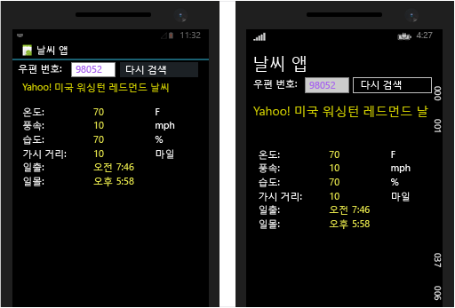

# <a name="build-apps-with-native-ui-using-xamarin-in-visual-studio"></a>Visual Studio에서 Xamarin을 사용하여 네이티브 UI로 앱 빌드

플랫폼 간 모바일 응용 프로그램을 작성하는 데 Xamarin 및 C#을 선택한 대부분의 개발자들은 Xamarin.Forms를 사용합니다. Xamarin.Forms는 iOS, Android 및 UWP(유니버설 Windows 플랫폼)에서 네이티브 컨트롤에 매핑하는 사용자 인터페이스를 정의합니다. Xamarin.Forms는 [Visual Studio에서 Xamarin.Forms를 사용한 앱 빌드 기본 사항 알아보기](learn-app-building-basics-with-xamarin-forms-in-visual-studio.md) 문서에 설명되어 있습니다.

이 문서에서는 각 플랫폼의 네이티브 사용자 인터페이스 API에 대한 액세스를 비롯한 다른 방법을 설명합니다. 네이티브 API 작업은 각 플랫폼의 광범위한 지식이 필요하므로 Xamarin.Forms에 비해 훨씬 더 접근하기 힘듭니다. 장점은 여전히 기본 비즈니스 논리를 공유하면서 사용자 인터페이스를 각 플랫폼의 특정 장점 및 기능에 맞도록 조정할 수 있다는 점입니다.

[설정 및 설치](../cross-platform/setup-and-install.md) 및 [Xamarin 환경 확인](../cross-platform/verify-your-xamarin-environment.md)의 단계를 완료했으면 이 연습 과정을 통해 네이티브 UI 레이어로 기본 Xamarin 앱을 빌드하는 방법을 확인합니다. 네이티브 UI에서는 공유 코드가 .NET Standard 라이브러리에 상주하며 개별 플랫폼 프로젝트가 UI 정의를 포함합니다. 다음은 실행을 만들 것인지를 응용 프로그램은 iOS와 Android 휴대폰 및 Windows 10 데스크톱에서 실행 중인 빌드할 응용 프로그램입니다(왼쪽에서 오른쪽).
  
[](../cross-platform/media/cross-plat-xamarin-build-1-Large.png#lightbox)
  
앱을 빌드하려면 다음 작업을 수행합니다.  
  
- [솔루션 설정](#solution)  
  
- [공유 데이터 서비스 코드 작성](#dataservice)  
  
- [Android용 UI 디자인](#Android)  

- [Windows용 UI 디자인](#Windows)  
  
- [다음 단계](#next): iOS 사용자 인터페이스 디자인 포함
  
> [!TIP]
> [GitHub의 mobile-samples 리포지토리](https://github.com/xamarin/mobile-samples/tree/master/Weather)에서 이 프로젝트에 대한 전체 소스 코드를 찾을 수 있습니다.
>
> 어려움이 있거나 오류가 발생하면 [forums.xamarin.com](http://forums.xamarin.com)에 질문을 게시하세요. Xamarin에 필요한 최신 SDK로 업데이트하면 많은 오류를 해결할 수 있습니다. 자세한 내용은 각 플랫폼에 대한 [Xamarin 릴리스 정보](https://developer.xamarin.com/releases/)에 설명되어 있습니다.    
  
> [!NOTE]
> Xamarin 개발자 설명서에서는 아래와 같이 빠른 시작 및 심층 분석 섹션이 둘 다 포함된 여러 가지 연습도 제공합니다. 이러한 모든 페이지에서 Visual Studio 관련 연습을 보려면 “Visual Studio”를 선택해야 합니다.  
>   
>  -   네이티브 UI를 사용한 Xamarin 앱:  
>     -   [Hello, Android](/xamarin/android/get-started/hello-android/) (단일 화면을 사용한 간단한 앱)  
>     -   [Hello, Android 멀티스크린](/xamarin/android/get-started/hello-android-multiscreen/) (화면 간 탐색을 사용한 앱)  
>     -   [Android 조각 연습](/xamarin/android/platform/fragments/fragments/implementing-with-fragments/walkthrough/) (마스터/세부 정보 화면에 사용됨)  
>     -   [Hello, iOS](/xamarin/ios/get-started/hello-iOS/)  
>     -   [Hello, iOS 멀티스크린](/xamarin/ios/get-started/hello-iOS-multiscreen/) 

>  -   Xamarin.Forms를 사용한 Xamarin 앱(공유 UI)  
>     -   [Hello, Xamarin.Forms](/xamarin/xamarin-forms/get-started/hello-xamarin-forms/quickstart/)  
>     -   [Hello, Xamarin.Forms 멀티스크린](/xamarin/xamarin-forms/get-started/hello-xamarin-forms-multiscreen/)  
  
<a name="solution" />

##  <a name="set-up-your-solution"></a>솔루션 설정  

Visual Studio에는 .NET Standard 라이브러리를 공유하는 네이티브 UI 응용 프로그램을 만들기 위한 솔루션 템플릿이 없습니다. 그러나 이러한 솔루션을 개별 프로젝트에서 빌드하는 것은 어렵지 않습니다. 이러한 단계에서 응용 프로그램 플랫폼의 각 형식에 대한 프로젝트와 공유 코드에 대한 .NET Standard 라이브러리를 사용하여 Xamarin 솔루션을 만듭니다.  
  
1.  Visual Studio에서 새 **클래스 라이브러리(.NET Standard)** 솔루션을 만들고 **WeatherApp**으로 이름을 지정합니다. 이 템플릿은 왼쪽에서 **Visual C#** 을 선택한 다음, **.NET Standard**를 선택하면 가장 쉽게 찾을 수 있습니다. 

    

    확인을 클릭하면 **WeatherApp** 솔루션은 **WeatherApp**이라는 이름의 단일 프로젝트로 구성됩니다. 

2.  iOS를 대상으로 지정하려는 경우 솔루션에 iOS 프로젝트를 추가합니다. **솔루션 탐색기**에서 솔루션 이름을 마우스 오른쪽 단추로 클릭하고 **추가** 및 **새 프로젝트**를 차례로 선택합니다.  **새 프로젝트** 대화 상자에서 왼쪽에 있는 **Visual C#** 을 선택한 다음, **iOS** 및 **유니버설**을 차례로 선택합니다. (템플릿이 이 위치에 없으면 Xamarin을 설치하거나 Visual Studio 2017 기능을 사용하도록 설정해야 합니다. [설정 및 설치](../cross-platform/setup-and-install.md)를 참조하세요.) 템플릿 목록에서 **단일 뷰 앱(iOS)** 을 선택합니다. 이름을 **WeatherApp.iOS**로 지정합니다.

3.  Android를 대상으로 지정하려는 경우 솔루션에 Android 프로젝트를 추가합니다. **새 프로젝트** 대화 상자에서 왼쪽에 있는 **Visual C#** 및 **Android**를 차례로 선택합니다. 템플릿 목록에서 **비어 있는 앱(Android)** 을 선택합니다. 이름을 **WeatherApp.Android**로 지정합니다. 

4. 유니버설 Windows 플랫폼을 대상으로 하려는 경우 **새 프로젝트** 대화 상자에서 왼쪽에 있는 **Visual C#** 및 **Windows 유니버설**을 차례로 선택합니다. 템플릿 목록에서 **비어 있는 앱(유니버설 Windows)** 을 선택하고 이름을 **WeatherApp.UWP**로 지정합니다.
  
5. 각 응용 프로그램 프로젝트(iOS, Android 및 UWP)의 경우 **솔루션 탐색기**의 **참조** 섹션을 마우스 오른쪽 단추로 클릭하고 **참조 추가**를 선택합니다. **참조 관리자** 대화 상자에서 왼쪽에 있는 **프로젝트** 및 **솔루션**을 선택합니다. 사용자가 관리 중인 참조가 있는 프로젝트를 제외한 솔루션의 모든 프로젝트 목록이 표시됩니다.

   

   **WeatherApp** 옆에 확인란을 선택합니다. 

   각 응용 프로그램 프로젝트에 대해 이 상자를 선택하면 모든 프로젝트는 .NET Standard 라이브러리에 대한 참조를 포함하며 해당 라이브러리의 코드를 공유할 수 있습니다.
  
6. **Newtonsoft.Json** NuGet 패키지를 .NET Standard 프로젝트에 추가합니다. 이 프로젝트는 날씨 데이터 서비스에서 검색된 정보를 처리하는 데 사용됩니다.  
  
    -   **솔루션 탐색기**에서 **WeatherApp** 프로젝트를 마우스 오른쪽 단추로 클릭하고 **NuGet 패키지 관리...** 를 선택합니다.  
  
         NuGet 창에서 **찾아보기** 탭을 선택하고 **Newtonsoft**를 검색합니다.  
  
    -   **Newtonsoft.Json**을 선택합니다.  
  
    -   **버전** 필드가 **안정적인 최신 버전** 으로 설정되어 있는지 확인합니다.  
  
    -   **설치**를 클릭합니다.  
  
7.  7단계를 반복하여 .NET Standard 프로젝트에서 **Microsoft.CSharp** 패키지를 찾아서 설치합니다. 이 라이브러리는 .NET Standard 라이브러리에서 C# `dynamic` 데이터 형식을 사용하는 데 필요합니다.
  
8.  솔루션을 빌드하고 빌드 오류가 없는지 확인합니다.  
  
<a name="dataservice" />

## <a name="write-shared-data-service-code"></a>공유 데이터 서비스 코드 작성  

 **WeatherApp** 프로젝트는 .NET Standard 라이브러리입니다. 이 프로젝트에서 모든 플랫폼에서 공유되는 코드를 작성할 수 있습니다. 각 응용 프로그램 프로젝트에는 .NET Standard 라이브러리에 대한 참조가 있으므로 라이브러리는 iOS, Android 및 UWP 앱 패키지에 포함됩니다.  
  
 다음 단계에서는 날씨 서비스의 데이터를 액세스하고 저장하기 위한 코드를 .NET Standard 라이브러리에 추가합니다.  
  
1.  먼저 [http://openweathermap.org/appid](http://openweathermap.org/appid)에서 무료 날씨 API 키에 등록합니다. 이 API 키를 사용하면 응용 프로그램에서 모든 미국 우편 번호에 대한 날씨를 가져올 수 있습니다. (미국 이외의 우편 번호에 대해서는 작동하지 않습니다.)
  
2.  **WeatherApp** 프로젝트를 마우스 오른쪽 단추로 클릭하고 **추가 > 클래스...** 를 선택합니다. **새 항목 추가** 대화 상자에서 파일 이름을 **Weather.cs**로 지정합니다. 이 클래스는 날씨 데이터 서비스의 데이터를 저장하는 데 사용합니다.  
  
3.  **Weather.cs**의 전체 콘텐츠를 다음 코드로 바꿉니다.  
  
    ```csharp  
    namespace WeatherApp
    {
        public class Weather
        {
            // Because labels bind to these values, set them to an empty string to
            // ensure that the label appears on all platforms by default.
            public string Title { get; set; } = " ";
            public string Temperature { get; set; } = " ";
            public string Wind { get; set; } = " ";
            public string Humidity { get; set; } = " ";
            public string Visibility { get; set; } = " ";
            public string Sunrise { get; set; } = " ";
            public string Sunset { get; set; } = " ";
        }
    }
    ```  
  
4.  **DataService.cs**라는 .NET Standard 프로젝트에 다른 클래스를 추가합니다. 이 클래스는 날씨 데이터 서비스의 JSON 데이터를 처리하는 데 사용합니다.  
  
5.  **DataService.cs** 의 전체 내용을 다음 코드로 바꿉니다.  
  
    ```csharp  
    using System.Net.Http;  
    using System.Threading.Tasks;  
    using Newtonsoft.Json;  
  
    namespace WeatherApp  
    {  
        public class DataService  
        {  
            public static async Task<dynamic> getDataFromService(string queryString)  
            {  
                HttpClient client = new HttpClient();  
                var response = await client.GetAsync(queryString);  
  
                dynamic data = null;  
                if (response != null)  
                {  
                    string json = response.Content.ReadAsStringAsync().Result;  
                    data = JsonConvert.DeserializeObject(json);  
                }  
  
                return data;  
            }  
        }  
    }  
    ```  
  
6.  세 번째 클래스를 **Core.cs**라는 .NET Standard 라이브러리에 추가합니다. 이 클래스를 사용하여 우편 번호를 사용한 쿼리 문자열을 구성하고, 날씨 데이터 서비스를 호출하고, **Weather** 클래스의 인스턴스를 채웁니다.  
  
7.  **Core.cs**의 콘텐츠를 다음 코드로 바꿉니다.  
  
    ```csharp  
    using System;  
    using System.Threading.Tasks;  
  
    namespace WeatherApp  
    {  
        public class Core  
        {  
            public static async Task<Weather> GetWeather(string zipCode)  
            {  
                //Sign up for a free API key at http://openweathermap.org/appid  
                string key = "YOUR API KEY HERE";  
                string queryString = "http://api.openweathermap.org/data/2.5/weather?zip="  
                    + zipCode + ",us&appid=" + key + "&units=imperial";  

                //Make sure developers running this sample replaced the API key
                if (key == "YOUR API KEY HERE")
                {
                    throw new ArgumentException("You must obtain an API key from openweathermap.org/appid and save it in the 'key' variable.");
                }
  
                dynamic results = await DataService.GetDataFromService(queryString).ConfigureAwait(false);  
  
                if (results["weather"] != null)  
                {  
                    Weather weather = new Weather();  
                    weather.Title = (string)results["name"];                  
                    weather.Temperature = (string)results["main"]["temp"] + " F";  
                    weather.Wind = (string)results["wind"]["speed"] + " mph";                  
                    weather.Humidity = (string)results["main"]["humidity"] + " %";  
                    weather.Visibility = (string)results["weather"][0]["main"];  
  
                    DateTime time = new System.DateTime(1970, 1, 1, 0, 0, 0, 0);  
                    DateTime sunrise = time.AddSeconds((double)results["sys"]["sunrise"]);  
                    DateTime sunset = time.AddSeconds((double)results["sys"]["sunset"]);  
                    weather.Sunrise = sunrise.ToString() + " UTC";  
                    weather.Sunset = sunset.ToString() + " UTC";  
                    return weather;  
                }  
                else  
                {  
                    return null;  
                }  
            }  
        }  
    }  
    ```  
  
8. *YOUR API KEY HERE*의 첫 번째 일치 항목을 1단계에서 얻은 API 키로 바꿉니다. 주위에 따옴표는 계속 필요합니다!
  
9. .NET Standard 라이브러리에서 **MyClass.cs**는 사용되지 않기 때문에 삭제합니다.  
  
10. **WeatherApp** 프로젝트를 빌드하여 코드가 올바른지 확인합니다.  
  
<a name="Android" />

## <a name="design-ui-for-android"></a>Android용 UI 디자인  

 이제 사용자 인터페이스를 디자인하고 공유 코드에 연결한 다음, 앱을 실행할 수 있습니다.  
  
### <a name="design-the-look-and-feel-of-your-app"></a>앱의 모양과 느낌 디자인  
  
1.  **솔루션 탐색기**에서 **WeatherApp.Droid > Resources > layout** 폴더를 확장하고 **Main.axml**을 엽니다. 이 명령은 비주얼 디자이너에서 파일을 엽니다. Java 관련 오류가 나타나는 경우 이 [블로그 게시물](http://forums.xamarin.com/discussion/32365/connection-to-the-layout-renderer-failed-in-xs-5-7-and-xamarinvs-3-9)을 참조하세요.  
  
    > [!TIP]
    >  프로젝트에는 다른 많은 파일이 있습니다. 이 문서에서는 이러한 파일에 대해 자세히 다루지 않지만 Android 프로젝트의 구조를 좀 더 자세히 알아보려면 Hello Android 문서에서 [Part 2 Deep Dive(2부 자세히 알아보기)](/xamarin/android/get-started/hello-android/hello-android-deepdive/)를 참조하세요.  
  
2.  **보기 > 다른 창 > 도구 상자**를 선택하여 도구 상자를 엽니다.  
  
3.  **도구 상자**의 **RelativeLayout** 컨트롤을 디자이너로 끕니다. 이 컨트롤을 다른 컨트롤의 부모 컨테이너로 사용하게 됩니다.  
  
    > [!TIP]
    >  레이아웃이 올바르게 표시되지 않는 경우 언제든지 파일을 저장하고 **디자인** 및 **소스** 탭 간에 전환하여 새로 고칩니다.  
  
4.  **속성** 창에서 **배경** 속성(스타일 그룹)을 `#545454`로 설정합니다.  **속성** 창에 있는 제목으로 **RelativeLayout**에 대한 배경을 설정했는지 확인합니다.
  
5.  **도구 상자**의 **TextView** 컨트롤을 **RelativeLayout** 컨트롤로 끕니다.  
  
6.  **속성** 창에서 이러한 속성을 설정합니다. (속성 창 도구 모음의 정렬 단추를 사용하면 목록을 사전순으로 정렬하는 데 도움이 될 수 있습니다.)  
  
    |속성|값|  
    |--------------|-----------|  
    |**text**|**우편 번호로 검색**|  
    |**ID**|`@+id/ZipCodeSearchLabel`|  
    |**layout_marginStart**|`10dp`|  
    |**textColor**|`@android:color/white`|  
    |**textStyle**|`bold`|  
  
    > [!TIP]
    >  대부분의 속성은 선택 가능한 값이 포함된 드롭다운 목록이 없습니다.  따라서 특정 속성에 어떤 문자열 값을 사용해야 할지 추측하기가 어려울 수 있습니다. 제안 사항을 보려면 [R.attr](http://developer.android.com/reference/android/R.attr.html) 클래스 페이지에서 속성 이름을 검색해 보세요.  
    >   
    >  또한 빠른 웹 검색을 수행하면 [http://stackoverflow.com/](http://stackoverflow.com/) 에서 다른 사용자가 동일한 속성을 사용한 페이지를 종종 찾을 수 있습니다.  
  
     참조용으로, **소스** 보기로 전환하면 이 요소에 대해 다음 코드가 표시됩니다.  
  
    ```xml  
    <TextView  
        android:text="Search by Zip Code"  
        android:layout_width="wrap_content"  
        android:layout_height="wrap_content"  
        android:id="@+id/ZipCodeSearchLabel"  
        android:layout_marginStart="10dp"  
        android:textColor="@android:color/white"  
        android:textStyle="bold" />  
  
    ```  
  
7.  **도구 상자**에서 **TextView** 컨트롤을 **RelativeLayout** 컨트롤로 끌어와 ZipCodeSearchLabel 컨트롤 아래에 놓습니다. 기존 컨트롤의 적절한 에지에 새 컨트롤을 드롭합니다. 디자이너를 약간 확대하여 컨트롤을 배치하는 데 유용합니다.  
  
8. **속성** 창에서 다음 속성을 설정합니다.  
  
    |속성|값|  
    |--------------|-----------|  
    |**텍스트**|**우편 번호**|  
    |**ID**|`@+id/ZipCodeLabel`|  
    |**layout_marginStart**|`10dp`|  
    |**layout_marginTop**|`6dp`|  
    |**textColor**|`@android:color/white`|  
  
    **소스** 보기의 코드는 다음과 같습니다.  
  
    ```xml  
    <TextView  
        android:text="Zip Code"  
        android:layout_width="wrap_content"  
        android:layout_height="wrap_content"  
        android:layout_below="@id/ZipCodeSearchLabel"  
        android:id="@+id/ZipCodeLabel"  
        android:layout_marginStart="10dp"
        android:layout_marginTop="6dp"  
        android:textColor="@android:color/white" />  
    ```  
  
9. **도구 상자**의 **숫자** 컨트롤을 **RelativeLayout**으로 끌고 **Zip Code** 레이블 아래에 배치합니다. 다음 속성을 설정합니다.  
  
    |속성|값|  
    |--------------|-----------|  
    |**ID**|`@+id/zipCodeEntry`|  
    |**layout_marginStart**|`10dp`|  
    |**layout_marginBottom**|`10dp`|  
    |**width**|`165dp`|  
    |**textColor**|`@android:color/white`|  
  
    사용자는 **번호** 컨트롤에서 5자리 미국 우편 번호를 입력합니다. 다음은 해당 컨트롤에 해당하는 태그입니다.  
  
    ```xml  
    <EditText  
        android:inputType="number"  
        android:layout_width="wrap_content"  
        android:layout_height="wrap_content"  
        android:layout_below="@id/ZipCodeLabel"  
        android:id="@+id/zipCodeEntry"  
        android:layout_marginStart="10dp"  
        android:layout_marginBottom="10dp"  
        android:width="165dp"  
        android:textColor="@android:color/white" />  
    ```  
  
10. **도구 상자**에서 **단추**를 **RelativeLayout** 컨트롤로 끌고 zipCodeEntry 컨트롤 오른쪽에 배치합니다. 다음 속성을 설정합니다.  
  
    |속성|값|  
    |--------------|-----------|  
    |**ID**|`@+id/weatherBtn`|  
    |**텍스트**|**날씨 검색**|  
    |**layout_marginStart**|`20dp`|  
    |**layout_alignBottom**|`@id/zipCodeEntry`|  
    |**width**|`165dp`|  
  
    ```xml  
    <Button
        android:text="Get Weather"  
        android:layout_width="wrap_content"  
        android:layout_height="wrap_content"  
        android:layout_toRightOf="@id/zipCodeEntry"  
        android:id="@+id/weatherBtn"  
        android:layout_marginStart="20dp"  
        android:layout_alignBottom="@id/zipCodeEntry"  
        android:width="165dp" />  
    ```  
  
11. Android 디자이너를 사용하여 기본 UI를 빌드할 수 있을 정도로 충분히 파악했습니다. 페이지의 Main.asxml 파일에 직접 태그를 추가하여 UI를 빌드할 수도 있습니다. 그와 같이 나머지 UI를 빌드하려면 디자이너에서 소스 뷰로 전환한 다음, 다음 태그를 `</RelativeLayout>` 끝 태그 *아래에* 붙여넣습니다. (이러한 요소는 `RelativeLayout`에 포함되지 *않으므로* 태그 아래에 있어야 합니다.)  
  
    ```xml  
    <TextView  
        android:text="Location"  
        android:textAppearance="?android:attr/textAppearanceSmall"  
        android:layout_width="match_parent"  
        android:layout_height="wrap_content"  
        android:id="@+id/locationLabel"  
        android:layout_marginStart="10dp"  
        android:layout_marginTop="10dp" />  
    <TextView  
        android:textAppearance="?android:attr/textAppearanceMedium"  
        android:layout_width="match_parent"  
        android:layout_height="wrap_content"  
        android:id="@+id/locationText"  
        android:layout_marginStart="20dp"  
        android:layout_marginBottom="10dp" />  
    <TextView  
        android:text="Temperature"  
        android:textAppearance="?android:attr/textAppearanceSmall"  
        android:layout_width="match_parent"  
        android:layout_height="wrap_content"  
        android:id="@+id/tempLabel"  
        android:layout_marginStart="10dp" />  
    <TextView  
        android:textAppearance="?android:attr/textAppearanceMedium"  
        android:layout_width="match_parent"  
        android:layout_height="wrap_content"  
        android:id="@+id/tempText"  
        android:layout_marginBottom="10dp"  
        android:layout_marginStart="20dp" />  
    <TextView  
        android:text="Wind Speed"  
        android:textAppearance="?android:attr/textAppearanceSmall"  
        android:layout_width="match_parent"  
        android:layout_height="wrap_content"  
        android:id="@+id/windLabel"  
        android:layout_marginStart="10dp" />  
    <TextView  
        android:textAppearance="?android:attr/textAppearanceMedium"  
        android:layout_width="match_parent"  
        android:layout_height="wrap_content"  
        android:id="@+id/windText"  
        android:layout_marginBottom="10dp"  
        android:layout_marginStart="20dp" />  
    <TextView  
        android:text="Humidity"  
        android:textAppearance="?android:attr/textAppearanceSmall"  
        android:layout_width="match_parent"  
        android:layout_height="wrap_content"  
        android:id="@+id/humidtyLabel"  
        android:layout_marginStart="10dp" />  
    <TextView  
        android:textAppearance="?android:attr/textAppearanceMedium"  
        android:layout_width="match_parent"  
        android:layout_height="wrap_content"  
        android:id="@+id/humidityText"  
        android:layout_marginBottom="10dp"  
        android:layout_marginStart="20dp" />  
    <TextView  
        android:text="Visibility"  
        android:textAppearance="?android:attr/textAppearanceSmall"  
        android:layout_width="match_parent"  
        android:layout_height="wrap_content"  
        android:id="@+id/visibilityLabel"  
        android:layout_marginStart="10dp" />  
    <TextView  
        android:textAppearance="?android:attr/textAppearanceMedium"  
        android:layout_width="match_parent"  
        android:layout_height="wrap_content"  
        android:id="@+id/visibilityText"  
        android:layout_marginBottom="10dp"  
        android:layout_marginStart="20dp" />  
    <TextView  
        android:text="Time of Sunrise"  
        android:textAppearance="?android:attr/textAppearanceSmall"  
        android:layout_width="match_parent"  
        android:layout_height="wrap_content"  
        android:id="@+id/sunriseLabel"  
        android:layout_marginStart="10dp" />  
    <TextView  
        android:textAppearance="?android:attr/textAppearanceMedium"  
        android:layout_width="match_parent"  
        android:layout_height="wrap_content"  
        android:id="@+id/sunriseText"  
        android:layout_marginBottom="10dp"  
        android:layout_marginStart="20dp" />  
    <TextView  
        android:text="Time of Sunset"  
        android:textAppearance="?android:attr/textAppearanceSmall"  
        android:layout_width="match_parent"  
        android:layout_height="wrap_content"  
        android:id="@+id/sunsetLabel"  
        android:layout_marginStart="10dp" />  
    <TextView  
        android:textAppearance="?android:attr/textAppearanceMedium"  
        android:layout_width="match_parent"  
        android:layout_height="wrap_content"  
        android:id="@+id/sunsetText"  
        android:layout_marginBottom="10dp"  
        android:layout_marginStart="20dp" />  
    ```  
  
12. 파일을 저장하고 **디자인** 보기로 전환합니다. UI가 다음과 같아야 합니다.  
  
       
  
13. **MainActivity.cs**를 엽니다. 코드는 다음과 같습니다.  
  
    ```  
    protected override void OnCreate (Bundle bundle)  
    {  
        base.OnCreate (bundle);  
  
        // Set our view from the "main" layout resource  
        SetContentView (Resource.Layout.Main);  
    }  
    ```  
  
14. Android 프로젝트를 빌드하여 작업을 확인합니다. 빌드 프로세스에서는 코드에서 이름으로 컨트롤을 참조할 수 있도록 컨트롤 ID가 **Resource.Designer.cs** 파일에 추가됩니다.  
  
### <a name="consume-your-shared-code"></a>공유 코드 사용  
  
1.  코드 편집기에서 **WeatherApp** 프로젝트의 **MainActivity.cs** 파일을 열고 내용을 다음 코드로 바꿉니다. 이 코드는 공유 코드에 정의된 `GetWeather` 메서드를 호출합니다. 그런 다음 해당 메서드에서 검색된 데이터를 앱의 UI에 표시합니다.  
  
    ```csharp  
    using System;  
    using Android.App;  
    using Android.Widget;  
    using Android.OS;  
  
    namespace WeatherApp.Droid  
    {  
        [Activity(Label = "Sample Weather App", 
                  Theme = "@android:style/Theme.Material.Light", 
                  MainLauncher = true)]  
        public class MainActivity : Activity  
        {  
            protected override void OnCreate(Bundle bundle)  
            {  
                base.OnCreate(bundle);  
  
                SetContentView(Resource.Layout.Main);  
  
                Button button = FindViewById<Button>(Resource.Id.weatherBtn);  
  
                button.Click += Button_Click;  
            }  
  
            private async void Button_Click(object sender, EventArgs e)  
            {  
                EditText zipCodeEntry = FindViewById<EditText>(Resource.Id.zipCodeEntry);  
  
                if (!String.IsNullOrEmpty(zipCodeEntry.Text))  
                {  
                    Weather weather = await Core.GetWeather(zipCodeEntry.Text);  
                    FindViewById<TextView>(Resource.Id.locationText).Text = weather.Title;  
                    FindViewById<TextView>(Resource.Id.tempText).Text = weather.Temperature;  
                    FindViewById<TextView>(Resource.Id.windText).Text = weather.Wind;  
                    FindViewById<TextView>(Resource.Id.visibilityText).Text = weather.Visibility;  
                    FindViewById<TextView>(Resource.Id.humidityText).Text = weather.Humidity;  
                    FindViewById<TextView>(Resource.Id.sunriseText).Text = weather.Sunrise;  
                    FindViewById<TextView>(Resource.Id.sunsetText).Text = weather.Sunset;  
                }  
            }  
        }  
    }  
    ```  

    활동에는 밝은 배경의 테마가 부여되었습니다.
  
### <a name="run-the-app-and-see-how-it-looks"></a>앱을 실행하고 어떻게 나타나는지 확인합니다.  
  
1.  **솔루션 탐색기**에서 **WeatherApp.Droid** 프로젝트가 시작 프로젝트로 설정되었는지 확인합니다.  
  
2.  적절한 장치 또는 에뮬레이터 대상을 선택한 다음 F5 키를 눌러 앱을 시작합니다.  

    > [!NOTE]
    > Visual Studio에 Android 프로젝트가 Newtonsoft.Json 파일을 찾을 수 없다고 표시되는 경우 해당 NuGet 패키지를 Android 프로젝트에 추가합니다. 
  
3.  장치 또는 에뮬레이터에서 편집 상자에 유효한 미국 우편 번호 5자리를 입력하고 **Get Weather**를 누릅니다. 그러면 해당 지역의 날씨 데이터가 컨트롤에 표시됩니다.  
  
    [](../cross-platform/media/cross-plat-xamarin-build-1-android-Large.png#lightbox)  
  
> [!TIP]
>  이 프로젝트에 대한 전체 소스 코드는 [GitHub의 xamarin-forms-samples 리포지토리](https://github.com/xamarin/mobile-samples/tree/master/Weather)에 있습니다.  
  
<a name="Windows" /> 

## <a name="design-ui-for-windows"></a>Windows용 UI 디자인

다음 단계는 Windows용 사용자 인터페이스를 디자인하고 공유 코드에 연결한 다음, 앱을 실행하는 것입니다.  
  
### <a name="design-the-look-and-feel-of-your-app"></a>앱의 모양과 느낌 디자인  

 Xamarin 앱에서 네이티브 UWP 사용자 인터페이스를 디자인하는 과정은 다른 네이티브 UWP 앱과 다르지 않습니다. 이러한 이유로 디자이너를 사용하는 것은 여기서 설명하지 않습니다. 자세한 논의는 [XAML 디자이너를 사용하여 UI 만들기](../designers/creating-a-ui-by-using-xaml-designer-in-visual-studio.md)를 참조하세요.  
  
 대신, **MainPage.xaml**을 열고 전체 XAML 콘텐츠를 다음 태그로 바꿉니다.   
  
```xaml  
<Page
    x:Class="WeatherApp.UWP.MainPage"
    xmlns="http://schemas.microsoft.com/winfx/2006/xaml/presentation"
    xmlns:x="http://schemas.microsoft.com/winfx/2006/xaml"
    xmlns:local="using:WeatherApp.UWP"
    xmlns:d="http://schemas.microsoft.com/expression/blend/2008"
    xmlns:mc="http://schemas.openxmlformats.org/markup-compatibility/2006"
    mc:Ignorable="d">

    <Grid Background="{ThemeResource ApplicationPageBackgroundThemeBrush}">

        <StackPanel HorizontalAlignment="Left" 
                    VerticalAlignment="Top" 
                    Height="40" Margin="10,0,0,0" Width="400">
            <TextBlock Text="Weather App" FontSize="30" />
        </StackPanel>
        <StackPanel HorizontalAlignment="Left" 
                    VerticalAlignment="Top" 
                    Height="120" Margin="10,40,0,0" Width="400" 
                    Background="#FF545454">

            <TextBlock Text="Search by Zip Code" TextWrapping="Wrap" 
                       HorizontalAlignment="Left" Margin="10,10,0,0"
                       Foreground="White" FontSize="18" FontWeight="Bold" />
            
            <TextBlock Text="Zip Code" TextWrapping="Wrap" 
                       Margin="10,5,0,0" FontSize="14" Foreground="#FFA8A8A8"/>
            
            <StackPanel Orientation="Horizontal">

                <TextBox x:Name="zipCodeEntry" Text="" 
                         Margin="10,10,0,0" VerticalAlignment="Top" 
                         InputScope="Number" Width="165" />
                
                <Button x:Name="weatherBtn" Content="Get Weather" 
                        Foreground="White" Width="165" Margin="20,0,0,0" Height="60" 
                        Click="GetWeatherButton_Click"/>
            </StackPanel>
        </StackPanel>
        
        <StackPanel Margin="10,175,0,0">
            <StackPanel.Resources>
                <Style x:Key="commonText" TargetType="TextBlock">
                    <Setter Property="HorizontalAlignment" Value="Left" />
                    <Setter Property="VerticalAlignment" Value="Top" />
                    <Setter Property="TextWrapping" Value="Wrap" />
                </Style>
                
                <Style x:Key="labelText" TargetType="TextBlock" BasedOn="{StaticResource commonText}">
                    <Setter Property="FontSize" Value="14" />
                    <Setter Property="Foreground" Value="#FFA8A8A8" />
                </Style>

                <Style x:Key="valueText" TargetType="TextBlock" BasedOn="{StaticResource commonText}">
                    <Setter Property="FontSize" Value="18" />
                    <Setter Property="Margin" Value="10, 0, 0, 10" />
                </Style>
            </StackPanel.Resources>
            
            <TextBlock Text="Location" Style="{StaticResource labelText}" />
            <TextBlock x:Name="locationText" Style="{StaticResource valueText}" />

            <TextBlock Text="Temperature" Style="{StaticResource labelText}" />
            <TextBlock x:Name="tempText" Style="{StaticResource valueText}" />
            
            <TextBlock Text="Wind Speed" Style="{StaticResource labelText}" />
            <TextBlock x:Name="windText" Style="{StaticResource valueText}" />
            
            <TextBlock Text="Humidity" Style="{StaticResource labelText}" />
            <TextBlock x:Name="humidityText" Style="{StaticResource valueText}" />
            
            <TextBlock Text="Temperature" Style="{StaticResource labelText}" />
            <TextBlock x:Name="visibilityText" Style="{StaticResource valueText}" />
            
            <TextBlock Text="Time of Sunrise" Style="{StaticResource labelText}" />
            <TextBlock x:Name="sunriseText" Style="{StaticResource valueText}" />
            
            <TextBlock Text="Time of Sunset" Style="{StaticResource labelText}" />
            <TextBlock x:Name="sunsetText" Style="{StaticResource valueText}" />
        </StackPanel>
    </Grid>
</Page>
```  
  
### <a name="consume-your-shared-code"></a>공유 코드 사용  
  
**MainPage.xaml.cs** 코드 숨김 파일에서 단추에 대해 다음 이벤트 처리기를 추가합니다. 
  
```csharp  
private async void GetWeatherButton_Click(object sender, RoutedEventArgs e)  
{  
    if (!String.IsNullOrEmpty(zipCodeEntry.Text))  
    {  
        Weather weather = await Core.GetWeather(zipCodeEntry.Text);  
        locationText.Text = weather.Title;  
        tempText.Text = weather.Temperature;  
        windText.Text = weather.Wind;  
        visibilityText.Text = weather.Visibility;  
        humidityText.Text = weather.Humidity;  
        sunriseText.Text = weather.Sunrise;  
        sunsetText.Text = weather.Sunset;  

        weatherBtn.Content = "Search Again";  
    }  
}  
```  
  
이 코드는 공유 코드에 정의된 `GetWeather` 메서드를 호출합니다. `GetWeather`는 Android 앱에서 호출한 것과 동일한 메서드입니다. 또한 이 코드는 해당 메서드에서 검색된 데이터를 앱의 UI 컨트롤에 표시합니다.  
  
### <a name="run-the-app-and-see-how-it-looks"></a>앱을 실행하고 어떻게 나타나는지 확인합니다.  
  
1.  **솔루션 탐색기**에서 **WeatherApp.UWP** 프로젝트를 시작 프로젝트로 설정합니다.  

2.  **솔루션 플랫폼** 드롭다운 상자에서 **x86**을 선택하고 **로컬 컴퓨터**를 선택하여 Windows 10 데스크톱에 응용 프로그램을 배포합니다.
  
3.  F5 키를 눌러 앱을 시작합니다.  
  
4.  유효한 다섯 자리 미국 우편 번호를 편집 상자에 입력하고 **Get Weather**를 누릅니다. 그러면 해당 지역의 날씨 데이터가 페이지에 표시됩니다.  

    [](../cross-platform/media/cross-plat-xamarin-build-1-uwp-Large.png#lightbox)  

> [!TIP]
>  이 프로젝트에 대한 전체 소스 코드는 [GitHub의 xamarin-forms-samples 리포지토리](https://github.com/xamarin/mobile-samples/tree/master/Weather)에 있습니다.  

<a name="next" /> 

## <a name="next-steps"></a>다음 단계  

 **iOS용 UI를 솔루션에 추가**  
  
 iOS용 네이티브 UI를 추가하여 이 샘플을 확장합니다. iOS에서 코드를 테스트하려면 로컬 네트워크에 있으며 Xcode 및 Xamarin이 설치된 Mac에 연결해야 합니다. 완료했으면 Visual Studio에서 직접 iOS 디자이너를 사용할 수 있습니다. 완성된 앱은 [GitHub의 모바일 샘플 리포지토리](https://github.com/xamarin/mobile-samples/tree/master/Weather)를 참조하세요.  
  
 또한 [Hello, iOS](/xamarin/ios/get-started/hello-ios/hello-ios-quickstart?tabs=vswin) 연습을 참조하세요.   
  
 **공유 프로젝트에 플랫폼별 코드 추가**  
  
 .NET Standard 라이브러리의 공유 코드는 플랫폼 중립적입니다. 라이브러리는 한 번 컴파일되며 각 플랫폼별 앱 패키지에 포함됩니다. 플랫폼별 코드를 격리하는 조건부 컴파일을 사용하는 공유 코드를 작성하려면 *공유* 프로젝트를 사용할 수 있습니다. 자세한 내용은 [코드 공유 옵션](/xamarin/cross-platform/app-fundamentals/building-cross-platform-applications/practical-code-sharing-strategies)을 참조하세요.  
  
## <a name="see-also"></a>참고 항목  

 [Xamarin 설명서](http://docs.microsoft.com/xamarin)   
 [Windows 개발자 센터](https://dev.windows.com/en-us)   
 [Swift 및 C# 빠른 참조 포스터](http://aka.ms/scposter)