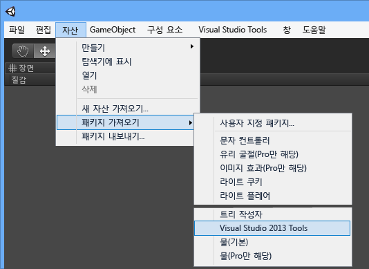
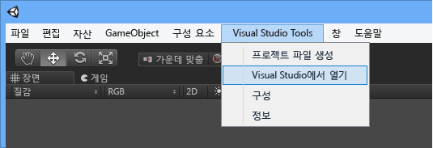

# Visual Studio Tools for Unity 시작
이 섹션에서는 Visual Studio Tools for Unity를 설치하고 Visual Studio와 함께 작동하도록 Unity 프로젝트를 구성하는 방법을 설명합니다.  

> [!IMPORTANT]
>  Unity 5.2에서는 프로젝트 설정을 간소화하는 Visual Studio Tools for Unity 2.1에 대한 기본 제공 지원이 추가되었습니다. 이 지원을 이용하려면 Windows에서 Unity 버전 5.2.0 이상과 Visual Studio Tools for Unity 버전 2.1 이상이 필요합니다.  

## 필수 조건  
 Visual Studio Tools for Unity를 사용하려면 다음이 필요합니다.  

-   Visual Studio Community, Professional, Premium 또는 Enterprise와 같은 확장을 지원하는 **Visual Studio** 버전. Visual Studio Community를 무료로 다운로드할 수 있습니다.  

     [Visual Studio Community 다운로드](http://www.visualstudio.com/downloads/download-visual-studio-vs)  

-   **Unity** 버전 4.0.0 이상. Visual Studio Tools for Unity 2.1 이상에 대한 기본 제공 지원을 활용하려면 **Unity** 버전 5.2.0 이상  

     [Unity 다운로드](https://unity3d.com/get-unity/download)  

## Visual Studio Tools for Unity 설치  
 Visual Studio 갤러리에서 Visual Studio Tools for Unity를 다운로드하고 설치합니다. 사용 중인 Visual Studio 버전에 맞는 패키지를 설치해야 합니다. Unity 5.2 이상에서 VSTU에 대한 기본 제공 지원을 활용하려면 Visual Studio Tools for Unity 버전 2.1 이상을 설치해야 합니다.  

-   Visual Studio 2015 Community, Visual Studio 2015 Professional 또는 Visual Studio 2015 Enterprise의 경우:  

     [Visual Studio 2015 Tools for Unity 다운로드](https://visualstudiogallery.msdn.microsoft.com/8d26236e-4a64-4d64-8486-7df95156aba9)  

-   Visual Studio 2013 Community, Visual Studio 2013 Professional 또는 Visual Studio 2013 Premium의 경우:  

     [Visual Studio 2013 Tools for Unity 다운로드](https://visualstudiogallery.msdn.microsoft.com/20b80b8c-659b-45ef-96c1-437828fe7cf2)  

-   Visual Studio 2012 Professional 또는 Visual Studio 2012 Premium의 경우:  

     [Visual Studio 2012 Tools for Unity 다운로드](https://visualstudiogallery.msdn.microsoft.com/7ab11d2a-f413-4ed6-b3de-ff1d05157714)  

-   Visual Studio 2010 Professional 또는 Visual Studio 2010 Premium의 경우:  

     [Visual Studio 2010 Tools for Unity 다운로드](https://visualstudiogallery.msdn.microsoft.com/6e536faa-ce73-494a-a746-6a14753015f1)  

> [!NOTE]
>  Visual Studio의 Express 버전은 Visual Studio Tools for Unity 등의 확장을 지원하지 않습니다. Visual Studio Community는 Visual Studio Tools for Unity 및 기타 확장 프로그램을 지원하는 Visual Studio의 무료 버전입니다. 대부분의 사용자에게 Visual Studio Community가 Express보다 더 적합합니다.  

> [!NOTE]
>  Visual Studio 2017에서 VSTU 3은 설치 프로그램에서 선택할 수 있는 Unity 워크로드와 함께 제공됩니다.  

## Visual Studio Tools for Unity를 사용한 첫 번째 Unity 프로젝트  
 이제 필요한 준비를 갖췄으며 Visual Studio를 사용한 첫 번째 Unity 프로젝트를 시작할 준비가 되었습니다. Unity 프로젝트 설정은 설치된 Unity 및 Visual Studio Tools for Unity 버전에 따라 달라집니다. 설치한 Unity 및 Visual Studio Tools for Unity 버전에 대한 아래 단계를 수행합니다.  

### Unity 5.2 이상(VSTU 2.1 이상 필요)  
 Unity 5.2부터 더 이상 Visual Studio Tools unitypackage를 프로젝트로 가져올 필요가 없습니다. 프로젝트가 이 unitypackage를 가져오는 경우 Unity 5.2에서 이를 무시하고 설치된 위치에서 Visual Studio Tools for Unity를 직접 로드합니다.  

#### 1 - Unity 프로젝트 만들기  
 이미 Unity를 사용한 경험이 있는 경우 새 프로젝트를 만들거나 사용자 고유의 프로젝트 중 하나를 로드할 수 있습니다. 이전 버전의 Unity와 함께 Visual Studio Tools for Unity를 사용하기 위해 Visual Studio Tools unitypackage를 가져온 프로젝트를 로드하는 경우 UnityVS 디렉터리를 삭제하여 제거하는 것이 좋습니다.  

 또는 Unity를 처음 접하는 경우 기본 자습서를 사용하여 작은 항목부터 시작합니다. Unity 학습 페이지를 방문하여 시작에 사용할 수 있는 예제 프로젝트에 대한 자습서와 학습할 수 있는 단원을 찾아 Unity로 게임을 빌드합니다. Unity 학습 페이지에는 여러 다른 게임에 대한 따라하기 쉬운 자습서가 있습니다.  

 [자습서 - Unity 학습 페이지](http://unity3d.com/learn/tutorials/modules)  

#### 2 - Visual Studio Tools for Unity를 사용하여 Unity 편집기 구성  
 프로젝트에서 Visual Studio Tools for Unity를 사용할 수 있게 하려면 Visual Studio를 외부 스크립트 편집기로 설정하면 됩니다. Unity 편집기의 주 메뉴에서 **편집, 기본 설정**을 선택한 다음 **Unity 기본 설정** 대화 상자에서 **외부 도구**를 선택합니다. **외부 스크립트 편집기** 속성을 사용하려는 Visual Studio 버전으로 설정하고(이 Visual Studio 버전에 대한 Visual Studio Tools for Unity를 설치해야 함) **편집기 연결** 속성이 설정되어 있는지 확인합니다.  

 이제 Visual Studio Tools for Unity에 대한 기본 제공 지원을 사용할 수 있는지 확인하려면 **Unity 정보** 대화 상자를 참조하세요. In the Unity editor, on the main menu, choose **도움말, Unity 정보** 를 선택합니다. Visual Studio Tools for Unity가 설치되어 올바르게 구성된 경우 **Unity 정보** 대화 상자를 참조하세요.  

 끝으로, **빌드 설정** 페이지를 통해 빌드 대상을 설정했는지와 **스크립트 디버깅** 을 사용하도록 설정했는지 확인합니다.  

   

#### 3 - Unity 편집기에서 Visual Studio 시작  
 Unity 5.2부터 Visual Studio를 시작하거나 Visual Studio Tools for Unity를 구성하는 데 더 이상 **Visual Studio Tools** 확장 메뉴가 필요하지 않습니다. 대신, Visual Studio가 외부 스크립트 편집기로 구성된 후 Unity 편집기에서 스크립트 파일을 선택하기만 하면 코드가 Visual Studio에서 열립니다.  

### 이전 버전의 Unity(5.2 이전)  
 Unity 5.2 이전에는 Visual Studio Tools for Unity에 대한 기본 제공 지원이 없었습니다. 대신, Visual Studio Tools for Unity를 사용하려면 각 프로젝트가 Visual Studio Tools unitypackage를 가져오고 다른 프로젝트 설정을 구성해야 했습니다.  

#### 1 - Unity 프로젝트 만들기  
 이미 Unity를 사용한 경험이 있는 경우 새 프로젝트를 만들거나 사용자 고유의 프로젝트 중 하나를 로드할 수 있습니다. 새 프로젝트를 시작하는 경우 만들 때 Visual Studio Tools unitypackage를 가져옵니다.  

 또는 Unity를 처음 접하는 경우 기본 자습서를 사용하여 작은 항목부터 시작합니다. Unity 학습 페이지를 방문하여 시작에 사용할 수 있는 예제 프로젝트에 대한 자습서와 학습할 수 있는 단원을 찾아 Unity로 게임을 빌드합니다. Unity 학습 페이지에는 여러 다른 게임에 대한 따라하기 쉬운 자습서가 있습니다.  

 [자습서 - Unity 학습 페이지](http://unity3d.com/learn/tutorials/modules)  

#### 2 - Visual Studio Tools for Unity를 사용하여 Unity 편집기 구성  
 기존 Unity 프로젝트에서 시작하거나 프로젝트를 만들 때 Visual Studio Tools unitypackage를 가져오지 않은 경우 지금 unitypackage를 가져와야 합니다. Unity 편집기의 주 메뉴에서 **자산, 패키지 가져오기, Visual Studio 2015 Tools** 를 선택합니다(사용 중인 Visual Studio의 버전에 대한 옵션을 참조해야 합니다).  

   

 끝으로, **빌드 설정** 페이지를 통해 빌드 대상을 설정했는지와 **스크립트 디버깅** 을 사용하도록 설정했는지 확인합니다.  

   

#### 3 - Unity 편집기에서 Visual Studio 시작  
 최종 단계는 Unity에서 Visual Studio를 시작하는 것입니다. 그러면 프로젝트에 대한 Visual Studio 솔루션이 만들어지고 Visual Studio에서 열립니다.  

 Unity 편집기의 주 메뉴에서 **Visual Studio Tools, Visual Studio에서 열기**를 선택합니다.  

   

## 다음 단계  
 Visual Studio에서 Unity 프로젝트를 작업하고 디버그하는 방법을 알아보려면 [Visual Studio Tools for Unity 사용](../cross-platform/using-visual-studio-tools-for-unity.md)을 참조하세요.  

## 참고 항목  
 [Unity Homepage](http://unity3d.com)(Unity 홈페이지)

