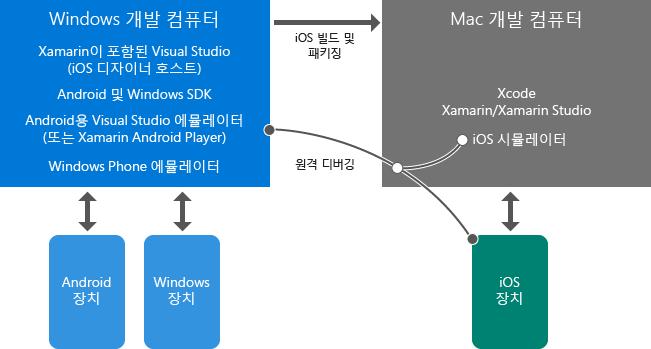

# Xamarin을 사용한 모바일 개발에 대해 알아보기
이 항목에서는 Xamarin을 사용한 플랫폼 간 모바일 앱 개발을 이해하는 데 도움되는 개요 자료를 안내합니다. 아직 Visual Studio 및 Xamarin을 설치하지 않았으면 먼저 [Setup and install](../cross-platform/setup-and-install.md) 프로세스를 시작하고 여기로 돌아와서 설치 관리자가 실행되는 동안 이러한 리소스를 살펴봅니다.  
  
> [!NOTE]
>  별도로 명시되지 않는 한 처음에는 부수적인 페이지가 아닌 여기에 직접 연결된 페이지만 읽는 것이 좋습니다. 이 목록이 완료된 후에도 설치 프로세스가 계속 실행 중이면 돌아가서 추가 항목을 살펴볼 수 있습니다.  
>   
>  또한 "주요 사항"으로 표시된 항목을 자유롭게 검토한 후 나중에 "심층 분석" 항목을 확인합니다.  
  
## 주요 사항: Xamarin 소개  
 *10~20분*  
  
1.  [Xamarin을 사용한 Visual Studio의 모바일 앱](https://www.visualstudio.com/explore/xamarin-vs) (영문)(visualstudio.com)에서는 Xamarin의 기본 특성에 대한 매우 짧은 설명을 제공합니다.  
  
2.  Xamarin 전문가인 James Montemagno와 함께하는[C# 및 Visual Studio를 사용하여 플랫폼 간 모바일 앱 빌드](https://channel9.msdn.com/Events/Visual-Studio/Visual-Studio-2015-Final-Release-Event/Building-cross-platform-mobile-apps-using-C-and-Visual-Studio-2015) (영문)(Channel9, 15분 16초). 처음 3분은 Xamarin 개요이고 코드 데모가 뒤따릅니다.  
  
## 주요 사항: Visual Studio 및 Xamarin 환경 개요  
 *5~15분*  
  
-   Visual Studio 및 Xamarin이 설치된 Windows 컴퓨터에서 대부분 작업을 수행합니다. 이 컴퓨터에서 직접 Windows 및 Android 앱을 빌드하고 장치나 에뮬레이터에서 실행 및 디버그합니다. Mac을 통해 원격으로 iOS 앱을 빌드, 실행 및 디버그할 수도 있습니다. Windows 컴퓨터의 Visual Studio를 iOS 스토리보드 디자이너 및 iOS 시뮬레이터에 연결할 수도 있습니다.  
  
-   Xcode 및 Xamarin이 설치된 Mac은 iOS 앱용 빌드/서명 호스트 및 런타임 환경으로 사용됩니다. Windows 컴퓨터의 Visual Studio에서 iOS에 대한 빌드는 이 Mac으로 위임됩니다. Visual Studio에서 iOS 앱을 디버그하면 앱은 Mac의 iOS 시뮬레이터에서 실행되거나 Mac에 연결된 테더링된 장치에서 직접 실행됩니다. 이 경우 Mac이나 그 주변에서 앱을 조작하고 Visual Studio에서 디버깅을 수행합니다.  
  
 이러한 관계는 아래에서 설명하고 iOS 앱 작업에 대한 자세한 내용은 [Visual Studio용 Xamarin.iOS 소개](http://developer.xamarin.com/guides/ios/getting_started/installation/windows/introduction_to_xamarin_ios_for_visual_studio/) (영문)(xamarin.com)를 참조하세요.  
  
   
  
## 주요 사항: 프로젝트 구성 방법  
 *10~30분*  
  
1.  [코드 공유 옵션](http://developer.xamarin.com/guides/cross-platform/application_fundamentals/building_cross_platform_applications/sharing_code_options/) (영문)(xamarin.com). 이식 가능한 클래스 라이브러리 옵션은 모든 대상 플랫폼에서 지원되는 .NET API만 사용하는 작업을 가장 잘 지원하므로 이 옵션을 사용하는 것이 좋습니다. 데이터베이스 액세스, REST API 호출 및 이식 가능한 Xamarin 구성 요소 호출을 포함한 대부분 비즈니스 논리 코드는 PCL에 있습니다(이 항목 끝에 나오는 [Deeper Dive: Xamarin Components](#components) 참조). Xamarin.Forms로 작성된 일반적인 UI 코드가 PCL에 있을 수도 있습니다.  
  
2.  (선택 사항) [사례 연구: Tasky](http://developer.xamarin.com/guides/cross-platform/application_fundamentals/building_cross_platform_applications/case_study-tasky/) (영문)(xamarin.com)에서는 데이터, 데이터 액세스 및 비즈니스 계층을 구분하는 공유 코드에 대한 PCL을 사용하여 프로젝트 구조를 지정하는 것과 같은 전기능 앱의 디자인 및 구조에 대한 몇 가지 모범 사례를 설명합니다.  
  
## 주요 사항: 네이티브 및 Xamarin.Forms UI 계층  
 *10~40분*  
  
 Xamarin에서는 Xamarin Native 및 Xamarin.Forms의 두 가지 방법으로 멋진 네이티브 앱을 빌드할 수 있습니다.  
  
 Xamarin Native를 사용하여 iOS, Android 및 Windows 등의 각 대상 플랫폼에 대한 별도의 UI 코드를 작성합니다.  이 방법을 사용하면 플랫폼별 API에 직접 액세스하여 플랫폼마다 사용자 지정된 UI 환경을 사용할 수 있습니다.  각 플랫폼에 대한 기본 디자이너 및 컨트롤에 대해 모든 권한을 얻게 되므로 각 UI 구축에 도움이 됩니다.  
  
 Xamarin.Forms는 모든 플랫폼에 대한 공유 UI 계층을 이식 가능한 클래스 라이브러리에 작성할 수 있는 일반화된 API 집합을 제공합니다.  Xamarin.Forms는 각 대상 플랫폼에 네이티브 컨트롤을 렌더링하여 네이티브 모양 및 느낌을 제공합니다.  디자이너 대신 Xamarin.Forms를 사용하면 C# 및 XAML을 사용하여 UI를 빌드할 수 있습니다.  
  
 어떤 방법을 사용할지 고민할 필요가 없습니다. Xamarin Native와 Xamarin.Forms의 조합을 사용하여 앱을 구현할 수 있습니다.  
  
-   Xamarin.Forms를 사용하여 로그인, 연락처 양식 및 검색 결과와 같이 플랫폼 간에 유사한 UI 및 기능을 제공하는 범용 화면을 빌드합니다.  
  
-   Xamarin.Forms의 다양한 사용자 지정 기능을 사용하여 플랫폼 기준으로 UI를 조정합니다. 여기에는 코드 및 XAML 둘 다에서 사용하여 사용자 지정 보기를 만들고, 기존 렌더러를 확장하고, 사용자 지정 렌더러를 만들 수 있는 OnPlatform API가 포함됩니다.  
  
-   필요한 경우 Xamarin Native를 사용하여 각 플랫폼의 고유한 UI 기능을 사용하는 화면(예: 네이티브 카메라 캡처 및 이미지 조작을 사용하는 화면)을 빌드합니다.  
  
 항상 Xamarin.Forms 솔루션부터 시작하여 플랫폼 간에 공유되는 UI 코드를 설정하고 사용자 지정 기능을 사용하여 플랫폼별 조정을 수행하는 것이 좋습니다. 완전한 플랫폼별 화면이 필요한 경우 Xamarin Native를 사용하여 개별적으로 추가할 수 있습니다.  
  
 자세히 알아보려면:  
  
1.  [Xamarin.Forms](http://developer.xamarin.com/guides/cross-platform/xamarin-forms/) (xamarin.com)에서는 Xamarin.Forms 및 네이티브 UI 레이어(Xamarin.iOS 및 Xamarin.Android)에 대한 간단한 개요와 장점 및 단점을 제공합니다.  
  
2.  James Montemagno의 비디오 [Xamarin.Forms: Native iOS, Android & Windows apps with C# & XAML](https://channel9.msdn.com/events/Visual-Studio/Connect-event-2015/704)(Xamarin.Forms: C# 및 XAML을 이용한 네이티브 iOS, Android 및 Windows 앱)(Channel9, 13분 3초)에서 처음 3분은 또 다른 개요를 제공하고 데모를 계속 시청할 수 있습니다.  
  
3.  (선택 사항) [Xamarin.Forms 소개](http://developer.xamarin.com/guides/cross-platform/xamarin-forms/getting-started/introduction-to-xamarin-forms/) (영문)(xamarin.com)  
  
4.  (선택 사항) [장치 클래스](http://developer.xamarin.com/guides/xamarin-forms/platform-features/device/) 설명서(영문)에서 사용자 지정을 위해 OnPlatform을 사용하는 예제 참조(xamarin.com)  
  
5.  (선택 사항) Jason Smith(MSDN Magazine)의 [크로스 플랫폼 - Xamarin.Forms를 사용하여 모바일 플랫폼 간에 UI 코드 공유](https://msdn.microsoft.com/magazine/dn904669.aspx) (영문)에서는 Xamarin.Forms 내의 다양한 사용자 지정 옵션에 대해 설명하며 자세한 내용은 [각 플랫폼의 컨트롤 사용자 지정](http://developer.xamarin.com/guides/xamarin-forms/custom-renderer/) (영문)(xamarin.com)에 나와 있습니다.  
  
## 심층 분석: 에뮬레이터를 사용한 디버깅  
 *10~15분*  
  
 물리적 장치를 사용하지 않고도 플랫폼 간 앱을 디버깅하려면 다음을 사용해야 합니다.  
  
1.  **Android 에뮬레이터.** 사용 중인 Windows 버전에 따라, Microsoft의 Visual Studio Emulator for Android 또는 Xamarin Player를 사용하는 것이 좋습니다. 두 제품 모두 빠른 성능을 제공하고 다양한 장치 기능을 지원합니다.  
  
    -   **Windows 8+ 컴퓨터:** Visual Studio와 함께 설치되는 Microsoft의 [Visual Studio Emulator for Android](https://www.visualstudio.com/en-us/features/msft-android-emulator-vs.aspx)를 사용하는 것이 좋습니다.  [Visual Studio Emulator for Android](https://channel9.msdn.com/events/Visual-Studio/Connect-event-2015/711) 비디오(영문)(Channel9, 5분 55초)에서는 개요 및 데모를 제공합니다.  
  
    -   **Windows 7 또는 이전/Mac OS X에서 실행되는 Windows**: [Xamarin Android Player](http://developer.xamarin.com/guides/android/getting_started/installation/android-player) (xamarin.com)를 사용합니다.  
  
2.  **Apple iOS 시뮬레이터.** 자세한 내용은 [iOS 시뮬레이터 시작](https://developer.apple.com/library/prerelease/content/documentation/IDEs/Conceptual/iOS_Simulator_Guide/GettingStartedwithiOSSimulator/GettingStartedwithiOSSimulator.html#//apple_ref/doc/uid/TP40012848-CH5-SW1) (영문)(apple.com)을 참조하세요.  
  
3.  **Microsoft's Windows Phone Emulator.** 자세한 내용은 [Windows Phone 8용 Windows Phone Emulator](../debugger/run-windows-phone-apps-in-the-emulator.md)(영문)를 참조하세요.  
  
##   Deeper Dive: Xamarin Components  
 *10분*  
  
 Xamarin 구성 요소를 통해 대부분 확장 기능을 Xamarin 앱에 사용할 수 있습니다. 추가 UI 컨트롤, 인증, 다양한 클라우드 서비스(예: Microsoft Azure) 등을 비롯해서 다운로드할 수 있는 전체 카탈로그는 [http://components.xamarin.com/](http://components.xamarin.com/)에서 찾을 수 있습니다.