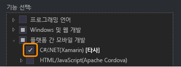

# 설정 및 설치
Xamarin을 사용하여 일반적인 C#/.NET 코드베이스에서 네이티브 iOS, Android 및 Windows 앱을 빌드하려면 다음이 필요합니다.  
  
-   Windows 및 Android 앱 작업: Visual Studio 2015 및 Xamarin 4가 설치된 Windows 개발 컴퓨터(아래 참고 사항 참조). [직접 Xamarin 설치](https://developer.xamarin.com/guides/cross-platform/getting_started/requirements/#install)(xamarin.com)의 지침에 따라 Visual Studio 2013을 사용할 수도 있습니다.   
  
-   iOS 앱 작업: XCode 및 Xamarin이 설치된 OS X Yosemite(10.10.5) 이상 버전의 Mac  
  
 Windows 및 Mac 컴퓨터를 동시에 설정할 수 있고 해당 설치 관리자가 실행되는 동안 [Xamarin을 사용한 모바일 개발에 대해 알아보기](../cross-platform/learn-about-mobile-development-with-xamarin.md)를 검토하여 필요한 배경 자료를 읽고 살펴볼 수 있습니다.  
 
이 설정 및 설치를 수행한 후 Xamarin을 사용하는 데 문제가 있으면 [forums.xamarin.com](http://forums.xamarin.com/)에 질문을 게시하세요.
  
> [!NOTE]
>  2016년 3월 31일부터는 모든 Visual Studio 버전에 모든 Xamarin이 추가 비용 없이 포함되며 별도의 라이선스는 필요하지 않습니다. 학생, OSS 개발자 및 소규모 팀의 경우에는 Xamarin Studio Community for Mac도 무료로 사용할 수 있습니다. 이전 Xamarin 라이선스로 구성한 기존 Visual Studio 설치의 경우에는 Xamarin을 버전 4.0.3.214 이상으로 업데이트해야 합니다. 이 작업을 수행하려면 **도구 > 옵션 > Xamarin > 기타**로 이동하여 **지금 확인** 링크를 클릭한 다음 4.0.3.214 업데이트를 다운로드합니다. Visual Studio를 다시 시작하고 **도구 > Xamarin 계정... **으로 이동하면 업데이트된 상태가 표시됩니다.  
  
 **항목 내용:**  
  
-   [필수 구성 요소](#prereq)  
  
-   [Windows 설치(Visual Studio 및 Xamarin)](#windows)  
  
-   [Mac 설치(Apple ID, Xcode 및 Xamarin)](#mac)  
  
##   필수 구성 요소  
  
1.  Xamarin 계정: [https://www.xamarin.com/](https://www.xamarin.com/)으로 이동하여 페이지 오른쪽 위에서 **로그인**을 클릭한 다음 나타나는 페이지에서 **새 계정 만들기**를 클릭합니다. Xamarin 계정에 사용할 전자 메일 주소와 암호를 선택합니다. 나중에 이러한 정보를 사용합니다.  
  
2.  Windows 및 Android 타기팅:  
  
    1.  권장: Android 장치가 없는 경우 빠른 Hyper-V 기반 Visual Studio Emulator for Android를 사용할 수 있는 Windows 8 이상을 실행하는 VM이 아닌 물리적 Windows 컴퓨터 (VM이 아닌 실제 컴퓨터를 사용해야 한다는 내용을 앞에서 언급했는지 확인)  
  
    2.  Windows 7 이전 버전이 설치된 컴퓨터를 사용할 수도 있으며, 이 경우 Xamarin Player for Android를 에뮬레이터로 사용하게 됩니다. 
    
    3. 어떤 구성을 사용하든 항상 연결된 물리적 장치에서 앱을 직접 실행할 수 있습니다.  
  
3.  IOS 타기팅:  
  
    1.  OS X 10.10.5 이상(Xcode 7.1에 필요)을 실행하는 OS X Yosemite가 설치된 네트워크 Mac 또는 Mac mini  
  
    2.  Windows(7 이상) 컴퓨터에서 Visual Studio를 기본 개발 환경으로 사용하는 경우에는 iOS 앱을 컴파일/디버그하고, iOS 시뮬레이터 또는 테더링된 장치에 연결하고, 사용자 인터페이스 디자인을 위해 Visual Studio에서 스토리보드 디자인을 사용할 때만 네트워크 Mac이 필요합니다. 이러한 보조 역할에는 이전 Mac 모델을 사용해도 충분합니다.  
  
##   Windows 설치(Visual Studio 및 Xamarin)  
  
> [!TIP]
>  이러한 지침은 Visual Studio 2015에 적용됩니다. Visual Studio 2013(업데이트 2 필요)에서 Xamarin을 사용하려면 [직접 Xamarin 설치](https://developer.xamarin.com/guides/cross-platform/getting_started/requirements/#install)(xamarin.com)의 지침을 따릅니다.  
  
1.  [어떤 버전이든 Visual Studio 2015 설치 관리자를 다운로드하여 설치합니다](https://www.visualstudio.com/en-us/downloads/download-visual-studio-vs.aspx) (Community, Professional 또는 Enterprise). Visual Studio 2015 Community는 무료 버전이고, Professional 및 Enterprise 버전은 30일 평가판으로 사용할 수 있으며 평가 기간 이후에는 라이선스를 구매해야 합니다.  
  
    1.  Visual Studio를 이미 설치했으면 **제어판 > 프로그램 및 기능**을 열고 **Visual Studio 2015** 항목을 선택한 후에 **변경**을 클릭합니다. 설치 관리자가 열리면 **수정**을 클릭하고 아래의 3단계로 건너뜁니다.  
  
2.  (새 설치에만 해당) 설치 관리자 내에서 **사용자 지정** 설치를 선택합니다.  
  
       
  
3.  다음 상자를 선택합니다.  
  
    1.  **플랫폼 간 모바일 개발 > C#/.NET(Xamarin)**. 그러면 일반 도구와 소프트웨어 개발 키트 아래에서 다양한 Android 도구가 자동으로 선택됩니다. 이 옵션을 사용하는 경우 기존 Xamarin 설치도 업데이트합니다.  
  
           
  
    2.  Windows 8 이상: **플랫폼 간 모바일 개발 > Microsoft Visual Studio Emulator for Android**. 참고: Windows 7 이하 컴퓨터를 사용하거나 Mac에서 Windows를 실행하고 있으면 이 확인란이 *선택 취소*되어 있는지 확인합니다. 5단계 후에 "Windows 컴퓨터의 에뮬레이터에 대한 참고"를 참조하세요. 물리적 Android 장치에서만 디버그하려는 경우에는 이 확인란을 선택 취소한 상태로 유지해도 됩니다.  
  
    3.  (선택 사항) Windows 장치를 대상으로 지정하려면 **Windows 및 웹 개발 > 유니버설 Windows 앱 개발 도구** 및/또는 **Windows 8.1 및 Windows Phone 8.0/8.1 도구**도 선택합니다. 여기에는 다운로드하는 데 시간이 더 오래 걸리는 에뮬레이터 이미지를 설치하기 위한 옵션이 포함되고, 언제든지 Visual Studio 설치 관리자로 돌아가서 나중에 추가할 수 있습니다.  
  
4.  설치 단추를 클릭하면 프로세스가 실행됩니다. 이 작업도 완료하는 데 약간 시간이 걸리므로 기다리는 동안 Mac 설치 지침을 계속 확인하고 [Xamarin을 사용한 모바일 개발에 대해 알아보기](../cross-platform/learn-about-mobile-development-with-xamarin.md)를 살펴볼 수 있습니다.  
  
5.  설치가 완료되면 Visual Studio를 시작하고 메시지가 표시되면 Microsoft 계정으로 로그인합니다(Windows에서 사용하는 것과 같은 계정). 그리고 **도구 > 옵션 >Xamarin** 또는 **도구 > 옵션 Xamarin > 기타**에서 **지금 확인** 링크를 통해 Xamarin 업데이트를 확인합니다.  
  
       
  
    > [!NOTE]
    >  앞에서 언급한 것처럼, 이전 Xamarin 라이선스 관련 문제를 방지하려면 Xamarin을 4.0.3.214 이상으로 업데이트해야 합니다.  

    **도구 > 옵션**에 Xamarin에 대한 옵션이 표시되지 않으면 설치를 다시 확인하거나 Visual Studio를 다시 시작해 보세요. 옵션 대화 상자에서 Xamarin을 검색할 수도 있습니다.
      
6.  Windows 7 이하 버전의 경우 또는 Mac에서 Windows를 실행하는 경우 물리적 장치가 없으면 [Android SDK 에뮬레이터](https://developer.xamarin.com/guides/android/deployment,_testing,_and_metrics/debug-on-emulator/android-sdk-emulator/)를 사용합니다. 다음 참고를 참조하세요.  
  
 **Windows 컴퓨터의 에뮬레이터에 대한 참고:** CPU는 한 번에 하나의 가상화 기술만 지원하므로 개발 컴퓨터에서 하나의 기술만 사용하는 것이 좋습니다. 세 가지 주요 가상화 기술은 Hyper-V(Visual Studio Emulator for Android 및 Windows Phone 에뮬레이터에서 사용됨), Virtual Box(Genymotion에서 사용됨) 및 Intel HAXM(Android SDK 에뮬레이터에서 사용됨)입니다. Hyper-V와 Virtual Box 간의 다양한 문제 때문에 지정된 컴퓨터에서 한 가지 유형의 에뮬레이터만 사용하는 것이 좋습니다. 즉, 위의 권장 사항에 따라 Windows 8 이상 컴퓨터에서는 Hyper-V를 사용하고 Windows 7 이하 컴퓨터를 사용하는 경우와 Mac에서 Windows를 실행하는 경우에는 Intel HAXM 에뮬레이터를 사용하는 것이 좋습니다.  
  
##   Mac 설치(Apple ID, Xcode 및 Xamarin)  
  
1.  Apple ID가 없으면 [https://appleid.apple.com](https://appleid.apple.com/) 에서 무료 Apple ID를 만듭니다. Xcode를 설치하고 서명하려면 이 작업이 필요합니다.  
  
2.  [https://developer.apple.com/xcode/](https://developer.apple.com/xcode/)에서 Xcode를 다운로드하여 설치하고 [XCode에 계정 추가](https://developer.apple.com/library/content/documentation/IDEs/Conceptual/AppStoreDistributionTutorial/AddingYourAccounttoXcode/AddingYourAccounttoXcode.html#//apple_ref/doc/uid/TP40013839-CH40-SW1)(apple.com)에 설명된 대로 Apple ID를 추가합니다.  
  
3.  [Xamarin.iOS 설치 및 구성](http://developer.xamarin.com/guides/ios/getting_started/installation/mac/) (영문)(xamarin.com)의 지침에 따라 Xamarin을 다운로드하여 설치합니다.  
  
4.  Windows 및 Mac 컴퓨터에서 Xamarin 설치를 마친 후 [Mac에 연결](http://developer.xamarin.com/guides/ios/getting_started/installation/windows/xamarin-mac-agent/)(xamarin.com)의 지침에 따라 Windows 컴퓨터의 Visual Studio에서 iOS 및 Mac 작업을 수행할 수 있습니다.  
  
     두 컴퓨터는 같은 로컬 네트워크에 있어야 합니다.
