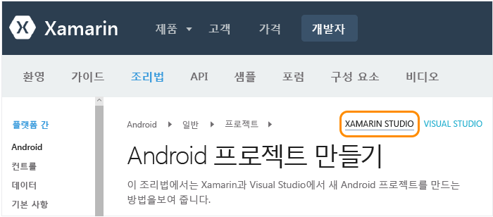
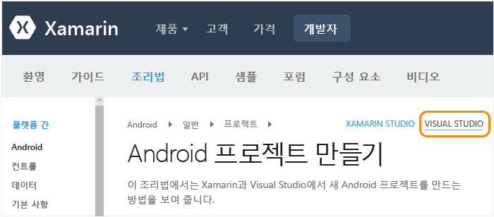

# Mac 사용자용 설정, 설치 및 확인
이 항목은 Mac에서 주로 작업하고 Mac의 Windows 가상 컴퓨터 내부에서 선택적으로 Visual Studio를 사용하는 개발자를 위해 제공됩니다. 주로 Windows 컴퓨터에서 작업하는 개발자가 iOS를 대상으로 하도록 보조 Mac을 설정해야 하면 기본 [설정 및 설치](../cross-platform/setup-and-install.md) 항목을 참조하세요.

 Mac에서 Xamarin을 사용하려면 다음이 필요합니다.

-   macOS Sierra 10.12 이상, Xcode 및 Xamarin이 설치된 Mac

-   다음 구성의 하나:

    -   **Mac에서 직접 Xamarin Studio를 실행하려면:** Xamarin Studio는 C#을 사용한 Android, iOS 및 Windows 앱 빌드를 지원하는 Xamarin 개발 환경입니다.  Xamarin Studio를 간단히 살펴보려면 [Xamarin Studio 개요](https://xamarin.com/studio) (영문)(xamarin.com)를 참조하세요.

    -   **Mac에 Parallels 또는 VMWare가 구성되어 있는 경우:** Parallels 또는 VMWare 내부에서 Visual Studio 2017 및 Xamarin이 설치된 Windows를 실행합니다.  이 구성을 사용하면 Xamarin은 Visual Studio와 함께 설치되고 C#을 사용하여 Android, iOS 및 Windows 앱을 빌드하는 데 Visual Studio를 개발 환경으로 사용하는 기능을 제공하는 확장입니다.  Visual Studio Developer Essentials 프로그램 일부로 무료 3개월 Parallels 구독을 구할 수 있습니다. [Microsoft Visual Studio Dev Essentials에 Parallels Desktop Pro 및 Parallels Access가 포함됨](http://blog.parallels.com/blog/2015/11/18/visual-studio-dev-essentials/) (영문)(Parallels 블로그)을 참조하세요.

 이 항목에서는 이러한 요구 사항에 대한 지침을 제공합니다.  설치 프로세스가 실행되는 동안 [Xamarin을 사용한 모바일 개발에 대해 알아보기](../cross-platform/learn-about-mobile-development-with-xamarin.md) 항목을 검토하여 필요한 배경 자료를 읽고 살펴볼 수 있습니다.

##   Mac 설치(Apple ID, Xcode 및 Xamarin)

1.  Apple ID가 없으면 [내 Apple ID](https://appleid.apple.com/)에서 무료 Apple ID를 만듭니다. Xcode를 설치하고 서명하려면 이 작업이 필요합니다.

2.  [https://developer.apple.com/xcode/](https://developer.apple.com/xcode/)에서 Xcode 다운로드 및 설치.

3.  [Xamarin.iOS 설치 및 구성](http://developer.xamarin.com/guides/ios/getting_started/installation/mac/) (영문)(xamarin.com)의 지침에 따라 Xamarin을 다운로드하여 설치합니다.

4.  Windows 및 Mac 컴퓨터에서 Xamarin 설치를 마친 후 [Connecting to the Mac using XMA](http://developer.xamarin.com/guides/ios/getting_started/installation/windows/#Connecting_to_the_Mac_Using_XMA)(XMA를 사용하여 Mac에 연결)(xamarin.com)의 지침에 따라 Windows 컴퓨터의 Visual Studio에서 iOS 및 Mac 작업을 수행할 수 있습니다.

##   Parallels 내부의 Windows 설치(Visual Studio 및 Xamarin)

1.  Parallels/VMWare 내부에 구성한 Windows 데스크톱을 사용하여 Community, Professional, Enterprise 중 [어떤 버전이든 Visual Studio 2017 설치 관리자를 다운로드하여 시작합니다](https://www.visualstudio.com/downloads/). Visual Studio 2017 Community는 무료 버전이고, Professional 및 Enterprise 버전은 30일 평가판으로 사용할 수 있습니다.

2.  _설치 관리자에서_ **시작** 옆에 있는 **추가 옵션**(세 막대 아이콘) 단추를 클릭한 다음 **수정**을 선택합니다.  
  
       
  
3.  다음 상자를 선택합니다.

    1.  **모바일 및 게임 > .NET을 사용한 모바일 개발** 그러면 일반 도구와 소프트웨어 개발 키트 아래에서 다양한 Android 도구가 자동으로 선택됩니다. 이 옵션을 사용하는 경우 기존 Xamarin 설치도 업데이트합니다.  
  
           
  
    2. (선택 사항) **Windows > 유니버설 Windows 플랫폼 개발** 여기에는 다운로드하는 데 시간이 더 오래 걸리는 에뮬레이터 이미지를 설치하기 위한 옵션이 포함되고, 언제든지 Visual Studio 설치 관리자로 돌아가서 나중에 추가할 수 있습니다.  

4.  **수정** 단추를 클릭하면 프로세스가 실행됩니다. 이 작업도 완료하는 데 약간 시간이 걸리므로 기다리는 동안 Mac 설치 지침을 계속 확인하고 [Xamarin을 사용한 모바일 개발에 대해 알아보기](../cross-platform/learn-about-mobile-development-with-xamarin.md)를 살펴볼 수 있습니다.

5.  설치가 완료되면 Visual Studio를 시작하고 메시지가 표시되면 Microsoft 계정으로 로그인합니다(Windows에서 사용하는 것과 같은 계정).

6.  Windows 및 Mac 컴퓨터에서 모두 Xamarin 설치를 완료한 후 [Connecting to the Mac using XMA](http://developer.xamarin.com/guides/ios/getting_started/installation/windows/#Connecting_to_the_Mac_Using_XMA)(XMA를 사용하여 Mac에 연결)(xamarin.com)의 지침에 따라 Visual Studio에서 iOS 작업을 수행할 수 있습니다.

##   환경 확인
 설치 관리자가 완료되면 잠시 Xamarin 개발을 경험할 모든 준비가 되었는지 확인하세요.

### Xamarin Studio
 먼저 제공된 링크로 이동할 때 Xamarin 설명서의 올바른 버전이 표시되도록 오른쪽 위에 **Xamarin Studio** 가 선택되었는지 확인합니다.

 

**OWA(Outlook Web Access)**

1.  [Android 프로젝트 만들기](http://developer.xamarin.com/recipes/android/general/projects/create_an_android_project/) (영문)(xamarin.com)의 지침에 따라 Android 프로젝트 만들기를 확인합니다.

2.  [Android Player > Xamarin Studio 통합 설명서](https://developer.xamarin.com/guides/android/getting_started/installation/android-player/#Integration_with_Xamarin_Studio)(xamarin.com)를 통해 Android 에뮬레이터의 디버깅 유효성을 검사합니다.

**iOS**

1.  [iOS 만들기](http://developer.xamarin.com/recipes/ios/general/projects/create_an_ios_project/) (영문)(xamarin.com)의 지침에 따라 iOS 프로젝트 만들기를 확인합니다.

2.  [시뮬레이터의 디버깅 설명서](https://developer.xamarin.com/guides/ios/deployment,_testing,_and_metrics/debugging_in_xamarin_ios/#Debugging_on_the_Simulator) (영문)(xamarin.com)를 통해 iOS 시뮬레이터의 디버깅을 확인합니다.

### Visual Studio
 먼저 제공된 링크로 이동할 때 Xamarin 설명서의 올바른 버전이 표시되도록 오른쪽 위에 **Visual Studio** 가 선택되었는지 확인합니다.

 

**Android**

1.  [Android 프로젝트 만들기](http://developer.xamarin.com/recipes/android/general/projects/create_an_android_project/) (영문)(xamarin.com)의 지침에 따라 Android 프로젝트 만들기를 확인합니다.

2.  Android 디자이너 유효성 검사: 솔루션 탐색기의 Android 프로젝트에서**리소스 > 레이아웃 > Main.axml** 파일을 엽니다.

    -   “설치된 Android SDK가 너무 오래되었습니다.”라는 오류가 표시되면 이 메시지에서 **Android SDK 열기**를 클릭하고 사용 가능한 최신 SDK 버전을 선택합니다. SDK를 업데이트하려면 Visual Studio를 관리자로 실행하고 있어야 합니다.

3.  Visual Studio에서 Mac에 설치된 에뮬레이터로 연결할 수 있는지 확인합니다.  이의 결과로 Visual Studio 내에서 디버깅용으로 선택할 수 있는 에뮬레이터 목록에 Xamarin Player가 표시됩니다.  이 작업을 수행하려면 [Xamarin Android Player에 Visual Studio 연결](http://developer.xamarin.com/guides/android/deployment,_testing,_and_metrics/android-player-with-visual-studio-in-vm/) (영문)(xamarin.com)의 지침을 따르세요.

**iOS**

1.  [Connecting to the Mac](https://developer.xamarin.com/guides/ios/getting_started/installation/windows/#Connecting_to_the_Mac)(Mac에 연결)(xamarin.com)에 설명된 대로 Mac이 네트워크에서 사용 가능하고 Visual Studio와 연결되었는지 확인합니다.

2.  [iOS 만들기](http://developer.xamarin.com/recipes/ios/general/projects/create_an_ios_project/) (영문)(xamarin.com)의 지침에 따라 iOS 프로젝트 만들기를 확인합니다.

3.  스토리보드 디자이너 확인: 솔루션 탐색기의 iOS 프로젝트에서 **MainStoryboard.storyboard** 파일을 엽니다. 여기서 Visual Studio는 Mac에서 원격으로 실행 중인 디자이너를 호스트하고 있습니다.

4.  빌드 및 디버깅 확인:

    1.  솔루션 탐색기에서 iOS 프로젝트를 마우스 오른쪽 단추로 클릭하고 **시작 프로젝트로 설정**을 선택합니다.

    2.  아래 표시된 대로 Visual Studio의 빌드 드롭다운에서 **iPhoneSimulator** 대상을 선택합니다. 시뮬레이터가 나열되지 않으면 Mac에서 Xcode를 시작하고 **Xcode->기본 설정**을 선택한 후에 **다운로드**를 클릭합니다. **구성 요소** 에 다운로드할 수 있는 시뮬레이터 버전이 표시되어야 합니다. 디버깅에 대한 추가 지침은 Xamarin의 [Debugging](https://developer.xamarin.com/guides/ios/deployment,_testing,_and_metrics/debugging_in_xamarin_ios/#Debugging_on_the_Simulator)(디버깅) 페이지(xamarin.com)에서 확인할 수 있습니다.

         

    3.  아래 표시된 대로 Visual Studio의 디버그 드롭다운에서 iPhone 대상을 선택하고 F5 키를 눌러 디버거를 시작합니다. 그러면 앱을 조작할 Mac에서 시뮬레이터가 시작되고 동시에 Visual Studio에서 디버깅이 수행됩니다.

         