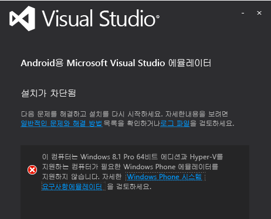
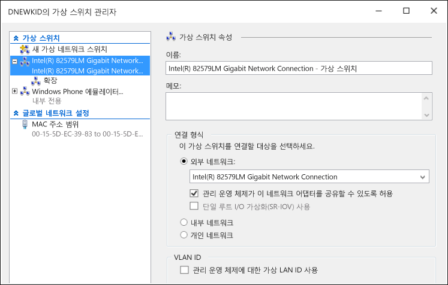

# Troubleshooting the Visual Studio Emulator for Android
이 항목에는 Android용 Visual Studio 에뮬레이터를 사용하는 동안 발생할 수 있는 문제를 해결하는 데 도움이 되는 정보가 들어 있습니다.  
  
> [!WARNING]
>  에뮬레이터가 설치되면 설치 프로그램은 소프트웨어 실행을 위한 필수 구성 요소를 확인합니다. 필수 구성 요소가 없는 경우 경고가 표시되지만 설치에 꼭 필요한 것은 아닙니다.  
  
 이 항목에는 다음과 같은 섹션이 포함되어 있습니다.  
  
-   [시작하기 전에](#BeforeYouStart)  
  
-   [에뮬레이터 설치 실패](#NoInstall)  
  
-   [도메인 또는 회사 네트워크의 네트워크 대상에 연결할 수 없음](#DomainNetwork)  
  
-   [네트워크 설정에 수동 구성이 필요할 때 네트워크 대상에 연결할 수 없음](#ManualNetworkConfig)  
  
-   [에뮬레이터가 느려지기 시작하거나, 시간 초과로 인해 시작되지 못하거나, 앱 배포가 실패함](#SlowStart)  
  
-   [에뮬레이터 시작 실패](#NoStart2)  
  
-   [Emulator fails to start (first use)](#NoStart)  
  
-   [에뮬레이터를 설치한 후 컴퓨터 부팅 실패](#NoBoot)  
  
-   [Visual Studio가 앱을 에뮬레이터에 배포하는 동안 중지되거나 에뮬레이터가 다른 IDE에 디버그 대상으로 표시되지 않습니다.](#ADB)  
  
-   [에뮬레이터가 UDP 포트를 설정하지 못해서 중지됨](#XamarinPlayer)  
  
-   [Xamarin 프로젝트에 디버거를 연결할 수 없음](#Skylake)  
  
-   [에뮬레이터가 Google Play 서비스를 사용하는 앱을 실행하지 못함](#GooglePlay)  
  
-   [파일 끌어서 놓기, APK 또는 플래시 가능 zip 파일이 작동하지 않습니다.](#DragAndDrop)  
  
-   [스크린샷의 해상도가 올바르지 않음](#Resolution)  
  
-   [에뮬레이터가 OpenGL 콘텐츠를 렌더링하지 못함](#OpenGL)  
  
-   [에뮬레이터가 멀티 터치 제스처에 응답하지 않음](#Multitouch)  
  
-   [지원 리소스](#Support)  
  
##   시작하기 전에  
 문제 해결을 시작하기 전에 다음 항목을 검토하는 것이 유용할 수 있습니다.  
  
-   [System Requirements for the Visual Studio Emulator for Android](../cross-platform/system-requirements-for-the-visual-studio-emulator-for-android.md)  
  
##   에뮬레이터 설치 실패  
 Hyper-V를 설치하지 않은 경우 에뮬레이터를 설치하려고 할 때 다음과 같은 메시지가 나타납니다. HyperV를 지원하는 컴퓨터가 있어야 하고 HyperV를 사용하도록 설정해야 합니다.  
  
   
  
> [!NOTE]
>  이 메시지는 Android용 Visual Studio 에뮬레이터 및 Windows Phone 에뮬레이터 모두에 적용됩니다. Windows 8.1 및 Windows 10에서 에뮬레이터를 지원합니다.  
  
 이 메시지가 표시되는 경우 [System Requirements for the Visual Studio Emulator for Android](../cross-platform/system-requirements-for-the-visual-studio-emulator-for-android.md) 에서 에뮬레이터를 실행할 수 있는지 여부를 확인하세요.  
  
##   도메인 또는 회사 네트워크의 네트워크 대상에 연결할 수 없음  
 Android용 Visual Studio 에뮬레이터는 네트워크에서 자체 IP 주소를 가진 별도 장치도 나타납니다. 이 에뮬레이터는 Windows 도메인에 연결되지 않고 호스트 컴퓨터와 도메인 또는 작업 그룹 자격 증명을 공유하지 않습니다.  
  
 네트워크에 기본 네트워크 및 인터넷 연결을 위한 도메인 또는 작업 그룹 권한 부여가 필요한 경우 IT 관리자에게 예외에 대해 문의합니다. 이 예외를 사용하여 개발 컴퓨터는 경계 시스템으로 작동할 수 있고 에뮬레이터와 같은 도메인에 연결되지 않은 네트워크 장치에서의 연결을 허용할 수 있습니다.  
  
 Android용 Visual Studio 에뮬레이터는 또한 고유한 MAC 주소 집합을 사용합니다. 에뮬레이터에서 네트워크 또는 인터넷 리소스에 액세스할 수 없으면 IT 관리자에게 에뮬레이터의 MAC 주소가 네트워크에서 허가되었는지 확인합니다.  
  
#### 에뮬레이터의 MAC 주소를 보려면  
  
1.  에뮬레이터를 시작합니다.  
  
2.  에뮬레이터 도구 모음에서 펼침 단추(>>)를 클릭하여 추가 도구 창을 엽니다.  
  
3.  추가 도구 창에서 네트워크 탭을 클릭합니다.  
  
4.  네트워크 페이지에서 실제 주소 항목을 찾습니다.  
  
##   네트워크 설정에 수동 구성이 필요할 때 네트워크 대상에 연결할 수 없음  
 에뮬레이터에서 네트워크 대상에 연결하려면 네트워크가 다음 요구 사항을 충족해야 합니다.  
  
-   DHCP. 에뮬레이터는 네트워크에서 자체 IP 주소를 갖는 별도의 장치로 구성되므로 DHCP가 필요합니다.  
  
-   자동으로 구성된 DNS 및 게이트웨이 설정. 에뮬레이터에 대해 DNS 및 게이트웨이 설정을 수동으로 구성할 수 없습니다.  
  
 네트워크에 수동으로 구성된 설정이 필요한 경우 IT 관리자에게 에뮬레이터에 대한 네트워크 연결을 설정하는 방법을 확인합니다.  
  
##   에뮬레이터가 느려지기 시작하거나, 시간 초과로 인해 시작되지 못하거나, 앱 배포가 실패함  
 특정 상황에서 에뮬레이터는 시작하는 데 몇 분 정도 소요되거나 시간 초과로 인해 시작되지 않습니다. 에뮬레이터를 시작하지 못하면 다음 메시지가 나타납니다. `App deployment failed. Please try again`. 이 오류는 다음과 같은 상황에서 발생할 수 있습니다.  
  
-   부팅 가능 VHD에서 Android용 Visual Studio 에뮬레이터를 실행하고 있습니다. 이 구성은 지원되지 않습니다.  
  
-   하드 드라이브에 결함이 있습니다. chkdsk 프로그램 실행을 고려합니다.  
  
-   하드 드라이브에 조각 모음이 필요합니다. 드라이브 조각 모음을 고려합니다.  
  
-   하드 드라이브가 거의 가득 찼습니다. 드라이브의 사용 가능한 공간을 확인합니다.  
  
-   실행 중인 다른 응용 프로그램으로 인해 메모리가 부족합니다. 메모리를 소비하는 응용 프로그램의 수를 줄이거나 메모리 양을 늘립니다.  
  
-   일반적으로 시스템의 성능 저하는 다양한 요인에 의해 발생할 수 있습니다. 제어판의 성능 정보 및 도구 페이지에서 찾을 수 있는 Windows 체험 지수에서 항목별 점수가 가장 낮은 구성 요소의 문제부터 해결합니다.  
  
##   에뮬레이터 시작 실패  
 에뮬레이터가 기존에 작동했지만 지금은 작동하지 않는 경우 다음 작업을 수행합니다. 에뮬레이터를 처음으로 사용하는 경우 이 단계를 시도하기 전에 [Emulator fails to start (first use)](#NoStart) 를 참조하세요.  
  
-   에뮬레이터의 다른 Hyper-V 인스턴스를 제거합니다.  
  
    1.  Visual Studio를 닫습니다.  
  
    2.  Hyper-V 관리자를 열고 이미 실행 중이지만 손상된 상태일 수 있는 에뮬레이터(가상 컴퓨터)의 Hyper-V 인스턴스를 모두 중지합니다.  
  
    3.  Hyper-V 관리자에서 다른 에뮬레이터 VM을 삭제합니다.  
  
    4.  컴퓨터를 다시 부팅합니다.  
  
-   4GB 이상의 시스템 메모리가 있는지와 이 메모리가 다른 리소스 집약적 프로그램 및 프로세스에서 사용되고 있지 않은지 확인합니다. 예를 들어 브라우저 창을 닫아 봅니다.  
  
-   Hyper-V 관리자에 가상 스위치 관리자를 열고 네트워크 스위치가 2개 있고, 첫 번째는 내부 스위치, 두 번째는 외부 스위치인지 확인합니다.  
  
       
  
     설치가 잘못되고 Windows 10을 사용 중인 경우 [netcfg – d 명령을 사용하여 네트워크 장치를 다시 설치](http://windows.microsoft.com/en-us/windows-10/fix-network-connection-issues)할 수 있습니다(섹션 6).  
  
-   이러한 단계로도 문제가 해결되지 않으면 [Emulator fails to start (first use)](#NoStart) 에서 에뮬레이터에 방해가 될 수 있는 타사 소프트웨어에 대한 정보를 확인하세요.  
  
##   Emulator fails to start (first use)  
 에뮬레이터가 시작되지 않으면 다음 작업을 수행하여 문제를 확인하고 해결합니다.  
  
-   최소 하드웨어 요구 사항이 충족되는지와 BIOS 설정이 올바른지 확인합니다.  
  
     이 에뮬레이터와 Windows 8 Hyper-V에는 SLAT(두 번째 수준 주소 변환)를 지원하는 64비트 프로세서가 필요합니다. Intel의 경우는 기본적으로 Core i3, i5 또는 i7 프로세서(또는 여러 Xeon 모델 하나)가 필요합니다. AMD 칩의 목록은 [여기](http://support.amd.com/en-us)에서 확인할 수 있습니다.  
  
    1.  사용하는 컴퓨터가 [시스템 요구 사항](../cross-platform/system-requirements-for-the-visual-studio-emulator-for-android.md)을 충족하는지 확인합니다.  
  
    2.  [SLAT 도구](https://slatstatuscheck.codeplex.com/) 에서 컴퓨터의 SLAT 지원 여부를 보고하는지 확인합니다.  
  
    3.  컴퓨터의 BIOS 설정 내에서 모든 가상화 기술을 사용되도록 설정되어 있는지 확인합니다. 각 하드웨어 제조업체에 대해 정확한 BIOS 설명이 다를 수 있습니다. 일반적으로 다음과 관련된 기능을 사용하도록 설정합니다.  
  
        -   SLAT(두 번째 수준 주소 변환)  
  
        -   EPT(확장 페이지 테이블)(Intel)  
  
        -   NPT(중첩된 페이지 테이블)(AMD)  
  
        -   RVI(신속한 가상화 인덱싱)(AMD)  
  
        -   VMX(하드웨어 지원 가상화 지원을 나타내는 Intel 머리글자어)  
  
        -   SVM(하드웨어 지원 가상화 지원을 나타내는 AMD 머리글자어)  
  
        -   XD(Execute Disable)(Intel). 사용하도록 설정해야 합니다.  
  
        -   NX(No Execute)(AMD). 사용하도록 설정해야 합니다.  
  
    4.  BIOS에 다음 옵션이 있는 경우 사용하지 않도록 설정합니다.  
  
        -   Intel VT-d 사용 안 함  
  
        -   신뢰할 수 있는 실행 사용 안 함  
  
         자세한 내용은 다음 문서를 참조하세요. Technet: Hyper-V: Hyper-V를 사용하도록 설정하는 동안 BIOS 오류를 해결하는 방법  
  
    5.  4GB 이상의 시스템 메모리가 있는지와 이 메모리가 다른 리소스 집약적 프로그램 및 프로세스에서 사용되고 있지 않은지 확인합니다.  
  
    6.  Windows 8 Professional 이상을 실행하고 있는지 확인합니다(Windows Server 2008은 지원되지 않음). Windows Server 2012는 지원되지만 데스크톱 경험 기능을 사용하도록 설정해야 합니다.  
  
     이벤트 뷰어를 검사하여 하이퍼바이저 오류가 있는지 확인할 수 있습니다. 이 작업을 수행하려면 이벤트 뷰어를 열고(시작 키+R을 입력한 다음 `eventvwr`입력) **Windows 로그**, **시스템**을 선택합니다. 그런 후 소스를 **Hyper-V-Hypervisor**로 설정하고 이벤트 소스별로 로그를 필터링합니다. 근본 원인을 파악하는 데 도움이 되도록 오류를 확인하세요.  
  
     프로세서가 최소 요구 사항을 충족하지만 하이퍼바이저에 계속 오류가 발생하는 경우 컴퓨터에 사용할 수 있는 BIOS 업그레이드가 있는지 확인하세요. 업그레이드가 있고 적용하기로 선택한 경우 BIOS를 업그레이드할 때 제조업체에서 제공한 모든 사전 예방 조치를 준수합니다(예를 들어 전력 손실로 인해 BIOS 펌웨어 업그레이드가 중단될 경우 BIOS가 영구히 손상될 수 있으므로 주의할 것).  
  
-   4GB 이상의 시스템 메모리가 있는지와 이 메모리가 다른 리소스 집약적 프로그램 및 프로세스에서 사용되고 있지 않은지 확인합니다.  
  
-   가상 네트워킹에 방해가 될 수 있는 타사 드라이버 또는 소프트웨어를 제거/사용하지 않도록 설정합니다.  
  
     Hyper-V 네트워킹 스택과 완전히 호환되지는 않는 네트워킹 드라이버/프로토콜 등, Windows 8에 설치된 일부 타사 제품의 알려진 문제가 있습니다.  
  
     일반적으로 Windows 8 및 Hyper-V와 호환되도록 해당 소프트웨어를 업데이트하는 작업은 해당 제품 개발자가 진행해야 합니다.  
  
     Windows 8 규정 준수를 위해 VirtualBox, Virtual PC 7, VMWare, 일부 VPN 클라이언트, 소프트웨어 방화벽, 일부 Cisco VPN 클라이언트 버전 및 기타 가상화 시스템의 업그레이드가 필요할 수 있습니다. 문제가 있을 수 있는 가상화 소프트웨어의 개발자에게 Windows 8 및 Hyper-V와 호환되도록 소프트웨어를 업그레이드하도록 권장하세요.  
  
     **해결 방법**으로, 에뮬레이터에서 Visual Studio와 통신하는 데 사용하는 가상 네트워크에 방해가 될 수 있는 모든 타사 드라이버 및 응용 프로그램을 사용하지 않도록 설정할 수 있습니다. 이러한 응용 프로그램에는 다음이 포함될 수 있습니다.  
  
    -   바이러스 백신 응용 프로그램(네트워크 스택에 연결)  
  
    -   네트워크 모니터링 도구  
  
    -   네트워크 로깅 도구  
  
    -   기타 시스템 모니터링 소프트웨어  
  
     가능한 다른 해결 방법으로, 문제의 제품을 제거하고 제품 개발자에게 업데이트된 버전을 릴리스할 것을 요청하는 것 외에 다음 단계를 수행합니다.  
  
    1.  네트워크 연결 관리자를 시작합니다(시작 화면에서 `View Network Connections` 을 입력하고 이 옵션을 선택하여 네트워크 연결 보기).  
  
    2.  vEthernet(내부 이더넷 포트 Windows Phone 에뮬레이터 내부 스위치) 어댑터에 대해 상황에 맞는 메뉴에서 **속성** 을 선택합니다.  
  
           
  
         어댑터 속성은 다음과 같습니다.  
  
           
  
    3.  이 어댑터에 대해 **이 연결에 다음 항목 사용** 에서 선택해야 하는 유일한 항목은 다음과 같습니다.  
  
        -   Microsoft Networks용 클라이언트  
  
        -   QoS 패킷 스케줄러  
  
        -   Microsoft Networks에 대한 파일 및 프린터 공유  
  
        -   Microsoft LLDP 프로토콜 드라이버  
  
        -   연결 계층 토폴로지 검색 매퍼 I/O 드라이버  
  
        -   연결 계층 토폴로지 검색 응답기  
  
        -   인터넷 프로토콜 버전 6(TCP/IPv6)  
  
        -   인터넷 프로토콜 버전 4(TCP/IPv4)  
  
    4.  다른 모든 항목은 선택 취소합니다.  
  
     이 기법을 사용할 때의 단점은 새로운 타사 제품이 지원되지 않는 드라이버를 설치하거나, 에뮬레이터가 설치될 때마다 이러한 단계를 반복해야 한다는 것입니다.  
  
     타사 제품을 제거한 후 Windows Phone 에뮬레이터 내부 스위치를 복원해야 할 수 있습니다. 수행할 작업  
  
    -   Hyper-V를 열고 가상 스위치 관리자로 이동합니다. "Windows Phone 에뮬레이터 내부 스위치"라는 가상 스위치를 만들고 해당 연결 형식을 **내부 네트워크**로 설정합니다.  
  
           
  
     이제 에뮬레이터를 시작합니다. 에뮬레이터가 작동됩니다.  
  
##   에뮬레이터를 설치한 후 컴퓨터 부팅 실패  
 이 문제는 다음 조건에 해당되는 경우 발생할 수 있습니다.  
  
-   컴퓨터에 Gigabyte 마더보드가 있습니다.  
  
-   이 마더보드에서 USB3이 사용되도록 설정되어 있습니다.  
  
 이 문제를 해결하려면 마더보드의 BIOS 설정에서 USB3를 사용하지 않도록 설정하고 컴퓨터를 다시 부팅합니다. 그런 후 Gigabyte에서 이 마더보드의 BIOS에 대한 업데이트를 출시했는지 확인합니다.  
  
 자세한 내용은 기술 자료 문서 [Gigabyte 시스템에서 Hyper-V 역할을 설치한 후 부팅 오류 발생](https://support.microsoft.com/en-us/kb/2693144)을 참조하세요.  
  
##   Visual Studio가 앱을 에뮬레이터에 배포하는 동안 중지되거나 에뮬레이터가 다른 IDE에 디버그 대상으로 표시되지 않습니다.  
 에뮬레이터를 실행하고 있지만 ADB(Android 디버그 브리지)에 연결된 것으로 나타나지 않거나 ADB를 사용하는 Android 도구(예: Android Studio 또는 Eclipse)에 나타나지 않는 경우 에뮬레이터가 ADB를 찾는 위치를 조정해야 할 수 있습니다. 에뮬레이터는 레지스트리 키를 사용하여 Android SDK의 기본 위치를 식별하고 해당 디렉터리에서 \platform-tools\adb.exe 파일을 찾습니다. 에뮬레이터에서 사용하는 Android SDK 경로를 수정하려면  
  
-   시작 단추 상황에 맞는 메뉴에서 **실행** 을 선택하고 대화 상자에 `regedit` 를 입력한 다음 **확인**을 선택하여 레지스트리 편집기를 엽니다.  
  
-   왼쪽의 폴더 트리에서 HKEY_LOCAL_MACHINE\SOFTWARE\Wow6432Node\Android SDK Tools로 이동합니다.  
  
-   Android SDK의 경로와 일치하도록 **Path** 레지스트리 변수를 수정합니다.  
  
 에뮬레이터를 다시 시작하면 에뮬레이터가 ADB 및 관련 Android 도구에 연결되어 있는 것을 확인할 수 있어야 합니다.  
  
##   에뮬레이터가 UDP 포트를 설정하지 못해서 중지됩니다.  
 Xamarin Player와의 비호환성으로 인해 이 문제가 발생할 수 있습니다. 에뮬레이터가 응답하지 않거나 “에뮬레이터가 장치 운영 체제에 연결할 수 없음: UDP 포트를 설정할 수 없습니다.  일부 기능을 사용할 수 없습니다”와 같은 오류 메시지가 표시되는 경우 이 문제가 발생할 수 있습니다. 다음 단계를 수행합니다.  
  
1.  Xamarin Player를 제거합니다.  
  
2.  Virtual Box가 제거되었는지 확인합니다(Xamarin Player는 Virtual Box에서 실행됨).  
  
3.  장치 관리자로 이동하고 숨겨진 장치를 표시하는 옵션을 선택한 다음 실제 네트워크 카드를 제외하고 모든 장치를 삭제합니다.  
  
4.  실제 네트워크 어댑터 외의 장치를 모두 제거한 후 Hyper-V를 제거했다가 다시 설치해 볼 수 있습니다.  
  
##   Xamarin 프로젝트에 디버거를 연결할 수 없음  
 Intel Skylake 프로세서를 사용하여 Windows 10을 실행하는 경우 에뮬레이터에서 Xamarin 앱을 실행할 수 없거나 Visual Studio 디버거가 앱에 연결되지 않을 수 있습니다. 이러한 현상은 Hyper-V 및 Skylake 프로세서의 문제로 인해 발생합니다. 이러한 문제를 해결하려면 다음 단계를 수행합니다.  
  
1.  Hyper-V 관리자를 열고 사용 중인 에뮬레이터 프로필용 VM을 선택합니다.  
  
2.  오른쪽 아래에 있는 **저장된 상태 삭제**를 선택합니다.  
  
3.  **설정...**을 선택합니다.  
  
4.  프로세서 노드를 확장하고 **호환성**을 선택합니다.  
  
5.  **다른 프로세서 버전을 사용하는 물리적 컴퓨터로 마이그레이션**을 사용하도록 설정합니다.  
  
6.  **작업** 아래에서 서비스를 다시 시작한 후에 다시 시도합니다.  
  
##   에뮬레이터가 Google Play 서비스를 사용하는 앱을 실행하지 못함  
 에뮬레이터에 Google Play 서비스용 라이브러리가 함께 제공되지 않습니다. 그러나 에뮬레이터는 플래시 가능 zip 파일의 끌어서 놓기 설치를 지원합니다.  
  
##   파일 끌어서 놓기, APK 또는 플래시 가능 zip 파일이 작동하지 않습니다.  
 사용자가 화면에 파일을 끌어다 놓으면 에뮬레이터는 ADB.exe를 사용하여 화면에 파일을 전송합니다. 파일을 끌어다 놓으려 할 때 오류가 발생하면 에뮬레이터가 ADB.exe에 연결되지 않은 것일 수 있습니다. 해결하려면 [Visual Studio가 앱을 에뮬레이터에 배포하는 동안 중지되거나 에뮬레이터가 다른 IDE에 디버그 대상으로 표시되지 않습니다.](#ADB)에서 확인할 수 있습니다.  
  
##   스크린샷의 해상도가 올바르지 않음  
 **추가 도구** 창에서 스크린샷 탭을 사용하여 스크린샷을 찍었으나 결과 이미지 크기가 예상과 다른 경우 **캡처**를 선택하기 전에 화면의 확대/축소 수준을 조정해야 할 수 있습니다. 에뮬레이터는 호스트 PC 모니터의 화면 해상도로 스크린샷을 찍습니다.  
  
##   에뮬레이터가 OpenGL 콘텐츠를 렌더링하지 못함  
 에뮬레이터는 호스트 컴퓨터의 GPU를 사용하여 OpenGL 콘텐츠를 렌더링하고 ANGLE 프로젝트를 사용하여 DirectX와의 사이에서 이러한 호출을 변환합니다. 응용 프로그램이 장치에서는 올바르게 렌더링하지만 에뮬레이터에서는 그렇지 못할 경우 장치가 잘못된 OpenGL 호출을 완화시키는 것일 수 있습니다(예: 일치하지 않는 셰이더 변수 사용).  
  
##   에뮬레이터가 멀티 터치 제스처에 응답하지 않음  
 일부 경우에는 에뮬레이터가 시작되지만 터치 지원 디스플레이의 직접적인 조작을 통해 또는 에뮬레이터 도구 모음의 멀티 터치 도구를 사용하여 멀티 터치에 응답하지 않습니다. 이러한 경우 에뮬레이터 도구 모음에서 **회전** 단추를 선택하고 멀티 터치를 다시 사용해 봅니다. 문제가 계속되면 [에뮬레이터가 OpenGL 콘텐츠를 렌더링하지 못함](#OpenGL) 문제를 확인하세요.  
  
##   지원 리소스  
 호스트 컴퓨터가 시스템 요구 사항을 충족한 상태에서 이 문제 해결 가이드에서 다루지 않은 문제가 발생하는 경우:  
  
-   [Android 에뮬레이터](http://stackoverflow.com/questions/tagged/android-emulator) 및 visual-studio 태그를 사용하여 StackOverflow에 대해 질문합니다.  
  
-   Visual Studio 또는 에뮬레이터 관리자에서 웃는 얼굴 보내기 도구를 사용하여 문제를 보고합니다.