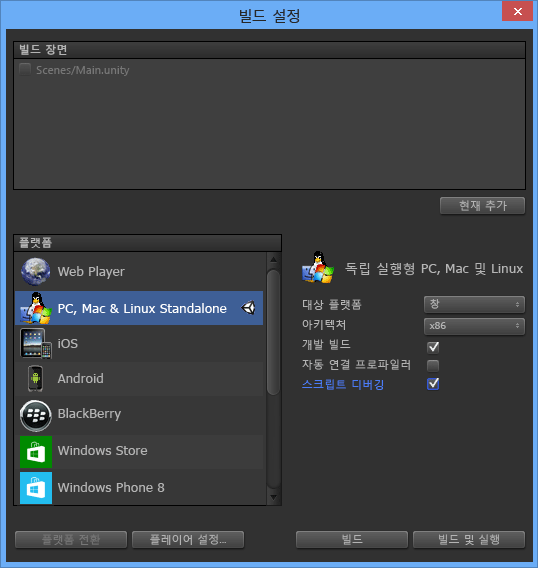

# Visual Studio Tools for Unity 사용
이 섹션에서는 Visual Studio Tools for Unity의 통합 및 생산성 기능을 사용하는 방법과 Unity 개발을 위해 Visual Studio 디버거를 사용하는 방법에 대해 배워 봅니다.  
  
## Unity 통합 및 생산성  
 Visual Studio Tools for Unity가 생산성을 높일 수 있도록 Unity 편집기와 통합되었습니다. 이러한 생산성 향상 기능은 일반적인 스크립팅 작업을 자동화하고 Unity에서 Visual Studio로 정보를 가져오므로 Unity 편집기로 전환하여 찾지 않아도 됩니다.  
  
### Unity 설명서 액세스  
 Visual Studio에서 신속하게 Unity 스크립팅 설명서에 액세스할 수 있습니다. Visual Studio Tools for Unity에서 로컬에 있는 API 설명서를 찾지 못하는 경우 온라인으로 찾기를 시도합니다.  
  
##### Unity 설명서에 액세스하려면  
  
-   Visual Studio에서 알아보려는 Unity API를 강조 표시하거나 그 위로 커서를 가져간 다음 **Ctrl+Alt+M, Ctrl+H**를 누릅니다.  
  
### Unity MonoBehavior 스크립팅 마법사  
 Unity에서 대부분의 스크립트는 MonoBehavior 클래스에서 파생하고 해당 메서드 중 일부를 재정의하여 구현됩니다. MonoBehavior 마법사를 사용하여 오버로드하려는 MonoBehavior 메서드의 빈 정의를 신속하게 만들 수 있습니다. 이 마법사를 사용하여 사용할 수 있는 메서드의 목록에서 오버로드하려는 하나 이상의 메서드를 지정하고, 코드에서 메서드를 삽입할 위치를 선택하고, 메서드가 사용되는 방법에 대한 설명을 포함할지 여부를 결정할 수 있습니다.  
  
   
  
##### MonoBehavior 마법사를 사용하여 빈 MonoBehavior 메서드 정의를 만들려면  
  
1.  Visual Studio에서 메서드를 삽입할 위치에 커서를 놓은 다음 **Ctrl+Shift+M**을 눌러 MonoBehavior 마법사를 시작합니다. 또는 이미 하나가 구현된 후 새로운 메서드를 삽입하려는 경우 나중에 지정할 수 있습니다. **Ctrl+Shift+M**을 누르기만 하면 됩니다.  
  
2.  오버로드하려는 메서드를 선택합니다. **스크립트 메서드 만들기** 창의 **만들 메서드 선택**에서 오버로드하려는 각 메서드 이름 옆의 확인란에 표시합니다.  
  
3.  **프레임워크 버전** 드롭다운에 표시된 프레임워크 버전이 사용 중인 버전과 일치하는지 확인합니다. 일치하지 않으면 사용하려는 버전의 드롭다운 값을 변경합니다.  
  
4.  메서드를 삽입할 위치를 선택합니다. 기본적으로 메서드는 커서의 위치에 삽입됩니다. 다른 위치에 삽입하려면 클래스에서 이미 구현된 메서드 뒤에 삽입하도록 선택할 수 있습니다. 이러한 위치 중 하나를 선택하려면 **삽입점** 드롭다운의 값을 원하는 위치로 변경합니다.  
  
5.  마법사가 선택한 방법에 대한 주석을 생성하게 하려면 **메서드 주석 생성** 확인란에 표시합니다. 이러한 주석은 해당 메서드를 호출하는 때가 언제인지, 해당 메서드가 담당하는 역할이 무엇인지 이해할 수 있기 위해 생성합니다.  
  
6.  **확인** 단추를 선택하여 마법사를 종료하고 메서드를 코드에 삽입합니다.  
  
 MonoBehavior 마법사는 아직 Unity API를 배우는 중이거나 익숙하지 않은 메서드를 오버로드해야 하는 경우에 특히 유용합니다. Unity API를 사용한 경험이 많은 사람은 이미 익숙한 메서드를 신속하게 만들기 위해 빠른 MonoBehavior 마법사를 선호할 수도 있습니다.  
  
#### 빠른 MonoBehavior 스크립팅 마법사  
 이미 Unity API에 익숙한 경우 빠른 MonoBehavior 마법사를 사용하여 훨씬 더 빠르게 오버로드된 메서드를 구현할 수 있습니다. 이 마법사를 사용하여 커서 위치에서 메서드 주석 없이 삽입되는 단 하나의 메서드를 지정할 수 있습니다.  
  
   
  
###### 빠른 MonoBehavior 마법사를 사용하여 빈 MonoBehavior 메서드 정의를 만들려면  
  
1.  Visual Studio에서 메서드를 삽입할 위치에 커서를 놓은 다음 **Ctrl+Shift+Q**를 눌러 빠른 MonoBehavior 마법사를 시작합니다. 새 메서드는 항상 그곳에 삽입되어 있으므로 다른 MonoBehavior 마법사와는 달리 이 마법사를 사용할 때는 의도적으로 커서를 배치해야 합니다.  
  
2.  **스크립트 메서드 만들기** 창의 오른쪽 상단 모서리에 표시되는 프레임워크 버전이 사용 중인 버전과 일치하는지 확인합니다. 일치하지 않으면 사용하려는 버전의 드롭다운 값을 변경합니다.  
  
3.  오버로드하려는 메서드를 찾습니다. 스크립트 메서드 만들기 창에서 텍스트 상자에 메서드의 이름을 입력하기 시작합니다. 입력한 이름과 일치하는 메서드 목록이 표시됩니다.  
  
4.  오버로드하려는 메서드를 선택합니다. 원하는 메서드가 목록에 표시되면 마우스 또는 화살표 키로 선택한 다음 **Enter** 키를 누릅니다. 목록에 메서드가 하나만 표시되는 경우 **Enter** 키를 누르기만 하면 됩니다. 메서드는 코드에 삽입됩니다.  
  
### Unity 프로젝트 탐색기  
 Unity 프로젝트 탐색기를 사용하여 Visual Studio 내의 Unity 프로젝트를 탐색할 수 있습니다.  
  
   
  
##### Unity 프로젝트 탐색기를 보려면  
  
-   Visual Studio의 주 메뉴에서 **보기**, **Unity 프로젝트 탐색기**를 선택합니다. 키보드: **Alt+Shift+E**  
  
       
  
 Unity 프로젝트 탐색기는 Unity 편집기와 동일한 방식으로 모든 Unity 프로젝트 파일 및 디렉터리를 표시합니다. 이는 Visual Studio Tools for Unity에서 생성한 프로젝트와 솔루션이 구성하는 대로 스크립트 파일만 포함하고 이를 표시하는 솔루션 탐색기를 사용하여 Unity 스크립트를 탐색하는 것과는 다릅니다. 특히 대규모 프로젝트에서 Unity 프로젝트 탐색기를 사용하면 수정하려는 스크립트를 일반적으로 더 쉽게 찾을 수 있습니다. 또한 Visual Studio 솔루션에서 프로젝트 중 하나로 추가하지 않고 Visual Studio에서 다른 종류의 파일(예: 텍스트 기반 구성 파일)을 쉽게 수정할 수 있습니다.  
  
### Unity 오류 목록  
 Unity 인스턴스에 연결된 경우 Visual Studio 내의 Unity 콘솔로부터의 메시지를 볼 수 있습니다. 여기에는 Unity에서의 오류 및 경고가 포함됩니다. 메시지는 Visual Studio의 **오류 목록** 창에 표시됩니다. Unity의 오류 메시지는 **오류** 탭에, 경고 메시지는 **경고** 탭에, 기타 메시지(예:Debug.Log Unity API를 사용하여 보낸 메시지)는 **메시지** 탭에 표시됩니다.  
  
 메시지를 보려면 Unity 프로젝트가 [Unity 플레이어에서 프로젝트를 디버그하고](#debugging-your-project-in-a-unity-player) 있어서 스크립트 디버깅을 지원하고 사용 중인 Visual Studio 버전에 적합한 Visual Studio Tools for Unity 패키지를 가져올 수 있어야 하며 Visual Studio가 [Unity에 연결](#connecting-visual-studio-to-unity)되어 있어야 합니다.  
  
 Visual Studio의 **오류 목록** 창에서 Unity의 오류, 경고 및 메시지를 보지 않으려면 구성 메뉴에서 비활성화할 수 있습니다.  
  
### 바로 가기 키  
 바로 가기 키를 사용하여 Visual Studio 기능에 대한 Unity 도구에 신속하게 액세스할 수 있습니다. 다음은 사용할 수 있는 바로 가기를 정리한 것입니다.  
  
|명령|바로 가기|바로 가기 명령 이름|  
|-------------|--------------|---------------------------|  
|MonoBehavior 마법사 열기|**Ctrl+Shift+M**|**EditorContextMenus.CodeWindow.ImplementMonoBehaviours**|  
|빠른 monobehavior 마법사 열기|**Ctrl+Shift+Q**|**EditorContextMenus.CodeWindow.QuickMonoBehaviours**|  
|Unity 프로젝트 탐색기 열기|**Alt+Shift+E**|**View.UnityProjectExplorer**|  
|Unity 설명서 액세스|**Ctrl+Alt+M, Ctrl+H**|**Help.UnityAPIReference**|  
|Unity 디버거(플레이어 또는 편집기)에 연결|***기본값이 없습니다.***|**Debug.AttachUnityDebugger**|  
  
 기본값이 마음에 들지 않는 경우 바로 가기 키 조합을 변경할 수 있습니다. 변경 방법에 대한 자세한 내용은 [Visual Studio에서 바로 가기 키 식별 및 사용자 지정](https://msdn.microsoft.com/en-us/library/5zwses53.aspx)을 참조하세요.  
  
## Unity 디버깅  
 Visual Studio Tools for Unity를 통해 Visual Studio의 강력한 디버거를 사용하여 Unity 프로젝트에 대해 편집기와 게임 스크립트를 모두 디버그할 수 있습니다.  
  
###   Unity에 Visual Studio 연결  
 Visual Studio Tools for Unity는 UDP 연결을 통해 Unity와 통신합니다. 즉, 로컬 또는 네트워크 어느 곳에서나 실행되는 Unity 인스턴스에 완전히 동일한 방식으로 연결할 수 있습니다. **Unity 인스턴스 선택** 대화 상자를 사용하여 네트워크에서 볼 수 있는 모든 Unity 인스턴스에 연결할 수 있습니다.  
  
##### Unity 인스턴스 선택 대화 상자를 열려면  
  
-   Visual Studio의 주 메뉴에서 **디버그**, **Unity 디버거 연결**을 선택합니다.  
  
       
  
-   *또는* Visual Studio의 상태 표시줄에서 Visual Studio의 오른쪽 아래 모서리에 있는 플러그 아이콘을 선택합니다.  
  
       
  
> [!TIP]
>  플러그 아이콘에 확인 표시가 보이면 Unity 인스턴스에 이미 연결되어 있는 것입니다.  
  
 **Unity 인스턴스 선택** 대화 상자는 연결할 수 있는 각 Unity 인스턴스에 대한 일부 정보를 표시합니다.  
  
   
  
 **프로젝트**  
 이 Unity의 인스턴스에서 실행되는 Unity 프로젝트의 이름입니다.  
  
 **Machine**  
 이 Unity가 실행되고 있는 컴퓨터 또는 장치의 이름입니다.  
  
 **Type**  
 이 Unity의 인스턴스가 Unity 편집기의 일부로 실행 중인 경우 **편집기**이며 이 Unity의 인스턴스가 독립 실행형 플레이어인 경우 **플레이어**입니다.  
  
 **포트**  
 이 Unity의 인스턴스에서 통신하는 데 사용하는 UDP 소켓의 포트 번호입니다.  
  
> [!IMPORTANT]
>  Visual Studio Tools for Unity 및 Unity 인스턴스가 UDP 네트워크 소켓을 통해 통신 중이므로 방화벽이 이를 감지할 수 있습니다. 이 경우 VSTU 및 Unity가 통신할 수 있도록  연결 권한을 부여해야 합니다.  
  
###   Unity 플레이어에서 프로젝트 디버그  
 Unity 편집기를 실행 중이지 않은 경우 Visual Studio Tools for Unity를 독립 실행형 플레이어에서 실행 중인 Unity 앱으로 직접 연결하거나 플랫폼 특정적인 문제를 디버그할 수 있습니다.  
  
##### Unity 플레이어에서 스크립트 디버깅을 활성화하려면  
  
-   스크립트 디버깅이 활성화된 상태로 개발 빌드를 만들고 있는지 확인합니다. Unity 프로젝트의 빌드 설정에서 **개발 빌드** 및 **스크립트 디버깅** 확인란에 표시합니다.  
  
   
  
 또한 **Unity 웹 플레이어**에서 실행 중인 Unity 앱을 디버그하려면 **개발 릴리스 채널**을 사용하도록 구성해야 합니다.  
  
##### Unity 웹 플레이어에서 개발 릴리스 채널을 구성하려면  
  
-   Unity 웹 플레이어의 상황에 맞는 메뉴에서 **릴리스 채널**을 선택하고 **개발** 옵션이 활성화되어 있는지 확인합니다.  
  
    > [!IMPORTANT]
    >  Unity 4.2 이상 버전에서는 웹 플레이어 상황에 맞는 메뉴에서 **릴리스 채널** 상황에 맞는 메뉴 항목을 사용하려면 상황에 맞는 메뉴를 열 때 **Alt** 키를 누르고 있어야 합니다. 웹 플레이어가 Mac OS X에서 실행 중인 경우 **Option** 키를 대신 누릅니다.  
  
 마지막으로 디버그하려는 Unity 인스턴스에 연결되어 있는지 확인합니다. 그렇게 하는 방법에 대한 내용은 [Unity에 Visual Studio 연결](#connecting-visual-studio-to-unity) 섹션을 참조하세요.  
  
### Unity 프로젝트에서 DLL 디버깅  
 많은 Unity 개발자가 개발하는 기능을 쉽게 다른 프로젝트와 공유할 수 있도록 코드 구성 요소를 외부 DLL로 작하고 있습니다. Visual Studio Tools for Unity를 통해 Unity 프로젝트에서 이러한 DDL의 코드를 다른 코드와 함께 원활하게 디버그할 수 있습니다.  
  
> [!NOTE]
>  이때 Visual Studio Tools for Unity는 관리 DLL만 지원합니다. C++에서 작성한 것과 같은 네이티브 코드 DLL의 디버깅은 지원하지 않습니다.  
  
 여기에 설명된 시나리오에서는 사용자에게 소스 코드가 있다고 가정합니다. 즉, 자사 코드를 개발 또는 다시 사용하는 중이거나 타사 라이브러리에 대한 소스 코드가 있으며 이를 Unity 프로젝트에서 DLL로 배포하도록 계획 중이라고 가정합니다. 이 시나리오는 소스 코드가 없는 DLL 디버깅에 대해서는 설명하지 않습니다.  
  
##### Unity 프로젝트에서 사용되는 관리 DLL 프로젝트를 디버그하려면  
  
1.  Visual Studio Tools for Unity에서 생성한 Visual Studio 솔루션에 기존 DLL 프로젝트를 추가합니다. 새로운 관리 DLL 프로젝트를 시작하여 Unity 프로젝트에 코드 구성 요소를 포함하는 경우도 더러 있을 수 있습니다. 이러한 경우 새로운 관리 DLL 프로젝트를 Visual Studio 솔루션에 대신 추가할 수 있습니다. 기존 또는 새 프로젝트를 솔루션에 추가하는 방법에 대한 자세한 내용은 [방법: 솔루션에 프로젝트 추가](https://msdn.microsoft.com/en-us/library/vstudio/ff460187.aspx)를 참조하세요.  
  
     ![기존 DLL 프로젝트를 솔루션에 추가합니다.] (../cross-platform/media/vstu_debugging_dll_add_existing.png "vstu_debugging_dll_add_existing")  
  
     두 경우 모두 Visual Studio Tools for Unity에서는 프로젝트 및 솔루션 파일을 다시 생성해야 하는 경우에도 프로젝트 참조를 유지하므로 이러한 단계는 한 번만 수행하면 됩니다.  
  
2.  DLL 프로젝트에서 올바른 Unity 프레임워크 프로필을 참조하세요. Visual Studio의 DLL 프로젝트 속성에서 **대상 프레임워크** 속성을 사용 중인 Unity 프레임워크 버전으로 설정합니다. 이는 Unity 전체, 마이크로, 또는 웹 기반 클래스 라이브러리 등 프로젝트가 대상으로 하는 API 호환성과 일치하는 Unity 기반 클래스 라이브러리입니다. 다른 프레임워크 또는 호환성 수준에 있지만 사용 중인 Unity 프레임워크 버전에는 없을 수 있는 프레임워크 메서드를 DLL에서 호출하는 것을 방지합니다.  
  
       
  
3.  Unity 프로젝트의 자산 폴더에 DLL을 복사합니다. Unity에서 자산은 런타임에 로드될 수 있도록 Unity 앱과 함께 배포되고 패키지되는 파일입니다. DLL은 런타임에 연결되므로 DDL을 자산으로 배포해야 합니다. 자산으로 배포하기 위해 Unity 편집기는 Unity 프로젝트에서 자산 폴더 안에 DLL을 배치할 것을 요구합니다. 다음 두 가지 방법으로 이 작업을 수행할 수 있습니다.  
  
    -   DLL 프로젝트의 빌드 설정을 수정하여 해당 출력 폴더에서 Unity 프로젝트의 **자산** 폴더로 출력 DLL 및 PDB 파일을 복사하는 빌드 후 작업을 포함합니다.  
  
    -   DLL 프로젝트의 빌드 설정을 수정하여 Unity 프로젝트의 **자산** 폴더로 해당 출력 폴더를 설정합니다. DLL 및 PDB 파일은 모두 **자산** 폴더에 배치됩니다.  
  
     PDB 파일은 DLL의 디버깅 기호를 포함하며 DLL 코드를 소스 코드 형태로 매핑하므로 디버깅에 필요합니다. Visual Studio Tools for Unity에서는 DLL 및 PDB의 정보를 사용하여 Unity 스크립팅 엔진에서 사용되는 디버그 기호 형식인 DLL.MDB 파일을 만듭니다.  
  
4.  코드를 디버그합니다. 이제 Unity 프로젝트의 소스 코드와 함께 DLL 소스 코드를 디버그할 수 있으며 중단점 및 단계별 코드 실행 등 익숙한 디버깅 기능을 모두 사용할 수 있습니다.