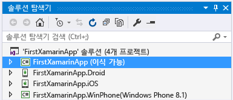
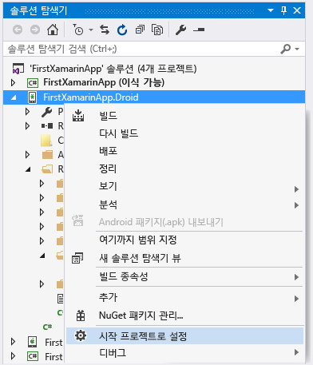
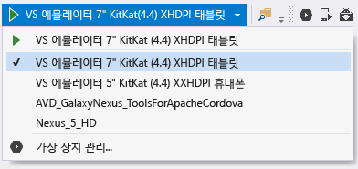
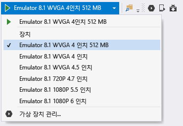
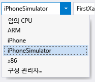
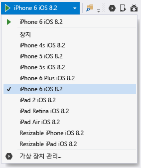
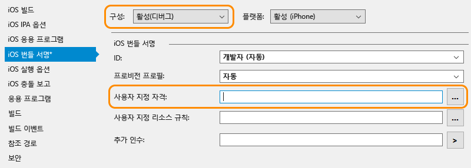

# Xamarin 환경 확인
설치 관리자가 완료되면([설정 및 설치](../cross-platform/setup-and-install.md) 참조) 몇 분 동안 Xamarin 개발을 경험할 모든 준비가 되었는지 확인하세요.  
  
 이러한 확인을 완료한 후에는 다음 연습 중 하나 또는 두 연습을 모두 진행할 수 있습니다.  
  
-   [Visual Studio에서 Xamarin.Forms를 사용한 앱 빌드 기본 사항 알아보기](../cross-platform/learn-app-building-basics-with-xamarin-forms-in-visual-studio.md)  
  
-   [Visual Studio에서 Xamarin을 사용하여 네이티브 UI로 앱 빌드](../cross-platform/build-apps-with-native-ui-using-xamarin-in-visual-studio.md)  
  
## 모든 플랫폼  
 먼저 **도구 > 옵션**을 선택하고 **Xamarin > 기타**를 확장한 후에 업데이트에 대한 **지금 확인** 링크를 클릭합니다. 이전의 라이선스 문제를 방지하려면 Xamarin 4.0.3.214 이상 버전을 사용해야 합니다.  
  
 그런 다음 Visual Studio에서 **파일 > 새 프로젝트**를 사용하여 Xamarin 솔루션을 새로 만들고, 대화 상자에서 **템플릿 > 기타 언어 > Visual C# > 크로스 플랫폼**을 확장하고, **비어 있는 앱(네이티브 이식 가능)**을 선택하고, 확인을 클릭합니다. 그러면 공유된 이식 가능한 클래스 라이브러리 프로젝트와 Android, iOS 및 Windows에 대한 개별 프로젝트가 포함된 솔루션이 생성됩니다.  
  
   
  
> [!NOTE]
>  여기에 템플릿이 없으면 [Xamarin 프로젝트 템플릿 누락 시 사용 방법](#missing)(이 페이지의 맨 아래에 나와 있음)을 참조하세요.  
  
## Android  
  
1. **도구 > Android > Android SDK Manager**로 이동한 다음 최신 버전의 Android SDK 도구, Android SDK 플랫폼 도구 및 Android SDK 빌드 도구 구성 요소를 설치하여 최신 Android SDK 도구가 설치되었는지 확인합니다. 항상 최신 Android API 수준을 설치하지는 않아도 되며, 필요한 API는 대상으로 지정할 플랫폼 수준에 따라 달라집니다. 일반적으로 Xamarin을 설치하면 필요한 플랫폼 수준이 설치됩니다.  

2.  Android 디자이너 유효성 검사: 솔루션 탐색기의 Android 프로젝트에서**리소스 > 레이아웃 > Main.axml** 파일을 엽니다. 이 파일이 바로 표시되지 않으면 솔루션 탐색기에서 파일을 검색해 보세요. 이 파일은 Android 프로젝트에만 있으며 iOS 프로젝트에는 없습니다.  
  
    - "설치된 Android SDK가 너무 오래되었습니다."라는 오류가 표시되면 이 메시지에서 **Android SDK 열기**를 클릭하고 위의 1단계에서와같이 사용 가능한 최신 SDK 버전 도구를 선택하여 설치합니다. 
  
3.  에뮬레이터(또는 장치)에서 빌드 및 디버깅 확인:  
  
    -   솔루션 탐색기에서 Android 프로젝트를 마우스 오른쪽 단추로 클릭하고 **시작 프로젝트로 설정**을 선택합니다.  
  
           
  
    -   대상 Android 버전에 따라 적절한 에뮬레이터를 선택합니다. 컴퓨터에 연결된 Android 개발 장치가 있으면 에뮬레이터와 함께 여기에 나열됩니다.  
  
        -   Windows 8+: 아래 표시된 대로 Visual Studio의 디버그 드롭다운에서 **VS 에뮬레이터** 대상을 선택하고 **F5** 키를 눌러 디버거를 시작합니다. 자세한 내용은 [Introducing Visual Studio's Emulator for Android](http://blogs.msdn.com/b/visualstudioalm/archive/2014/11/12/introducing-visual-studio-s-emulator-for-android.aspx)(Visual Studio Emulator for Android 소개)(Visual Studio ALM 블로그)를 참조하세요. 에뮬레이터를 작동시키는 중 문제가 발생하면 [Troubleshooting the Visual Studio Emulator for Android](../cross-platform/troubleshooting-the-visual-studio-emulator-for-android.md)을 참조하세요. **도구 > Visual Studio Emulator for Android...**를 선택하여 에뮬레이터에 대한 새로운 장치 프로필을 만들 수도 있습니다.  
  
               
  
             참고: **도구 > Visual Studio Emulator for Android...** 메뉴 옵션이 표시되지 않으면 에뮬레이터 자체가 설치되지 않은 것일 수 있습니다. **제어판 > 프로그램 및 기능**으로 이동하여 **Microsoft Visual Studio**를 선택하고 **변경**을 클릭하여 설치 관리자를 다시 실행합니다. 설치 관리자에서 **수정**을 클릭하고 **플랫폼 간 모바일 개발 > Microsoft Visual Studio Emulator for Android** 확인란을 선택한 후에 **업데이트**를 클릭합합니다.  
  
        -   Windows 7 이하: 대신 드롭다운에서 Xamarin Player for Android를 선택하고 F5 키를 눌러 실행합니다. Xamarin Player, 해당 장치 관리자 및 문제 해결 팁에 대해서는 [Xamarin Android Player](http://developer.xamarin.com/guides/android/getting_started/installation/android-player/) (영문)(xamarin.com)를 참조하세요.  
  
> [!NOTE]
>  Visual Studio에서 도구 모음에 AVD(Android Emulator Manager) 단추가 표시되는 것을 알 수 있습니다(아래 그림 참조). 이 단추를 선택하면 Google Android 에뮬레이터를 구성하는 데 특별히 사용되는 장치 관리자가 열립니다.  이 단추는 프로필을 구성하는 자체 장치 관리자가 있는 Visual Studio Emulator for Android 또는 Xamarin Player에는 영향을 미치지 않습니다.  자세한 내용은 [Introducing Visual Studio's Emulator for Android](http://blogs.msdn.com/b/visualstudioalm/archive/2014/11/12/introducing-visual-studio-s-emulator-for-android.aspx)(Visual Studio Emulator for Android 소개)(Visual Studio ALM 블로그) 및 [Xamarin Android Player](http://developer.xamarin.com/guides/android/getting_started/installation/android-player/)(xamarin.com)를 참조하세요.  
>   
  
## Windows Phone  
  
1.  Windows Phone 디자이너 확인: 솔루션 탐색기의 Windows Phone 프로젝트에서 **MainPage.xaml** 파일을 엽니다.  
  
2.  에뮬레이터 또는 장치에서 빌드 및 디버깅 확인(참고: 이 단계를 수행하려면 Visual Studio를 통해 설치된 Windows Phone 에뮬레이터 또는 테더링된 장치가 있어야 함):  
  
    -   솔루션 탐색기에서 Windows Phone 프로젝트를 마우스 오른쪽 단추로 클릭하고 **시작 프로젝트로 설정**을 선택합니다.  
  
    -   아래 표시된 대로 Visual Studio의 디버그 드롭다운에서 **Emulator 8.1** 대상 또는 연결된 장치를 선택하고 F5 키를 눌러 디버거를 시작합니다.  
  
           
  
    -   에뮬레이터를 작동하는 데 문제가 발생하는 경우 [Windows Phone 8 Emulator 문제 해결](/previous-versions/windows/apps/jj681694\(v%3dvs.105\))(영문)을 참조하세요.  
  
## iOS  
  
1.  [Mac에 연결](http://developer.xamarin.com/guides/ios/getting_started/installation/windows/xamarin-mac-agent/) (영문)(xamarin.com)에 설명된 대로 Mac이 네트워크에서 사용 가능하고 Visual Studio와 연결되었는지 확인합니다.  
  
2.  스토리보드 디자이너 확인: 솔루션 탐색기의 iOS 프로젝트에서 **Main.storyboard** 파일을 엽니다. 여기서 Visual Studio는 Mac에서 원격으로 실행 중인 디자이너를 호스트하고 있습니다.  
  
3.  빌드 및 디버깅 확인:  
  
    1.  솔루션 탐색기에서 iOS 프로젝트를 마우스 오른쪽 단추로 클릭하고 **시작 프로젝트로 설정**을 선택합니다.  
  
    2.  아래 표시된 대로 Visual Studio의 빌드 드롭다운에서 **iPhoneSimulator** 대상을 선택하거나 테더링된 장치가 있는 경우 **iPhone** 대상을 선택합니다. 시뮬레이터가 나열되지 않으면 Mac에서 Xcode를 시작하고 **Xcode->기본 설정**을 선택한 후에 **다운로드**를 클릭합니다. **구성 요소** 에 다운로드할 수 있는 시뮬레이터 버전이 표시되어야 합니다. 디버깅에 대한 추가 지침은 Xamarin의 [Debugging](https://developer.xamarin.com/guides/ios/deployment,_testing,_and_metrics/debugging_in_xamarin_ios/#Debugging_on_the_Simulator)(디버깅) 페이지(xamarin.com)에서 확인할 수 있습니다.  
  
           
  
    3.  아래 표시된 대로 Visual Studio의 디버그 드롭다운에서 iPhone 대상을 선택하고 F5 키를 눌러 디버거를 시작합니다. 그러면 앱을 조작할 Mac에서 시뮬레이터가 시작되고 동시에 Visual Studio에서 디버깅이 수행됩니다. 실제로 iPhone 또는 iPad가 Mac에 연결되어 있으면 여기에 나타나며, 해당 iPhone 또는 iPad를 대신 선택할 수 있습니다. 나열된 장치 또는 시뮬레이터가 하나도 표시되지 않는다면 위의 1단계에서 연결된 항목을 검토하거나 **도구** >**iOS** >**Xamarin Mac 에이전트**  
  
           
  
    4.  Mac에 연결할 때 문제가 발생하면 [연결 문제 해결](http://developer.xamarin.com/guides/ios/getting_started/installation/windows/xamarin-mac-agent/xma-troubleshooting/) (영문)(xamarin.com)을 참조하세요.  
  
    5.  “No installed provisioning profiles match the installed iOS signing keys(설치된 프로비저닝 프로필이 설치된 iOS 서명 키와 일치하지 않습니다).”라는 오류가 표시되면 다음을 수행합니다.  
  
        -   [Xcode에 사용자 계정 추가](https://developer.apple.com/library/content/documentation/IDEs/Conceptual/AppStoreDistributionTutorial/AddingYourAccounttoXcode/AddingYourAccounttoXcode.html#//apple_ref/doc/uid/TP40013839-CH40-SW1) (영문)(apple.com)에 설명된 대로 Mac의 Xcode에 Apple Id 계정이 추가되어 있는지 확인합니다.  계정을 추가한 후 Visual Studio와 Xcode를 둘 다 다시 시작해야 합니다.  
  
               
  
        -   iOS 번들 서명 탭의 iOS 프로젝트 속성에서 활성 디버그 구성을 위한 사용자 지정 권한 부여 필드가 비어 있는지 확인합니다.  참고: 위의 오류 메시지가 발생하는 경우에만 이 설정을 제거합니다.  
  
##   Xamarin 프로젝트 템플릿 누락 시 사용 방법  
 Visual Studio 2013과 Visual Studio 2015가 함께 설치되어 있는 경우 Xamarin 웹 사이트에서 직접 Xamarin을 설치하면 템플릿이 누락될 수 있습니다. 쉽게 수정할 수 있습니다. Xamarin 설치 프로그램에서 **Visual Studio 2015용 Xamarin** 기능을 사용하도록 설정하기만 하면 됩니다.  
  
1.  제어판에서 **프로그램 및 기능**을 열고 **Xamarin** 항목을 선택하고 **변경**을 클릭합니다.  
  
2.  표시되는 Xamarin 설정 마법사에서 **다음** , **변경**을 차례로 클릭합니다.  
  
3.  설치할 선택적 기능 목록에서 **Xamarin for Visual Studio 2015**를 확장하고 **will be installed on local drive(로컬 드라이브에 설치)**를 선택하고 **다음** 을 클릭하여 기능을 추가합니다.