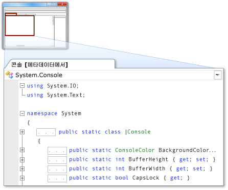

# 소스로서의 메타데이터
[!INCLUDE[vs2017banner](../code-quality/includes/vs2017banner.md)]

메타데이터를 소스로 사용하면 읽기 전용 버퍼에 C\# 소스 코드로 표시되는 메타데이터를 볼 수 있습니다. 이 경우 구현 없이 형식 및 멤버의 선언을 볼 수 있습니다. 프로젝트 또는 솔루션에서 해당 소스 코드를 사용할 수 없는 형식 또는 멤버에 대해 **정의로 이동** 명령을 실행하면 메타데이터를 소스로 볼 수 있습니다.  
  
> [!NOTE]
>  내부로 표시된 형식 또는 멤버에 대해 **정의로 이동** 명령을 실행하려고 하면 참조하는 어셈블리가 friend인지 여부에 관계없이 IDE\(통합 개발 환경\)에서 해당 메타데이터를 소스로 표시하지 않습니다.  
  
 코드 편집기 또는 **코드 정의** 창에서 메타데이터를 소스로 볼 수 있습니다.  
  
## 코드 편집기에서 메타데이터를 소스로 보기  
 소스 코드를 사용할 수 없는 항목에 대해 **정의로 이동** 명령을 실행하면 해당 항목의 메타데이터가 소스로 표시된 보기를 포함하는 탭 문서가 코드 편집기에 나타납니다. 뒤에 **\[메타데이터에서\]**가 추가된 형식 이름이 문서 탭에 나타납니다.  
  
 예를 들어 <xref:System.Console>에 대해 **정의로 이동** 명령을 실행하는 경우 <xref:System.Console>에 대한 메타데이터가 코드 편집기에 구현 없이 해당 선언과 유사한 C\# 소스 코드로 나타납니다.  
  
   
  
## 코드 정의 창에서 소스로 메타데이터 보기  
 **코드 정의** 창이 활성 상태이거나 표시되는 경우 IDE는 코드 편집기에서 커서 아래에 있는 항목과 **클래스 뷰** 또는 **개체 브라우저**에서 선택된 항목에 대해 **정의로 이동** 명령을 자동으로 실행합니다. 해당 항목에 대한 소스 코드를 사용할 수 없는 경우 IDE는 **코드 정의** 창에 항목의 메타데이터를 소스로 표시합니다.  
  
 예를 들어 코드 편집기에서 <xref:System.Console> 단어 안에 커서를 두면 <xref:System.Console>에 대한 메타데이터가 **코드 정의** 창에 소스로 나타납니다. 소스는 구현 없이 <xref:System.Console> 선언과 비슷합니다.  
  
 **코드 정의** 창에 표시되는 항목의 선언을 보려는 경우 항목을 마우스 오른쪽 단추로 클릭한 다음 **정의로 이동**을 클릭합니다.