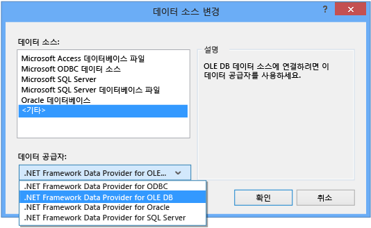

# 연습: Access 데이터베이스의 데이터에 연결(Windows Forms)
Visual Studio를 사용하여 Access 데이터베이스\(.mdf 파일 또는 .accdb 파일\)에 연결할 수 있습니다.  연결을 정의한 후 **데이터 소스 창**에 데이터가 나타납니다.  그 창에서 테이블 또는 뷰를 폼으로 끌 수 있습니다.  Visual Studio의 프로젝트 시스템에서 이러한 로컬 데이터베이스 파일을 관리하는 방법을 이해하려면 [방법: 프로젝트의 로컬 데이터 파일 관리](../data-tools/how-to-manage-local-data-files-in-your-project.md)를 참조하십시오.  
  
## 사전 요구 사항  
 이런 절차를 사용하려면 Windows Forms 응용 프로그램 프로젝트와 Access 데이터베이스\(.accdb 파일\) 또는 Access 2000\-2003 데이터베이스\(.mdb 파일\)가 필요합니다.  파일 형식에 해당하는 절차를 따릅니다.  
  
## .accdb 파일에 대한 데이터 집합 만들기  
 다음 절차를 사용하여 Access 2013, Office 365, Access 2010 또는 Access 2007로 만든 데이터베이스에 연결할 수 있습니다.  
  
#### 데이터 집합을 만들려면  
  
1.  데이터를 연결하려는 Windows Forms 응용 프로그램을 엽니다.  
  
2.  **보기** 메뉴에서 **다른 창** \> **데이터 소스**를 선택합니다.  
  
       
  
3.  **데이터 소스** 창에서 **새 데이터 소스 추가**를 클릭합니다.  
  
       
  
4.  **데이터 소스 형식 선택** 페이지에서 **데이터베이스**를 선택하고 **다음**을 선택합니다.  
  
5.  **데이터베이스 모델 선택** 페이지에서 **데이터 집합**을 선택하고 **다음**을 선택합니다.  
  
6.  **데이터 연결 선택** 페이지에서 **새 연결**을 선택하여 새 데이터 연결을 구성합니다.  
  
7.  **데이터 소스**를 **.NET Framework Data Provider for OLE DB**로 변경합니다.  
  
       
  
    > [!IMPORTANT]
    >  **Microsoft Access Database File\(OLE DB\)**의 데이터 소스가 올바른 선택으로 보일 수 있지만, .mdb 데이터베이스 파일에만 그 데이터 소스 형식을 사용합니다.  
  
8.  **OLE DB 공급자**에서 **Microsoft Office 12.0 Access Database Engine OLE DB 공급자**를 선택합니다.  
  
       
  
9. **서버 또는 파일 이름**에서 연결하려는 .accdb 파일의 경로와 이름을 지정한 후 **확인**을 선택합니다.  
  
    > [!NOTE]
    >  데이터베이스 파일에 사용자 이름과 암호가 있는 경우 이들을 지정한 후 **확인**을 선택합니다.  
  
10. **데이터 연결 선택** 페이지에서 **다음**을 선택합니다.  
  
11. **응용 프로그램 구성 파일에 연결 문자열 저장** 페이지에서 **다음**을 선택합니다.  
  
12. **데이터베이스 개체 선택** 페이지에서 **테이블** 노드를 확장합니다.  
  
13. 데이터 집합에서 원하는 모든 테이블 또는 뷰를 선택한 후 **마침**을 선택합니다.  
  
     데이터 집합이 프로젝트에 추가되고 테이블과 뷰가 **데이터 소스** 창에 나타납니다.  
  
## .mdb 파일에 대한 데이터 집합 만들기  
 데이터 집합은 **데이터 소스 구성 마법사**를 실행하여 만듭니다.  
  
#### 데이터 집합을 만들려면  
  
1.  데이터를 연결하려는 Windows Forms 응용 프로그램을 엽니다.  
  
2.  **보기** 메뉴에서 **다른 창** \> **데이터 소스**를 선택합니다.  
  
       
  
3.  **데이터 소스** 창에서 **새 데이터 소스 추가**를 클릭합니다.  
  
       
  
4.  **데이터 소스 형식 선택** 페이지에서 **데이터베이스**를 선택하고 **다음**을 선택합니다.  
  
5.  **데이터베이스 모델 선택** 페이지에서 **데이터 집합**을 선택하고 **다음**을 선택합니다.  
  
6.  **데이터 연결 선택** 페이지에서 **새 연결**을 선택하여 새 데이터 연결을 구성합니다.  
  
7.  **데이터 소스**가 **Microsoft Access 데이터베이스 파일\(OLE DB\)**이 아닌 경우, **변경**을 선택하여 **데이터 소스 변경** 대화 상자를 열고 **Microsoft Access 데이터베이스 파일**을 선택한 후 **확인**을 선택합니다.  
  
8.  **데이터베이스 파일 이름**에서 연결하려는 .mdb 파일의 경로와 이름을 지정한 후 **확인**을 선택합니다.  
  
       
  
9. **데이터 연결 선택** 페이지에서 **다음**을 선택합니다.  
  
10. **응용 프로그램 구성 파일에 연결 문자열 저장** 페이지에서 **다음**을 선택합니다.  
  
11. **데이터베이스 개체 선택** 페이지에서 **테이블** 노드를 확장합니다.  
  
12. 데이터 집합에서 원하는 모든 테이블 또는 뷰를 선택한 후 **마침**을 선택합니다.  
  
     데이터 집합이 프로젝트에 추가되고 테이블과 뷰가 **데이터 소스** 창에 나타납니다.  
  
## 보안  
 중요한 정보\(예: 암호\)를 저장하면 응용 프로그램 보안 문제가 발생할 수 있습니다.  데이터베이스 액세스를 제어할 경우에는 통합 보안이라고도 하는 Windows 인증을 사용하는 방법이 더 안전합니다.  자세한 내용은 [연결 정보 보호](../Topic/Protecting%20Connection%20Information.md)을 참조하십시오.  
  
## 다음 단계  
 방금 만든 데이터 집합을 이제 **데이터 소스** 창에서 사용할 수 있습니다.  다음 작업 중 어떤 작업이든 수행할 수 있습니다.  
  
-   **데이터 소스** 창에서 항목을 선택하여 폼으로 끕니다\([Visual Studio에서 데이터에 Windows Forms 컨트롤 바인딩](../data-tools/bind-windows-forms-controls-to-data-in-visual-studio.md) 참조\).  
  
-   [데이터 집합 디자이너](../data-tools/creating-and-editing-typed-datasets.md)에서 데이터 소스를 열어 데이터 집합을 구성하는 개체를 추가하거나 편집합니다.  
  
-   데이터 집합에 있는 데이터 테이블의 <xref:System.Data.DataTable.ColumnChanging> 또는 <xref:System.Data.DataTable.RowChanging> 이벤트에 유효성 검사 논리를 추가합니다\([데이터 집합의 데이터 유효성 검사](../data-tools/validate-data-in-datasets.md) 참조\).  
  
## 참고 항목  
 [Visual Studio에서 데이터에 연결](../data-tools/connecting-to-data-in-visual-studio.md)   
 [데이터를 받기 위해 응용 프로그램 준비](../Topic/Preparing%20Your%20Application%20to%20Receive%20Data.md)   
 [데이터를 응용 프로그램으로 페치](../data-tools/fetching-data-into-your-application.md)   
 [Visual Studio에서 데이터에 컨트롤 바인딩](../data-tools/bind-controls-to-data-in-visual-studio.md)   
 [응용 프로그램에서 데이터 편집](../data-tools/editing-data-in-your-application.md)   
 [데이터 유효성 검사](../Topic/Validating%20Data.md)   
 [데이터 저장](../data-tools/saving-data.md)   
 [데이터 연습](../Topic/Data%20Walkthroughs.md)