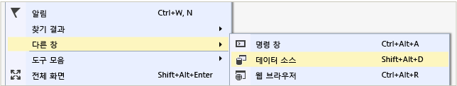
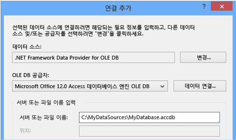
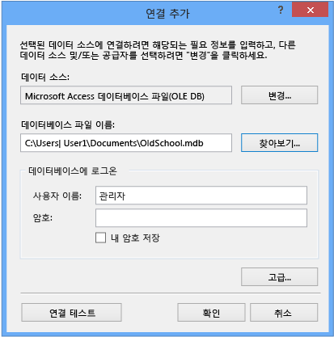

# Access 데이터베이스 (Windows Forms)의 데이터에 연결
Visual Studio를 사용 하 여 Access 데이터베이스 (.mdf 파일 또는.accdb 파일)에 연결할 수 있습니다. 에 표시할 연결을 정의한 후의 데이터는 **데이터 소스** 창. 그 창에서 테이블 또는 뷰를 폼으로 끌 수 있습니다.   
  
## 전제 조건  
 이러한 절차를 사용 하려면 Windows Forms 응용 프로그램 프로젝트와 Access 데이터베이스 (.accdb 파일) 또는 Access 2000-2003 데이터베이스 (.mdb 파일)이 필요 합니다. 파일 형식에 해당하는 절차를 따릅니다.  
  
## .Accdb 파일에 대 한 데이터 집합 만들기  
 다음 절차를 사용 하 여 Access 2013, Office 365, Access 2010 또는 Access 2007을 통해 만든 데이터베이스에 연결할 수 있습니다.  
  
#### 데이터 집합을 만들려면  
  
1.  데이터에 연결 하려면 Windows Forms 응용 프로그램을 엽니다.  
  
2.  에 **보기** 메뉴 선택 **다른 창** > **데이터 소스**합니다.  
  
       
  
3.  **데이터 소스** 창에서 **새 데이터 소스 추가**를 클릭합니다.  

     **데이터 소스 구성 마법사** 열립니다.  
  
4.  선택 **데이터베이스** 에 **데이터 소스 형식 선택** 페이지를 선택한 다음 선택 **다음**합니다.  
  
5.  선택 **Dataset** 에 **데이터베이스 모델 선택** 페이지를 선택한 다음 선택 **다음**합니다.  
  
6.  에 **데이터 연결 선택** 페이지에서 **새 연결** 새 데이터 연결을 구성 합니다.  

     **연결 추가** 대화 상자가 열립니다.  
  
7.  선택 된 **변경** 단추 옆에 **데이터 원본** 입력란.

     **데이터 소스 변경** 대화 상자가 열립니다.  
  
8.  데이터 원본 목록에서 선택  **\<다른\>**합니다. 에 **데이터 공급자** 드롭다운 목록에서 선택 **.NET Framework Data Provider for OLE DB**를 눌러 **확인**합니다.  

9. 에 **연결 추가** 대화 상자에서 **Microsoft Office 12.0 Access Database Engine OLE DB Provider** 에서 **OLE DB Provider** 드롭 다운 합니다.  
  
       

     > [!NOTE]
     >  표시 되지 않으면 **Microsoft Office 12.0 Access Database Engine OLE DB Provider** 드롭다운 목록에는 OLE DB 공급자에 설치 해야 할 수 있습니다는 [2007 Office System 드라이버: 데이터 연결 구성 요소](https://www.microsoft.com/download/confirmation.aspx?id=23734)합니다.
  
9. 에 **서버 또는 파일 이름** 텍스트 상자 경로 지정 하 고 파일에, 연결 하려는.accdb 파일의 이름 및 선택한 후 **확인**합니다. (데이터베이스 파일에 있는 경우 사용자 이름 및 암호를 지정 선택 하기 전에 **확인**.)    
  
10. 선택 **다음** 에 **데이터 연결 선택** 페이지.  

     데이터 파일이 현재 프로젝트에 없는 있습니다를 알리는 대화 상자가 표시 될 수 있습니다. **예** 또는 **아니요**를 선택합니다.
  
11. 선택 **다음** 에 **응용 프로그램 구성 파일에 연결 문자열 저장** 페이지.  
  
12. 확장 된 **테이블** 에서 노드는 **데이터베이스 개체 선택** 페이지.  
  
13. 모든 테이블 또는 뷰에서 데이터 집합에서 원하는 하 고 선택 하면 선택 **마침**합니다.  
  
     데이터 집합 프로젝트에 추가 되 고에 표시 된 테이블 및 뷰는 **데이터 소스** 창.  
  
## .Mdb 파일에 대 한 데이터 집합 만들기  
 실행 하 여 데이터 집합을 만듭니다는 **데이터 소스 구성 마법사**합니다.  
  
#### 데이터 집합을 만들려면  
  
1.  데이터에 연결 하려면 Windows Forms 응용 프로그램을 엽니다.  
  
2.  에 **보기** 메뉴 선택 **다른 창** > **데이터 소스**합니다.  
  
       
  
3.  **데이터 소스** 창에서 **새 데이터 소스 추가**를 클릭합니다.  

     **데이터 소스 구성 마법사** 열립니다.
  
4.  선택 **데이터베이스** 에 **데이터 소스 형식 선택** 페이지를 선택한 다음 선택 **다음**합니다.  
  
5.  선택 **Dataset** 에 **데이터베이스 모델 선택** 페이지를 선택한 다음 선택 **다음**합니다.  
  
6.  에 **데이터 연결 선택** 페이지에서 **새 연결** 새 데이터 연결을 구성 합니다.  
  
7.  데이터 원본이 없는 경우 **Microsoft Access 데이터베이스 파일 (OLE DB)**선택, **변경** 열려는 **데이터 소스 변경** 대화 상자와 선택 **Microsoft 데이터베이스 파일에 액세스**를 선택한 후 **확인**합니다.  
  
8.  에 **데이터베이스 파일 이름**, 경로 연결 하 고 다음을 선택 하려는.mdb 파일의 이름을 지정 **확인**합니다.  
  
       
  
9. 선택 **다음** 에 **데이터 연결 선택** 페이지.  
  
10. 선택 **다음** 에 **응용 프로그램 구성 파일에 연결 문자열 저장** 페이지.  
  
11. 확장 된 **테이블** 에서 노드는 **데이터베이스 개체 선택** 페이지.  
  
12. 모든 테이블 또는 뷰에서 데이터 집합에서 원하는 하 고 선택 하면 선택 **마침**합니다.  
  
     데이터 집합 프로젝트에 추가 되 고에 표시 된 테이블 및 뷰는 **데이터 소스** 창.  
  
## 보안  
 중요한 정보(예: 암호)를 저장하면 응용 프로그램 보안 문제가 발생할 수 있습니다. 데이터베이스 액세스를 제어할 경우에는 통합 보안이라고도 하는 Windows 인증을 사용하는 방법이 더 안전합니다. 자세한 내용은 [연결 정보 보호](/dotnet/framework/data/adonet/protecting-connection-information)를 참조하세요.  
  
## 다음 단계  
 방금 만든 데이터 집합은 현재는 **데이터 소스** 창. 이제 다음과 같은 태스크를 수행할 수 있습니다.  
  
-   항목을 선택는 **데이터 원본** 창에서 폼으로 끌어와 (참조 [Visual Studio에서 데이터를 바인딩할 Windows Forms 컨트롤](../data-tools/bind-windows-forms-controls-to-data-in-visual-studio.md)).  
  
-   데이터 소스를 열어는 **데이터 집합 디자이너** 데이터 집합을 구성 하는 개체를 추가 하거나 편집 합니다.  
  
-   유효성 검사 논리를 추가 <xref:System.Data.DataTable.ColumnChanging> 또는 <xref:System.Data.DataTable.RowChanging> 데이터 집합에 있는 데이터 테이블의 이벤트 (참조 [데이터 집합의 데이터 유효성 검사](../data-tools/validate-data-in-datasets.md)).  
  
## 참고자료
[연결 추가](../data-tools/add-new-connections.md)
