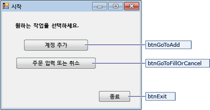
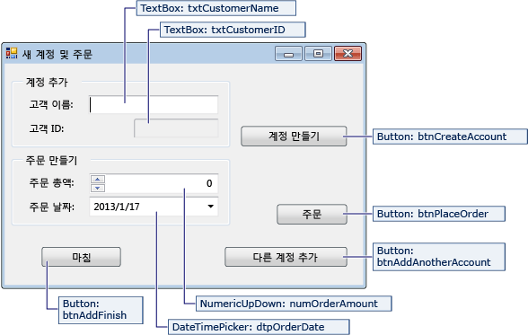
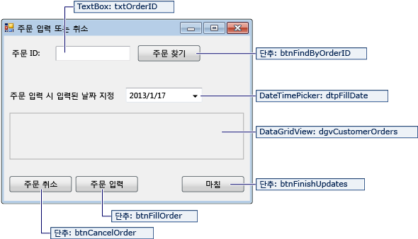

# <a name="create-a-simple-data-application-by-using-adonet"></a>ADO.NET을 사용 하 여 간단한 데이터 응용 프로그램 만들기

데이터베이스의 데이터를 조작 하는 응용 프로그램을 만들 때 연결 문자열 정의 데이터를 삽입 및 저장된 프로시저를 실행 하는 등의 기본 작업을 수행 합니다. 이 항목에 따라 Visual C# 또는 Visual Basic 및 ADO.NET을 사용 하 여 간단한 Windows Forms "데이터 폼" 응용 프로그램 내에서 데이터베이스와 상호 작용 하는 방법을 확인할 수 있습니다.  모든.NET 데이터 기술-데이터 집합, LINQ to SQL 및 Entity Framework를 포함 하 여-궁극적으로이 문서에 표시 된 것과 매우 유사한 단계를 수행 합니다.

 이 문서는 매우 빠르게 방식으로 데이터베이스에서 데이터를 가져오기 하는 간단한 방법을 보여줍니다. 응용 프로그램을 특정 방법으로 데이터를 수정 하 고 데이터베이스를 업데이트 하는 경우 자동으로 동기화 원본으로 사용 데이터의 변화에 따라 사용자 인터페이스 컨트롤에 데이터 바인딩 및 Entity Framework를 사용 하 여 고려해 야 합니다.

> [!IMPORTANT]
> 코드를 간단히 유지 하기 위해 프로덕션에 사용 가능한 예외 처리를 포함 되지 않습니다.

## <a name="prerequisites"></a>전제 조건

응용 프로그램을 만들려면 다음이 필요 합니다.

-   Visual Studio.

-   SQL Server Express LocalDB SQL Server Express LocalDB가 없는 경우에서 설치할 수 있습니다는 [SQL Server Express 다운로드 페이지](https://www.microsoft.com/sql-server/sql-server-editions-express)합니다.

이 항목 Visual Studio IDE의 기본 기능에 익숙한 및 수는 Windows Forms 응용 프로그램을 만들 하 컨트롤 및 간단한 이벤트 코드의 속성을 설정 하는 단추 및 다른 컨트롤을 폼에 배치 하는 프로젝트에 폼 추가 가정 합니다. 이러한 작업에 익숙하지 경우 완료 하는 것이 좋습니다는 [Visual C# 및 Visual Basic 시작](../ide/getting-started-with-visual-csharp-and-visual-basic.md) 이 연습을 시작 하기 전에 항목입니다.

## <a name="set-up-the-sample-database"></a>샘플 데이터베이스 설정

다음이 단계를 수행 하 여 샘플 데이터베이스를 만듭니다.

1. Visual Studio에서 열고는 **서버 탐색기** 창.

2. 마우스 오른쪽 단추로 클릭 **데이터 연결** 선택 하 고 * * 새 SQL Server 데이터베이스 만들기... ".

3. 에 **서버 이름** 텍스트 상자에 입력 **(localdb) \mssqllocaldb**합니다.

4. 에 **새 데이터베이스 이름을** 텍스트 상자에 입력 **Sales**, 선택 **확인**합니다.

     빈 **Sales** 데이터베이스 생성 되어 서버 탐색기에서 데이터 연결 노드에 추가 합니다.

5. 마우스 오른쪽 단추로 클릭는 **Sales** 데이터 연결 및 선택 **새 쿼리**합니다.

     쿼리 편집기 창이 열립니다.

6. 복사는 [Sales Transact SQL 스크립트](https://github.com/MicrosoftDocs/visualstudio-docs/raw/master/docs/data-tools/samples/sales.sql) 를 클립보드에 복사 합니다.

7. 쿼리 편집기에 T-SQL 스크립트를 붙여 넣습니다.를 선택한 후는 **Execute** 단추입니다.

     짧은 시간 후 쿼리 실행이 완료 되 하 고 데이터베이스 개체가 생성 됩니다. 데이터베이스에 두 개의 테이블: 고객과 주문 합니다. 이 테이블 처음에 없는 데이터를 포함 하지만 만들어야 하는 응용 프로그램을 실행할 때 데이터를 추가할 수 있습니다. 데이터베이스에는 네 개의 간단한 저장된 프로시저 포함 되어 있습니다.

## <a name="create-the-forms-and-add-controls"></a>폼 만들기 및 컨트롤 추가

1.  Windows Forms 응용 프로그램에 대 한 프로젝트를 만들고 이름을 SimpleDataApp 합니다.

     Visual Studio에서 프로젝트와 Form1이라는 빈 Windows 폼을 포함한 여러 파일을 만듭니다.

2.  세 개의 폼을 갖도록 프로젝트에 두 개의 Windows forms를 추가 하 고 다음 이름을 지정 합니다.

    -   탐색

    -   NewCustomer

    -   FillOrCancel

3.  각 폼에 대해 다음 그림에 나오는 텍스트 상자, 단추 및 기타 컨트롤을 추가합니다. 각 컨트롤에 대해 테이블이 설명하는 속성을 설정합니다.

    > [!NOTE]
    >  그룹 상자 및 레이블 컨트롤도 선명성을 더해 주지만 코드에서는 사용하지 않습니다.

 **Navigation 폼**

 

|Navigation 폼 컨트롤|속성|
|--------------------------------------|----------------|
|단추|Name = btnGoToAdd|
|단추|Name = btnGoToFillOrCancel|
|단추|Name = btnExit|

 **NewCustomer 폼**

 

|NewCustomer 폼 컨트롤|속성|
|---------------------------------------|----------------|
|TextBox|Name = txtCustomerName|
|TextBox|Name = txtCustomerID<br /><br /> Readonly = True|
|단추|Name = btnCreateAccount|
|NumericUpdown|DecimalPlaces = 0<br /><br /> Maximum = 5000<br /><br /> Name = numOrderAmount|
|DateTimePicker|Format = Short<br /><br /> Name = dtpOrderDate|
|단추|Name = btnPlaceOrder|
|단추|Name = btnAddAnotherAccount|
|단추|Name = btnAddFinish|

 **FillOrCancel 폼**

 

|FillOrCancel 폼 컨트롤|속성|
|----------------------------------------|----------------|
|TextBox|Name = txtOrderID|
|단추|Name = btnFindByOrderID|
|DateTimePicker|Format = Short<br /><br /> Name = dtpFillDate|
|DataGridView|Name = dgvCustomerOrders<br /><br /> Readonly = True<br /><br /> RowHeadersVisible = False|
|단추|Name = btnCancelOrder|
|단추|Name = btnFillOrder|
|단추|Name = btnFinishUpdates|

## <a name="store-the-connection-string"></a>연결 문자열 저장
 응용 프로그램이 데이터베이스에 대한 연결을 열려면 응용 프로그램에는 연결 문자열에 액세스할 수 있어야 합니다. 각 폼에 문자열을 수동으로 입력를 방지 하려면 프로젝트의 App.config 파일에 문자열을 저장 하 고 응용 프로그램의 폼에서 메서드를 호출할 때 문자열을 반환 하는 메서드를 만듭니다.

 마우스 오른쪽 단추로 클릭 하 여 연결 문자열을 찾을 수 있습니다는 **Sales** 에서 데이터 연결 **서버 탐색기** 선택한 **속성**합니다. 찾을 **ConnectionString** 속성을 다음 Ctrl + C를 선택 하 고 클립보드에 문자열을 복사 하려면 Ctrl + A를 사용 합니다.

1.  사용 중인 경우 C#에서 **솔루션 탐색기**를 확장 하 고는 **속성** 노드 프로젝트를 연 다음는 **Settings.settings** 파일입니다.
    Visual Basic에서 사용 중인 경우 **솔루션 탐색기**, 클릭 **모든 파일 표시**를 확장 하 고는 **My Project** 노드를 연 후는 **Settings.settings** 파일입니다.

2.  에 **이름** 열, 입력 `connString`합니다.

3.  에 **형식** 목록에서 **(연결 문자열)** 합니다.

4.  에 **범위** 목록에서 **응용 프로그램**합니다.

5.  에 **값** 열 (없이 따옴표 외부), 연결 문자열을 입력 한 다음 변경 내용을 저장 합니다.

> [!NOTE]
> 실제 응용 프로그램을 저장 해야 연결 문자열을 안전 하 게에 설명 된 대로 [연결 문자열 및 구성 파일](/dotnet/framework/data/adonet/connection-strings-and-configuration-files)합니다.

##  <a name="write-the-code-for-the-forms"></a>폼에 대한 코드 작성

이 섹션에는 각 양식에서 수행 하는 작업의 간단한 개요를 포함 합니다. 또한 폼에 단추를 클릭할 때의 기본 논리를 정의 하는 코드를 제공 합니다.

### <a name="navigation-form"></a>Navigation 폼

응용 프로그램을 실행하면 Navigation 폼이 열립니다. **계정 추가** 단추는 NewCustomer 폼을 엽니다. **또는 취소 정렬** 단추 FillOrCancel 폼을 엽니다. **종료** 단추 응용 프로그램을 닫습니다.

#### <a name="make-the-navigation-form-the-startup-form"></a>Navigation 폼을 시작 폼으로 만들기

사용 중인 경우 C#에서 **솔루션 탐색기**Program.cs를 연 다음 변경 된 `Application.Run` 줄: `Application.Run(new Navigation());`

Visual Basic에서 사용 중인 경우 **솔루션 탐색기**열고는 **속성** 창에서는 **응용 프로그램** 탭을 선택한 다음 선택  **SimpleDataApp.Navigation** 에 **시작 폼** 목록입니다.

#### <a name="create-auto-generated-event-handlers"></a>자동으로 생성 된 이벤트 처리기 만들기

빈 이벤트 처리기 메서드를 만드는 탐색 양식에서 세 개의 단추를 두 번 클릭 합니다. 이벤트를 발생 시키는 단추 클릭 수 있는 디자이너 코드 파일에서 자동 생성 된 코드에도 추가 단추를 두 번 클릭 합니다.

#### <a name="add-code-for-the-navigation-form-logic"></a>탐색 양식 논리에 대 한 코드를 추가 합니다.

Navigation 폼에 대 한 코드 페이지에서 완료 메서드 본문을 세 개의 단추에 대 한 click 이벤트 처리기 다음 코드에 나와 있는 것 처럼 합니다.

[!code-csharp[Navigation#1](../data-tools/codesnippet/CSharp/SimpleDataApp/Navigation.cs#1)]
[!code-vb[Navigation#1](../data-tools/codesnippet/VisualBasic/SimpleDataApp/Navigation.vb#1)]

### <a name="newcustomer-form"></a>NewCustomer 폼

고객 이름을 입력 하 고 다음 선택에서 **계정 만들기** 단추를 NewCustomer 폼은 고객 계정을 만들고 SQL Server는 ID 값을 새 고객 ID 반환 합니다. 그런 다음 금액과 주문 날짜를 지정 하 고 선택 하 여 새 계정에 대 한 순서를 배치할 수 있습니다는 **구매 주문** 단추입니다.

#### <a name="create-auto-generated-event-handlers"></a>자동으로 생성 된 이벤트 처리기 만들기

빈 Click 만들기 각각 네 개의 단추를 두 번 클릭 하면 NewCustomer 폼에 있는 각 단추에 대 한 이벤트 처리기입니다. 이벤트를 발생 시키는 단추 클릭 수 있는 디자이너 코드 파일에서 자동 생성 된 코드에도 추가 단추를 두 번 클릭 합니다.

#### <a name="add-code-for-the-newcustomer-form-logic"></a>NewCustomer 폼 논리에 대 한 코드를 추가 합니다.

NewCustomer 폼 논리를 완료 하려면 다음이 단계를 수행 합니다.

1. 가져오기는 `System.Data.SqlClient` 범위로 네임 스페이스를 완벽 하 게 하려면 않아도 이름을 한 정하는 해당 멤버의 합니다.

     ```csharp
     using System.Data.SqlClient;
     ```
     ```vb
     Imports System.Data.SqlClient
     ```

2. 다음 코드와 같이 클래스에 일부 변수 및 도우미 메서드를 추가 합니다.

     [!code-csharp[NewCustomer#1](../data-tools/codesnippet/CSharp/SimpleDataApp/NewCustomer.cs#1)]
     [!code-vb[NewCustomer#1](../data-tools/codesnippet/VisualBasic/SimpleDataApp/NewCustomer.vb#1)]

3. 완료 메서드 본문을 네 개의 단추에 대 한 click 이벤트 처리기 다음 코드에 나와 있는 것 처럼 합니다.

     [!code-csharp[NewCustomer#2](../data-tools/codesnippet/CSharp/SimpleDataApp/NewCustomer.cs#2)]
     [!code-vb[NewCustomer#2](../data-tools/codesnippet/VisualBasic/SimpleDataApp/NewCustomer.vb#2)]

### <a name="fillorcancel-form"></a>FillOrCancel 폼

FillOrCancel 폼이 주문 ID를 입력 한 다음 클릭 하면 주문을 반환 하는 쿼리 실행은 **주문** 단추입니다. 반환되는 행은 읽기 전용 데이터 표에 표시됩니다. 선택 하는 경우 (X) 취소 하 고 순서를 표시할 수 있습니다는 **주문 취소** 단추 또는 있습니다 표시할 수 순서 채워진된 (F)로 선택 하는 경우는 **주문** 단추입니다. 선택 하는 경우는 **주문** 단추를 다시 업데이트 된 행이 나타납니다.

#### <a name="create-auto-generated-event-handlers"></a>자동으로 생성 된 이벤트 처리기 만들기

빈 만들기 단추를 두 번 클릭 하 여 FillOrCancel 폼에 단추 4 개에 대 한 이벤트 처리기를 클릭 합니다. 이벤트를 발생 시키는 단추 클릭 수 있는 디자이너 코드 파일에서 자동 생성 된 코드에도 추가 단추를 두 번 클릭 합니다.

#### <a name="add-code-for-the-fillorcancel-form-logic"></a>FillOrCancel 폼 논리에 대 한 코드를 추가 합니다.

FillOrCancel 폼 논리를 완료 하려면 다음이 단계를 수행 합니다.

1. 해당 멤버의 이름을 정규화 필요가 없도록 범위에는 다음 두 가지 네임 스페이스를 가져옵니다.

     ```csharp
     using System.Data.SqlClient;
     using System.Text.RegularExpressions;
     ```
     ```vb
     Imports System.Data.SqlClient
     Imports System.Text.RegularExpressions
     ```

2. 다음 코드와 같이 클래스에는 변수 및 도우미 메서드를 추가 합니다.

     [!code-csharp[FillOrCancel#1](../data-tools/codesnippet/CSharp/SimpleDataApp/FillOrCancel.cs#1)]
     [!code-vb[FillOrCancel#1](../data-tools/codesnippet/VisualBasic/SimpleDataApp/FillOrCancel.vb#1)]

3. 완료 메서드 본문을 네 개의 단추에 대 한 click 이벤트 처리기 다음 코드에 나와 있는 것 처럼 합니다.

     [!code-csharp[FillOrCancel#2](../data-tools/codesnippet/CSharp/SimpleDataApp/FillOrCancel.cs#2)]
     [!code-vb[FillOrCancel#2](../data-tools/codesnippet/VisualBasic/SimpleDataApp/FillOrCancel.vb#2)]

## <a name="test-your-application"></a>응용 프로그램 테스트

선택 된 **F5** 키를 빌드하고 각 Click 이벤트 처리기를 코딩 한 후 응용 프로그램을 테스트 한 코딩을 마친 후 다음 합니다.

## <a name="see-also"></a>참고자료

- [.NET용 Visual Studio 데이터 도구](../data-tools/visual-studio-data-tools-for-dotnet.md)
