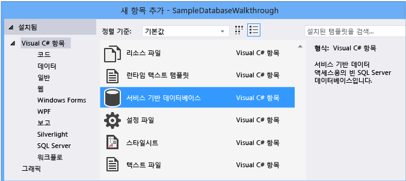
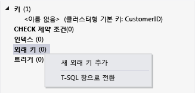

# <a name="create-a-database-and-add-tables-in-visual-studio"></a>데이터베이스를 만들고 Visual Studio에서 테이블을 추가 합니다.
만들고 SQL Server Express LocalDB에서 로컬 데이터베이스 파일을 업데이트 합니다. Visual Studio를 사용할 수 있습니다. TRANSACT-SQL 문을 실행 하 여 데이터베이스를 만들 수도 있습니다는 **SQL Server 개체 탐색기** Visual Studio의 도구 창입니다. 이 항목에서는.mdf 파일을 만들고 고 테이블 디자이너를 사용 하 여 테이블 및 키를 추가 합니다.

## <a name="prerequisites"></a>필수 조건
이 연습을 완료 하려면 선택적 있어야 **데이터 저장 및 처리** Visual Studio에 설치 하는 작업입니다. 를 설치 하려면 열고 **Visual Studio 설치 관리자** 선택 하 고는 **작업** 탭 합니다. 아래 **웹 및 클라우드에**, 선택 **데이터 저장 및 처리**합니다. 선택 된 **수정** Visual Studio에 작업을 추가 하는 단추입니다.

## <a name="create-a-project-and-a-local-database-file"></a>프로젝트 및 로컬 데이터베이스 파일 만들기

### <a name="to-create-a-project-and-a-database-file"></a>프로젝트 및 데이터베이스 파일을 만들려면
1.  라는 Windows Forms 프로젝트 만들기 `SampleDatabaseWalkthrough`합니다.

2.  메뉴 모음에서 선택 **프로젝트**, **새 항목 추가**합니다.

3.  항목 템플릿 목록에서 아래로 스크롤하여 선택 **서비스 기반 데이터베이스**합니다.

     

4.  데이터베이스의 이름을 **SampleDatabase**를 선택한 후는 **추가** 단추입니다.

### <a name="to-add-a-data-source"></a>데이터 소스를 추가하려면
5.  경우는 **데이터 원본** 창이 열려 있지 않으면, 선택 하 여 열에서 **Shift + Alt + D** 키 또는 메뉴 모음을 선택 하면 **보기**, **다른 창**, **데이터 소스**합니다.

6.  에 **데이터 원본** 창에서는 **새 데이터 소스 추가** 링크 합니다.

    **데이터 소스 구성 마법사** 열립니다.

7. 에 **데이터 소스 형식 선택** 페이지에서 선택 **데이터베이스** 선택한 후 **다음**합니다.

8. 에 **데이터베이스 모델 선택** 페이지에서 선택 **다음** (데이터 집합) 하 여 기본값을 적용 합니다.

9. 에 **데이터 연결 선택** 페이지에서는 **SampleDatabase.mdf** 드롭 다운 목록에서 파일을 선택한 후 **다음**합니다.

10. 에 **응용 프로그램 구성 파일에 연결 문자열 저장** 페이지에서 선택 **다음**합니다.

11. 하나는 **데이터베이스 개체 선택** 페이지 표시 데이터베이스 수 없다는 메시지가 모든 개체를 포함 하지 않습니다. **마침**을 선택합니다.

### <a name="to-view-properties-of-the-data-connection"></a>데이터 연결의 속성을 보려면
데이터 연결의 속성 창을 열어 SampleDatabase.mdf 파일에 대 한 연결 문자열을 볼 수 있습니다.

-   Visual Studio에서 선택 **보기**, **SQL Server 개체 탐색기** 그 창이 아직 열리지 않은 경우. 확장 하 여 속성 창을 열고는 **데이터 연결** 노드를 SampleDatabase.mdf에 대 한 바로 가기 메뉴를 열고 다음을 선택 하 **속성**합니다.

-   선택할 수 있습니다 **보기**, **서버 탐색기**그 창이 아직 열려 있지 않은 경우. 확장 하 여 속성 창을 열고는 **데이터 연결** 노드. 다음을 선택 하 고 SampleDatabase.mdf에 대 한 바로 가기 메뉴를 열고 **속성**합니다.

## <a name="create-tables-and-keys-by-using-table-designer"></a>테이블 디자이너를 사용 하 여 테이블 및 키 만들기
이 섹션에서는 두 개의 테이블, 각 테이블과 샘플 데이터 행을 몇 개에서 기본 키를 만듭니다. 한 테이블의 레코드가 다른 테이블의 레코드에 해당 하는 방법을 지정 하는 외래 키를 만들 수 있습니다.

### <a name="to-create-the-customers-table"></a>Customers 테이블을 만들려면
1.  **서버 탐색기** 또는 **SQL Server 개체 탐색기**를 확장 하 고는 **데이터 연결** 노드를 차례로 확장 하 고는 **SampleDatabase.mdf**노드.

2.  에 대 한 바로 가기 메뉴를 열고 **테이블**를 선택한 후 **새 테이블 추가**합니다.

     **테이블 디자이너** 열리고 사용자가 만드는 테이블의 단일 열을 나타내는 한 개의 기본 행이 포함 된 표를 표시 합니다. 표에 행을 추가하여 테이블에 열을 추가합니다.

3.  표에서 다음 각 항목에 대한 행을 추가합니다.

    |열 이름|데이터 형식|null 허용|
    |-----------------|---------------|-----------------|
    |`CustomerID`|`nchar(5)`|False(선택 취소)|
    |`CompanyName`|`nvarchar(50)`|False(선택 취소)|
    |`ContactName`|`nvarchar (50)`|True(선택)|
    |`Phone`|`nvarchar (24)`|True(선택)|

4.  에 대 한 바로 가기 메뉴를 열고는 `CustomerID` 행을 선택한 후 **기본 키 설정**합니다.

5.  기본 행에 대 한 바로 가기 메뉴를 연 다음 선택 **삭제**합니다.

6.  다음 샘플과 일치하도록 스크립트 창에서 첫 번째 줄을 업데이트하여 Customers 테이블 이름을 지정합니다.

    ```sql
    CREATE TABLE [dbo].[Customers]
    ```

    다음과 같이 표시되어야 합니다.

    

7.  왼쪽 위 모서리에는 **테이블 디자이너**, 선택는 **업데이트** 단추입니다.

8.  에 **데이터베이스 업데이트 미리 보기** 대화 상자는 **데이터베이스 업데이트** 단추입니다.

    변경 내용이 로컬 데이터베이스 파일에 저장됩니다.

### <a name="to-create-the-orders-table"></a>Orders 테이블을 만들려면
1.  다른 테이블을 추가한 다음, 다음 표의 각 항목에 대한 행을 추가합니다.

    |열 이름|데이터 형식|null 허용|
    |-----------------|---------------|-----------------|
    |`OrderID`|`int`|False(선택 취소)|
    |`CustomerID`|`nchar(5)`|False(선택 취소)|
    |`OrderDate`|`datetime`|True(선택)|
    |`OrderQuantity`|`int`|True(선택)|

2.  설정 **OrderID** 기본 키 및 기본 행을 삭제 합니다.

3.  다음 샘플과 일치하도록 스크립트 창에서 첫 번째 줄을 업데이트하여 Orders 테이블 이름을 지정합니다.

    ```sql
    CREATE TABLE [dbo].[Orders]
    ```

4.  왼쪽 위 모서리에는 **테이블 디자이너**, 선택는 **업데이트** 단추입니다.

5.  에 **데이터베이스 업데이트 미리 보기** 대화 상자는 **데이터베이스 업데이트** 단추입니다.

    변경 내용이 로컬 데이터베이스 파일에 저장됩니다.

### <a name="to-create-a-foreign-key"></a>외래 키를 만들려면
1.  눈금의 오른쪽에 컨텍스트 창에서에 대 한 바로 가기 메뉴를 열고 **외래 키**를 선택한 후 **새 외래 키 추가**다음 그림과 같이 합니다.

     

2.  표시 되는 텍스트 상자에서 대체 **ToTable** 와 `Customers`합니다.

3.  T-SQL 창에서 마지막 줄이 다음 샘플과 일치 하도록 업데이트 합니다.

    ```sql
    CONSTRAINT [FK_Orders_Customers] FOREIGN KEY ([CustomerID]) REFERENCES [Customers]([CustomerID])
    ```

4.  왼쪽 위 모서리에는 **테이블 디자이너**, 선택는 **업데이트** 단추입니다.

5.  에 **데이터베이스 업데이트 미리 보기** 대화 상자는 **데이터베이스 업데이트** 단추입니다.

    변경 내용이 로컬 데이터베이스 파일에 저장됩니다.

## <a name="populate-the-tables-with-data"></a>데이터로 테이블 채우기

### <a name="to-populate-the-tables-with-data"></a>테이블을 데이터로 채우려면

1.  **서버 탐색기** 또는 **SQL Server 개체 탐색기**, 예제 데이터베이스에 대 한 노드를 확장 합니다.

2.  에 대 한 바로 가기 메뉴를 열고는 **테이블** 노드를 선택 **새로 고침**를 차례로 확장 하 고는 **테이블** 노드.

3.  Customers 테이블에 대 한 바로 가기 메뉴를 연 다음 선택 **테이블 데이터 표시**합니다.

4.  일부 고객에 대해 원하는 모든 데이터를 추가 합니다.

    고객 ID를 5자로 지정할 수 있지만 나중에 이 절차에서 사용할 수 있도록 기억하기 쉬운 1자 정도를 선택하면 됩니다.

5.  Orders 테이블에 대 한 바로 가기 메뉴를 연 다음 선택 **테이블 데이터 표시**합니다.

6.  일부 주문에 대 한 데이터를 추가 합니다.

    > [!IMPORTANT]
    > 모든 주문 Id와 주문 수량이 정수가 고 각 고객 ID와 Customers 테이블의 CustomerID 열에 지정 하는 값을 일치 하는지 확인 합니다.

7.  메뉴 모음에서 선택 **파일**, **모두 저장**합니다.

## <a name="see-also"></a>참고자료

- [Visual Studio에서 데이터 액세스](accessing-data-in-visual-studio.md)