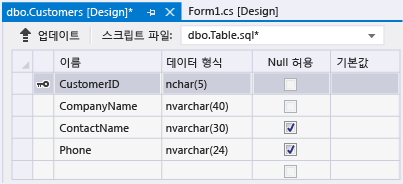

# 연습: Visual Studio에서 로컬 데이터베이스 파일 만들기
Visual Studio를 사용하여 [로컬 데이터 개요](../data-tools/local-data-overview.md)에 설명된 SQL Server Express LocalDB에서 로컬 데이터베이스 파일 만들기 및 업데이트를 수행하여 테이블 추가 및 열 정의와 같은 기본적인 작업을 탐색할 수 있습니다.  이 연습을 마친 후 로컬 데이터베이스를 사용하여 고급 기능을 알아보고 다른 연습을 미리 준비할 수 있습니다.  
  
 SQL Server Management Studio 또는 Transact\-SQL을 사용하여 데이터베이스를 만드는 방법에 대한 자세한 내용은 [Create a Database](http://msdn.microsoft.com/ko-kr/4c4beea2-6cbc-4352-9db6-49ea8130bb64)를 참조하십시오.  
  
 이 연습에서는 다음 작업을 수행하는 방법을 알아봅니다.  
  
-   [프로젝트 및 로컬 데이터베이스 파일 만들기](../data-tools/create-a-sql-database-by-using-a-designer.md#BKMK_CreateNewSQLDB)  
  
-   [테이블, 열, 기본 키 및 외래 키 만들기](../data-tools/create-a-sql-database-by-using-a-designer.md#BKMK_CreateNewTbls)  
  
-   [테이블에 데이터 채우기](../data-tools/create-a-sql-database-by-using-a-designer.md#BKMK_Populating)  
  
## 사전 요구 사항  
 이 연습을 완료하려면 [!INCLUDE[vs_dev12_expwin](../data-tools/includes/vs_dev12_expwin_md.md)], Visual Studio Professional 2013, Visual Studio Premium 2013 또는 Visual Studio Ultimate 2013을 설치합니다.  이러한 Visual Studio 버전에는 SQL Server 데이터 도구가 포함됩니다.  
  
##  <a name="BKMK_CreateNewSQLDB"></a> 프로젝트 및 로컬 데이터베이스 파일 만들기  
  
#### 프로젝트 및 데이터베이스 파일을 만들려면  
  
1.  `SampleDatabaseWalkthrough`로 명명된 Windows Form 프로젝트를 만듭니다.  
  
     [솔루션 및 프로젝트 만들기](../ide/creating-solutions-and-projects.md)를 참조하십시오.  
  
2.  메뉴 모음에서 **프로젝트**, **새 항목 추가**를 선택합니다.  
  
     Windows Form 프로젝트에 적합한 항목을 추가할 수 있도록 **새 항목 추가** 대화 상자가 나타납니다.  
  
3.  항목 템플릿 목록에서 **서비스 기반 데이터베이스**가 나타날 때까지 아래로 스크롤한 다음 선택합니다.  
  
       
  
4.  데이터베이스 이름을 SampleDatabase로 지정한 다음 **추가** 단추를 선택합니다.  
  
5.  데이터 소스 창이 열리지 않는 경우 Shift\-Alt\-D 키를 선택하거나 메뉴 모음에서 **보기**, **다른 창**, **데이터 소스**를 선택하여 창을 엽니다.  
  
6.  데이터 소스 창에서 **새 데이터 소스 추가** 링크를 선택합니다.  
  
7.  **데이터 소스 구성 마법사**에서 **다음** 단추를 네 번 선택하여 기본 설정을 적용한 다음, **마침** 단추를 선택합니다.  
  
 데이터베이스의 속성 창을 열어 연결 문자열 및 기본 .mdf 파일 위치를 볼 수 있습니다.  
  
-   Visual Studio Express에서 그 창이 아직 열리지 않은 경우 **보기**, **다른 창**, **데이터베이스 탐색기**를 선택합니다.  **데이터 연결** 노드를 확장하고 SampleDatabase.mdf에 대한 바로 가기 메뉴를 열고 **속성**을 선택하여 속성 창을 엽니다.  
  
-   다른 버전의 Visual Studio에서 그 창이 아직 열리지 않은 경우 **보기**, **서버 탐색기**를 선택합니다.  **데이터 연결** 노드를 확장하고 SampleDatabase.mdf에 대한 바로 가기 메뉴를 열고 **속성**을 선택하여 속성 창을 엽니다.  
  
##  <a name="BKMK_CreateNewTbls"></a> 테이블, 열, 기본 키 및 외래 키 만들기  
 이 단원에서는 몇 가지 테이블과 각 테이블의 기본 키 그리고 몇 행의 샘플 데이터를 만들어야 합니다.  다음 연습에서는 응용 프로그램에서 이 정보를 표시하는 방법을 배웁니다.  또한 외래 키를 만들어 한 테이블의 레코드가 다른 테이블의 레코드에 해당하는 방식을 지정할 수 있습니다.  
  
#### Customers 테이블을 만들려면  
  
1.  **서버 탐색기** 또는 **데이터베이스 탐색기**에서 **데이터 연결** 노드를 확장한 다음 **SampleDatabase.mdf** 노드를 확장합니다.  
  
     Visual Studio 버전의 탐색기가 열려 있지 않는 경우 메뉴 모음에서 **보기**, **서버 탐색기** 또는 **보기**, **다른 창**, **데이터베이스 탐색기**를 선택합니다.  
  
2.  **테이블**의 바로 가기 메뉴를 열고 **새 테이블 추가**를 선택합니다.  
  
     **테이블 디자이너**가 열리고 사용자가 만드는 테이블의 단일 열을 나타내는 한 개의 기본 행이 포함된 표가 표시됩니다.  표에 행을 추가하여 테이블에 열을 추가합니다.  
  
3.  표에서 다음 각 항목에 대한 행을 추가합니다.  
  
    |열 이름|데이터 형식|null 허용|  
    |----------|------------|-------------|  
    |`CustomerID`|`nchar(5)`|False\(선택 취소\)|  
    |`CompanyName`|`nvarchar(40)`|False\(선택 취소\)|  
    |`ContactName`|`nvarchar (30)`|True\(선택\)|  
    |`Phone`|`nvarchar (24)`|True\(선택\)|  
  
4.  `CustomerID` 행의 바로 가기 메뉴를 열고 **기본 키 설정**을 선택합니다.  
  
5.  기본 행에 대한 바로 가기 메뉴를 열고 **삭제**를 선택합니다.  
  
6.  다음 샘플과 일치하도록 스크립트 창에서 첫 번째 줄을 업데이트하여 Customers 테이블 이름을 지정합니다.  
  
    ```  
    CREATE TABLE [dbo].[Customers]  
    ```  
  
7.  다음 그림에 표시된 것처럼 테이블 디자이너의 왼쪽 상단 모서리에 있는 **업데이트** 단추를 선택합니다.  
  
       
  
8.  **데이터베이스 업데이트 미리 보기** 대화 상자에서 **데이터베이스 업데이트** 단추를 선택합니다.  
  
     변경 내용이 로컬 데이터베이스 파일에 저장됩니다.  
  
#### Orders 테이블을 만들려면  
  
1.  다른 테이블을 추가한 다음, 다음 표의 각 항목에 대한 행을 추가합니다.  
  
    |열 이름|데이터 형식|null 허용|  
    |----------|------------|-------------|  
    |`OrderID`|`int`|False\(선택 취소\)|  
    |`CustomerID`|`nchar(5)`|False\(선택 취소\)|  
    |`OrderDate`|`datetime`|True\(선택\)|  
    |`OrderQuantity`|`int`|True\(선택\)|  
  
2.  **OrderID**를 기본 키로 설정한 다음, 기본 행을 삭제합니다.  
  
3.  다음 샘플과 일치하도록 스크립트 창에서 첫 번째 줄을 업데이트하여 Orders 테이블 이름을 지정합니다.  
  
    ```  
    CREATE TABLE [dbo].[Orders]  
    ```  
  
4.  테이블 디자이너의 왼쪽 상단 모서리에 있는 **업데이트** 단추를 선택합니다.  
  
5.  **데이터베이스 업데이트 미리 보기** 대화 상자에서 **데이터베이스 업데이트** 단추를 선택합니다.  
  
     변경 내용이 로컬 데이터베이스 파일에 저장됩니다.  
  
#### 외래 키를 만들려면  
  
1.  표 오른쪽의 컨텍스트 창에서 **외래 키**에 대한 바로 가기 메뉴를 연 후 다음 그림처럼 **새 외래 키 추가**를 선택합니다.  
  
       
  
2.  표시되는 텍스트 상자에서 **ToTable**을 `Customers`로 바꿉니다.  
  
3.  스크립트 창에서 마지막 줄이 다음 샘플과 일치하도록 업데이트합니다.  
  
    ```  
    CONSTRAINT [FK_Orders_Customers] FOREIGN KEY ([CustomerID]) REFERENCES [Customers]([CustomerID])  
    ```  
  
4.  테이블 디자이너의 왼쪽 상단 모서리에 있는 **업데이트** 단추를 선택합니다.  
  
5.  **데이터베이스 업데이트 미리 보기** 대화 상자에서 **데이터베이스 업데이트** 단추를 선택합니다.  
  
     변경 내용이 로컬 데이터베이스 파일에 저장됩니다.  
  
##  <a name="BKMK_Populating"></a> 테이블에 데이터 채우기  
  
#### 테이블을 데이터로 채우려면  
  
1.  **서버 탐색기** 또는 **데이터베이스 탐색기**에서 샘플 데이터베이스의 노드를 확장합니다.  
  
2.  테이블 노드의 바로 가기 메뉴를 열고 **새로 고침**을 선택한 다음 테이블 노드를 확장합니다.  
  
3.  Customers 테이블의 바로 가기 메뉴를 열고 **테이블 데이터 표시**를 선택합니다.  
  
4.  세 명 이상의 고객에 대해 원하는 모든 데이터를 추가합니다.  
  
     고객 ID를 5자로 지정할 수 있지만 나중에 이 절차에서 사용할 수 있도록 기억하기 쉬운 1자 정도를 선택하면 됩니다.  
  
5.  Orders 테이블의 바로 가기 메뉴를 열고 **테이블 데이터 표시**를 선택합니다.  
  
6.  세 개 이상의 주문에 대한 데이터를 추가합니다.  
  
    > [!IMPORTANT]
    >  모든 주문 ID와 주문 수량이 정수이고 각 고객 ID가 Customers 테이블의 CustomerID 열에 지정한 값과 일치하는지 확인합니다.  
  
7.  메뉴 모음에서 **파일**, **모두 저장**을 차례로 선택합니다.  
  
8.  메뉴 모음에서 **파일**, **솔루션 닫기**를 선택합니다.  
  
    > [!NOTE]
    >  가장 좋은 방법은 만든 데이터베이스 파일을 복사한 후 복사본을 다른 위치에 붙여 넣거나 복사본에 다른 이름을 지정하여 데이터베이스 파일을 백업하는 것입니다.  
  
## 다음 단계  
 일부 샘플 데이터가 포함된 로컬 데이터베이스 파일이 있으므로 [연습: 로컬 데이터베이스 파일의 데이터에 연결\(Windows Forms\)](../Topic/Walkthrough:%20Connecting%20to%20Data%20in%20a%20Local%20Database%20File%20\(Windows%20Forms\).md) 및 데이터베이스 작업을 보여 주는 다른 연습을 완료할 수 있습니다.  
  
## 참고 항목  
 [방법: 프로젝트의 로컬 데이터 파일 관리](../data-tools/how-to-manage-local-data-files-in-your-project.md)   
 [로컬 데이터 개요](../data-tools/local-data-overview.md)   
 [Visual Studio에서 데이터에 Windows Forms 컨트롤 바인딩](../data-tools/bind-windows-forms-controls-to-data-in-visual-studio.md)   
 [Visual Studio의 데이터 응용 프로그램 개요](../data-tools/overview-of-data-applications-in-visual-studio.md)   
 [Visual Studio에서 데이터에 연결](../data-tools/connecting-to-data-in-visual-studio.md)   
 [데이터를 받기 위해 응용 프로그램 준비](../Topic/Preparing%20Your%20Application%20to%20Receive%20Data.md)   
 [데이터를 응용 프로그램으로 페치](../data-tools/fetching-data-into-your-application.md)   
 [Visual Studio에서 데이터에 컨트롤 바인딩](../data-tools/bind-controls-to-data-in-visual-studio.md)   
 [응용 프로그램에서 데이터 편집](../data-tools/editing-data-in-your-application.md)   
 [데이터 유효성 검사](../Topic/Validating%20Data.md)   
 [데이터 저장](../data-tools/saving-data.md)