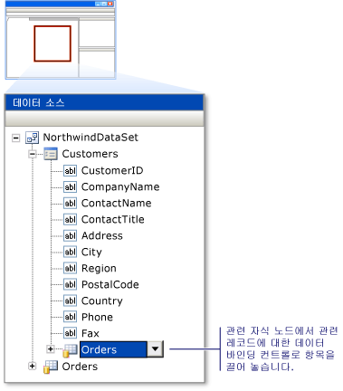

# WPF 응용 프로그램에서 관련된 데이터 표시
일부 응용 프로그램에서 가져온 여러 테이블이 나 부모-자식 관계에서 서로 관련 된 엔터티 데이터를 사용 하는 것이 좋습니다. 예를 들어 고객을 표시 하는 표를 표시 하려면 수는 `Customers` 테이블입니다. 다른 그리드에서 관련 된 해당 고객에 대 한 주문이 표시 됩니다는 사용자가 특정 고객을 선택 `Orders` 테이블입니다.

항목을 끌어 관련된 데이터를 표시 하는 데이터 바인딩된 컨트롤을 만들 수는 **데이터 소스** 창에서 WPF 디자이너로 합니다.

## 관련된 레코드를 표시 하는 컨트롤을 만들려면

1. 에 **데이터** 메뉴를 클릭 **데이터 소스 표시** 열려는 **데이터 소스** 창.

2. 클릭 **새 데이터 소스 추가**, 완료 된 **데이터 소스 구성** 마법사.

3. WPF 디자이너를 열고 디자이너에 컨테이너의 항목에 대 한 유효한 놓기 대상에 포함 되어 있는지 확인은 **데이터 소스** 창.

     유효한 놓기 대상에 대 한 자세한 내용은 참조 [Visual Studio에서 데이터에 컨트롤을 바인딩하는 WPF](../data-tools/bind-wpf-controls-to-data-in-visual-studio.md)합니다.

4. 에 **데이터 소스** 창 부모 테이블을 나타내는 노드를 확장 또는 관계에서 개체입니다. 1 대 다 관계의 "일" 쪽에 부모 테이블이 나 개체입니다.

5. 부모 노드 (또는 개별 항목에 부모 노드)에서 끌어는 **데이터 소스** 창 디자이너에서 유효한 놓기 대상으로 합니다.

     Visual Studio를 끌면 각 항목에 대 한 새 데이터 바인딩된 컨트롤을 만드는 XAML을 생성 합니다. XAML도 새 추가 <xref:System.Windows.Data.CollectionViewSource> 부모 테이블이 나 놓기 대상의 리소스에는 개체에 대 한 합니다. Visual Studio 일부 데이터 원본에 대 한 부모 테이블이 나 개체에 데이터를 로드 하는 코드를 생성 합니다. 자세한 내용은 참조 [Visual Studio에서 데이터에 컨트롤을 바인딩하는 WPF](../data-tools/bind-wpf-controls-to-data-in-visual-studio.md)합니다.

6. 에 **데이터 소스** 창 관련된 자식 테이블 또는 개체를 찾습니다. 관련된 자식 테이블 및 개체 데이터의 부모 노드 목록 맨 아래에 확장 가능한 노드가으로 표시 됩니다.

7. 자식 노드 (또는 개별 항목에 자식 노드)에서 끌어는 **데이터 소스** 창 디자이너에서 유효한 놓기 대상으로 합니다.

     Visual Studio의 각 끌면 항목에 대 한 새 데이터 바인딩된 컨트롤을 만듭니다는 XAML을 생성 합니다. XAML도 새 추가 <xref:System.Windows.Data.CollectionViewSource> 자식 테이블이 나 놓기 대상의 리소스에는 개체에 대 한 합니다. 이 새로운 <xref:System.Windows.Data.CollectionViewSource> 는 부모 테이블 또는 디자이너로 끌어 온 개체의 속성에 바인딩됩니다. 일부 데이터 원본에 대 한 Visual Studio 자식 테이블이 나 개체에 데이터를 로드 하는 코드를 생성 합니다.

     다음 그림에서는 관련 **Orders** 목차는 **고객** 테이블에서 데이터 집합에는 **데이터 원본** 창.

     

## 참고자료

- [Visual Studio에서 데이터에 WPF 컨트롤 바인딩](../data-tools/bind-wpf-controls-to-data-in-visual-studio.md)
- [WPF 응용 프로그램에서 조회 테이블 만들기](../data-tools/create-lookup-tables-in-wpf-applications.md)