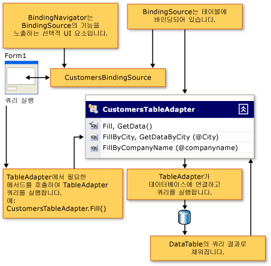
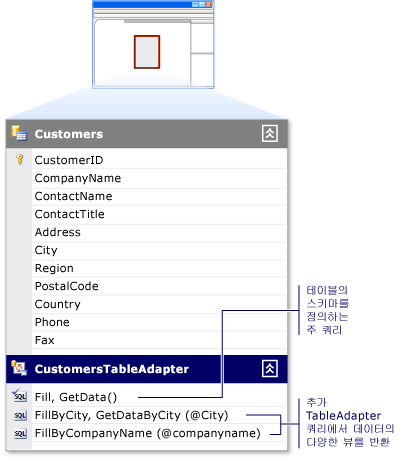

# Tableadapter를 사용 하 여 데이터 집합 채우기
TableAdapter 구성 요소는 데이터 집합 쿼리 또는 사용자가 지정한 저장된 프로시저를 하나 이상에 따라 데이터베이스의 데이터로 채웁니다. Tableadapter를 수행할 수도 추가, 업데이트 및 데이터 집합에 수행한 변경 내용을 유지 하려면 데이터베이스에서 삭제 합니다. 또한 특정 테이블에 관련 되지 않은 전역 명령을 실행할 수 있습니다.  
  
> [!NOTE]
>  Tableadapter는 Visual Studio 디자이너에서 생성 됩니다. 데이터 집합을 프로그래밍 방식으로 만들려는 경우에.NET Framework 클래스 DataAdapter를 사용 합니다.  
  
 TableAdapter 작업에 대 한 자세한 내용은 다음이 항목 중 하나에 직접 건너뛸 수 있습니다.  
  
|항목|설명|  
|-----------|-----------------|  
|[TableAdapter 만들기 및 구성](../data-tools/create-and-configure-tableadapters.md)|만들고 Tableadapter를 구성 하는 디자이너를 사용 하는 방법|  
|[매개 변수가 있는 TableAdapter 쿼리 만들기](../data-tools/create-parameterized-tableadapter-queries.md)|사용자가 인수 TableAdapter 프로시저 또는 쿼리를 제공할 수 있도록 하는 방법|  
|[TableAdapter를 사용하여 데이터베이스에 직접 액세스](../data-tools/directly-access-the-database-with-a-tableadapter.md)|Tableadapter의 Dbdirect 메서드를 사용 하는 방법|  
|[데이터 집합을 채우는 동안 제약 조건 해제](../data-tools/turn-off-constraints-while-filling-a-dataset.md)|데이터를 업데이트할 때 외래 키 제약 조건으로 작업 하는 방법|  
|[TableAdapter의 기능을 확장 하는 방법](../data-tools/fill-datasets-by-using-tableadapters.md)|Tableadapter에 사용자 지정 코드를 추가 하는 방법|  
|[XML 데이터를 Dataset에 읽어오기](../data-tools/read-xml-data-into-a-dataset.md)|XML로 작업 하는 방법|  
  
  
  
## TableAdapter 개요  
 Tableadapter 디자이너에서 생성 된 구성 요소는 데이터베이스, 실행된 된 쿼리 또는 저장된 프로시저에 연결 하 고 반환된 된 데이터의 DataTable을 채웁니다. Tableadapter는 데이터베이스에 다시 응용 프로그램에서 업데이트 된 데이터도 보냅니다. TableAdapter에 연결 된 테이블의 스키마에 맞는 데이터를 반환 한다면 TableAdapter에 원하는 만큼 많은 쿼리를 실행할 수 있습니다. 다음 다이어그램에서는 Tableadapter 데이터베이스 및 메모리의 다른 개체 상호 작용 하는 방법을 보여 줍니다.  
  
   
  
 Tableadapter로 설계 되어는 **데이터 집합 디자이너**, TableAdapter 클래스의 중첩 된 클래스로 생성 되지 않은 <xref:System.Data.DataSet>합니다. 각 데이터 집합에만 적용 되는 별도 네임 스페이스에 있습니다. 예를 들어, 라는 데이터 집합이 있는 경우 `NorthwindDataSet`, 연관 된 Tableadapter <xref:System.Data.DataTable>에서 s는 `NorthwindDataSet` 것에 `NorthwindDataSetTableAdapters` 네임 스페이스입니다. 특정 TableAdapter에 프로그래밍 방식으로 액세스 하려면 TableAdapter의 새 인스턴스를 선언 해야 합니다. 예:  
  
 [!code-csharp[VbRaddataTableAdapters#7](../data-tools/codesnippet/CSharp/fill-datasets-by-using-tableadapters_1.cs)]
 [!code-vb[VbRaddataTableAdapters#7](../data-tools/codesnippet/VisualBasic/fill-datasets-by-using-tableadapters_1.vb)]  
  
## 연결 된 DataTable 스키마  
 TableAdapter를 만들면, 초기 쿼리를 사용 하거나 TableAdapter의 스키마를 정의 하는 저장된 프로시저의 연결 된 <xref:System.Data.DataTable>합니다. 이 초기 쿼리를 실행 또는 저장 프로시저를 TableAdapter의 호출 하 여 `Fill` 메서드 (관련 TableAdapter를 채우는 <xref:System.Data.DataTable>). 연결 된 데이터 테이블의 스키마에는 TableAdapter의 주 쿼리에 변경 내용이 반영 됩니다. 예를 들어 열은 연결 된 데이터 테이블에서 제거도 기본 쿼리에서 열을 제거 합니다. TableAdapter에 쿼리 주 쿼리에서 없는 열을 반환 하는 SQL 문을 사용 하 여, 디자이너 주 쿼리 및 추가 쿼리 간의 열 변경 내용을 동기화 하려고 합니다. 
  
## TableAdapter 업데이트 명령  
 TableAdapter의 업데이트 기능 TableAdapter 마법사에서 주 쿼리에서 사용할 수 있는 정보를 어느 정도에 따라 달라 집니다. 예를 들어 여러 테이블 (조인)의 값, 스칼라 값, 뷰 또는 집계 함수의 결과 인출 하도록 구성 된 Tableadapter 처음 업데이트 기본 데이터베이스를 다시 보내는 수 만들어지지 않습니다. 그러나, INSERT, UPDATE 및 DELETE 명령에서 수동으로 구성할 수 있습니다는 **속성** 창.  
  
## TableAdapter 쿼리  
   
  
 Tableadapter의 관련된 데이터 테이블을 채우는 여러 개의 쿼리를 포함할 수 있습니다. 각 쿼리는 연결 된 데이터 테이블과 같은 스키마를 따르는 데이터를 반환 한다면 응용 프로그램에 필요한 만큼의 쿼리는 TableAdapter에 대 한을 정의할 수 있습니다. 이 기능을 사용 하면 TableAdapter를 서로 다른 기준에 따라 다른 결과 로드 합니다.  
  
 예를 들어 고객 이름이 있는 테이블을 포함 하는 응용 프로그램을 동일한 상태에 있는 모든 고객으로 테이블을 채우는 하는 특정 문자로 시작 하는 모든 고객 이름과와 테이블을 채우는 쿼리를 만들 수 있습니다. 채우는 한 `Customers` 테이블 특정된 상태에 대 한 고객을 만들 수 있습니다는 `FillByState` 쿼리 상태 값에 대 한 매개 변수를 다음과 같이 사용: `SELECT * FROM Customers WHERE State = @State`합니다. 호출 하 여 쿼리를 실행 하면는 `FillByState` 메서드 매개 변수 값을 전달 하 고 다음과 같이: `CustomerTableAdapter.FillByState("WA")`합니다.  
  
 같은 TableAdapter의 데이터 테이블 스키마의 데이터를 반환 하는 쿼리를 추가 하는 것 외에도 스칼라 (단일) 값을 반환 하는 쿼리를 추가할 수 있습니다. 고객의 수를 반환 하는 쿼리 예를 들어 (`SELECT Count(*) From Customers`)를 사용할 수는 `CustomersTableAdapter,` 있지만 반환 되는 데이터 테이블의 스키마를 준수 하지 않습니다.  
  
## ClearBeforeFill 속성  
 기본적으로 TableAdapter의 데이터 테이블 채우는 쿼리를 실행할 때 기존 데이터의 선택을 취소 하 고 쿼리의 결과만 테이블에 로드 됩니다. TableAdapter의 설정 `ClearBeforeFill` 속성을 `false` 추가 하거나 데이터 테이블의 기존 데이터에는 쿼리에서 반환 되는 데이터를 병합 하려는 경우. 데이터를 지우려면 여부에 관계 없이 해야 명시적으로 업데이트를 데이터베이스로 다시 보내는 유지 하려는 경우. 따라서 테이블을 채우는 다른 쿼리를 실행 하기 전에 테이블의 데이터 변경 내용을 저장 해야 합니다. 자세한 내용은 참조 [TableAdapter를 사용 하 여 데이터를 업데이트](../data-tools/update-data-by-using-a-tableadapter.md)합니다.  
  
## TableAdapter 상속  
 Tableadapter 구성 캡슐화 하 여 표준 데이터 어댑터의 기능을 확장 <xref:System.Data.Common.DataAdapter> 클래스입니다. 기본적으로 TableAdapter에서 상속 된 <xref:System.ComponentModel.Component> 클래스 및으로 캐스팅할 수 없습니다는 <xref:System.Data.Common.DataAdapter> 클래스입니다. TableAdapter를 캐스팅 하는 <xref:System.Data.Common.DataAdapter> 클래스에 결과 <xref:System.InvalidCastException> 오류입니다. TableAdapter의 기본 클래스를 변경 하려면에서 파생 되는 클래스를 지정할 수 있습니다 <xref:System.ComponentModel.Component> 에 **기본 클래스** 에서 TableAdapter의 속성은 **데이터 집합 디자이너**합니다.  
  
## TableAdapter 메서드 및 속성  
 TableAdapter 클래스가 않습니다의 일부가 [!INCLUDE[dnprdnshort](../code-quality/includes/dnprdnshort_md.md)]합니다. 즉, 설명서에서을 조회할 수 없습니다 또는 **개체 브라우저**합니다. 앞에서 언급 한 마법사 중 하나를 사용 하면 디자인 타임에 생성 됩니다. 만들 때 TableAdapter에 할당 된 이름은 사용 하는 테이블의 이름을 기반으로 합니다. 예를 들어 이름의 데이터베이스에 테이블을 기반으로 TableAdapter를 만들 때 `Orders`, TableAdapter 라는 `OrdersTableAdapter`합니다. TableAdapter의 클래스 이름을 사용 하 여 변경할 수 있습니다는 **이름** 속성에는 **데이터 집합 디자이너**합니다.  
  
 다음은 자주 사용 되는 메서드 및 Tableadapter의 속성입니다.  
  
|멤버|설명|  
|------------|-----------------|  
|`TableAdapter.Fill`|TableAdapter의 SELECT 명령의 결과 TableAdapter의 연결 된 데이터 테이블을 채웁니다.|  
|`TableAdapter.Update`|변경 내용을 데이터베이스에 다시 보내고 업데이트에 의해 영향을 받는 행 수를 나타내는 정수를 반환 합니다. 자세한 내용은 참조 [TableAdapter를 사용 하 여 데이터를 업데이트](../data-tools/update-data-by-using-a-tableadapter.md)합니다.|  
|`TableAdapter.GetData`|새 반환 <xref:System.Data.DataTable> 데이터로 채워집니다.|  
|`TableAdapter.Insert`|데이터 테이블에 새 행을 만듭니다. 자세한 내용은 참조 [데이터베이스에 새 레코드 삽입](../data-tools/insert-new-records-into-a-database.md)합니다.|  
|`TableAdapter.ClearBeforeFill`|데이터 테이블 중 하나를 호출 하기 전에 비어 있는지 여부를 결정은 `Fill` 메서드.|  
  
## TableAdapter update 메서드  
 Tableadapter를 읽기 / 쓰기 데이터베이스에서 데이터 명령을 사용 합니다. TableAdapter의 초기 `Fill` (주) 쿼리를 사용 하는 기준으로 연결 된 데이터 테이블의 스키마를 만들기 위한으로 `InsertCommand`, `UpdateCommand`, 및 `DeleteCommand` 연관 된 명령을 `TableAdapter.Update` 메서드. TableAdapter의 호출 `Update` 사용 하 여 추가 된 추가 쿼리 중 하나가 아닙니다 메서드를 원래 TableAdapter 때 생성 된 문 실행 구성의 **TableAdapter 쿼리 구성 마법사**.  
  
 TableAdapter를 사용 하면 일반적으로 수행 되는 명령을 이와 동일한 작업을 효과적으로 수행 합니다. 예를 들어 호출 하는 경우 어댑터의 `Fill` 메서드, 어댑터 명령을 실행 하는 데이터 해당 `SelectCommand` 속성 데이터 판독기를 사용 하 고 (예를 들어 <xref:System.Data.SqlClient.SqlDataReader>)를 결과 집합을 데이터 테이블에 로드 합니다. 마찬가지로, 호출 하는 경우 어댑터의 `Update` 메서드를 적절 한 명령을 실행 (에 `UpdateCommand`, `InsertCommand`, 및 `DeleteCommand` 속성) 각각에 대해 데이터 테이블의 레코드를 변경 합니다.  
  
> [!NOTE]
>  주 쿼리에서 충분 한 정보가 없는 경우는 `InsertCommand`, `UpdateCommand`, 및 `DeleteCommand` 명령을 TableAdapter가 생성 될 때 기본적으로 생성 됩니다. 디자이너를 생성 하지 못할 수 있기 TableAdapter의 주 쿼리에서 단일 테이블 SELECT 문을 보다 크면, `InsertCommand`, `UpdateCommand`, 및 `DeleteCommand`합니다. 이러한 명령은으로 생성 되지 않은 경우 실행 하는 경우 오류가 발생할 수 있습니다는 `TableAdapter.Update` 메서드.  
  
## TableAdapter GenerateDbDirectMethods  
 외에 `InsertCommand`, `UpdateCommand`, 및 `DeleteCommand`, Tableadapter는 데이터베이스에 대해 직접 실행할 수 있는 메서드를 사용 하 여 만들어집니다. 이러한 메서드 (`TableAdapter.Insert`, `TableAdapter.Update`, 및 `TableAdapter.Delete`) 데이터베이스에서 데이터를 조작 하는 직접 호출할 수 있습니다. 즉, 이러한 개별 메서드를 호출 하는 대신 사용자 코드에서 호출할 수 있습니다 `TableAdapter.Update` 삽입, 업데이트 및 보류 중인 삭제를 처리 하는 연결 된 데이터 테이블에 대 한 합니다.  
  
 이러한 직접 메서드를 만드는 않으려면 설정 TableAdapter의 **GenerateDbDirectMethods** 속성을 `false` (에 **속성** 창). TableAdapter에 추가 된 추가 쿼리는 독립 실행형-이러한 메서드를 생성 하지 않습니다.  
  
## Nullable 형식에 대 한 TableAdapter 지원  
 Tableadapter에서 nullable 형식을 지원 `Nullable(Of T)` 및 `T?`합니다. Visual Basic의 nullable 형식에 대한 자세한 내용은 [Nullable 값 형식](/dotnet/visual-basic/programming-guide/language-features/data-types/nullable-value-types)을 참조하세요. C#의 null 허용 형식에 대 한 자세한 내용은 참조 하십시오. [Nullable 형식을 사용 하 여](/dotnet/csharp/programming-guide/nullable-types/using-nullable-types)합니다.  
  
  
  
## TableAdapterManager 참조  
 기본적으로는 `TableAdapterManager` 클래스 관련된 테이블을 포함 하는 데이터 집합을 만들 때 생성 됩니다. 클래스를 생성 되지 않도록 하려면의 값을 변경는 `Hierarchical Update` false로 데이터 집합의 속성입니다. Windows Form 또는 WPF 페이지의 디자인 화면으로 관계가 있는 테이블을 끌어 놓으면 Visual Studio 클래스의 멤버 변수를 선언 합니다. 데이터 바인딩을 사용 하지 않는 경우 수동으로 변수를 선언 해야 합니다.  
  
 `TableAdapterManager` 클래스가 않습니다의 일부가 [!INCLUDE[dnprdnshort](../code-quality/includes/dnprdnshort_md.md)]합니다. 따라서 설명서에서을 조회할 수 없습니다. 데이터 집합 만들기 프로세스의 일환으로 디자인 타임에 생성 됩니다.  
  
 다음은 자주 사용 되는 메서드 및 속성의는 `TableAdapterManager` 클래스:  
  
|멤버|설명|  
|------------|-----------------|  
|`UpdateAll` 메서드|모든 데이터 테이블의 모든 데이터를 저장합니다.|  
|`BackUpDataSetBeforeUpdate` 속성|실행 하기 전에 데이터 집합의 백업 복사본을 만들 것인지 결정는 `TableAdapterManager.UpdateAll` 메서드. 부울 값입니다.|  
|*tableName* `TableAdapter` 속성|나타냅니다는 `TableAdapter`합니다. 생성 된 `TableAdapterManager` 각각에 대 한 속성이 포함 되어 `TableAdapter` 관리 합니다. 예를 들어, Customers 및 Orders 테이블이 포함 된 데이터 집합으로 생성 됩니다는 `TableAdapterManager` 포함 된 `CustomersTableAdapter` 및 `OrdersTableAdapter` 속성입니다.|  
|`UpdateOrder` 속성|개별 insert, update 및 delete 명령을의 순서를 제어 합니다. 이 설정의 값 중 하나에 `TableAdapterManager.UpdateOrderOption` 열거형입니다.   기본적으로는 `UpdateOrder` 로 설정 된 **InsertUpdateDelete**합니다. 이 즉, 삽입, 다음 업데이트 및 삭제 한 다음 데이터 집합의 모든 테이블에 대해 수행 됩니다.|

## 보안  
데이터 명령 CommandType 속성이로 설정 된 사용 하는 경우 <xref:System.Data.CommandType.Text>, 신중 하 게 데이터베이스에 전달 하기 전에 클라이언트에서 전송 되는 정보를 확인 합니다. 악의적인 사용자가를 보내려고 시도할 수 있습니다 (주입) 데이터베이스를 훼손 하거나 무단으로 액세스 하기 위해 SQL 문을 수정 또는 추가 합니다. 데이터베이스에 사용자 입력을 전송 하기 전에 항상 정보가 올바른지 확인 합니다. 항상 가능한 경우 저장된 프로시저 또는 매개 변수가 있는 쿼리를 사용 하는 것이 좋습니다.  
  
## 참고 항목
[데이터 집합 도구](../data-tools/dataset-tools-in-visual-studio.md)