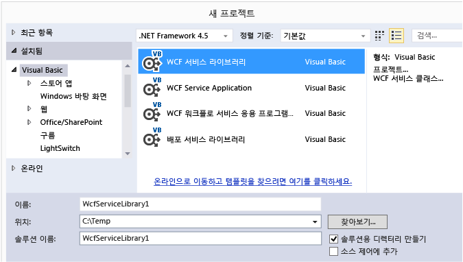
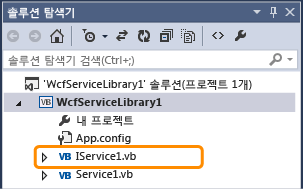
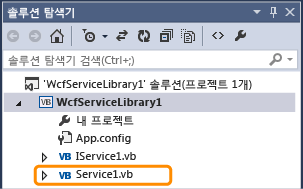
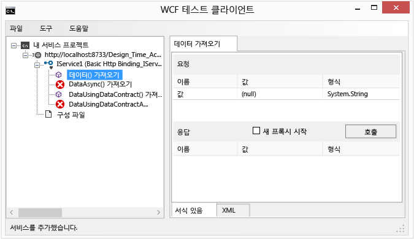
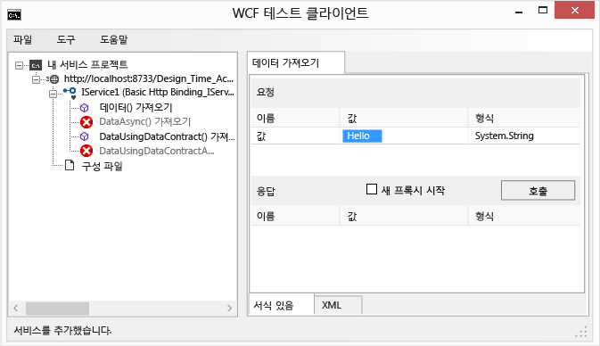
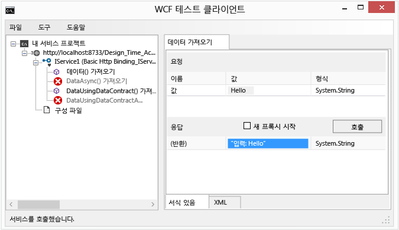
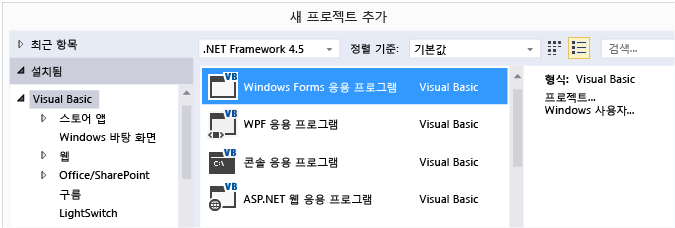
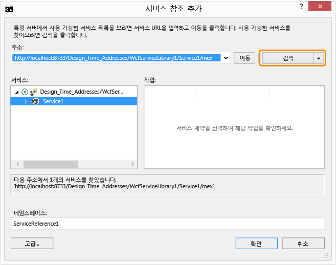
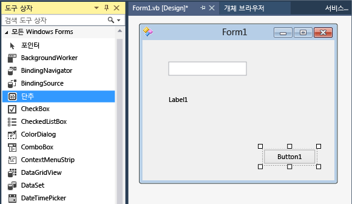
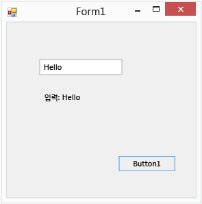

# Walkthrough: Creating and Accessing WCF Services
이 연습에서는 간단한 [!INCLUDE[vsindigo](../data-tools/includes/vsindigo_md.md)] 서비스를 만들고 테스트한 다음 Windows Forms 응용 프로그램에서 액세스하는 방법을 보여 줍니다.  
  
 [!INCLUDE[note_settings_general](../data-tools/includes/note_settings_general_md.md)]  
  
## 서비스 만들기  
  
#### WCF 서비스를 만들려면  
  
1.  **파일** 메뉴에서 **새로 만들기**를 가리킨 다음 **프로젝트**를 클릭합니다.  
  
2.  **새 프로젝트** 대화 상자에서 **Visual Basic** 또는 **Visual C\#** 노드를 확장한 다음 **WCF**, **WCF 서비스 라이브러리**를 차례로 클릭합니다.  **확인**을 클릭하여 프로젝트를 엽니다.  
  
       
  
    > [!NOTE]
    >  이렇게 하면 테스트 및 액세스할 수 있는 작업 서비스가 만들어집니다.  다음 두 단계는 다른 데이터 형식을 사용하도록 기본 메서드를 수정하는 방법을 보여 줍니다.  실제 응용 프로그램에서는 서비스에 사용자 고유의 함수를 추가할 수도 있습니다.  
  
3.    
  
     **솔루션 탐색기**에서 IService1.vb 또는 IService1.cs를 두 번 클릭하고 다음 줄을 찾습니다.  
  
     [!code-cs[WCFWalkthrough#4](../data-tools/codesnippet/CSharp/walkthrough-creating-a-simple-wcf-service-in-windows-forms_1.cs)]
     [!code-vb[WCFWalkthrough#4](../data-tools/codesnippet/VisualBasic/walkthrough-creating-a-simple-wcf-service-in-windows-forms_1.vb)]  
  
     `value` 매개 변수의 형식을 `String`으로 변경합니다.  
  
     [!code-cs[WCFWalkthrough#1](../data-tools/codesnippet/CSharp/walkthrough-creating-a-simple-wcf-service-in-windows-forms_2.cs)]
     [!code-vb[WCFWalkthrough#1](../data-tools/codesnippet/VisualBasic/walkthrough-creating-a-simple-wcf-service-in-windows-forms_2.vb)]  
  
     위의 코드에서 `<OperationContract()>` 또는 `[OperationContract]` 특성을 확인합니다.  이러한 특성은 서비스에서 노출하는 모든 메서드에 필요합니다.  
  
4.    
  
     **솔루션 탐색기**에서 Service1.vb 또는 Service1.cs를 두 번 클릭하고 다음 줄을 찾습니다.  
  
     [!code-vb[WCFWalkthrough#5](../data-tools/codesnippet/VisualBasic/walkthrough-creating-a-simple-wcf-service-in-windows-forms_3.vb)]
     [!code-cs[WCFWalkthrough#5](../data-tools/codesnippet/CSharp/walkthrough-creating-a-simple-wcf-service-in-windows-forms_3.cs)]  
  
     값 매개 변수의 형식을 `String`으로 변경합니다.  
  
     [!code-cs[WCFWalkthrough#2](../data-tools/codesnippet/CSharp/walkthrough-creating-a-simple-wcf-service-in-windows-forms_4.cs)]
     [!code-vb[WCFWalkthrough#2](../data-tools/codesnippet/VisualBasic/walkthrough-creating-a-simple-wcf-service-in-windows-forms_4.vb)]  
  
## 서비스 테스트  
  
#### WCF 서비스를 테스트하려면  
  
1.  **F5** 키를 눌러 서비스를 실행합니다.  **WCF 테스트 클라이언트** 폼이 표시되고 서비스가 로드됩니다.  
  
2.  **WCF 테스트 클라이언트** 폼에서 **IService1** 아래의 **GetData\(\)** 메서드를 두 번 클릭합니다.  **GetData** 탭이 표시됩니다.  
  
       
  
3.  **요청** 상자에서 **값** 필드와 형식 `Hello`를 선택합니다.  
  
       
  
4.  **호출** 단추를 클릭합니다.  **보안 경고** 대화 상자가 표시되면 **확인**을 클릭합니다.  그 결과가 **응답** 상자에 표시됩니다.  
  
       
  
5.  **파일** 메뉴에서 **끝내기**를 클릭하여 테스트 폼을 닫습니다.  
  
## 서비스 액세스  
  
#### WCF 서비스를 참조하려면  
  
1.  **파일** 메뉴에서 **추가**를 가리킨 다음 **새 프로젝트**를 클릭합니다.  
  
2.  **새 프로젝트** 대화 상자에서 **Visual Basic** 또는 **Visual C\#** 노드를 확장하고 **Windows**를 선택한 다음 **Windows Forms 응용 프로그램**을 선택합니다.  **확인**을 클릭하여 프로젝트를 엽니다.  
  
       
  
3.  **WindowsApplication1**을 마우스 오른쪽 단추로 클릭하고 **서비스 참조 추가**를 클릭합니다.  **서비스 참조 추가** 대화 상자가 나타납니다.  
  
4.  **서비스 참조 추가** 대화 상자에서 **검색**을 클릭합니다.  
  
       
  
     **서비스** 창에 **Service1**이 표시됩니다.  
  
5.  **확인**을 클릭하여 서비스 참조를 추가합니다.  
  
#### 클라이언트 응용 프로그램을 빌드하려면  
  
1.  Windows Forms 디자이너를 아직 열지 않은 경우 **솔루션 탐색기**에서 **Form1.vb** 또는 **Form1.cs**을 두 번 클릭하여 엽니다.  
  
2.  **도구 상자**에서 `TextBox` 컨트롤, `Label` 컨트롤 및 `Button` 컨트롤을 폼으로 끌어옵니다.  
  
       
  
3.  `Button`을 두 번 클릭하고 다음 코드를 `Click` 이벤트 처리기에 추가합니다.  
  
     [!code-cs[WCFWalkthrough#3](../data-tools/codesnippet/CSharp/walkthrough-creating-a-simple-wcf-service-in-windows-forms_5.cs)]
     [!code-vb[WCFWalkthrough#3](../data-tools/codesnippet/VisualBasic/walkthrough-creating-a-simple-wcf-service-in-windows-forms_5.vb)]  
  
4.  **솔루션 탐색기**에서 **WindowsApplication1**을 마우스 오른쪽 단추로 클릭한 다음 **시작 프로젝트로 설정**을 클릭합니다.  
  
5.  **F5** 키를 눌러 프로젝트를 실행합니다.  텍스트를 입력하고 단추를 클릭합니다.  레이블에 "입력한 내용:"과 입력한 텍스트가 표시됩니다.  
  
       
  
## 참고 항목  
 [ASMX 및 WCF 서비스 샘플 사용](http://msdn.microsoft.com/ko-kr/788ddf2c-2ac1-416b-8789-2fbb1e29b8fe)