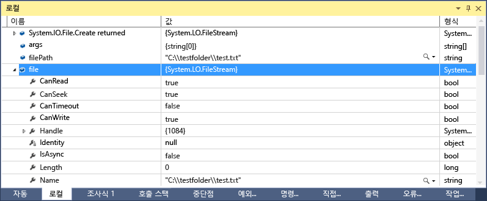
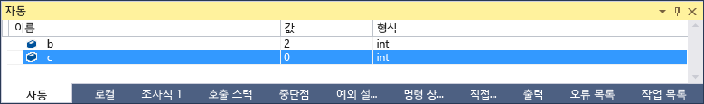
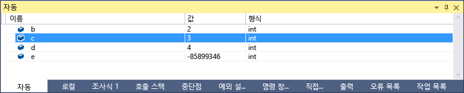
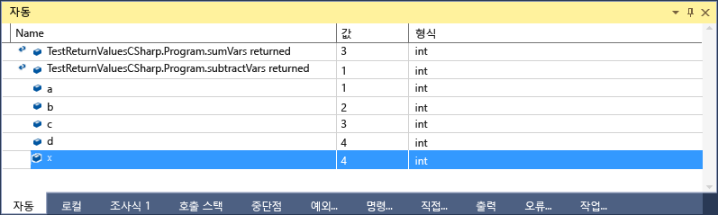

# 자동 및 지역 창
[!INCLUDE[vs2017banner](../code-quality/includes/vs2017banner.md)]

**자동** 창\(디버깅하는 동안 **Ctrl\+Alt\+V, A** 또는 **디버그\/Windows\/자동**\) 및 **지역** 창\(디버깅하는 동안 **Ctrl\+Alt\+V, L** 또는 **디버그\/Windows\/지역**\)은 디버깅하는 동안 변수 값을 확인하려는 경우에 매우 유용합니다.**지역** 창에는 로컬 범위에 정의되는 변수가 표시되며, 일반적으로 현재 실행되고 있는 함수 또는 메서드입니다.**자동** 창에는 현재 줄\(디버거가 중지되어 있는 위치\)에 사용된 변수가 표시됩니다. 정확히 표시되는 변수는 언어에 따라 달라집니다. 아래에서 자동 창에 나타나는 변수를 참조하세요.  
  
 기본 디버깅에 대한 자세한 내용은 [디버거 시작](../debugger/getting-started-with-the-debugger.md)을 참조하세요.  
  
## 자동 및 지역 창에서 개체 보기  
 배열 및 개체는 트리 컨트롤로 자동 및 지역 창에 표시됩니다. 필드 및 속성을 표시하려면 변수 이름 왼쪽에 있는 화살표를 클릭하여 보기를 확장합니다. 다음은 **지역** 창에 있는 [FileStream](../Topic/FileStream%20Class.md) 개체의 예입니다.  
  
   
  
## 자동 창에 나타나는 변수  
 **자동** 창은 C\#, Visual Basic 및 C\+\+ 코드에서 사용할 수 있습니다.**자동** 창은 JavaScript 또는 F\#을 지원하지 않습니다.  
  
 C\# 및 Visual Basic의 **자동** 창에는 현재 줄이나 이전 줄에 사용된 모든 변수가 표시됩니다. 예를 들어 다음은 네 개의 변수를 선언하고 설정하는 경우입니다.  
  
```c#  
public static void Main() { int a, b, c, d; a = 1; b = 2; c = 3; d = 4; }  
```  
  
 `c = 3`; 줄에 중단점을 설정하고 디버거를 실행하는 경우 실행이 중지되면 **자동** 창이 다음과 같이 표시됩니다.  
  
   
  
 `c = 3` 줄이 아직 실행되지 않았기 때문에 `c`의 값이 0입니다.  
  
 C\+\+의 **자동** 창에는 현재 줄\(실행이 중지된 줄\) 앞에 있는 세 개 이상의 줄에서 사용된 변수가 표시됩니다. 다음은 6개의 변수를 선언하는 경우입니다.  
  
```cpp  
void main() { int a, b, c, d, e, f; a = 1; b = 2; c = 3; d = 4; e = 5; f = 6; }  
```  
  
 `e = 5;` 줄에 중단점을 설정하고 디버거를 실행하는 경우 실행이 중지되면 **자동** 창이 다음과 같이 표시됩니다.  
  
   
  
 `e = 5;`  줄의 코드가 아직 실행되지 않았기 때문에 변수 e가 초기화되지 않습니다.  
  
 특정 상황에서는 함수 및 메서드의 반환 값을 볼 수도 있습니다. 아래에서 [메서드 호출의 반환 값 보기](#bkmk_returnValue)를 참조하세요.  
  
##  <a name="bkmk_returnValue"></a> 메서드 호출의 반환 값 보기  
 .NET 및 C\+\+ 코드에서는 메서드 호출을 프로시저 단위로 실행하거나 프로시저에서 나가는 경우 반환 값을 검사할 수 있습니다. 이 기능은 메서드가 다른 메서드의 반환 값이나 매개 변수로 사용되는 경우처럼 메서드 호출의 결과가 지역 변수에 저장되지 않는 경우에 유용합니다.  
  
 다음 C\# 코드는 두 함수의 반환 값을 추가합니다.  
  
```c#  
static void Main(string[] args) { int a, b, c, d; a = 1; b = 2; c = 3; d = 4; int x = sumVars(a, b) + subtractVars(c, d); } private static int sumVars(int i, int j) { return i + j; } private static int subtractVars(int i, int j) { return j - i; }  
  
```  
  
 int `x = sumVars(a, b) + subtractVars(c, d);` 줄에 중단점을 설정합니다.  
  
 디버깅을 시작하고 첫 번째 중단점에서 실행이 중단되면 **F10\(프로시저 단위 실행\)** 키를 누릅니다.**자동** 창에서 다음을 확인해야 합니다.  
  
   
  
## 지역 및 자동 창에서 변수 값이 가끔 빨간색으로 표시되는 이유  
 **지역** 및 **자동** 창에서 변수 값이 가끔 빨간색인 경우를 볼 수 있습니다. 이러한 값은 마지막 평가 이후 변경된 변수 값입니다. 변경은 이전 디버깅 세션에서 수행되거나 값이 창에서 변경되었기 때문에 수행될 수 있습니다.  
  
## 변수 창의 숫자 형식 변경  
 기본 숫자 형식은 10진수이지만 16진수로 변경할 수 있습니다.**지역** 또는 **자동** 창 내부를 마우스 오른쪽 단추로 클릭하고 **16진수 표시**를 선택합니다. 변경 내용은 모든 디버거 창에 영향을 줍니다.  
  
## 변수 창에서 값 편집  
 **자동**, **지역**, **조사식** 및 **간략한 조사식** 창에 나타나는 대부분의 변수 값을 편집할 수 있습니다.**조사식** 및 **간략한 조사식** 창에 대한 자세한 내용은 [조사식 및 간략한 조사식 창](../debugger/watch-and-quickwatch-windows.md)을 참조하세요. 변경하려는 값을 두 번 클릭하고 새 값을 추가하면 됩니다.  
  
 값에 대해 식을 입력할 수 있습니다\(예: `a + b`\). 디버거는 유효한 언어 식을 대부분 받아들입니다.  
  
 네이티브 C\+\+ 코드에서 변수 이름의 컨텍스트를 한정해야 할 수 있습니다. 자세한 내용은 [컨텍스트 연산자\(C\+\+\)](../debugger/context-operator-cpp.md)을 참조하세요.  
  
 그러나 값을 변경하는 경우 주의해야 합니다. 다음과 같은 문제가 있을 수 있습니다.  
  
-   일부 경우에는 식을 계산하면 변수 값이 바뀌거나 프로그램 상태에 영향이 미칠 수 있습니다. 예를 들어 `var1 = ++var2`를 평가하면 `var1` 및 `var2`의 값이 바뀝니다.  
  
     데이터를 변경하는 식은 [부작용](https://en.wikipedia.org/wiki/Side_effect_\(computer_science\))을 유발하여 인식하지 못할 경우 예기치 않은 결과를 생성할 수 있습니다. 변경을 수행하기 전에 이러한 변경의 결과를 이해해야 합니다.  
  
-   부동 소수점 값을 편집하면 소수 부분이 10진수에서 이진수로 변환되면서 약간의 오차가 발생할 수 있습니다. 겉보기에 해가 없는 편집 작업을 수행하는 경우에도 부동 소수점 변수의 LSB 중 일부가 변경될 수 있습니다.  
  
## 디버그 위치 도구 모음  
 **디버그 위치** 도구 모음을 사용하여 원하는 함수, 스레드 또는 프로세스를 선택할 수 있습니다. 중단점을 설정하고 디버깅을 시작합니다. 이 도구 모음이 표시되지 않으면 도구 모음 영역의 빈 부분을 클릭하여 사용하도록 설정할 수 있습니다. 도구 모음 목록이 표시되면 **디버그 위치**를 선택합니다. 중단점이 적중되면 실행이 중지되고 디버그 위치 도구 모음이 표시될 수 있으며, 다음 그래픽의 맨 아래쪽 행입니다.  
  
   
  
 **호출 스택** 창, **스레드** 창 또는 **프로세스** 창에서 요소를 두 번 클릭하여 컨텍스트를 다른 함수 호출, 스레드 또는 프로세스로 변경할 수도 있습니다.  
  
## 참고 항목  
 [디버거 창](../debugger/debugger-windows.md)