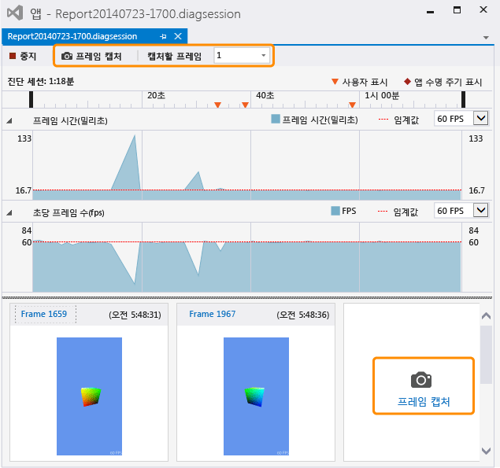

# 그래픽 정보 캡처
[!INCLUDE[vs2017banner](../code-quality/includes/vs2017banner.md)]

Visual Studio Graphics Analyzer를 사용하여 렌더링 문제 및 성능 문제를 진단할 수 있도록 Direct3D 앱에서 그래픽 정보를 캡처합니다.  
  
## 그래픽 정보 캡처  
 그래픽 정보를 캡처하는 과정은 두 단계로 이루어집니다.  먼저 그래픽 진단 모드로 응용 프로그램을 실행하고 세부 정보를 캡처할 하나 이상의 프레임을 지정합니다.  
  
#### 그래픽 진단 모드로 응용 프로그램을 실행하려면  
  
-   메뉴 모음에서 **디버그**, **그래픽**, **진단 시작**을 선택합니다.  \(키보드: Alt\+F5를 누릅니다.\)  
  
-   **그래픽** 도구 모음에서 **진단 시작** 단추를 선택합니다.  
  
 그래픽 진단 모드로 응용 프로그램을 실행하는 동안에는 특정 종류의 그래픽 정보가 항상 캡처됩니다. 여기에는 장치 설정, 스왑 체인의 생성, 그래픽 개체 및 리소스의 생성, 둘 이상의 프레임에 영향을 주는 기타 중요 이벤트가 포함됩니다.  이와 동시에, 특정 프레임에 대한 세부 정보를 캡처할 수 있습니다. 여기에는 그리기 호출, 계산 셰이더 디스패치, Direct3D 개체 및 지원 리소스가 포함됩니다.  
  
#### 프레임을 캡처하려면  
  
-   Visual Studio의 **그래픽** 도구 모음에서 **프레임 캡처** 단추 를 선택합니다.  
  
-   키보드에서 Print Screen 키를 누릅니다.  
  
    > [!NOTE]
    >  **그래픽 진단** 모드로 응용 프로그램이 실행되는 동안에는 Print Screen 키를 그래픽 정보 프레임의 캡처에만 사용할 수 있으며, 일반 기능이 작동하지 않습니다.  이러한 상태는 그래픽 정보 캡처를 중지할 때까지 유지되며, 일반적으로 디버깅 중지 또는 응용 프로그램 정상 종료 시까지 유지됩니다. 이는 다른 응용 프로그램에 포커스가 있더라도 마찬가지입니다.  
  
-   Visual Studio 캡처 인터페이스에서 **진단 세션** 타임라인 위에 있는 **프레임 캡처** 단추를 선택하거나 **초당 프레임 수** 스윔 레인 아래의 이전에 캡처한 프레임 오른쪽에 있는 큰 **프레임 캡처** 단추를 선택합니다.  아래 그림에서는 이 두 단추가 모두 강조 표시되어 있습니다.  
  
       
  
     캡처한 프레임을 검사할 준비가 되면 축소판 이미지 위에 있는 **프레임...** 링크를 따라 이동하거나 미리 보기 이미지를 두 번 클릭하여 **Visual Studio Graphics Analyzer**를 시작합니다.  
  
 전체 프레임만 캡처할 수 있으므로, 캡처를 시작하면 기록된 다음 프레임부터 실제 그래픽 정보입니다.  기록은 캡처를 시작할 때의 프레임이 제시된 직후부터 시작되고 캡처된 프레임이 제시될 때 종료됩니다.  그래픽 진단 모드로 응용 프로그램을 실행하는 동안 원하는 만큼의 프레임을 캡처할 수 있습니다.  아무 프레임도 캡처하지 않으면 그래픽 로그는 삭제됩니다.  
  
 프레임을 캡처하는 동안 Visual Studio에 진단 세션\(.diagsession\) 창이 표시됩니다.  이 창을 닫거나, 디버깅을 중지하거나, 앱을 닫으면 해당 로그에 더 이상 프레임을 캡처할 수 없습니다.  그래픽 정보를 더 캡처하려면 그래픽 진단 모드로 앱을 다시 실행하여 새 진단 세션을 시작해야 합니다.  
  
### 그래픽 진단 캡처 옵션  
 모든 그래픽 이벤트 또는 제한된 하위 집합에 대한 호출 스택을 수집하도록 캡처를 구성하고, 캡처 HUD를 사용하지 않도록 설정하고, 캡처 호환성 모드를 사용하거나 사용하지 않도록 설정할 수 있습니다.  
  
##### 그래픽 진단 캡처 옵션을 구성하려면  
  
1.  메뉴 모음에서 도구, 옵션을 차례로 선택합니다.  옵션 대화 상자가 표시됩니다.  
  
2.  왼쪽의 옵션 범주 목록에서 그래픽 진단을 선택한 다음 원하는 그래픽 진단 옵션을 구성합니다.  
  
     **캡처하는 동안 호출 스택 수집\(캡처 속도가 느려짐\)**  
     호출 스택을 수집하려면 이 확인란을 선택합니다.  기본적으로 호출 스택은 수집되지 않습니다.  호출 스택을 캡처하려면 **캡처 중 호출 스택 수집\(캡처 속도가 느려짐\)** 확인란이 수집 사용으로 설정되어 있는지 확인한 다음 **그리기, 디스패치, 표시 및 perf 마커용** 옵션\(기본값\)을 설정하여 가장 중요한 호출 스택만 수집하거나 **모든 항목용** 옵션을 설정하여 모든 호출 스택을 수집합니다.  나중에 호출 스택 수집을 중지하려면 **캡처 중 호출 스택 수집\(캡처 속도가 느려짐\)** 확인란의 선택을 취소합니다.  
  
     **캡처 중에 게임 내 HUD 사용 안 함**  
     그래픽 진단에서 실행되는 앱에 일반적으로 표시되는 HUD 오버레이를 사용하지 않으려면 이 확인란을 선택합니다.  HUD 오버레이를 표시하려면 확인란 선택을 취소합니다.  
  
     **호환 모드에서 캡처**  
     호환 모드에서 그래픽 정보를 캡처하려면 이 확인란을 선택합니다.  기본적으로는 호환 모드에서 정보를 캡처합니다.  호환 모드에서 Direct3D는 GPU가 기본 기능 수준에 정의된 기능 외의 추가 기능을 지원함을 보고하지 않습니다.  따라서 캡처 대상 CPU의 하드웨어별 확장을 사용하여 앱을 캡처할 수 없으며, 기능 수준이 같거나 더 높은 CPU를 사용하여 그래픽 로그를 재생할 수 있습니다.  호환 모드를 사용하지 않으려면 이 확인란의 선택을 취소합니다. 호환 모드를 사용하지 않도록 설정한 상태에서 캡처한 로그는 캡처 중에 앱에서 사용했던 것과 같은 추가 기능을 지원하지 않는 GPU에서는 재생할 수 없습니다.  
  
     **SDK 레이어 오류가 있는 경우 캡처 중지**  
     오류가 발생하는 경우 캡처를 즉시 중지하려면 이 확인란을 선택합니다.  
  
## 원격으로 그래픽 정보 캡처  
 그래픽 정보는 로컬 컴퓨터, 원격 컴퓨터 또는 원격 장치에서 실행되는 응용 프로그램에서 캡처할 수 있습니다.  원격 캡처는 [!INCLUDE[winblue_client_2](../debugger/includes/winblue_client_2_md.md)] 컴퓨터 및 [!INCLUDE[winblue_winrt_2](../debugger/includes/winblue_winrt_2_md.md)] 장치에서 지원됩니다.  원격으로 실행되는 응용 프로그램에서 그래픽 정보를 캡처하려면 원격 디버깅을 위해 프로젝트를 구성하고 앞에서 설명한 대로 그래픽 진단 모드로 응용 프로그램을 실행합니다.  원격 컴퓨터에서 실행되는 응용 프로그램 및 캡처한 그래픽 정보를 개발 시스템에 기록합니다.  
  
 원격 디버깅을 위한 프로젝트 구성 방법은 개발 중인 응용 프로그램 종류와 사용 중인 프로그래밍 언어의 종류에 따라 달라집니다.  Windows 스토어 앱에 대해 원격 디버깅을 구성하는 방법에 대한 자세한 내용은 [원격 컴퓨터에서 Windows 스토어 앱 실행](../debugger/run-windows-store-apps-on-a-remote-machine.md)를 참조하세요.  Windows 데스크톱 앱에 대해 원격 디버깅을 구성하는 방법에 대한 자세한 내용은 [Visual Studio 프로젝트의 원격 디버깅 설정](../Topic/Set%20Up%20Remote%20Debugging%20for%20a%20Visual%20Studio%20Project.md)을 참조하세요.  
  
 이후에는 정보가 캡처된 위치에 관계없이 원격 컴퓨터 또는 장치를 사용하여 그래픽 정보를 재생할 수 있습니다.  자세한 내용은 [방법: 그래픽 진단 재생 컴퓨터 변경](../debugger/how-to-change-the-graphics-diagnostics-playback-machine.md)을 참조하세요.  
  
## 명령줄에서 그래픽 정보 캡처  
 명령줄 도구를 사용하여 앱에서 그래픽 정보를 캡처할 수 있습니다.  DXCap.exe라는 이 도구를 통해 Visual Studio 또는 프로그래밍 방식 캡처 기능을 사용하지 않고도 그래픽 정보를 빠르게 캡처하고 재생할 수 있습니다.  특히 자동화 수행 시 또는 테스트 환경에서 DXCap.exe를 사용할 수 있습니다.  DXCap.exe에 대한 자세한 내용은 [명령줄 캡처 도구](../debugger/command-line-capture-tool.md)를 참조하세요.  
  
## 참고 항목  
 [연습: 그래픽 정보 캡처](../debugger/walkthrough-capturing-graphics-information.md)