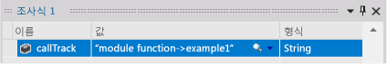
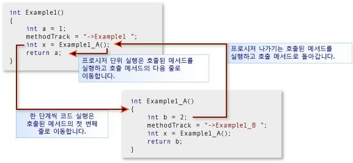
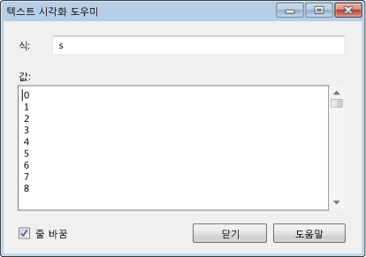
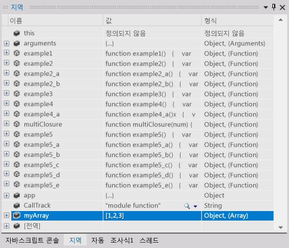
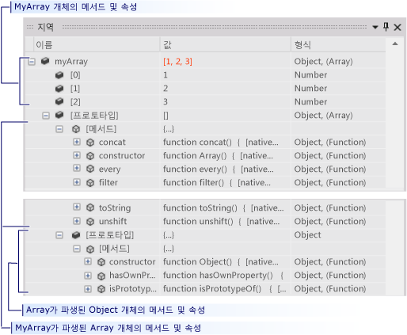
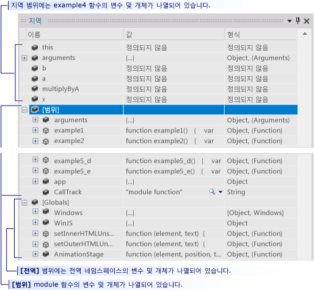
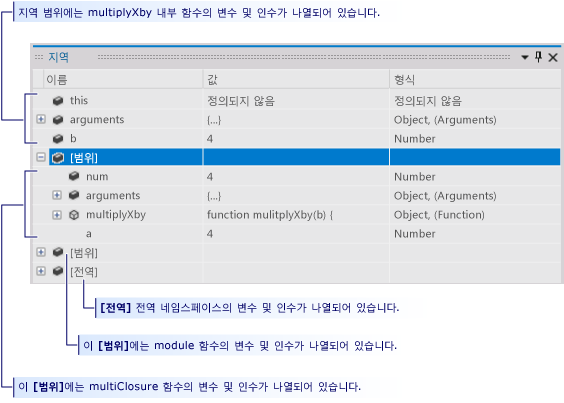
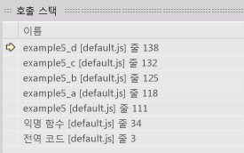

# UWP 앱의 Visual Studio 디버그 세션 (JavaScript)에서 실행 제어
이 빠른 시작에서는 Visual Studio 디버거에서 탐색하는 방법 및 세션에서 프로그램 상태를 보는 방법을 보여 줍니다.  
  
 이 빠른 시작은 처음으로 Visual Studio를 사용하여 디버깅하는 개발자 및 Visual Studio 디버그 세션 탐색에 대해 자세히 알아보려는 개발자를 위한 것이며, 디버깅 자체의 기술에 대해서는 설명하지 않습니다. 샘플 코드의 함수는 이 항목에서 설명하는 디버깅 절차를 보여 주기 위해서만 설계되었습니다. 이 함수는 앱 또는 함수 디자인의 모범 사례를 사용하지 않습니다. 실제로 함수 및 앱 자체가 많은 기능을 수행하지 않는다는 것을 금방 알 수 있습니다.  
  
 이 빠른 시작의 각 섹션은 최대한 독립적으로 설계되었으므로 이미 알고 있는 정보가 포함된 섹션은 건너뛸 수 있습니다. 샘플 앱을 만들 필요도 없습니다. 그러나 샘플 앱을 만들어 프로세스를 최대한 쉽게 만드는 것이 좋습니다.  
  
 **디버거 바로 가기 키** Visual Studio 디버거의 탐색은 마우스와 키보드 둘 다에 맞게 최적화되어 있습니다. 이 항목의 많은 단계에서는 키보드 액셀러레이터 또는 바로 가기 키를 괄호로 묶어 표시합니다. 예를 들어 (키보드: F5)는 F5 키를 입력하면 디버거 실행이 시작되거나 계속됨을 나타냅니다.  
  
> [!NOTE]
>  **모듈 패턴**  
>   
>  UWP 앱은 종종 JavaScript 사용 *모듈 패턴* 를 페이지의 데이터와 함수를 캡슐화 합니다. 모듈 패턴은 자동 실행되는 익명의 단일 클로저를 사용하여 페이지 기능을 전역 네임스페이스와 별도로 유지합니다. 이 항목에서는 해당 함수를 *모듈*이라고 합니다.  
  
## 항목 내용  
 배울 방법:  
  
 [샘플 앱 만들기](#BKMK_Create_the_sample_app)  
  
 [중단점을 설정하고 중단점까지 실행, 함수 한 단계씩 코드 실행 및 프로그램 데이터 검사](#BKMK_Set_and_run_to_a_breakpoint__step_into_a_function__and_examine_program_data)  
  
 [함수 한 단계씩 코드 실행, 프로시저 단위 실행 및 프로시저 나가기](#BKMK_Step_into__over__and_out_of_functions)  
  
 [조건부 중단점 설정, 커서까지 실행 및 변수 시각화](#BKMK_Set_a_conditional_breakpoint__run_to_the_cursor__and_visualize_a_variable)  
  
 [지역 창의 변수 데이터 보기](#BKMK_View_variable_data_in_the_Locals_window)  
  
-   [개체의 변수 데이터 및 프로토타입 체인 보기](#BKMK_View_variable_data_and_the_prototype_chain_of_an_object)  
  
-   [범위 체인 데이터 검사](#BKMK_Examine_scope_chain_data)  
  
 [호출 스택 창을 사용하여 코드로 이동](#BKMK_Navigate_to_code_by_using_the_Call_Stack_window)  
  
##   샘플 앱 만들기  
 디버깅은 코드에 있으므로 샘플 앱은 UWP 앱의 프레임 워크를 사용 하 여 디버그 세션 탐색의 작동 방식 및 프로그램 상태를 검사 하는 방법을 확인할 수 있는 소스 파일을 만들 때에 합니다. 호출하게 될 모든 코드는 default.js 파일의 `module` 함수에서 호출됩니다. 컨트롤이 추가되지 않으며 이벤트도 처리되지 않습니다.  
  
1.  **빈 JavaScript UWP 앱을 만듭니다.** Visual Studio를 엽니다. 홈페이지에서 **새 프로젝트** 링크를 선택합니다. 에 **새 프로젝트** 대화 상자에서 선택 **JavaScript** 에 **설치 됨** 목록을 열고 다음 **Windows 유니버설**합니다. 프로젝트 템플릿 목록에서 선택 **비어 있는 앱 (유니버설 Windows)**합니다. Visual Studio에서 새 솔루션 및 프로젝트를 만들고 코드 편집기에 default.htm 파일을 표시합니다.  
  
     스크립트 파일이 페이지에 로드됩니다.  
  
    -   `base.js` 및 `ui.js` 파일은 **JavaScript용 Windows 라이브러리**를 만듭니다. JavaScript 용 Windows 라이브러리는 JavaScript의 집합을 만들 및 CSS 파일을 쉽게 해 주는 JavaScript를 사용 하 여 UWP 앱. HTML, CSS 및 Windows 런타임과 함께 사용하여 앱을 만듭니다.  
  
    -   코드는 `default.js`  파일에서 시작됩니다.  
  
2.  **default.js 소스 파일을 엽니다.** 솔루션 탐색기에서 **js** 노드를 열고 `default.js`이라고 합니다.  
  
3.  **페이지 내용을 샘플 코드로 바꿉니다.** `default.js` 파일에서 시작됩니다. 이 [Debugger navigation sample code (JavaScript)](../debugger/debugger-navigation-sample-code-javascript.md)링크를 따라 이동한 다음 JavaScript 섹션에 나열된 코드를 클립보드에 복사합니다. (선택 **다시** 브라우저 또는 도움말 뷰어에서이 빠른 시작 페이지로 돌아갑니다.) Visual Studio 편집기에서 코드를 현재 비어 있는 `default.js`에 붙여 넣습니다. **Ctrl+S** 를 선택하여 파일을 저장합니다.  
  
 이제 이 항목의 예제도 함께 수행할 수 있습니다.  
  
##   중단점을 설정하고 중단점까지 실행, 함수 한 단계씩 코드 실행 및 프로그램 데이터 검사  
 디버그 세션을 시작하는 가장 일반적인 방법은 **디버그** 메뉴에서 **디버깅 시작** (키보드: F5)을 선택하는 것입니다. 앱이 시작되고 중단점에 도달하거나, 실행을 수동으로 일시 중단하거나, 예외가 발생하거나, 앱이 종료될 때까지 계속 실행됩니다.  
  
 실행이 디버거에서 일시 중단되면 변수를 마우스로 가리켜 데이터 팁에서 활성 변수의 값을 확인할 수 있습니다.  
  
 앱의 실행을 일시 중단(디버거 중단이라고도 함)한 후 나머지 프로그램 코드가 실행되는 방식을 제어합니다. 한 줄씩 계속하여 함수 호출에서 함수 자체로 이동하거나 호출된 함수를 단일 단계에서 실행할 수 있습니다. 이러한 프로시저를 앱 단계별 실행이라고 합니다. 또한 앱의 표준 실행을 다시 시작하여, 설정된 다음 중단점까지 또는 커서가 있는 줄까지 실행할 수 있습니다. 디버그 세션은 언제든지 중지할 수 있습니다. 디버거는 필요한 정리 작업을 수행하고 실행을 종료하도록 설계되었습니다.  
  
###   예제 1  
 이 예제에서는 사용자 문을 처음 호출할 때 `module` 에서 `default.js` 함수의 본문에 중단점을 설정합니다. 그런 다음 함수를 한 단계씩 실행하고 디버거 데이터 팁에서 변수 값을 확인한 후 디버깅을 중지합니다.  
  
1.  **중단점을 설정합니다.** `app.start()` 호출 직후에 발생되는 `callTrack = "module function";` 문에서 중단점을 설정합니다. 소스 코드 편집기의 음영 처리된 여백에서 줄을 선택합니다(키보드: 줄에 커서를 놓고 **F9** 키 선택).  
  
       
  
     여백에 중단점 아이콘이 나타납니다.  
  
2.  **중단점까지 실행합니다.** **디버그** on the **디버깅 시작** (키보드: F5)을 선택하는 것입니다.  
  
     앱이 실행되기 시작하고 중단점을 설정한 문 바로 앞에서 실행을 일시 중단합니다. 여백에 있는 현재 줄 아이콘은 위치를 식별하고 현재 문이 강조 표시됩니다.  
  
       
  
     이제 앱의 실행을 제어하고 프로그램 문을 단계별로 실행하면서 프로그램 상태를 검사할 수 있습니다.  
  
3.  **함수를 한 단계씩 코드 실행합니다.** On the **디버깅 시작** 메뉴에서 **한 단계씩 코드 실행** 을 선택합니다(키보드: **F11**).  
  
       
  
     디버거가 `example1` 함수를 호출하는 다음 줄로 이동합니다. **한 단계씩 코드 실행** 을 다시 선택합니다. 디버거가 `example1` 함수의 첫 번째 코드 줄로 이동합니다. 강조 표시된 줄은 실행되지 않았지만 함수가 호출 스택에 로드되고 지역 변수에 대한 메모리가 할당되었습니다.  
  
4.  코드 줄을 한 단계씩 코드 실행하면 디버거가 다음 작업 중 하나를 수행합니다.  
  
    -   다음 문이 솔루션의 함수를 호출하지 않을 경우 디버거는 문을 실행하고 다음 문으로 이동한 후 실행을 일시 중단합니다.  
  
    -   문이 솔루션의 함수를 호출할 경우 디버거는 호출된 함수의 첫 번째 줄로 이동한 후 실행을 일시 중단합니다.  
  
     끝내기 점에 도달할 때까지 `example1` 문의 한 단계씩 코드 실행을 계속합니다. 디버거는 함수의 닫는 중괄호를 강조 표시합니다.  
  
5.  **데이터 팁에서 변수 값을 확인합니다.** 끝내기 점에 도달할 때까지 `example1` 문의 한 단계씩 코드 실행을 계속합니다. 디버거는 함수의 닫는 중괄호를 강조 표시합니다. 변수 이름에서 마우스를 일시 중지하면 변수의 이름과 값이 데이터 팁에 표시됩니다.  
  
       
  
6.  **CallTrack 변수에 대한 조사식을 추가합니다.** 함수의 `callTrack` 변수는 빠른 시작 전체에서 예제의 호출된 함수를 표시하는 데 사용됩니다. 변수의 값을 더 쉽게 확인하려면 조사식 창에 추가합니다. 편집기에서 변수 이름을 선택한 다음 바로 가기 메뉴에서 **조사식 추가** 를 선택합니다.  
  
       
  
     조사식 창에서 여러 변수를 조사할 수 있습니다. 데이터 팁 창의 값과 같이 조사 변수의 값은 실행이 일시 중단될 때마다 업데이트됩니다. 조사 변수는 디버그 세션 전체에 저장됩니다.  
  
7.  **디버깅을 중지합니다.** On the **디버깅 시작** 메뉴에서 **디버깅 중지** 을 선택합니다(키보드: **Shift+F5**). 이렇게 하면 디버그 세션이 종료됩니다.  
  
##   함수 한 단계씩 코드 실행, 프로시저 단위 실행 및 프로시저 나가기  
 부모 함수에 의해 호출된 함수를 한 단계씩 코드 실행하는 것과 달리 함수를 프로시저 단위로 실행하면 자식 함수가 실행된 다음 부모가 다시 시작될 때 함수 호출에서 실행이 일시 중단됩니다. 함수 작동 방식을 잘 알고 있고 함수 실행이 조사하고 있는 문제에 영향을 주지 않을 것을 확신하는 경우 함수를 프로시저 단위로 실행할 수 있습니다.  
  
 함수 호출을 포함하지 않는 코드 줄을 프로시저 단위로 실행하면 줄을 한 단계씩 코드 실행하는 것처럼 줄이 실행됩니다.  
  
 자식 함수의 프로시저에서 나가면 함수 실행이 계속된 다음 함수가 호출 함수에 반환한 후에 실행이 일시 중단됩니다. 나머지 함수가 중요하지 않은 것으로 확인된 경우 긴 함수의 프로시저에서 나갈 수 있습니다.  
  
 함수의 프로시저 단위 실행과 프로시저에서 나가지 모두 함수를 실행합니다.  
  
   
  
###   예제 2  
 이 예제에서는 함수의 한 단계씩 코드 실행, 프로시저 단위 실행 및 프로시저 나가기를 수행합니다.  
  
1.  **모듈 함수에서 example2 함수를 호출합니다.** `module` 함수를 편집하고 `var callTrack = "module function"` 다음 줄을 `example2();` 줄로 바꿉니다.  
  
       
  
2.  **중단점까지 실행합니다.** **디버그** on the **디버깅 시작** (키보드: F5)을 선택하는 것입니다. 디버거는 중단점에서 실행을 일시 중단합니다.  
  
3.  **코드 줄을 프로시저 단위로 실행합니다.** On the **디버깅 시작** 메뉴에서 **프로시저 단위 실행** 을 선택합니다(키보드: F10). 디버거는 문을 한 단계씩 코드 실행하는 것과 동일한 방식으로 `var callTrack = "module function"` 문을 실행합니다.  
  
4.  **example2 및 example2_a를 한 단계씩 코드 실행합니다.** **F11** 키를 선택하여 `example2` 함수를 호출하는 다음 줄로 이동합니다. `example2` 줄에 도달할 때까지 `var x = example2_a();`문을 계속 한 단계씩 코드 실행합니다. 다시 이 줄을 한 단계씩 코드 실행하여 `example2_a`의 진입점으로 이동합니다. `example2_a` 로 돌아갈 때까지 `example2`의 각 문을 계속 한 단계씩 코드 실행합니다.  
  
       
  
5.  **함수를 프로시저 단위로 실행합니다.** `example2`의 다음 줄 `var y = example2_a();` 는 기본적으로 이전 줄과 동일합니다. 이 줄을 안전하게 프로시저 단위로 실행합니다. **F10** 키를 선택하여 `example2` 의 다시 계속에서 `example2_a`의 이 두 번째 호출로 이동합니다. `callTrack` 문자열은 `example2_a` 함수가 두 번 실행되었음을 나타냅니다.  
  
6.  **함수의 프로시저에서 나갑니다.** **F11** 키를 선택하여 `example2_b` 함수를 호출하는 다음 줄로 이동합니다. `example2_b` 는 `example2_a`와 크게 다르지 않습니다. 함수의 프로시저에서 나가려면 **디버그** 메뉴에서 **프로시저 나가기** (키보드: **Shift+F11**)를 선택합니다. `callTrack` 변수는 `example2_b` 가 실행되었으며, `example2` 가 다시 시작되는 지점으로 디버거가 돌아갔음을 나타냅니다.  
  
7.  **디버깅을 중지합니다.** On the **디버깅 시작** 메뉴에서 **디버깅 중지** 을 선택합니다(키보드: **Shift+F5**). 이렇게 하면 디버그 세션이 종료됩니다.  
  
##   조건부 중단점 설정, 커서까지 실행 및 변수 시각화  
 조건부 중단점은 디버거가 실행을 일시 중단하도록 하는 조건을 지정합니다. 조건은 true 또는 false로 평가될 수 있는 모든 코드 식으로 지정됩니다. 예를 들어 조건부 중단점을 사용하면 변수가 특정 값에 도달하는 경우에만 자주 호출되는 함수에서 프로그램 상태를 검사할 수 있습니다.  
  
 커서까지 실행은 일회용 중단점 설정과 유사합니다. 실행이 일시 중단되면 소스에서 줄을 선택하고 선택한 줄에 도달할 때까지 실행을 다시 시작할 수 있습니다. 예를 들어 함수의 루프를 단계별로 실행하고 루프의 코드가 올바르게 수행되고 있는지 확인할 수 있습니다. 루프의 모든 반복을 단계별로 실행하는 대신 루프가 실행된 후에 배치되는 커서까지 실행할 수 있습니다.  
  
 경우에 따라 데이터 팁 또는 다른 데이터 창의 행에서 변수 값을 확인하기가 어려울 수 있습니다. 디버거는 스크롤 가능한 창에서 값의 서식이 지정된 보기를 표시하는 텍스트 시각화 도우미에 문자열, HTML 및 Xml을 표시할 수 있습니다.  
  
###   예제 3  
 이 예제에서는 조건부 중단점을 설정하여 루프의 특정 반복에서 중단한 다음 루프 후 배치되는 커서까지 실행합니다. 또한 텍스트 시각화 도우미에서 변수의 값을 확인합니다.  
  
1.  **모듈 함수에서 example3 함수를 호출합니다.** `module` 함수를 편집하고 `var callTrack = "module function";` 다음 줄을 `example3();` 줄로 바꿉니다.  
  
       
  
2.  **중단점까지 실행합니다.** **디버그** on the **디버깅 시작** (키보드: **F5**). 디버거가 `module` 함수의 중단점에서 실행을 일시 중단합니다.  
  
3.  **example3 함수를 한 단계씩 코드 실행합니다.** 바로 가기 메뉴에서 **한 단계씩 코드 실행** 메뉴에서 **디버깅 시작** (키보드: **F11**)을 선택하여 `example3` 함수를 호출하는 다음 줄로 이동합니다. `for` 블록의 루프 하나 또는 두 개를 반복할 때까지 함수를 계속 한 단계씩 코드 실행합니다. 1000개 루프를 모두 단계별로 실행하려면 시간이 오래 걸릴 수 있습니다.  
  
4.  **조건부 중단점을 설정합니다.** 코드 창의 왼쪽 여백에서 `s += i.toString() + "\n";` 줄을 마우스 오른쪽 단추로 클릭한 다음 바로 가기 메뉴에서 **조건** 을 선택합니다.  
  
     **조건** 확인란을 선택한 다음 텍스트 상자에 `i == 500;` 을 입력합니다. **참인 경우** 옵션을 선택하고 **확인**을 선택합니다. 중단점을 사용하면 `for` 루프의 500번째 반복에서 값을 확인할 수 있습니다. 조건부 중단점 아이콘은 해당 흰색 십자 표시로 식별할 수 있습니다.  
  
       
  
5.  **중단점까지 실행합니다.** On the **디버깅 시작** 메뉴에서 **계속** 을 선택합니다(키보드: **F5**). `i` 에서 일시 중지하여 `i` 의 현재 값이 500인지 확인합니다. 또한 `s` 변수는 한 줄로 표시되고 데이터 팁 창보다 훨씬 더 깁니다.  
  
6.  **문자열 변수를 시각화합니다.** `s`의 데이터 팁에서 돋보기 아이콘을 클릭합니다.  
  
     텍스트 시각화 도우미 창이 나타나고 문자열의 값이 여러 줄로 된 문자열로 표시됩니다.  
  
       
  
7.  **커서까지 실행합니다.** `callTrack += "->example3";` 줄을 마우스 오른쪽 단추로 클릭한 다음 바로 가기 메뉴에서 **커서까지 실행** (키보드: **Ctrl+F10**). 디버거가 루프 반복을 완료하고 줄에서 실행을 일시 중단합니다.  
  
8.  **디버깅을 중지합니다.** On the **디버깅 시작** 메뉴에서 **디버깅 중지** 을 선택합니다(키보드: **Shift+F5**). 이렇게 하면 디버그 세션이 종료됩니다.  
  
###   커서까지 실행을 사용하여 코드로 돌아가 중단점 삭제  
 커서까지 실행은 Microsoft 또는 타사에서 제공하는 라이브러리 코드를 한 단계씩 코드 실행할 때 매우 유용할 수 있습니다. 라이브러리 코드를 단계별로 실행하면 정보를 충분히 얻을 수 있지만 종종 시간이 오래 걸릴 수 있습니다. 일반적으로 사용자는 사용자 고유의 코드에 훨씬 더 많은 관심을 보입니다. 이 연습에서는 이 작업을 수행하는 방법을 보여 줍니다.  
  
1.  **app.start 호출에 중단점을 설정합니다.** In the `module` 함수의 `app.start()`  
  
2.  **중단점까지 실행하고 라이브러리 함수를 한 단계씩 코드 실행합니다.**  
  
     `app.start()`를 한 단계씩 코드 실행하면 편집기에는 `base.js`에 코드가 표시됩니다. 몇 줄을 더 한 단계씩 코드 실행합니다.  
  
3.  **함수를 프로시저 단위로 실행하고 프로시저에서 나갑니다.** **F10**F10**SHIFT+F11**Shift+F11 `base.js`) 시작 함수의 복잡성 및 길이 검사가 수행하려는 작업이 아니라는 결론에 도달할 수 있습니다.  
  
4.  **커서를 코드로 설정하고 커서까지 실행합니다.** 코드 편집기에서 `default.js` 파일로 다시 전환합니다. `app.start()` 다음 첫 번째 코드 줄을 선택합니다. 주석이나 빈 줄까지 실행할 수는 없습니다. 바로 가기 메뉴에서 **커서까지 실행** 을 선택합니다. 디버거는 app.start 함수의 실행을 계속하고 중단점에서 실행을 일시 중단합니다.  
  
##   지역 창의 변수 데이터 보기  
 지역 창은 현재 실행 중인 함수의 범위 체인에 있는 매개 변수 및 변수의 트리 뷰입니다.  
  
###   개체의 변수 데이터 및 프로토타입 체인 보기  
  
1.  **배열 개체를 모듈 함수에 추가합니다.** `module` 함수를 편집하고 `var callTrack = "module function"` 다음 줄을 `var myArray = new Array(1, 2, 3);` 줄로 바꿉니다.  
  
       
  
2.  **중단점까지 실행합니다.** **디버그** on the **디버깅 시작** (키보드: **F5**). 디버거는 중단점에서 실행을 일시 중단합니다. 줄을 한 단계씩 코드 실행합니다.  
  
3.  **지역 창을 엽니다.** On the **디버깅 시작** 메뉴에서 **창**을 가리킨 다음 **지역**이라고 합니다. (키보드: Alt + 4).  
  
4.  **모듈 함수에서 지역 변수 검사** 지역 창에서는 현재 실행 중인 함수( `module` 함수)의 변수가 트리의 최상위 노드로 표시됩니다. 함수를 입력하면 JavaScript에서 모든 변수를 만들고 `undefined`값을 지정합니다. 함수에 정의된 함수는 해당 텍스트를 값으로 사용합니다.  
  
       
  
5.  **callTrack 및 myArray 정의를 단계별로 실행합니다.** 지역 창에서 callTrack 및 myArray 변수를 찾습니다. 두 정의를 프로시저 단위로 실행(**F10**)하면 **값** 및 **형식** 필드가 변경됩니다. 지역 창에서 마지막 중단 이후 변경된 변수의 값이 강조 표시됩니다.  
  
6.  **myArray 개체 검사** `myArray` 변수를 확장합니다. 배열의 각 요소가 나열됩니다. **[prototype]** 노드에는 `Array` 개체의 상속 계층 구조가 포함됩니다. 이 노드를 확장합니다.  
  
       
  
    -   **Methods** 노드에는 `Array` 개체의 모든 메서드가 나열됩니다.  
  
    -   **[prototype]** 노드에는 `Object` 가 파생되는 `Array` 개체의 프로토타입이 포함됩니다. **[prototype]** 노드는 재귀적일 수 있습니다. 개체 계층 구조에서 각 부모 개체는 해당 자식의 **[prototype]** 노드에 설명되어 있습니다.  
  
7.  **디버깅을 중지합니다.** On the **디버깅 시작** 메뉴에서 **디버깅 중지** 를 선택합니다(키보드: F5). 이렇게 하면 디버그 세션이 종료됩니다.  
  
##   범위 체인 데이터 검사  
 함수의 *범위 체인* 에는 활성 상태이고 함수에서 연결할 수 있는 모든 변수가 포함됩니다. 전역 변수는 현재 실행 중인 함수를 정의하는 함수에 정의된 모든 개체(함수 포함)이므로 범위 체인의 일부입니다. 예를 들어 `callTrack` 의 `module` 함수에 정의된 `default.js` 변수는 `module` 함수에 정의된 모든 함수에서 연결할 수 있습니다. 각 범위는 지역 창에 별도로 나열됩니다.  
  
-   현재 실행 중인 함수의 변수는 창의 맨 위에 나열됩니다.  
  
-   범위 체인에 있는 각 함수 범위의 변수는 함수에 대한 **[Scope]** 노드 아래에 나열됩니다. 범위 함수는 체인에서의 순서에 따라 현재 함수를 정의하는 함수에서 체인의 가장 바깥쪽 함수순으로 나열됩니다.  
  
-   **[Globals]** 노드에는 함수 외부에 정의된 전역 개체가 나열됩니다.  
  
 범위 체인은 혼동될 수 있으며 예제를 통해 가장 잘 확인할 수 있습니다. 다음 예제에서는 `module` 함수에서 고유한 범위를 만드는 방법 및 클로저를 만들어 또 다른 수준의 범위를 만드는 방법을 확인할 수 있습니다.  
  
###   예제 4  
  
1.  **모듈 함수에서 example4 함수를 호출합니다.** `module` 함수를 편집하고 `var callTrack = "module function"` 다음 줄을 `example4()` 줄로 바꿉니다.  
  
       
  
2.  **중단점까지 실행합니다.** **디버그** on the **디버깅 시작** (키보드: **F5**). 디버거는 중단점에서 실행을 일시 중단합니다.  
  
3.  **지역 창을 엽니다.** 필요한 경우 **디버깅 시작** 메뉴에서 **창**을 가리킨 다음 **지역**이라고 합니다. (키보드: **Alt+4**). 창에 `module` 함수의 모든 변수 및 함수가 나열되고 **[Globals]** 노드도 포함됩니다.  
  
4.  **전역 변수를 검사합니다.** 지역 창에서 **[Globals]** 노드도 포함됩니다. 전역의 개체 및 변수는 JavaScript용 Windows 라이브러리에서 설정되었습니다. 전역 범위에 고유한 변수를 추가할 수 있습니다.  
  
5.  **example4를 한 단계씩 코드 실행하고 지역 및 범위 변수 검사** **함수를 한 단계씩 코드 실행(키보드:**F11 `example4` )합니다. `example4` 는 `module` 함수에 정의되어 있으므로 `module` 함수가 부모 범위가 됩니다. `example4` 에서 `module` 함수의 모든 함수를 호출하고 해당 변수에 액세스할 수 있습니다. 지역 창에서 **[Scope]** 노드를 확장하고 동일한 항목과 `module` 함수의 변수가 포함되어 있는지 확인합니다.  
  
       
  
6.  **example4_a를 한 단계씩 코드 실행하고 지역 및 범위 변수 검사** `example4` 를 계속 한 단계씩 코드 실행하고 `example4_a`를 호출합니다. 이제 지역 변수는 `example4_a`에서 제공되고 **[Scope]** 노드는 `module` 함수의 변수를 계속 유지합니다. `example4` 의 변수가 활성인 경우에도 `example4_a` 에서 연결할 수 없으며 더 이상 범위 체인의 일부가 아닙니다.  
  
7.  **multipyByA를 한 단계씩 코드 실행하고 지역 및 범위 변수 검사** 나머지 `example4_a` 를 단계별로 실행하고 `var x = multilpyByA(b);`줄을 한 단계씩 코드 실행합니다.  
  
     함수 변수 `multipyByA` 가 `multiplyClosure` 클로저 *인*함수로 설정되었습니다. `multipyClosure` 는 내부 함수 `mulitplyXby`를 정의하고 반환하며 해당 매개 변수 및 변수를 캡처(포함)합니다. 클로저에서, 반환된 내부 함수는 외부 함수의 데이터에 액세스할 수 있으므로 고유한 수준의 범위를 만듭니다.  
  
     `var x = multilpyByA(b);`를 한 단계씩 코드 실행하면 `return a * b;` 내부 함수의 `mulitplyXby` 줄로 이동합니다.  
  
8.  지역 창에서는 `b` 매개 변수만 지역 변수로 `multiplyXby`에 나열되지만 새 **[Scope]** 수준이 추가되었습니다. 이 노드를 확장하면 `multiplyClosure`의 첫 번째 줄에서 호출된 `a` 변수를 포함하여 `multiplyXby`의 매개 변수, 함수 및 변수가 포함되어 있는 것을 확인할 수 있습니다. 두 번째 **[Scope]** 노드를 신속하게 확인하면 모듈 함수 변수가 표시되며, `multiplyXby` 에서 그 다음 줄에 액세스합니다.  
  
       
  
9. **디버깅을 중지합니다.** On the **디버깅 시작** 메뉴에서 **디버깅 중지** 을 선택합니다(키보드: **Shift+F5**). 이렇게 하면 디버그 세션이 종료됩니다.  
  
##   호출 스택 창을 사용하여 코드로 이동  
 호출 스택은 응용 프로그램의 현재 스레드에서 실행되고 있는 함수에 대한 정보를 포함하는 데이터 구조입니다. 중단점에 도달하면 호출 스택 창에는 스택에서 활성 상태인 모든 함수 목록이 표시됩니다. 현재 실행 중인 함수가 호출 스택 창 목록의 맨 위에 있습니다. 스레드를 시작하는 함수는 목록의 맨 아래에 있습니다. 사이에 있는 함수는 시작하는 함수부터 현재 함수까지의 호출 경로를 보여 줍니다.  
  
 호출 스택 창을 사용하면 현재 실행 중인 함수의 호출 경로를 표시할 뿐만 아니라 코드 편집기에서 코드로 이동할 수도 있습니다. 이 기능은 여러 파일을 사용하여 작업할 때 특정 함수로 신속하게 이동하려는 경우 유용할 수 있습니다.  
  
###   예제 5  
 이 예제에서는 5개의 사용자 정의 함수를 포함하는 호출 경로를 한 단계씩 코드 실행합니다.  
  
1.  **모듈 함수에서 example5 함수를 호출합니다.** `module` 함수를 편집하고 `var callTrack = "module function";` 다음 줄을 `example5();` 줄로 바꿉니다.  
  
       
  
2.  **중단점까지 실행합니다.** **디버그** on the **디버깅 시작** (키보드: **F5**). 디버거가 모듈 함수의 중단점에서 실행을 일시 중단합니다.  
  
3.  **호출 스택 창을 엽니다.** On the **디버깅 시작** 메뉴에서 **창**을 가리킨 다음 **호출 스택** (키보드: Alt+7)을 선택합니다. 호출 스택 창에 다음 두 함수가 표시됩니다.  
  
    -   **전역 코드** 는 호출 스택의 맨 아래에 있는 `module` 함수의 진입점입니다.  
  
    -   **익명 함수** 는 `module` 함수에서 실행이 일시 중단된 줄을 표시합니다. 호출 스택의 맨 위입니다.  
  
4.  **example5_d 함수에 도달할 때까지 함수를 한 단계씩 코드 실행합니다.** 바로 가기 메뉴에서 **한 단계씩 코드 실행** 메뉴에서 **디버깅 시작** (키보드: **F11**)을 선택하여 example5_d 함수의 진입점에 도달할 때까지 호출 경로에서 호출을 실행합니다. 함수에서 함수를 호출할 때마다 호출 함수의 줄 번호가 저장되고 호출된 함수는 스택의 맨 위에 배치됩니다. 호출 함수의 줄 번호는 호출 함수가 실행을 일시 중단한 지점입니다. 노란색 화살표는 현재 실행 중인 함수를 가리킵니다.  
  
       
  
5.  **호출 스택 창을 사용하여 example5_a 코드로 이동하고 중단점을 설정합니다.** 호출 스택 창에서 `example5_a` 목록 항목을 선택한 다음 바로 가기 메뉴에서 **소스로 이동** 을 선택합니다. 코드 편집기는 함수의 반환 줄에서 해당 커서를 설정합니다. 이 줄에 중단점을 설정합니다. 현재 실행 줄이 변경되지 않습니다. 편집기 커서만 이동했습니다.  
  
6.  **함수로 한 단계씩 코드 실행한 다음 중단점까지 실행합니다.** `example5_d`를 계속 한 단계씩 코드 실행합니다. 사용자가 함수에서 돌아오면 해당 함수는 호출 스택을 벗어납니다. **F5** 키를 눌러 프로그램 실행을 계속합니다. 이전 단계에서 만든 중단점에서 중지합니다.  
  
7.  **디버깅을 중지합니다.** On the **디버깅 시작** 메뉴에서 **디버깅 중지** 을 선택합니다(키보드: **Shift+F5**). 이렇게 하면 디버그 세션이 종료됩니다.  
  
## 참고 항목  
 [(JavaScript) 디버그 세션 시작](../debugger/start-a-debugging-session-for-store-apps-in-visual-studio-javascript.md)   
 [빠른 시작: 디버거 탐색 (JavaScript)](../debugger/control-execution-of-a-store-app-in-a-visual-studio-debug-session-for-windows-store-apps-javascript.md)   
 [빠른 시작: HTML 및 CSS 디버그](../debugger/quickstart-debug-html-and-css.md)   
 [트리거 일시 중단, 다시 시작 및 백그라운드 이벤트를 UWP 앱 용)](../debugger/how-to-trigger-suspend-resume-and-background-events-for-windows-store-apps-in-visual-studio.md)   
 [Visual Studio에서 앱 디버깅](../debugger/debug-store-apps-in-visual-studio.md)
