# 네이티브 개체의 사용자 지정 뷰 만들기
[!INCLUDE[vs2017banner](../code-quality/includes/vs2017banner.md)]

Visual Studio Natvis 프레임워크를 사용하면 Visual Studio에서 **조사식**, **지역**, **데이터 팁** 창 같은 디버거 변수 창에 네이티브 형식을 표시하는 방법을 사용자 지정할 수 있습니다.  
  
 Natvis는 이전 버전의 Visual Studio에서 사용된 **autoexp.dat** 파일을 대체하며 XML 구문, 보다 효과적인 진단 기능, 버전 관리 기능, 다중 파일 지원을 제공합니다.  
  
> [!NOTE]
>  다음과 같은 경우에는 Natvis 프레임워크를 시각화에 사용할 수 없습니다.  
>   
>  -   디버거 형식이 **혼합**으로 설정된 C\+\+ Windows 데스크톱 프로젝트를 디버그하고 있습니다.  
> -   관리되는 호환성 모드\(**도구 \/ 옵션 \/ 디버깅 \/ 일반 \/ 관리되는 호환성 모드**\)로 Windows 데스크톱 응용 프로그램에서 혼합 모드 디버깅을 수행하고 있습니다.  
> -   기본 호환성 모드\(**도구 \/ 옵션 \/ 디버깅 \/ 일반 \/ 기본 호환성 모드**\)로 Windows 데스크톱 응용 프로그램에서 디버그하고 있습니다.  
  
##  <a name="BKMK_Why_create_visualizations_"></a> Natvis 시각화를 만드는 이유는 무엇인가요?  
 만든 형식에 대한 시각화 규칙을 Natvis 프레임워크를 사용하여 만들면 개발자가 디버그 중 형식을 쉽게 확인할 수 있습니다.  
  
 예를 들어 아래 이미지에는 사용자 지정 시각화가 적용되지 않은 상태로 디버거에 표시되는 [Windows::UI::Xaml::Controls::TextBox](http://go.microsoft.com/fwlink/?LinkId=258422) 형식의 변수가 나와 있습니다.  
  
 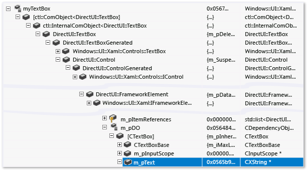  
  
 강조 표시된 행은 `TextBox` 클래스의 `Text` 속성을 보여 줍니다. 복잡한 클래스 계층 구조를 사용하면 값을 찾는 것이 어렵습니다. 그뿐 아니라 디버거에서는 개체에 사용되는 사용자 지정 문자열 형식을 해석할 수 없기 때문에 텍스트 상자 내에 들어 있는 문자열을 확인할 수 없습니다.  
  
 사용자 지정 시각화 규칙을 적용하면 동일한 `TextBox`가 변수 창에서 훨씬 간단하게 표시됩니다. 클래스의 중요한 멤버를 모두 한꺼번에 확인할 수 있으며 디버거에서는 사용자 지정 문자열 형식의 기본 문자열 값을 표시합니다.  
  
   
  
##  <a name="BKMK_Using_Natvis_files"></a> Natvis 파일 사용  
 natvis 파일은 확장명이 .natvis인 XML 파일입니다. 스키마는 **%VSINSTALLDIR%\\Xml\\Schemas\\natvis.xsd**에 정의됩니다.  
  
 .natvis 파일의 기본 구조는 하나 이상의 `Type` 요소로 이루어져 있으며, 각각의 `Type` 요소는 정규화된 이름이 `Name` 특성에 지정된 형식에 대한 시각화 항목을 나타냅니다.  
  
```xml  
  
<?xml version="1.0" encoding="utf-8"?> <AutoVisualizer xmlns="http://schemas.microsoft.com/vstudio/debugger/natvis/2010"> <Type Name="MyNamespace::CFoo"> . . </Type> <Type Name="..."> . . </Type> </AutoVisualizer>  
```  
  
 Visual Studio의 경우 몇 개의 .natvis 파일이 **%VSINSTALLDIR%\\Common7\\Packages\\Debugger\\Visualizers** 폴더에 제공됩니다. 이러한 파일은 많은 공통 형식에 대한 시각화 규칙을 포함하고, 새 형식에 대한 시각화를 작성할 때 예로 활용할 수 있습니다.  
  
## 프로젝트에 .natvis 파일 추가  
 C\+\+ 프로젝트에 .natvis 파일을 추가할 수 있습니다.  
  
 새 .natvis 파일을 추가하려면 열려 있는 C\+\+ 프로젝트의 **솔루션 탐색기**에서 프로젝트 노드를 선택하고 **추가 \/ 새 항목 \/ Visual C\+\+ \/ 유틸리티 \/ 디버거 시각화 파일\(.natvis\)**을 클릭합니다. 디버거가 C\+\+ 프로젝트에서 자동으로 Natvis 파일을 로드합니다. 기본적으로 프로젝트의 Natvis 파일이 프로젝트에서 빌드한 .pdb 파일에 삽입됩니다. 즉, 이 프로젝트에서 빌드한 이진을 디버그하는 경우 프로젝트가 열려 있지 않아도 디버거가 .pdb에서 Natvis 파일을 로드합니다.  .natvis 파일을 .pdb에 포함하지 않으려면 **솔루션 탐색기**에서 .natvis 파일을 마우스 오른쪽 단추로 클릭하고 **구성 속성** 창에서 **빌드에서 제외**를 **예**로 설정합니다.  
  
 Natvis 파일은 Visual Studio를 사용하여 편집하는 것이 좋습니다. 디버그하는 동안 변경된 내용은 파일을 저장하면 자동으로 적용됩니다. 또한 IntelliSense의 편집 환경이 개선되었습니다.  
  
 .pdb에서 로드되는 Natvis 파일은 pdb가 참조하는 모듈의 형식에만 적용됩니다. 예를 들어 Module1.pdb가 이름이 `Test`인 형식의 항목을 정의하는 경우 이 항목은 Module1.dll의 **Test** 클래스에만 적용됩니다. 다른 모듈이 이름이 **Test**인 클래스를 정의하는 경우 Module1.pdb의 natvis 항목은 이 클래스에 적용되지 않습니다.  
  
##  <a name="BKMK_natvis_location"></a> .natvis 파일 배포  
 .natvis 파일이 Visual Studio 프로젝트에서 만든 형식에만 적용되는 경우 어떤 작업도 수행할 필요가 없습니다. .natvis는 .pdb에 포함되어 있습니다. 그러나 .natvis 파일을 여러 프로젝트에 적용하려는 경우에는 .natvis 파일을 사용자 디렉터리 또는 시스템 디렉터리에 추가합니다.  
  
 .natvis 파일이 평가되는 순서는 다음과 같습니다.  
  
1.  디버그 중인 .pdb에 포함된 .natvis 파일\(로드된 프로젝트에 동일한 이름의 파일이 없는 경우\)  
  
2.  로드된 C\+\+ 프로젝트 또는 최상위 솔루션 항목에 속하는 .natvis 파일 여기에는 클래스 라이브러리를 포함하여 로드된 모든 C\+\+ 프로젝트가 포함되지만 다른 언어의 프로젝트는 포함되지 않습니다\(예: C\# 프로젝트에서 .natvis 파일을 로드할 수 없음\). 실행 파일 프로젝트의 경우 사용 가능한 C\+\+ 프로젝트가 없으므로 .pdb에 아직 없는 모든 .natvis 파일을 호스트하는 솔루션 항목을 사용해야 합니다.  
  
3.  사용자별 natvis 디렉터리\(**%USERPROFILE%\\My Documents\\Visual Studio 2015\\Visualizers**  
  
4.  시스템 차원 Natvis 디렉터리\(**%VSINSTALLDIR%\\Common7\\Packages\\Debugger\\Visualizers**\). Visual Studio와 함께 설치되는 .natvis 파일이 복사되는 위치입니다. 관리자 권한이 있는 경우 이 디렉터리에 다른 파일을 추가할 수 있습니다.  
  
## 디버그하는 동안 .natvis 파일 수정  
 .natvis 파일이 포함된 프로젝트를 디버그하는 동안 IDE에서 .natvis 파일을 수정할 수 있습니다. IDE\(디버그하는 Visual Studio의 동일한 인스턴스 사용\)에서 파일을 열고 수정하고 저장합니다. 파일이 저장되면 **조사식** 및 **지역** 창이 변경 내용을 반영하도록 업데이트되어야 합니다. IDE 외부에서 .nativs 파일을 수정하면 변경 내용이 자동으로 적용되지 않습니다. 창을 업데이트하려면 **조사식** 창에서 **.natvisreload** 명령을 평가하면 됩니다. 이렇게 하면 디버그 세션을 다시 시작하지 않아도 변경 내용이 적용됩니다.  
  
 디버그하는 솔루션에 .natvis 파일을 추가 또는 삭제할 수 있으며 Visual Studio가 관련 시각화 요소를 추가 또는 제거합니다.  
  
 .natvis 파일이 .pdb에 포함된 경우 디버그하는 동안 수정할 수 없습니다.  
  
 natvis 파일을 새 버전\(예: 소스 제어에 체크 인되고 다른 사용자가 파일에 최근 변경한 내용을 적용하려는 경우\)으로 업그레이드하는 경우 **.natvisreload** 명령을 사용합니다. natvis 파일은 Visual Studio xml 편집기를 사용하여 편집하는 것이 좋습니다.  
  
##  <a name="BKMK_Expressions_and_formatting"></a> 식 및 형식 지정  
 Natvis 시각화에서는 C\+\+ 식을 사용하여 표시할 데이터 항목을 지정합니다.[컨텍스트 연산자\(C\+\+\)](../debugger/context-operator-cpp.md)에 설명된 디버거에서의 C\+\+ 식과 관련된 개선 및 제한 사항 외에도 다음과 같은 차이를 인지하고 있어야 합니다.  
  
-   Natvis 식은 현재 스택 프레임이 아닌 시각화되는 개체의 컨텍스트에서 평가됩니다. 예를 들어 Natvis 식에 `x`를 사용하는 경우 이는 현재 실행되는 함수의 `x`라는 지역 변수가 아니라 시각화되는 개체의 `x`라는 필드를 나타냅니다. Natvis 식 내의 지역 변수에는 액세스할 수 없지만 전역 변수에는 액세스할 수 있습니다.  
  
-   Natvis 식에서는 함수 평가 또는 부작용이 허용되지 않습니다. 따라서 함수 호출 및 할당 연산자가 무시됩니다.[디버거 내장 함수](../debugger/expressions-in-the-debugger.md#BKMK_Using_debugger_intrinisic_functions_to_maintain_state)는 부작용이 발생하지 않기 때문에 다른 함수 호출이 금지되어 있더라도 어떤 Natvis 식에서든 자유롭게 호출할 수 있습니다.  
  
 변수 창에 식이 표시되는 방식을 제어하려면 [C\+\+의 형식 지정자](../debugger/format-specifiers-in-cpp.md) 항목의 [형식 지정자](../debugger/format-specifiers-in-cpp.md#BKMK_Visual_Studio_2012_format_specifiers) 섹션에 설명된 형식 지정자를 사용하면 됩니다.[ArrayItems 확장](../debugger/create-custom-views-of-native-objects.md#BKMK_ArrayItems_expansion)의 `Size` 식 같은 가상화 항목이 Natvis 내부에서 사용되는 경우에는 형식 지정자가 무시됩니다.  
  
## Natvis 뷰  
 Natvis 뷰를 통해 모든 형식을 두 가지 이상의 방법으로 볼 수 있습니다. 예를 들어 **simple**이라는 뷰를 정의하여 단순화된 형식의 뷰를 제공할 수 있습니다. 예를 들어 `std::vector`의 시각화는 다음과 같습니다.  
  
```xml  
<Type Name="std::vector<*>"> <DisplayString>{{ size={_Mylast - _Myfirst} }}</DisplayString> <Expand> <Item Name="[size]" ExcludeView="simple">_Mylast - _Myfirst</Item> <Item Name="[capacity]" ExcludeView="simple">_Myend - _Myfirst</Item> <ArrayItems> <Size>_Mylast - _Myfirst</Size> <ValuePointer>_Myfirst</ValuePointer> </ArrayItems> </Expand> </Type>  
```  
  
 `DisplayString` 및 `ArrayItems` 요소는 기본 뷰와 simple 뷰에서 사용되는 반면 `[size]` 및 `[capacity]` 항목은 simple 뷰에서 제외됩니다.**,view** 형식 지정자를 사용하여 대체 뷰를 지정할 수 있습니다.**조사식** 창에서 **vec,view\(simple\)**로 simple 뷰를 지정합니다.  
  
   
  
##  <a name="BKMK_Diagnosing_Natvis_errors"></a> Natvis 오류 진단  
 구문 분석 오류 문제 해결에 Natvis 진단을 사용할 수 있습니다. 시각화 항목에서 오류가 발생하면 디버거는 오류를 무시하고 형식을 원시 형식으로 표시하거나 적합한 다른 시각화를 선택합니다. 특정 시각화 항목이 무시된 이유를 파악하고 발생한 기본 오류를 확인하려면 Natvis 진단 **도구 \/ 옵션 \/ 디버깅 \/ 출력 창 \/ Natvis 진단 메시지\(C\+\+만 해당\)** 옵션을 켜면 됩니다. 오류가 **출력** 창에 표시됩니다.  
  
##  <a name="BKMK_Syntax_reference"></a> Natvis 구문 참조  
  
###  <a name="BKMK_AutoVisualizer"></a> AutoVisualizer 요소  
 `AutoVisualizer`  요소는 .natvis 파일의 루트 노드이며 네임스페이스 `xmlns:` 특성을 포함합니다.  
  
```xml  
<?xml version="1.0" encoding="utf-8"?> <AutoVisualizer xmlns="http://schemas.microsoft.com/vstudio/debugger/natvis/2010"> . . </AutoVisualizer>  
```  
  
###  <a name="BKMK_Type"></a> Type 요소  
 기본 Type은 다음과 같습니다.  
  
```xml  
<Type Name="[fully qualified type name]"> <DisplayString Condition="[Boolean expression]">[Display value]</DisplayString> <Expand> ... </Expand> </Type>  
  
```  
  
 다음을 지정합니다.  
  
1.  이 시각화가 사용되는 대상 형식\(`Type Name` 특성\).  
  
2.  이 형식의 개체 값이 표시되는 모양\(`DisplayString` 요소\)  
  
3.  사용자가 변수 창에서 확장할 경우 형식 멤버가 표시되는 모양\(`Expand` 노드\)  
  
 **템플릿 클래스** `Type` 요소의 `Name` 특성은 별표 `*`를 템플릿 클래스 이름에 사용할 수 있는 와일드카드 문자로 허용합니다.  
  
```xml  
<Type Name="ATL::CAtlArray<*>"> <DisplayString>{{Count = {m_nSize}}}</DisplayString> </Type>  
  
```  
  
 이 예에서는 개체가 `CAtlArray<int>`이든 아니면 `CAtlArray<float>`이든 관계없이 동일한 시각화가 사용됩니다.`CAtlArray<float>`에 대한 특정 시각화 항목이 있으면 일반적인 시각화 항목보다 우선하게 됩니다.  
  
 템플릿 매개 변수는 매크로 $T1, $T2 등을 사용하여 시각화 항목에서 참조할 수 있습니다. 이러한 매크로의 예를 살펴보려면 Visual Studio와 함께 제공되는 .natvis 파일을 참조하세요.  
  
####  <a name="BKMK_Visualizer_type_matching"></a> 시각화 도우미 형식 일치  
 시각화 항목이 유효성 검사에 실패하면 다음으로 사용 가능한 시각화가 사용됩니다.  
  
#### 상속 가능한 특성  
 시각화가 기본 형식에만 적용되는지 또는 기본 형식 및 선택적 `Inheritable` 특성을 가진 모든 파생된 형식에 적용되는지 여부를 지정할 수 있습니다. 다음 예제에서 시각화는 `BaseClass` 형식에만 적용됩니다.  
  
```xml  
<Type Name="Namespace::BaseClass" Inheritable=“true”> <DisplayString>{{Count = {m_nSize}}}</DisplayString> </Type>  
```  
  
 `Inheritable`의 기본값은 `true`입니다.  
  
#### Priority 특성  
 `Priority` 특성은 정의를 구문 분석하지 못하는 경우 대체 정의가 사용되는 순서를 지정합니다.`Priority`의 가능한 값은 `Low`, `MediumLow`, `Medium`, `MediumHigh`, `High`이며 기본값은 `Medium`입니다.  
  
 Priority 특성은 서로 다른 파일 간이 아닌 동일한 .natvis 파일 내의 우선 순위를 구분하기 위해서만 사용해야 합니다.  
  
 다음 예제에서는 2015 STL과 일치하는 항목을 먼저 구문 분석하고 구문 분석이 실패하는 경우 STL의 2013 버전에 대한 대체 항목을 사용합니다.  
  
```xml  
<!-- VC 2013 --> <Type Name="std::reference_wrapper<*>" Priority="MediumLow"> <DisplayString>{_Callee}</DisplayString> <Expand> <ExpandedItem>_Callee</ExpandedItem> </Expand> </Type> <!-- VC 2015 --> <Type Name="std::reference_wrapper<*>"> <DisplayString>{*_Ptr}</DisplayString> <Expand> <Item Name="[ptr]">_Ptr</Item> </Expand> </Type>  
```  
  
####  <a name="BKMK_Versioning"></a> Version 요소  
 `Version` 요소를 사용하면 이름 충돌을 최소화하고 각기 다른 시각화를 다양한 버전의 형식에 사용할 수 있도록 시각화 범위를 특정 모듈 및 해당 버전으로 지정할 수 있습니다. 예를 들면 다음과 같습니다.  
  
```xml  
<Type Name="DirectUI::Border"> <Version Name="Windows.UI.Xaml.dll" Min="1.0" Max="1.5"/> <DisplayString>{{Name = {*(m_pDO->m_pstrName)}}}</DisplayString> <Expand> <ExpandedItem>*(CBorder*)(m_pDO)</ExpandedItem> </Expand> </Type>  
```  
  
 이 예제에서는 버전 1.0부터 1.5 사이의 `Windows.UI.Xaml.dll`에서 확인할 수 있는 `DirectUI::Border` 형식에만 시각화를 적용할 수 있습니다. Version 요소를 추가하면 시각화 항목의 범위가 특정 모듈 및 버전으로 지정되고 실수로 인한 불일치 항목이 줄어들지만, 형식이 서로 다른 모듈에 사용되는 공통 헤더 파일에 정의된 경우 형식이 지정된 모듈에 없으면 버전이 지정된 시각화가 적용되지 않습니다.  
  
#### Optional 특성  
 `Optional` 특성은 모든 노드에 나타날 수 있습니다. 선택적 노드 내의 임의 부분식이 구문 분석에 실패하면 해당 노드는 무시되지만 Type 요소의 나머지 부분은 여전히 유효합니다. 다음 형식에서 `[State]`는 필수이지만 `[Exception]`은 선택적입니다.  즉, `MyNamespace::MyClass`에 이름이 \_`M_exceptionHolder`인 필드가 포함된 경우 `[State]` 노드 및 `[Exception]` 노드 둘 다 계속 표시되지만 `_M_exceptionHolder`가 없으면 `[State]` 노드만 표시됩니다.  
  
```xml  
<Type Name="MyNamespace::MyClass"> <Expand> <Item Name="[State]">_M_State</Item> <Item Name="[Exception]" Optional="true">_M_exceptionHolder</Item> </Expand> </Type>  
```  
  
###  <a name="BKMK_Condition_attribute"></a> 조건 특성  
 옵션 `Condition` 특성은 많은 시각화 요소에 사용할 수 있으며 시각화 규칙을 사용해야 하는 시기를 지정합니다. Condition 특성 내부의 식이 `false`로 확인되면 요소에서 지정한 시각화 규칙은 적용되지 않습니다. 이 식이 true로 평가되거나 `Condition` 특성이 없으면 시각화 규칙이 형식에 적용됩니다. 시각화 항목에서 `if-else` 논리에 대해 이 특성을 사용할 수 있습니다. 예를 들어 아래 시각화에는 스마트 포인터 형식에 대해 두 개의 `DisplayString` 요소가 있습니다.  
  
```xml  
<Type Name="std::auto_ptr<*>"> <DisplayString Condition="_Myptr == 0">empty</DisplayString> <DisplayString>auto_ptr {*_Myptr}</DisplayString> <Expand> <ExpandedItem>_Myptr</ExpandedItem> </Expand> </Type>  
  
```  
  
 `_Myptr` 멤버가 `null`이면 첫 번째 `DisplayString` 요소의 조건이 `true`로 확인되어 해당 양식이 표시됩니다.`_Myptr` 멤버가 `null`이 아니면 조건이 `false`로 평가되고 두 번째 `DisplayString` 요소가 표시됩니다.  
  
### IncludeView 및 ExcludeView 특성  
 이러한 특성은 다른 뷰에서 표시되거나 표시되지 않는 요소를 지정합니다. 다음은 `std::vector`의 Natvis 사양을 지정한 예제입니다.  
  
```xml  
<Type Name="std::vector<*>"> <DisplayString>{{ size={_Mylast - _Myfirst} }}</DisplayString> <Expand> <Item Name="[size]" ExcludeView="simple">_Mylast - _Myfirst</Item> <Item Name="[capacity]" ExcludeView="simple">_Myend - _Myfirst</Item> <ArrayItems> <Size>_Mylast - _Myfirst</Size> <ValuePointer>_Myfirst</ValuePointer> </ArrayItems> </Expand> </Type>  
```  
  
 simple 뷰에 \[size\]와 \[capacity\] 항목을 표시하지 않습니다.`ExcludeView` 대신 `IncludeView="simple"`을 사용하면 `[size]` 및 `[capacity]` 항목이 기본 뷰가 아닌 simple 뷰에 표시됩니다.  
  
 `IncludeView` 및 `ExcludeView` 특성은 개별 멤버뿐만 아니라 형식에도 사용할 수 있습니다.  
  
###  <a name="BKMK_DisplayString"></a> DisplayString  
 `DisplayString` 요소는 변수 값으로 표시되는 문자열을 지정합니다. 또한 식과 혼합된 임의의 문자열을 허용합니다. 중괄호 내의 모든 항목은 식으로 해석됩니다. 예를 들어 `DisplayString` 항목은 다음과 같습니다.  
  
```xml  
<Type Name="CPoint"> <DisplayString>{{x={x} y={y}}}</DisplayString> </Type>  
  
```  
  
 형식 `CPoint`의 변수는 다음과 같이 표시됩니다.  
  
 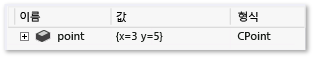  
  
 `DisplayString` 식에서 `x` 멤버의 `y` 및 `CPoint`는 중괄호 내에 있으므로 해당 값이 평가됩니다. 또한 이 식에서는 이중 중괄호\(`{{` 또는 `}}`\)를 사용하여 중괄호를 이스케이프하는 방법을 확인할 수 있습니다.  
  
> [!NOTE]
>  `DisplayString` 요소는 임의 문자열 및 중괄호 구문을 허용하는 유일한 요소입니다. 다른 모든 시각화 요소는 디버거에서 평가하는 식만 사용합니다.  
  
###  <a name="BKMK_StringView"></a> StringView  
 `StringView` 요소는 해당 값을 기본 제공 텍스트 시각화 도우미로 보내려는 식을 정의합니다. 예를 들어 `ATL::CStringT` 형식에 대한 다음과 같은 시각화가 있다고 가정해 보겠습니다.  
  
```xml  
<Type Name="ATL::CStringT<wchar_t,*>"> <DisplayString>{m_pszData,su}</DisplayString> </Type>  
  
```  
  
 `CStringT` 개체는 다음과 같습니다.  
  
 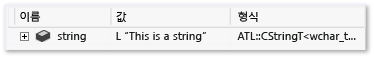  
  
 이 시각화를 통해 `CStringT` 개체가 변수 창에 다음과 같이 표시됩니다.  
  
 `StringView` 요소를 추가하면 이 값을 텍스트 시각화를 통해 볼 수 있음을 디버거에 알리게 됩니다.  
  
```  
<Type Name="ATL::CStringT<wchar_t,*>"> <DisplayString>{m_pszData,su}</DisplayString> <StringView>m_pszData,su</StringView> </Type>  
  
```  
  
 아래의 값 옆에는 돋보기 아이콘이 있는데, 이 아이콘을 선택하면 텍스트 시각화 도우미가 시작되어 `m_pszData`가 가리키는 문자열이 표시됩니다.  
  
 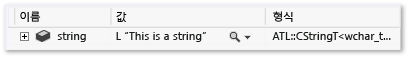  
  
> [!NOTE]
>  `{m_pszData,su}` 식에는 값을 유니코드 문자열로 표시하기 위한 C\+\+ 형식 지정자 `su`가 포함되어 있습니다. 자세한 내용은 [C\+\+의 형식 지정자](../debugger/format-specifiers-in-cpp.md)를 참조하세요.  
  
###  <a name="BKMK_Expand"></a> 확장  
 `Expand` 노드는 변수 창에서 확장된 시각화된 형식의 자식을 사용자 지정하는 데 사용됩니다. 또한 자식 요소를 정의하는 자식 노드의 목록을 허용합니다.  
  
 `Expand` 노드는 선택 사항입니다.  
  
-   `Expand` 노드가 시각화 항목에 지정되어 있지 않은 경우 Visual Studio의 기본 확장 규칙이 사용됩니다.  
  
-   `Expand` 노드가 아래에 자식 노드 없이 지정된 경우 형식을 디버거 창에서 확장할 수 없습니다.  
  
####  <a name="BKMK_Item_expansion"></a> 항목 확장  
 `Item` 요소는 `Expand` 노드에서 사용되는 가장 기본적이면서 일반적인 요소입니다.`Item`은 단일 자식 요소를 정의합니다. 예를 들어 `CRect`, `top`, `left` 및 `right`을 해당 필드로 가지고 있는 `bottom` 클래스와 다음과 같은 시각화 항목이 있다고 가정해 보겠습니다.  
  
```xml  
<Type Name="CRect"> <DisplayString>{{top={top} bottom={bottom} left={left} right={right}}}</DisplayString> <Expand> <Item Name="Width">right - left</Item> <Item Name="Height">bottom - top</Item> </Expand> </Type>  
  
```  
  
 `CRect` 형식은 다음과 같습니다.  
  
 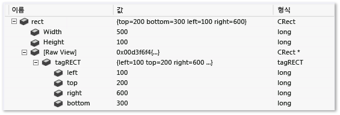  
  
 `Width` 및 `Height` 요소에 지정된 식이 평가되고 값 열에 표시됩니다.`[Raw View]` 노드는 사용자 지정 확장이 사용될 때마다 디버거를 통해 자동으로 만들어집니다. 위의 확장된 상태 스크린샷을 통해 개체의 Raw 뷰가 해당 시각화와 어떻게 다른지를 확인할 수 있습니다. Visual Studio 기본 확장은 기본 클래스의 하위 트리를 생성하고 기본 클래스의 모든 데이터 멤버를 자식으로 나열합니다.  
  
> [!NOTE]
>  항목 요소의 식이 복합 형식을 가리키는 경우 `Item` 노드 자체를 확장할 수 있습니다.  
  
####  <a name="BKMK_ArrayItems_expansion"></a> ArrayItems 확장  
 `ArrayItems` 노드를 사용하면 Visual Studio 디버거가 형식을 배열로 해석하고 해당 개별 요소를 표시하도록 할 수 있습니다.`std::vector`에 대한 시각화는 좋은 예입니다.  
  
```xml  
<Type Name="std::vector<*>"> <DisplayString>{{size = {_Mylast - _Myfirst}}}</DisplayString> <Expand> <Item Name="[size]">_Mylast - _Myfirst</Item> <Item Name="[capacity]">(_Myend - _Myfirst)</Item> <ArrayItems> <Size>_Mylast - _Myfirst</Size> <ValuePointer>_Myfirst</ValuePointer> </ArrayItems> </Expand> </Type>  
  
```  
  
 `std::vector`는 변수 창에서 확장되는 경우 개별 요소를 표시합니다.  
  
 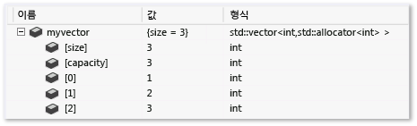  
  
 `ArrayItems` 노드에는 최소한 다음이 포함되어야 합니다.  
  
1.  디버거에서 배열의 길이를 파악하기 위한 `Size` 식\(정수로 계산되어야 함\)  
  
2.  첫 번째 요소를 가리켜야 하는 `ValuePointer` 식\(`void*`가 아닌 요소 형식의 포인터여야 함\).  
  
 배열 하한의 기본값은 0입니다. 이 값은 `LowerBound` 요소를 사용하여 재정의할 수 있습니다\(예는 Visual Studio와 함께 제공되는 .natvis 파일 참조\).  
  
 `[]` 연산자는 `ArrayItems` 확장과 함께 사용할 수 있습니다\(예: `vector[i]`\). \[\] 연산자는 형식 자체가 이 연산자를 허용하지 않는 경우\(예: `CATLArray`\)에도 `ArrayItems` 또는 `IndexListItems`를 사용하는 단일 차원 배열의 모든 시각화에 사용될 수 있습니다.  
  
 다차원 배열도 지정할 수 있습니다. 디버거에는 해당 사례에서 자식 요소를 올바르게 표시하기 위한 약간의 추가 정보만 있으면 됩니다.  
  
```xml  
<Type Name="Concurrency::array<*,*>"> <DisplayString>extent = {_M_extent}</DisplayString> <Expand> <Item Name="extent">_M_extent</Item> <ArrayItems Condition="_M_buffer_descriptor._M_data_ptr != 0"> <Direction>Forward</Direction> <Rank>$T2</Rank> <Size>_M_extent._M_base[$i]</Size> <ValuePointer>($T1*) _M_buffer_descriptor._M_data_ptr</ValuePointer> </ArrayItems> </Expand> </Type>  
  
```  
  
 `Direction`은 배열이 행 중심 순서인지 열 중심 순서인지를 지정합니다.`Rank`는 배열의 차수를 지정합니다.`Size` 요소는 해당 차원에서 배열의 길이를 확인하기 위해 차원 인덱스로 대체되는 암시적 `$i` 매개 변수를 허용합니다. 예를 들어 이전 예에서 `_M_extent.M_base[0]` 식 위에는 0차원의 길이를 지정하고, `_M_extent._M_base[1]` 식 위에는 1차원의 길이를 지정해야 할 것입니다.  
  
 다음은 2차원 `Concurrency::array` 개체가 디버거에서 어떻게 나타나는지를 보여 줍니다.  
  
 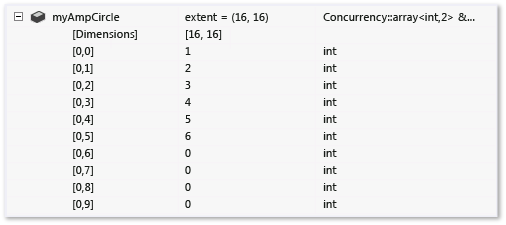  
  
####  <a name="BKMK_IndexListItems_expansion"></a> IndexListItems 확장  
 메모리에 배열 요소가 연속적으로 배치된 경우에만 `ArrayItems` 확장을 사용할 수 있습니다. 디버거는 포인터를 현재 요소까지 늘리는 방식으로 다음 요소로 이동합니다. 값 노드 인덱스를 조작해야 하는 사례를 지원하려면 `IndexListItems` 노드를 사용하면 됩니다. 다음은 `IndexListItems` 노드를 사용한 시각화입니다.  
  
```xml  
<Type Name="Concurrency::multi_link_registry<*>"> <DisplayString>{{size = {_M_vector._M_index}}}</DisplayString> <Expand> <Item Name="[size]">_M_vector._M_index</Item> <IndexListItems> <Size>_M_vector._M_index</Size> <ValueNode>*(_M_vector._M_array[$i])</ValueNode> </IndexListItems> </Expand> </Type>  
  
```  
  
 `[]` 연산자는 `IndexListItems` 확장과 함께 사용할 수 있습니다\(예: `vector[i]`\).`[]` 연산자는 형식 자체가 이 연산자를 허용하지 않는 경우\(예: `CATLArray`\)에도 `ArrayItems` 또는 `IndexListItems` 사용하는 단일 차원 배열의 모든 시각화에 사용될 수 있습니다.  
  
 `ArrayItems`와 `IndexListItems` 간의 유일한 차이점은 `ValueNode`에는 암시적 `$i` 매개 변수와 함께 i 번째 요소에 대한 전체 식이 있어야 한다는 점입니다.  
  
####  <a name="BKMK_LinkedListItems_expansion"></a> LinkedListItems 확장  
 시각화된 형식이 링크된 목록을 나타내는 경우 디버거에서는 `LinkedListItems` 노드를 사용하여 해당 자식을 표시할 수 있습니다. 다음은 이 기능을 사용하여 나타낸 `CAtlList` 형식에 대한 시각화입니다.  
  
```xml  
<Type Name="ATL::CAtlList<*,*>"> <DisplayString>{{Count = {m_nElements}}}</DisplayString> <Expand> <Item Name="Count">m_nElements</Item> <LinkedListItems> <Size>m_nElements</Size> <HeadPointer>m_pHead</HeadPointer> <NextPointer>m_pNext</NextPointer> <ValueNode>m_element</ValueNode> </LinkedListItems> </Expand> </Type>  
  
```  
  
 `Size` 요소는 목록의 길이를 참조합니다.`HeadPointer`는 첫 번째 요소를 가리키고, `NextPointer`는 다음 요소를 참조하며, `ValueNode`는 항목의 값을 참조합니다.  
  
-   `NextPointer` 및 `ValueNode` 식은 부모 목록 형식이 아닌 링크된 목록 노드 요소의 컨텍스트에서 평가됩니다. 위의 예에서 `CAtlList`에는 링크된 목록의 노드를 나타내는 `CNode` 클래스\(`atlcoll.h`에 있음\)가 있습니다.`m_pNext` 및 `m_element`는 `CNode` 클래스가 아닌 `CAtlList` 클래스의 필드입니다.  
  
-   `ValueNode`는 비워 둘 수도 있고, `this`가 링크된 목록 노드를 참조하도록 할 수도 있습니다.  
  
#### CustomListItems 확장  
 `CustomListItems` 확장을 사용하여 해시 테이블 같은 데이터 구조 전송에 대한 사용자 지정 논리를 작성할 수 있습니다. 평가해야 하는 모든 작업이 C\+\+ 식을 통해 표현 가능하지만 `ArrayItems`, `TreeItems` 또는 `LinkedListItems.`의 유형에 적합하지 않은 데이터 구조를 시각화하려면 `CustomListItems`를 사용해야 합니다.  
  
 CAtlMap의 시각화 도우미는 `CustomListItems`가 적합한 가장 좋은 예입니다.  
  
```xml  
<Type Name="ATL::CAtlMap<*,*,*,*>"> <AlternativeType Name="ATL::CMapToInterface<*,*,*>"/> <AlternativeType Name="ATL::CMapToAutoPtr<*,*,*>"/> <DisplayString>{{Count = {m_nElements}}}</DisplayString> <Expand> <CustomListItems MaxItemsPerView="5000" ExcludeView="Test"> <Variable Name="iBucket" InitialValue="-1" /> <Variable Name="pBucket" InitialValue="m_ppBins == nullptr ? nullptr : *m_ppBins" /> <Variable Name="iBucketIncrement" InitialValue="-1" /> <Size>m_nElements</Size> <Exec>pBucket = nullptr</Exec> <Loop> <If Condition="pBucket == nullptr"> <Exec>iBucket++</Exec> <Exec>iBucketIncrement = __findnonnull(m_ppBins + iBucket, m_nBins - iBucket)</Exec> <Break Condition="iBucketIncrement == -1" /> <Exec>iBucket += iBucketIncrement</Exec> <Exec>pBucket = m_ppBins[iBucket]</Exec> </If> <Item>pBucket,na</Item> <Exec>pBucket = pBucket->m_pNext</Exec> </Loop> </CustomListItems> </Expand> </Type>  
```  
  
####  <a name="BKMK_TreeItems_expansion"></a> TreeItems 확장  
 시각화된 형식이 트리를 나타내는 경우 디버거에서는 `TreeItems` 노드를 사용하여 트리를 단계별로 진행하면서 해당 자식을 표시할 수 있습니다. 다음은 이 기능을 사용하여 나타낸 `std::map` 형식에 대한 시각화입니다.  
  
```xml  
<Type Name="std::map<*>"> <DisplayString>{{size = {_Mysize}}}</DisplayString> <Expand> <Item Name="[size]">_Mysize</Item> <Item Name="[comp]">comp</Item> <TreeItems> <Size>_Mysize</Size> <HeadPointer>_Myhead->_Parent</HeadPointer> <LeftPointer>_Left</LeftPointer> <RightPointer>_Right</RightPointer> <ValueNode Condition="!((bool)_Isnil)">_Myval</ValueNode> </TreeItems> </Expand> </Type>  
  
```  
  
 이 구문은 `LinkedListItems` 노드와 매우 비슷합니다.`LeftPointer`, `RightPointer` 및 `ValueNode`는 트리 노드 클래스의 컨텍스트에서 평가되며, `ValueNode`는 비워 둘 수도 있고 `this`가 트리 노드를 참조하도록 할 수도 있습니다.  
  
####  <a name="BKMK_ExpandedItem_expansion"></a> ExpandedItem 확장  
 `ExpandedItem` 요소는 기본 클래스 또는 데이터 멤버를 시각화된 형식의 자식이었던 것처럼 표시하는 방식으로 집계된 자식 뷰를 생성하는 데 사용할 수 있습니다. 지정된 식이 평가되고 결과의 자식 노드가 시각화된 형식의 자식 목록에 추가됩니다. 예를 들어 일반적으로 다음으로 표시되는 스마트 포인터 형식 `auto_ptr<vector<int>>`가 있다고 가정해 보겠습니다.  
  
 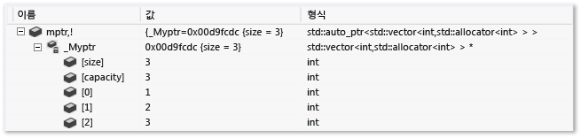  
  
 벡터 값을 확인하려면 변수 창에서 두 개의 수준을 드릴다운하여 \_Myptr 멤버를 통과해야 합니다.`ExpandedItem` 요소를 추가하면 계층 구조에서 `_Myptr` 변수를 제거하고 벡터 요소를 바로 확인할 수 있습니다.  
  
```xml  
<Type Name="std::auto_ptr<*>"> <DisplayString>auto_ptr {*_Myptr}</DisplayString> <Expand> <ExpandedItem>_Myptr</ExpandedItem> </Expand> </Type>  
  
```  
  
 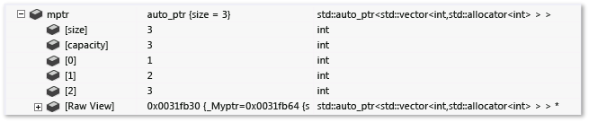  
  
 아래의 예에서는 파생 클래스에서 기본 클래스의 속성을 집계하는 방법을 보여 줍니다.`CPanel` 클래스가 `CFrameworkElement`에서 파생된다고 가정해 보겠습니다.`CFrameworkElement` 노드는 기본 `ExpandedItem` 클래스에서 가져온 속성을 반복하는 대신, 이러한 속성을 `CPanel` 클래스의 자식 목록에 추가할 수 있도록 합니다. 이때 파생된 클래스에 대해 시각화 일치를 해제하는 **nd** 형식 지정자가 필요합니다. 이 형식 지정자가 없으면 `*(CFrameworkElement*)this` 식으로 인해 `CPanel` 시각화가 다시 적용되는데, 이는 기본 시각화 형식 일치 규칙에서 이를 가장 적합한 것으로 인식하기 때문입니다.**nd** 형식 지정자를 사용하면 디버거에서 기본 클래스 시각화 또는 기본 클래스 기본 확장\(기본 클래스에 시각화가 없는 경우\)을 사용하게 됩니다.  
  
```xml  
<Type Name="CPanel"> <DisplayString>{{Name = {*(m_pstrName)}}}</DisplayString> <Expand> <Item Name="IsItemsHost">(bool)m_bItemsHost</Item> <ExpandedItem>*(CFrameworkElement*)this,nd</ExpandedItem> </Expand> </Type>  
  
```  
  
####  <a name="BKMK_Synthetic_Item_expansion"></a> 가상 항목 확장  
 `ExpandedItem` 요소는 계층 구조를 제거하여 데이터를 보다 평면적으로 표시하지만 `Synthetic` 노드는 그 반대입니다. 이 노드를 사용하면 인위적인 자식 요소, 즉 식의 결과가 아닌 자식 요소를 만들 수 있습니다. 이 자식 요소에는 해당 요소의 고유한 자식 요소가 포함될 수 있습니다. 다음 예의 `Concurrency::array` 형식에 대한 시각화에서는 사용자에게 진단 메시지를 표시하기 위해 `Synthetic` 노드를 사용합니다.  
  
```xml  
<Type Name="Concurrency::array<*,*>"> <DisplayString>extent = {_M_extent}</DisplayString> <Expand> <Item Name="extent" Condition="_M_buffer_descriptor._M_data_ptr == 0">_M_extent</Item> <ArrayItems Condition="_M_buffer_descriptor._M_data_ptr != 0"> <Rank>$T2</Rank> <Size>_M_extent._M_base[$i]</Size> <ValuePointer>($T1*) _M_buffer_descriptor._M_data_ptr</ValuePointer> </ArrayItems> <Synthetic Name="Array" Condition="_M_buffer_descriptor._M_data_ptr == 0"> <DisplayString>Array members can be viewed only under the GPU debugger</DisplayString> </Synthetic> </Expand> </Type>  
  
```  
  
 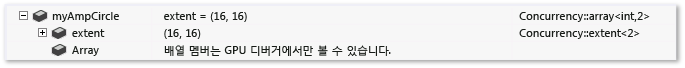  
  
###  <a name="BKMK_HResult"></a> HResult  
 `HResult` 요소를 사용하면 디버거 창에서 HRESULT에 대해 표시되는 정보를 사용자 지정할 수 있습니다.`HRValue` 요소에는 사용자 지정할 HRESULT의 32비트 값이 포함되어 있어야 합니다.`HRDescription` 요소에는 디버거에 표시되는 정보가 포함되어 있습니다.  
  
```  
  
<HResult Name="MY_E_COLLECTION_NOELEMENTS"> <HRValue>0xABC0123</HRValue> <HRDescription>No elements in the collection.</HRDescription> </HResult>  
```  
  
###  <a name="BKMK_UIVisualizer"></a> UIVisualizer  
 `UIVisualizer` 요소는 디버거에 그래픽 시각화 도우미 플러그 인을 등록합니다. 그래픽 시각화 도우미 플러그 인은 변수나 개체의 데이터 형식에 적합한 방식으로 변수나 개체를 표시하기 위한 대화 상자 또는 다른 인터페이스를 만듭니다. 시각화 도우미 플러그 인은 [VSPackage](../extensibility/internals/vspackages.md)로 작성해야 하며 디버거에서 사용할 수 있는 서비스를 노출해야 합니다. .natvis 파일에는 플러그 인의 이름, 노출된 서비스의 GUID, 시각화할 수 있는 형식 같은 플러그 인의 등록 정보가 포함되어 있습니다.  
  
 UIVisualizer 요소의 예는 다음과 같습니다.  
  
```xml  
  
<?xml version="1.0" encoding="utf-8"?> <AutoVisualizer xmlns="http://schemas.microsoft.com/vstudio/debugger/natvis/2010"> <UIVisualizer ServiceId="{5452AFEA-3DF6-46BB-9177-C0B08F318025}" Id="1" MenuName="Vector Visualizer"/> <UIVisualizer ServiceId="{5452AFEA-3DF6-46BB-9177-C0B08F318025}" Id="2" MenuName="List Visualizer"/> . . </AutoVisualizer>  
```  
  
 `UIVisualizer`는 `ServiceId` \- `Id` 특성 쌍으로 식별됩니다.`ServiceId`는 시각화 도우미 패키지를 통해 노출되는 서비스의 GUID이며, `Id`는 서비스에서 시각화 도우미를 두 개 이상 제공하는 경우 시각화 도우미를 구분하는 데 사용할 수 있는 고유한 식별자입니다. 위의 예에서는 동일한 시각화 도우미 서비스에서 두 개의 시각화 도우미를 제공합니다.  
  
 `MenuName` 특성은 사용자가 디버거 변수 창에서 돋보기 아이콘 옆의 드롭다운 메뉴를 열면 시각화 도우미의 이름으로 표시되는 항목이며, 예를 들면 다음과 같습니다.  
  
 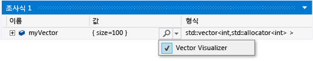  
  
 .natvis 파일에 정의된 각각의 형식에는 해당 형식을 표시할 수 있는 UI 시각화 도우미가 명시적으로 나열되어야 합니다. 디버거는 형식 항목의 시각화 도우미 참조를 일치시켜 형식과 등록된 시각화 도우미를 연결합니다. 예를 들어 `std::vector`에 대한 다음 형식 항목은 위의 예에 나와 있는 UIVisualizer를 참조합니다.  
  
```  
  
<Type Name="std::vector<int,*>"> <UIVisualizer ServiceId="{5452AFEA-3DF6-46BB-9177-C0B08F318025}" Id="1" /> </Type>  
```  
  
 메모리 내 비트맵을 확인하는 데 사용되는 이미지 조사식 확장에서 UIVisualizer의 예제를 볼 수 있습니다\([ImageWatch](https://visualstudiogallery.msdn.microsoft.com/e682d542-7ef3-402c-b857-bbfba714f78d)\).  
  
### CustomVisualizer 요소  
 `CustomVisualizer`는 Visual Studio에서 실행되는 코드에서 시각화를 제어하기 위해 작성할 수 있는 VSIX 확장을 지정하는 확장성 지점입니다. VSIX 확장 작성 방법에 대한 자세한 내용은 [Visual Studio SDK](../extensibility/visual-studio-sdk.md)를 참조하세요. 사용자 지정 시각화 도우미를 작성하는 작업은 XML natvis 정의를 작성하는 것보다 훨씬 더 많은 작업을 수행해야 하지만 어떤 natvis가 지원되고 지원되지 않는지에 대한 제약 조건이 없습니다. 사용자 지정 시각화 도우미는 디버기 프로세스를 쿼리하고 수정하거나 Visual Studio의 다른 부분과 통신하는 데 사용할 수 있는 전체 디버거 확장성 API에 액세스할 수 있습니다.  
  
 `Condition`, `IncludeView` 및 `ExcludeView` 특성을 CustomVisualizer 요소에 사용할 수 있습니다.