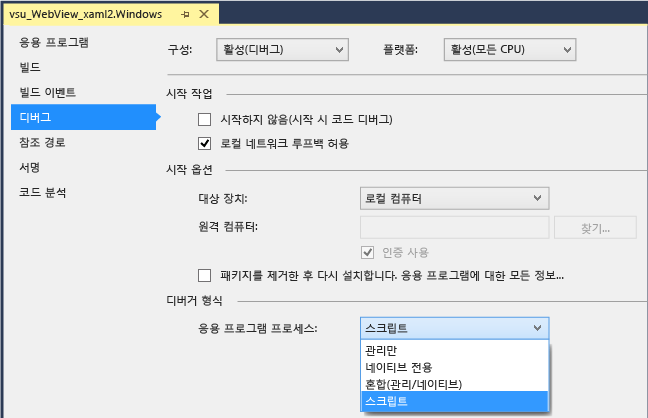
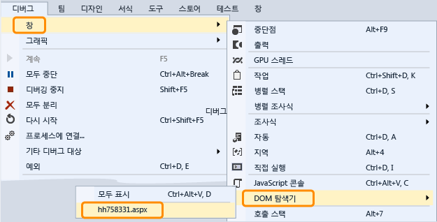

# WebView 컨트롤 디버깅
[!INCLUDE[vs2017banner](../code-quality/includes/vs2017banner.md)]

  
  
 Windows 런타임 앱에서 `WebView` 컨트롤을 조사 및 디버깅하려면 앱 시작 시 스크립트 디버거를 연결하도록 Visual Studio를 구성하면 됩니다.  Visual Studio 2013 업데이트 2부터 디버거를 사용하여 다음의 두 가지 방법으로 `WebView` 컨트롤과 상호 작용할 수 있습니다.  
  
-   `WebView` 인스턴스의 경우 [DOM 탐색기](../debugger/quickstart-debug-html-and-css.md)를 열어 DOM 요소를 조사하고, CSS 스타일 문제를 검토한 다음 스타일에 동적으로 렌더링된 변경 내용을 테스트합니다.  
  
-   [JavaScript 콘솔](../debugger/javascript-console-commands.md) 창에서 대상으로 `WebView` 인스턴스에 표시된 `iFrame` 또는 웹 페이지를 선택한 다음 콘솔 명령을 사용하여 웹 페이지와 상호 작용합니다.  JavaScript 콘솔은 현재 스크립트 실행 컨텍스트에 대한 액세스 권한을 제공합니다.  
  
### 디버거 연결\(C\#, Visual Basic, C\+\+\)  
  
1.  Visual Studio에서 Windows 런타임 앱에 `WebView` 컨트롤을 추가합니다.  
  
2.  솔루션 탐색기의 프로젝트 바로 가기 메뉴에서 **속성**을 선택하여 프로젝트의 속성을 엽니다.  
  
3.  **디버그**를 선택합니다.  **응용 프로그램 프로세스** 목록에서 **스크립트**를 선택합니다.  
  
       
  
4.  \(선택 사항\) Express 이외의 Visual Studio 버전에서 **도구**, **옵션**, **디버깅**, **Just\-In\-Time**을 선택한 다음 스크립트에 대한 JIT\(Just\-In\-Time\) 디버깅을 사용하지 않도록 설정하여 JIT 디버깅을 비활성화합니다.  
  
    > [!NOTE]
    >  JIT 디버깅을 사용하지 않도록 설정하면 일부 웹 페이지에서 발생하는 처리되지 않은 예외 대화 상자를 숨길 수 있습니다.  Visual Studio Express에서는 JIT 디버깅이 항상 사용하지 않도록 설정되어 있습니다.  
  
5.  F5 키를 눌러 디버깅을 시작합니다.  
  
### DOM 탐색기를 사용하여 WebView 컨트롤 조사 및 디버깅  
  
1.  \(C\#, Visual Basic, C\+\+\) 앱에 스크립트 디버거를 연결합니다.  지침은 첫 번째 섹션을 참조하세요.  
  
2.  아직 없는 경우 앱에 `WebView` 컨트롤을 추가하고 F5 키를 눌러 디버깅을 시작합니다.  
  
3.  `Webview` 컨트롤이 포함된 페이지로 이동합니다.  
  
4.  **디버그**, **창**, **DOM 탐색기**를 선택하여 `WebView` 컨트롤에 대한 DOM 탐색기 창을 열고 조사하려는 `WebView`의 URL을 선택합니다.  
  
       
  
     Visual Studio에서 `WebView`와 연결된 DOM 탐색기가 새 탭으로 나타납니다.  
  
5.  [DOM 탐색기를 사용하여 CSS 스타일 디버그](../debugger/debug-css-styles-using-dom-explorer.md)에 설명된 대로 라이브 DOM 요소 및 CSS 스타일을 보고 수정합니다.  
  
### JavaScript 콘솔 창을 사용하여 WebView 컨트롤 조사 및 디버깅  
  
1.  \(C\#, Visual Basic, C\+\+\) 앱에 스크립트 디버거를 연결합니다.  지침은 첫 번째 섹션을 참조하세요.  
  
2.  아직 없는 경우 앱에 `WebView` 컨트롤을 추가하고 F5 키를 눌러 디버깅을 시작합니다.  
  
3.  **디버그**, **창**, **JavaScript 콘솔**을 선택하여 `WebView` 컨트롤의 JavaScript 콘솔 창을 엽니다.  
  
     JavaScript 콘솔 창이 나타납니다.  
  
4.  `Webview` 컨트롤이 포함된 페이지로 이동합니다.  
  
5.  콘솔 창에서 웹 페이지를 선택하거나 **대상** 목록의 `WebView` 컨트롤을 통해 표시된 `iFrame`을 선택합니다.  
  
       
  
    > [!NOTE]
    >  콘솔을 사용하면 한 번에 단일 `WebView`, `iFrame`, 공유 계약 또는 웹 작업자와 상호 작용할 수 있습니다.  각 요소에는 웹 플랫폼 호스트\(WWAHost.exe\)의 개별 인스턴스가 필요합니다.  한 번에 한 호스트와 상호 작용할 수 있습니다.  
  
6.  [퀵 스타트: JavaScript 디버그](../debugger/quickstart-debug-javascript-using-the-console.md) 및 [JavaScript 콘솔 명령](../debugger/javascript-console-commands.md)에 설명된 대로 앱에서 변수를 보고 수정하거나 콘솔 명령을 사용합니다.  
  
## 참고 항목  
 [퀵 스타트: HTML 및 CSS 디버그](../debugger/quickstart-debug-html-and-css.md)