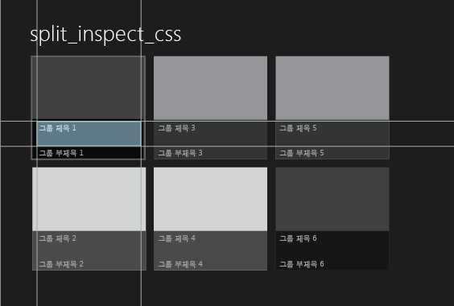
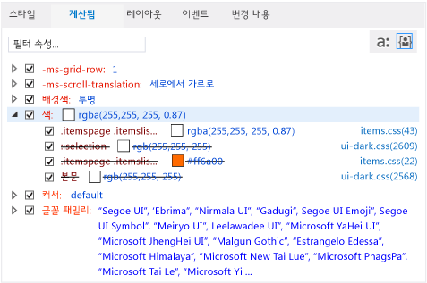
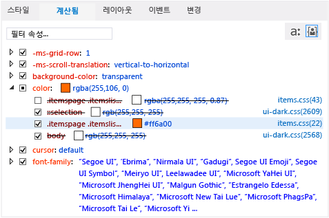
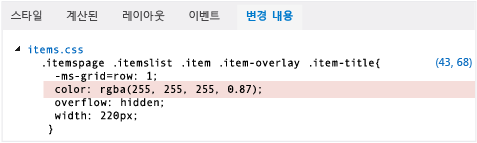

# DOM 탐색기를 사용하여 CSS 스타일 디버그
[!INCLUDE[vs2017banner](../code-quality/includes/vs2017banner.md)]

  
  
 Windows 스토어 앱, Windows Phone 스토어 앱 및 Visual Studio Tools for Apache Cordova를 사용하여 만든 앱을 디버그할 때 선택한 DOM 요소 및 해당 요소의 자식 요소에 대한 CSS 규칙을 보고 변경할 수 있습니다.  
  
 DOM 탐색기의 **스타일** 및 **계산됨** 탭에는 선택한 요소에 적용되는 CSS 규칙이 표시됩니다. 규칙은 CSS 우선 순위 규칙에 따라 구체적인 정도의 순서로 표시됩니다. 선택기의 맨 위 또는 탭의 스타일에 있는 규칙\(가장 구체적인 규칙\)이 선택한 요소에 가장 마지막에 적용되며 선택기 또는 스타일의 맨 아래에 있는 규칙이 가장 먼저 적용됩니다. 규칙이 적용되면 이전에 적용된 규칙이 재정의됩니다.  
  
 **스타일**, **계산됨** 및 **변경 내용** 탭에는 다양한 뷰로 스타일 정보가 표시됩니다.  
  
-   `html, body`와 같이 CSS 선택기 이름으로 구성된 규칙을 보려면 **스타일** 탭을 사용합니다. 또한 이 탭에서는 특정 스타일을 사용 또는 사용 안 함으로 설정하고, 값을 수동으로 편집하고, 이러한 변경의 결과를 즉시 볼 수 있습니다.  
  
-   스타일의 계산 값을 보려면 **계산됨** 탭을 사용합니다. 예를 들어, 크기를 1em으로 설정하면 Internet Explorer에 의해 계산된 값은 16px가 될 수 있습니다. 이 탭의 스타일은 `height`와 같은 스타일 이름으로 구성됩니다. 또한 이 탭을 사용하여 특정 스타일을 사용하거나 사용하지 않도록 설정하고, 값을 수동으로 편집하고, 이러한 변경 내용의 결과를 즉시 확인할 수 있습니다.  
  
    > [!NOTE]
    >  Visual Studio 2013 Update 2에서는 **추적** 탭에서 제공되는 정보가 **계산됨** 탭과 병합되어 **추적** 탭이 제거되었습니다.  
  
-   디버깅 세션 중 변경한 CSS 스타일을 식별하고 추적하려면 **변경 내용** 탭\(Windows 스토어 앱 및 Windows Phone 스토어 앱에만 해당\)을 사용합니다.  
  
> [!TIP]
>  **스타일** 및 **계산됨** 탭에서 변경한 스타일은 영구적이지 않습니다. 이 변경 내용은 디버깅을 중지하면 손실됩니다. 소스 코드를 변경한 후 디버거를 중지했다가 다시 시작하지 않고 페이지를 다시 로드하려면 **디버그** 도구 모음에 있는  단추\(**Windows 앱 새로 고침**\)\(Windows 스토어 및 Windows Phone 스토어 앱만 해당\)를 사용하여 앱을 새로 고칩니다. 자세한 내용은 [앱 새로 고침\(JavaScript\)](../debugger/refresh-an-app-javascript.md)을 참조하세요.  
  
## CSS 규칙 수정 예제  
 이 예제에서는 CSS 규칙을 검사하고 스타일 문제를 디버깅하는 방법을 보여 줍니다. 이 예제에서는 [!INCLUDE[win8_appname_long](../debugger/includes/win8_appname_long_md.md)] 분할 앱 템플릿에서 그룹 제목을 표시하는 데 사용되는 글꼴의 색을 변경하려고 합니다.  
  
> [!NOTE]
>  이 예제에서는 Windows 스토어 앱에 대해 설명하지만, 표시된 모든 DOM 탐색기 기능은 Windows Phone 스토어 앱 및 변경 내용 탭을 제외하고 Visual Studio Tools for Apache Cordova를 사용하여 만든 앱에도 적용됩니다.  
  
#### CSS 규칙을 보고 변경하려면  
  
1.  Visual Studio의 분할 앱 프로젝트 템플릿에서 JavaScript 및 HTML을 사용하여 [!INCLUDE[win8_appname_long](../debugger/includes/win8_appname_long_md.md)] 앱을 만듭니다.  
  
2.  **솔루션 탐색기**에서 items.css를 엽니다. 페이지 폴더에서 items.css를 찾을 수 있습니다.  
  
3.  다음 CSS 코드를  
  
    ```css  
    .itemspage .itemslist .item { -ms-grid-columns: 1fr; -ms-grid-rows: 1fr 90px; display: -ms-grid; height: 250px; width: 250px; }  
    ```  
  
     다음 코드로 바꿉니다.  
  
    ```css  
    .itemspage .itemslist .item { -ms-grid-columns: 1fr; -ms-grid-rows: 1fr 90px; display: -ms-grid; height: 250px; width: 250px; color: #ff6a00; }  
    ```  
  
     이 코드에서는 목록의 각 항목에 \#ff6a00\(주황\) 색을 지정하는 스타일을 추가합니다. CSS 선택기 `.itemspage .itemslist .item`은 items.html의 DIV 요소에 대한 클래스 이름 집합을 나타냅니다. DIV 요소는 라이브 DOM에서 중첩 요소로 나타납니다.`item` DIV 요소 항목은 목록 항목을 지정합니다.  
  
4.  **디버그** 도구 모음의 드롭다운 목록에서 **시뮬레이터**를 선택합니다\(기본값 **로컬 컴퓨터**\).  
  
       
  
5.  F5 키를 눌러 디버그 모드에서 응용 프로그램을 실행합니다.  
  
     앱 로드가 완료되면 **그룹 제목: 1**과 같은 목록 항목의 머리글을 살펴봅니다. 색이 변경되지 않으므로 주황색을 제목에 적용하려고 해도 적용되지 않습니다. DOM 탐색기에서 CSS 탭을 사용하여 무엇이 잘못되었는지 알아보고 수정해보도록 하겠습니다.  
  
    > [!TIP]
    >  시뮬레이터에 앱이 나타나면 선택한 사항과 변경한 CSS 스타일의 결과를 즉시 확인할 수 있도록 시뮬레이터를 Visual Studio 창 바로 오른쪽으로 이동합니다.  
  
6.  Visual Studio로 전환하고 DOM 탐색기에서 **요소 선택**을 클릭하거나 Ctrl \+ B를 누릅니다. 그러면 항목을 클릭하여 선택할 수 있도록 선택 모드가 변경되며, 앱이 전경에 옵니다. 한 번 클릭 후 모드는 되돌려집니다.**요소 선택** 단추는 다음과 같습니다.  
  
    > [!TIP]
    >  DOM 탐색기에서 HTML 요소를 직접 선택할 수도 있습니다. 요소를 선택하는 방법에 대한 자세한 내용은 [퀵 스타트: HTML 및 CSS 디버그](../debugger/quickstart-debug-html-and-css.md)을 참조하세요.  
  
7.  시뮬레이터에서 홈 페이지의 왼쪽 창에 있는 **Group Title: 1** 목록의 첫 번째 항목 제목을 마우스로 가리킵니다. 다음과 같이 제목이 강조 표시됩니다.  
  
       
  
    > [!NOTE]
    >  Windows Phone 에뮬레이터에서는 요소를 마우스로 가리키면 강조 표시되는 기능이 일부만 지원됩니다.  
  
8.  윤곽선이 있는 제목을 클릭합니다. DOM 탐색기는 아래와 비슷한 해당 HTML 요소를 자동으로 선택합니다.  
  
    ```html  
    <h4 class="item-title">Group Title: 1</h4>  
    ```  
  
     DOM 탐색기에서 H4 요소를 선택하면 DOM 탐색기 탭에 H4 요소와 연결된 규칙이 표시됩니다. 여기에 `color` 속성이 열린 상태의 **계산됨** 탭이 표시됩니다.  
  
       
  
     이 뷰에서는 `color` 스타일과 연결된 규칙에 대한 다음과 같은 유용한 정보를 제공합니다.  
  
    -   items.css에서 수정한 CSS 선택기인 `.itemspage .itemslist .item`은 최종 스타일 계산기에서 사용되고 있지 않습니다\(취소선 텍스트에 나타남\). 몇 번 나타난 `color` 스타일도 사용되고 있지 않습니다.  
  
        > [!TIP]
        >  더 긴 선택기 이름의 경우 도구 설명에 전체 이름이 나타납니다.  
  
    -   최종 계산된 CSS 값인 `rgba(255, 255, 255, 0.87)`은 역시 item.css에 정의되는 `.itemspage .itemslist .item .item-overlay .item-title` CSS 선택기에 대해 따로 설정됩니다.  
  
        > [!TIP]
        >  제목 색이 설정되는 위치를 알았으므로 어디에서 변경할 수 있는지도 알 수 있습니다. 하지만 나머지 단계에 나와 있는 대로, 앱을 새로 고치지 않고도 DOM 탐색기에서 변경 내용을 테스트할 수도 있습니다.  
  
9. `color` 선택기에 대해 첫 번째 나타난 `.itemspage .itemslist .item .item-overlay .item-title` 스타일의 확인란을 선택 취소합니다. 이제 시뮬레이터에서 항목 제목의 색이 의도한 대로 모두 주황색으로 바뀌고, CSS에서 수정한 선택기 `.itemspage .itemslist .item`이 더 이상 재정의되지 않습니다\(즉, 더 이상 취소선 텍스트가 적용되지 않음\). 확인란을 선택 취소하면 **계산됨** 탭이 다음과 같이 표시됩니다.  
  
       
  
10. **변경 내용** 탭을 선택합니다.  
  
     디버깅 세션 중 변경한 스타일을 식별하고 추적하려면 **변경 내용** 탭을 사용합니다. 다음 그림은 **변경 내용** 탭의 `.itemspage .itemslist .item .item-overlay .item-title` 선택기이며, 재정의되어 있습니다.  
  
       
  
11. CSS 스타일 값을 수동으로 편집하고 **스타일** 탭에서 즉시 결과를 볼 수도 있습니다.  
  
12. **스타일** 탭을 선택합니다.  
  
13. `.itemspage .itemslist .item .item-overlay .item-title` 스타일 선택기를 엽니다.  
  
14. 첫 번째 나타난 `color` 스타일을 선택한 다음 속성 값 `rgb(255, 255, 255, 0.87)`를 두 번 클릭합니다.  
  
15. 키보드를 사용하여 이 값을 수정합니다.`rgb(255, 255, 0, 0.87)`로 변경한 다음 Enter 키를 누릅니다. 시뮬레이터에서 항목 제목의 색이 모두 노란색으로 변경됩니다.  
  
16. 소스 CSS 파일을 변경하려면 **스타일** 탭에서 **items.css** 링크를 클릭합니다. 그러면 items.css가 열리고, 여기에서 앱 코드의 `color` 스타일 값을 변경할 수 있습니다. 디버거를 중지한 후 다시 시작하지 않고 앱을 새로 고치려면 **디버그** 도구 모음에서 \(**Windows 앱 새로 고침**\) 단추를 클릭합니다.  
  
## 참고 항목  
 [퀵 스타트: HTML 및 CSS 디버그](../debugger/quickstart-debug-html-and-css.md)   
 [DOM 탐색기를 사용하여 레이아웃 디버깅](../debugger/debug-layout-using-dom-explorer.md)   
 [DOM 이벤트 수신기 보기](../debugger/view-dom-event-listeners.md)   
 [기술 지원 및 접근성](http://go.microsoft.com/fwlink/?LinkId=253502)