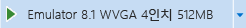
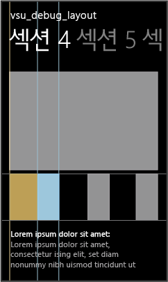
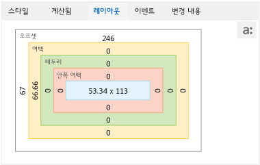

# DOM 탐색기를 사용하여 레이아웃 디버깅
[!INCLUDE[vs2017banner](../code-quality/includes/vs2017banner.md)]

  
  
 DOM 탐색기의 **레이아웃** 탭에는 [!INCLUDE[win8_appname_long](../debugger/includes/win8_appname_long_md.md)] 앱, Windows Phone 스토어 앱 또는 Visual Studio Tools for Apache Cordova를 사용하여 만든 앱에서 선택한 요소에 대한 [CSS 상자 모델](http://go.microsoft.com/fwlink/?LinkID=238778)을 보여 줍니다. 상자 모델의 이 시각적 표현을 사용하여 요소의 모양을 좌우하는 레이아웃 관련 값을 식별하고 수정할 수 있습니다.  
  
> [!TIP]
>  **레이아웃** 탭에서 변경한 내용은 영구적이지 않습니다. 소스 코드를 영구적으로 변경한 다음 디버그 도구 모음에서 **Windows 앱 새로 고침** 단추\(Windows 스토어 및 Windows Phone 스토어 앱만 해당\)를 사용하여 앱을 새로 고칠 수 있습니다. 이렇게 하면 디버거를 다시 시작하지 않아도 됩니다.  
  
 DOM 탐색기를 사용하여 상자 모델에 표시되지 않은 레이아웃 요소를 수정하려면 [퀵 스타트: HTML 및 CSS 디버그](../debugger/quickstart-debug-html-and-css.md) 및 [DOM 탐색기를 사용하여 CSS 스타일 디버그](../debugger/debug-css-styles-using-dom-explorer.md)를 참조하세요.  
  
## 레이아웃 문제 해결 예제  
 이 예에서는 허브\/피벗 템플릿에서 목록 요소를 선택하고, **레이아웃** 탭에 있는 상자 모델 값을 해석한 다음 속성 값 중 하나를 변경하여 레이아웃 문제를 해결하는 방법을 보여 줍니다.  
  
#### 레이아웃 문제를 해결하려면  
  
1.  Visual Studio에서 허브\/피벗 프로젝트 템플릿을 사용하는 새 스토어 앱을 만듭니다.  
  
2.  공유된 pages\\hub 폴더에서 hub.css를 엽니다.  
  
3.  다음 CSS 코드를  
  
    ```css  
    .hubpage .hub .section4 .sub-image-row img { height: 95px; width: 130px; }  
    ```  
  
     이 CSS 코드로 변경합니다.  
  
    ```css  
    .hubpage .hub .section4 .sub-image-row img { height: 95px; width: 130px; margin-left: 5em; }  
    ```  
  
4.  솔루션 탐색기에서 appName.WindowsPhone 프로젝트 또는 appName.Windows 프로젝트를 선택한 다음 프로젝트의 바로 가기 메뉴에서 **시작 프로젝트로 설정**을 선택합니다.  
  
5.  시작 프로젝트에 따라 디버그 도구 모음의 드롭다운 목록에서 **에뮬레이터 8.1 WVGA 4인치 512MB** 또는 **시뮬레이터**를 선택합니다\(**로컬 컴퓨터**가 기본값임\).  
  
       
  
6.  F5 키를 눌러 디버그 모드에서 응용 프로그램을 실행합니다.  
  
7.  스크롤 또는 긋기를 통해 섹션 4를 엽니다.  
  
    > [!TIP]
    >  선택 내용 및 CSS 스타일 변경 내용에 대한 결과를 즉시 확인할 수 있도록 Visual Studio 창 오른쪽에 Phone 에뮬레이터 또는 시뮬레이터를 배치합니다.  
  
     섹션 4가 로드될 때 하부 이미지가 제대로 표시되지 않는 것을 볼 수 있습니다. 각 항목 이미지는 왼쪽 절반이 누락된 상태로 잘려서 표시됩니다.  
  
8.  Visual Studio로 전환하고 DOM 탐색기에서 **요소 선택**을 선택하거나 Ctrl\+B를 누릅니다. 그러면 항목을 클릭하여 선택할 수 있도록 선택 모드가 변경되며, 앱이 전경에 옵니다. 한 번 클릭 후 모드는 되돌려집니다.  
  
    > [!TIP]
    >  화살표 키 또는 다른 방법을 사용하여 DOM 탐색기에서 직접 HTML 요소를 선택할 수도 있습니다. 요소를 선택하는 방법에 대한 자세한 내용은 [퀵 스타트: HTML 및 CSS 디버그](../debugger/quickstart-debug-html-and-css.md)을 참조하세요.  
  
9. Phone 에뮬레이터 또는 시뮬레이터에서 절반이 잘린 이미지 중 하나의 오른쪽 회색 절반을 선택합니다. 다음과 같이 Windows Phone 에뮬레이터에 표시된 대로 선택한 요소 주위가 강조 표시됩니다.  
  
       
  
    > [!TIP]
    >  시뮬레이터에서는 요소를 선택하기 전에 요소를 마우스로 가리키면 DOM 요소 주위에 강조 표시 상자가 표시됩니다. Windows Phone 에뮬레이터에서는 이 기능을 지원하지 않습니다.  
  
     DOM 요소를 선택하면 DOM 탐색기가 Visual Studio에서 해당 IMG 요소를 자동으로 선택합니다. DOM 탐색기에서 선택된 요소가 다음과 같이 표시됩니다.  
  
    ```html  
     </img>  
    ```  
  
10. **레이아웃** 탭을 클릭합니다. 이 탭에는 Windows Phone 에뮬레이터에서와 같이 선택한 요소의 상자 모델이 표시됩니다.  
  
       
  
     이 뷰에서는 요소에 대한 몇 가지 유용한 정보를 제공합니다.  
  
    -   색은 요소를 마우스로 가리킬 때 시뮬레이터에 나타나는 상자 강조 표시에 해당합니다. 파란색은 \ 요소 치수를 의미합니다. 태닝 색은 여백 값을 의미합니다.  
  
    -   왼쪽 여백\(margin\-left\)이 설정되어 있으며, 이것은 증상\(이미지 왼쪽이 검은색\)과 일치하기 때문에 문제의 원인을 암시합니다.  
  
    -   0 픽셀 값이 표시되는 상자\(예: 테두리 및 안쪽 여백\)는 해당 CSS 속성이 설정되어 있지 않음을 나타냅니다.  
  
11. margin\-left 규칙이 적용되는 방식을 보려면 **계산됨** 탭을 선택하고 margin\-left 규칙 아래를 봅니다. 이 규칙이 5em 값으로 설정되어 있는 것을 볼 수 있지만 대상 장치에 따라 계산된 값은 66.66px 또는 146.66px가 됩니다.  
  
    > [!TIP]
    >  **계산됨** 탭은 hub.css에 있는 `..hubpage .hub. section4 .sub-image-row img` CSS 선택기에 margin\-left 규칙이 설정되어 있음을 보여 줍니다. 이 데모 응용 프로그램에서 수정해야 합니다.  
  
     레이아웃 값의 수정 사항을 테스트할 때도 **레이아웃** 탭을 이용할 수 있습니다.  
  
12. **레이아웃** 탭에서 상자 왼쪽의 **여백** 상자에 표시되는 **66.66** 또는 **146.66** 중 하나를 선택합니다.  
  
13. `0`을 입력하고 Enter 키를 누릅니다. \(또한 위쪽 화살표 및 아래쪽 화살표 키를 사용해서 값을 변경할 수 있습니다.\)  
  
14. DOM 탐색기에서 다른 \ 요소를 선택하고 margin\-left 값을 0으로 변경합니다.  
  
15. Phone 에뮬레이터 또는 시뮬레이터로 전환합니다. 업데이트된 margin\-left 값이 섹션 4 이미지에 적용되었습니다. 이러한 값은 **계산됨** 탭의 margin\-left 규칙에서도 업데이트됩니다.  
  
## 참고 항목  
 [퀵 스타트: HTML 및 CSS 디버그](../debugger/quickstart-debug-html-and-css.md)   
 [DOM 탐색기를 사용하여 CSS 스타일 디버그](../debugger/debug-css-styles-using-dom-explorer.md)   
 [DOM 이벤트 수신기 보기](../debugger/view-dom-event-listeners.md)