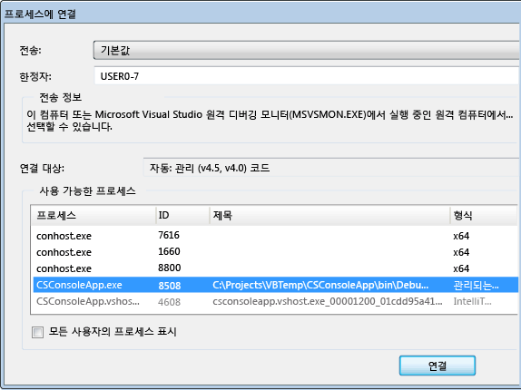
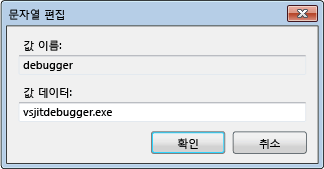
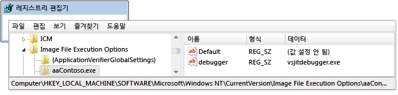
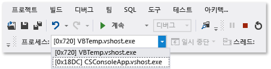
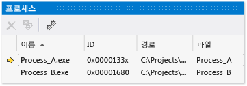

# 여러 프로세스 디버깅
프로세스 디버깅 시작, 프로세스 간 전환, 중단 및 계속 실행, 소스 단계별, 디버깅을 중지 하 고 프로세스 종료 또는 프로세스에서 분리 하는 방법은 다음과 같습니다.  
  
##   여러 프로세스의 실행 동작 구성  
 여러 프로세스가 디버거에서 실행되는 경우 기본적으로 디버거 명령을 중단하고 단계별로 실행하고 중지하면 대개 모든 프로세스가 영향을 받습니다. 예를 들어 한 프로세스가 중단점에서 일시 중단되면 다른 모든 프로세스의 실행도 일시 중단됩니다. 이 기본 동작을 변경하여 실행 명령의 대상을 더욱 세부적으로 제어할 수 있습니다.  
  
1.  클릭 **디버그 > 옵션 및 설정**합니다.  
  
2.  에 **디버깅**, **일반** 선택을 취소 페이지는 **한 프로세스가 중단 될 때 모든 프로세스 중단** 확인란 합니다.  
  
  [목차](#BKMK_Contents)  
  
##   소스 및 기호 (.pdb) 파일 찾기  
 프로세스의 소스 코드를 탐색하려면 디버거가 프로세스의 소스 파일과 기호 파일에 액세스할 수 있어야 합니다. 참조 [기호 (.pdb)을 지정 하 고 소스 파일과](../debugger/specify-symbol-dot-pdb-and-source-files-in-the-visual-studio-debugger.md)합니다.  
  
 프로세스에 대 한 파일에 액세스할 수 없는 경우 디스어셈블리 창을 사용 하 여 이동할 수 있습니다. 참조 [하는 방법: 디스어셈블리 창 사용](../debugger/how-to-use-the-disassembly-window.md)  
  
  [목차](#BKMK_Contents)  
  
##   VS 솔루션의 여러 프로세스 시작, 프로세스에 연결, 디버거에서 프로세스를 자동으로 시작  
  
-   [Visual Studio 솔루션의 여러 프로세스 디버깅 시작](#BKMK_Start_debugging_multiple_processes_in_a_Visual_Studio_solution)  
  
-   [시작 프로젝트 변경](#BKMK_Change_the_startup_project)  
  
-   [솔루션의 특정 프로젝트 시작](#BKMK_Start_a_specific_project_in_a_solution)  
  
-   [솔루션의 여러 프로젝트 시작](#BKMK_Start_multiple_projects_in_a_solution)  
  
-   [프로세스에 연결](#BKMK_Attach_to_a_process)  
  
-   [디버거에서 프로세스를 자동으로 시작](#BKMK_Automatically_start_an_process_in_the_debugger)  
  
> [!NOTE]
>  자식 프로젝트가 동일한 솔루션에 있는 경우에도 디버거는 디버깅된 프로세스에서 시작되는 자식 프로세스에 자동으로 연결되지 않습니다. 자식 프로세스를 디버깅하려면:  
>   
>  -   자식 프로세스가 시작된 후 자식 프로세스에 연결합니다.  
>   
>      -또는-  
> -   디버거의 새 인스턴스에서 자식 프로세스를 자동으로 시작하도록 Windows를 구성합니다.  
  
###   Visual Studio 솔루션의 여러 프로세스 디버깅 시작  
 독립적으로 실행될 수 있는 Visual Studio 솔루션에 프로젝트가 두 개 이상 있는 경우(각기 다른 프로세스에서 실행되는 프로젝트) 디버거가 시작하는 프로젝트를 선택할 수 있습니다.  
  
   
  
####   시작 프로젝트 변경  
 솔루션에 대 한 시작 프로젝트를 변경 하려면 솔루션 탐색기에서 프로젝트를 선택 하 고 다음 선택 **시작 프로젝트로 설정** 상황에 맞는 메뉴입니다.  
  
####   솔루션의 특정 프로젝트 시작  
 기본 시작 프로젝트를 변경 하지 않고 솔루션에 대 한 프로젝트를 시작 하려면 솔루션 탐색기에서 프로젝트를 선택 하 고 다음 선택 **디버그** 상황에 맞는 메뉴입니다. 그런 다음 **새 인스턴스 시작** 또는 **새 인스턴스 한 단계씩 코드 실행**합니다.  
  
  [VS 솔루션의 여러 프로세스 시작, 프로세스에 연결, 디버거에서 프로세스를 자동으로 시작](../debugger/debug-multiple-processes.md#BKMK_Start_multiple_processes_in_a_VS_solution__attach_to_a_process__automatically_start_a_process_in_the_debugger)  
  
  [목차](#BKMK_Contents)  
  
####   솔루션의 여러 프로젝트 시작  
  
1.  솔루션 탐색기에서 솔루션을 선택한 다음 선택 **속성** 상황에 맞는 메뉴입니다.  
  
2.  선택 **공용 속성**, **시작 프로젝트** 에 **속성** 대화 상자.  
  
3.  변경 하려는 각 프로젝트에 대 한 중 하나를 선택 **시작**, **디버깅 하지 않고 시작**, 또는 **None**합니다.  
  
  [VS 솔루션의 여러 프로세스 시작, 프로세스에 연결, 디버거에서 프로세스를 자동으로 시작](../debugger/debug-multiple-processes.md#BKMK_Start_multiple_processes_in_a_VS_solution__attach_to_a_process__automatically_start_a_process_in_the_debugger)  
  
  [목차](#BKMK_Contents)  
  
###   프로세스에 연결  
 디버거도 있습니다 *연결* Visual Studio 외부의 프로세스에서 실행 되는 프로그램을 원격 장치에서 실행 중인 프로그램을 포함 합니다. 일단 프로그램에 연결되면 디버거 실행 명령을 사용하고 프로그램 상태를 검사하는 등의 작업을 수행할 수 있습니다. 디버그 정보를 사용하여 프로그램을 빌드했는지 여부, 프로그램의 소스 코드에 액세스할 수 있는지 여부 및 공용 언어 런타임 JIT 컴파일러가 디버그 정보를 추적하고 있는지 여부에 따라 프로그램 검사 기능이 제한될 수 있습니다.  
  
 참조 [실행 중인 프로세스에 연결할](../debugger/attach-to-running-processes-with-the-visual-studio-debugger.md) 자세한 정보에 대 한 합니다.  
  
 **로컬 컴퓨터에서 실행 중인 프로세스에 연결**  
  
 클릭 **디버그 > 프로세스에 연결**합니다. 에 **프로세스에 연결** 대화 상자에서 프로세스를 선택 합니다는 **사용 가능한 프로세스** 목록에서 선택한 후 **연결**합니다.  
  
   
  
  [목차](#BKMK_Contents)  
  
###   디버거에서 프로세스를 자동으로 시작  
 경우에 따라 다른 프로세스에서 시작된 프로그램의 시작 코드를 디버깅해야 할 수도 있습니다. 서비스 및 사용자 지정 설치 작업을 예로 들 수 있습니다. 이러한 시나리오에서는 응용 프로그램을 시작할 때 디버거를 시작하고 자동으로 연결할 수 있습니다.  
  
1.  레지스트리 편집기를 시작 (**regedit.exe**).  
  
2.  탐색 하 고 **HKEY_LOCAL_MACHINE\Software\Microsoft\Windows NT\CurrentVersion\Image File Execution Options** 폴더입니다.  
  
3.  디버거에서 시작할 응용 프로그램의 폴더를 선택합니다.  
  
     응용 프로그램 이름이 하위 폴더로 나타나지 않으면 경우 선택 **Image File Execution Options** 선택한 후 **새로**, **키** 상황에 맞는 메뉴입니다. 새 키를 선택 **이름 바꾸기** 바로 가기 메뉴에서 응용 프로그램의 이름을 입력 합니다.  
  
4.  응용 프로그램 폴더의 상황에 맞는 메뉴에서 선택 **새로**, **문자열 값**합니다.  
  
5.  새 값의 이름을 변경 **새 값** 를 `debugger`합니다.  
  
6.  Debugger 항목의 상황에 맞는 메뉴에서 선택 **수정**합니다.  
  
7.  문자열 편집 대화 상자에서 입력 `vsjitdebugger.exe` 에 **값 데이터** 상자입니다.  
  
       
  
   
  
  [목차](#BKMK_Contents)  
  
##   프로세스 전환, 실행 중단 및 계속 실행, 소스 단계별 실행  
  
-   [프로세스 간 전환](#BKMK_Switch_between_processes)  
  
-   [단계, 명령 중단 및 계속](#BKMK_Break__step__and_continue_commands)  
  
###   프로세스 간 전환  
 디버깅하는 동안 여러 프로세스에 연결할 수 있지만 한 번에 프로세스 하나만 디버거에서 활성화됩니다. 활성을 설정할 수 있습니다 또는 *현재* 또는 디버그 위치 도구 모음에서 프로세스는 **프로세스** 창. 프로세스 간에 전환하려면 두 프로세스가 모두 중단 모드여야 합니다.  
  
 **현재 프로세스를 설정 하려면**  
  
-   디버그 위치 도구 모음에서 선택 **프로세스** 볼 수는 **프로세스** 목록 상자입니다. 현재 프로세스로 지정할 프로세스를 선택합니다.  
  
       
  
     경우는 **디버그 위치** 도구 모음이 보이지 않으면, 선택 **도구**, **사용자 지정**합니다. 에 **도구 모음** 탭에서 선택 **디버그 위치**합니다.  
  
-   열기는 **프로세스** 창 (바로 가기 **Ctrl + Alt + Z**) 현재 프로세스로 설정할 프로세스 찾아 두 번 클릭 합니다.  
  
       
  
     현재 프로세스는 노란색 화살표로 표시됩니다.  
  
 프로젝트로 전환하면 해당 프로젝트가 디버깅 목적의 현재 프로세스로 설정됩니다. 사용자에게 표시되는 모든 디버거 창은 현재 프로세스의 상태를 보여 주며, 모든 단계별 실행 명령은 현재 프로세스에만 영향을 미칩니다.  
  
  [프로세스 전환, 실행 중단 및 계속 실행, 소스 단계별 실행](../debugger/debug-multiple-processes.md#BKMK_Switch_processes__break_and_continue_execution__step_through_source)  
  
  [목차](#BKMK_Contents)  
  
###   단계, 명령 중단 및 계속  
  
> [!NOTE]
>  기본적으로 디버거 명령을 중단하고 계속 실행하고 단계별로 실행하면 디버그 중인 모든 프로세스가 영향을 받습니다. 이 동작을 변경 하려면 참조 [여러 프로세스의 실행 동작 구성](#BKMK_Configure_the_execution_behavior_of_multiple_processes)  
  
||||  
|-|-|-|  
|**명령**|**한 프로세스가 중단 될 때 모든 프로세스 중단**   선택됨(기본값)|**한 프로세스가 중단 될 때 모든 프로세스 중단**   선택 취소됨|  
|**디버그** 메뉴:   -   **모두 중단**|모든 프로세스가 중단됩니다.|모든 프로세스가 중단됩니다.|  
|**디버그** 메뉴:   -   **계속**|모든 프로세스가 다시 시작됩니다.|일시 중단된 모든 프로세스가 다시 시작됩니다.|  
|**디버그** 메뉴:   -   **한 단계씩 코드 실행** -   **프로시저 단위 실행** -   **프로시저 나가기**|현재 프로세스가 단계별로 실행되는 동안 모든 프로세스가 실행됩니다.   그런 다음 모든 프로세스가 중단됩니다.|현재 프로세스가 단계별로 실행됩니다.   일시 중단된 프로세스가 다시 시작됩니다.   실행 중인 프로세스가 계속 실행됩니다.|  
|**디버그** 메뉴:   -   **현재 프로세스 한 단계씩** -   **현재 프로세스 건너뛰기** -   **현재 프로세스 프로시저 나가기**|N/A|현재 프로세스가 단계별로 실행됩니다.   다른 프로세스가 기존 상태(일시 중단됨 또는 실행 중)를 유지합니다.|  
|소스 창   -   **중단점**|모든 프로세스가 중단됩니다.|소스 창 프로세스만 중단됩니다.|  
|소스 창 상황에 맞는 메뉴:   -   **커서까지 실행**   소스 창이 현재 프로세스에 있어야 합니다.|모든 프로세스가 소스 창 프로세스가 커서까지 실행되는 동안 실행되었다가 중단됩니다.   그런 다음 다른 모든 프로세스가 중단됩니다.|소스 창 프로세스가 커서까지 실행됩니다.   다른 프로세스가 기존 상태(일시 중단됨 또는 실행 중)를 유지합니다.|  
|**프로세스** 창 상황에 맞는 메뉴:   -   **프로세스 중단**|N/A|선택한 프로세스가 중단됩니다.   다른 프로세스가 기존 상태(일시 중단됨 또는 실행 중)를 유지합니다.|  
|**프로세스** 창 상황에 맞는 메뉴:   -   **프로세스를 계속**|N/A|선택한 프로세스가 다시 시작됩니다.   다른 프로세스가 기존 상태(일시 중단됨 또는 실행 중)를 유지합니다.|  
  
  [프로세스 전환, 실행 중단 및 계속 실행, 소스 단계별 실행](../debugger/debug-multiple-processes.md#BKMK_Switch_processes__break_and_continue_execution__step_through_source)  
  
  [목차](#BKMK_Contents)  
  
##   디버깅 중지, 종료 또는 프로세스에서 분리  
  
-   [중지, 종료 및 분리 명령](#BKMK_Stop__terminate__and_detach_commands)  
  
 기본적으로 선택 하면 **디버그**, **디버깅 중지** 디버거를 종료 또는 프로세스에서 연 방법에 따라 모든 프로세스에서 분리 여러 프로세스가 디버거에서 열려 있는 경우는 디버거:  
  
-   현재 프로세스가 디버거에서 시작된 경우 프로세스가 종료됩니다.  
  
-   디버거를 현재 프로세스에 연결한 경우 디버거는 프로세스에서 분리되며 프로세스는 계속 실행됩니다.  
  
 Visual Studio 솔루션에서 프로세스를 디버깅을 시작 하는 경우 이미 실행 중인 다른 프로세스에 연결 하 고를 눌러 예를 들어 **디버깅 중지**, Visual Studio에서 시작 된 프로세스가 종료, 디버깅 세션 종료 되 면 동안 연결 되어 있는 프로세스 계속 실행 됩니다. 다음 절차를 사용하여 디버깅을 중지하는 방법을 제어할 수 있습니다.  
  
> [!NOTE]
>  **한 프로세스가 중단 될 때 모든 프로세스 중단** 옵션 디버깅 나 프로세스 종료 및 프로세스에서 분리를 중지 합니다. 영향을 주지 않습니다.  
  
 **디버깅 중지는 개별 프로세스에 미치는 영향을 변경 하려면**  
  
-   열기는 **프로세스** 창 (바로 가기 **Ctrl + Alt + Z**). 프로세스를 선택 하 고 다음을 선택 하거나 선택 취소 된 **디버깅 중지 시 분리** 확인란 합니다.  
  
###   중지, 종료 및 분리 명령  
  
|||  
|-|-|  
|**명령**|**설명**|  
|**디버그** 메뉴:   -   **디버깅 중지**|동작에서 변경 하지 않으면 **프로세스** 창 **디버깅 중지 시 분리** 옵션:   1.  디버거에서 시작된 프로세스가 종료됩니다. 2.  연결된 프로세스가 디버거에서 분리됩니다.|  
|**디버그** 메뉴:   -   **모두 종료**|모든 프로세스가 종료됩니다.|  
|**디버그** 메뉴:   -   **모두 분리**|디버거가 모든 프로세스에서 분리됩니다.|  
|**프로세스** 창 상황에 맞는 메뉴:   -   **프로세스 분리**|디버거가 선택된 프로세스에서 분리됩니다.   다른 프로세스가 기존 상태(일시 중단됨 또는 실행 중)를 유지합니다.|  
|**프로세스** 창 상황에 맞는 메뉴:   -   **프로세스 종료**|선택한 프로세스가 종료됩니다.   다른 프로세스가 기존 상태(일시 중단됨 또는 실행 중)를 유지합니다.|  
|**프로세스** 창 상황에 맞는 메뉴:   -   **디버깅 중지 시 분리**|동작을 설정/해제 **디버그**, **디버깅 중지** 선택한 프로세스:   디버거: 확인 프로세스에서 분리 합니다. -선택 취소 됨: 프로세스가 종료 됩니다.|  
  
  [디버깅 중지, 종료 또는 프로세스에서 분리](../debugger/debug-multiple-processes.md#BKMK_Stop_debugging__terminate_or_detach_from_processes)  
  
  [목차](#BKMK_Contents)  
  
## 참고 항목  
 [기호 (.pdb)을 지정 하 고 소스 파일](../debugger/specify-symbol-dot-pdb-and-source-files-in-the-visual-studio-debugger.md)   
 [실행 중인 프로세스에 연결](../debugger/attach-to-running-processes-with-the-visual-studio-debugger.md)   
 [Navigating through Code with the Debugger](../debugger/navigating-through-code-with-the-debugger.md) (디버거로 코드 탐색)  
 [Just-in-time 디버깅](../debugger/just-in-time-debugging-in-visual-studio.md)   
 [다중 스레드 응용 프로그램 디버그](../debugger/debug-multithreaded-applications-in-visual-studio.md)