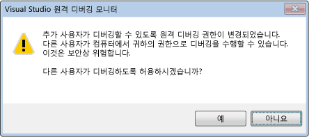

# 디버거 보안
다른 프로세스를 디버깅하는 기능을 사용하면 특히 원격으로 디버깅하는 경우 등과 같이 일반적으로 얻을 수 없는 매우 강력한 성능을 발휘할 수 있습니다. 이 경우 디버깅 중인 컴퓨터에 대해 악의적인 사용자가 디버거를 통해 광범위한 손상을 입힐 수 있습니다.  
  
 그러나 많은 개발자들은 보안 위협이 반대 방향으로 진행될 수도 있다는 사실을 깨닫지 못하고 있습니다. 디버기 프로세스의 악의적인 코드로 인해 디버깅 컴퓨터의 보안이 위험에 처할 수 있습니다. 주의해야 할 보안 위험 요소에는 여러 가지가 있습니다.  
  
## 최선의 보안 구현 방법  
 디버깅하는 코드와 디버거 사이에는 암시적 신뢰 관계가 있습니다. 임의의 코드를 디버깅하려면 이 코드의 실행에도 문제가 없어야 합니다. 즉, 디버깅하려는 대상을 신뢰할 수 있어야 합니다. 이를 신뢰할 수 없으면 디버깅도 하지 말아야 합니다. 신뢰할 수 없는 대상을 디버깅해야 하는 경우에는 위험에 노출되어도 상관없는 격리된 환경의 컴퓨터를 사용해야 합니다.  
  
 공격에 사용될 소지가 있는 부분을 줄이기 위해서는 프로덕션 시스템에서 디버깅을 수행하지 말아야 합니다. 마찬가지 이유로 디버깅은 필요한 동안만 활성화해야 합니다.  
  
### 관리되는 디버깅 보안  
 다음은 모든 관리되는 디버깅에 적용되는 몇 가지 일반적인 권장 사항입니다.  
  
-   신뢰할 수 없는 사용자의 프로세스에 연결 하는 경우 주의 해야: 이렇게 하면 없는 가정 합니다. 신뢰할 수 없는 사용자의 프로세스에 연결하려고 하면 이 프로세스에 연결할지 여부를 묻는 보안 경고 확인 대화 상자가 나타납니다. "신뢰할 수 있는 사용자"에는 **aspnet**, **localsystem**, **networkservice**및 **localservice**와 같이 .NET Framework가 설치된 컴퓨터에 일반적으로 정의되는 표준 사용자 집합과 현재 사용자가 포함됩니다. 자세한 내용은 참조 [보안 경고: 신뢰할 수 없는 사용자가 소유한 프로세스에 연결 위험할 수 있습니다. 다음 정보가 의심 스 럽 확실 하지 않은 경우이 프로세스에 연결 하지 마십시오](../debugger/security-warning-attaching-to-a-process-owned-by-an-untrusted-user.md)합니다.  
  
-   인터넷에서 프로젝트를 다운로드하여 [!INCLUDE[vsprvs](../code-quality/includes/vsprvs_md.md)]에 로드하는 경우 주의해야 합니다. 이는 디버깅을 하지 않는 경우라 해도 매우 위험한 작업입니다. 이러한 작업은 프로젝트와 여기에 포함된 코드를 신뢰할 수 있는 경우에만 수행해야 합니다.  
  
 자세한 내용은 [Debugging Managed Code](../debugger/debugging-managed-code.md)을 참조하세요.  
  
### 원격 디버깅 보안  
 로컬 디버깅은 일반적으로 원격 디버깅보다 안전합니다. 원격 디버깅을 수행하는 경우 공격자가 침투할 수 있는 지점이 더 많아집니다.  
  
 원격 디버깅에는 Visual Studio 원격 디버깅 모니터(msvsmon.exe)가 사용되고 이를 구성하기 위한 여러 가지 보안 권장 사항이 있습니다. 인증 안 함 모드는 안전하지 않으므로 인증 모드를 구성하는 방법으로는 Windows 인증을 사용하는 것이 좋습니다.  
  
   
  
 Windows 인증 모드를 사용하는 경우 msvsmon에 연결할 수 있는 권한을 신뢰할 수 없는 사용자에게 부여하면 신뢰할 수 없는 사용자가 컴퓨터에서 현재 사용자의 모든 권한을 부여 받기 때문에 위험하다는 사실을 명심해야 합니다.  
  
 알 수 없는 프로세스는 원격 컴퓨터에서 디버깅하지 말아야 합니다. 이 경우 디버거를 실행하는 컴퓨터에 나쁜 영향을 주거나 Visual Studio 원격 디버깅 모니터인 msvsmon.exe를 손상할 수 있는 잠재적 위험 요소가 있습니다. 알 수 없는 프로세스를 반드시 디버깅해야만 하는 경우 이를 로컬로 디버깅하고 방화벽을 사용하여 잠재적 위험 요인이 시스템의 다른 컴퓨터에 영향을 미치지 않도록 해야 합니다.  
  
 자세한 내용은 참조 [원격 디버깅](../debugger/remote-debugging.md)합니다.  
  
### 웹 서비스 디버깅 보안  
 디버깅은 로컬로 수행하는 것이 더 안전하지만 웹 서버에 [!INCLUDE[vsprvs](../code-quality/includes/vsprvs_md.md)] 가 설치되어 있지 않은 경우에는 로컬 디버깅을 수행할 수 없습니다. 일반적으로 웹 서비스는 개발 과정을 제외하고는 원격으로 디버깅되므로 원격 디버깅 보안에 적용되는 권장 사항이 웹 서비스 디버깅에도 적용됩니다. 다음은 추가로 적용되는 몇 가지 최선의 구현 방법입니다. 자세한 내용은 [Debugging XML Web Services](http://msdn.microsoft.com/en-us/c900b137-9fbd-4f59-91b5-9c2c6ce06f00)을 참조하세요.  
  
-   손상된 웹 서버에서는 디버깅을 활성화하지 말아야 합니다.  
  
-   웹 서버를 디버깅하기 전에 이 서버가 안전한지 확인해야 합니다. 웹 서버가 안전한지 확인할 수 없으면 해당 서버를 디버깅하지 말아야 합니다.  
  
-   인터넷에 노출되어 있는 웹 서비스를 디버깅할 때는 특히 주의해야 합니다.  
  
### 외부 구성 요소  
 특히 자신이 직접 코드를 작성하지 않은 경우 프로그램에서 상호 작용하는 외부 구성 요소의 신뢰 상태를 확인해야 합니다. [!INCLUDE[vsprvs](../code-quality/includes/vsprvs_md.md)] 또는 디버거에서 사용할 수 있는 구성 요소에 대해서도 이를 확인해야 합니다.  
  
### 기호 및 소스 코드  
 특히 보안과 관련하여 주의해야 할 [!INCLUDE[vsprvs](../code-quality/includes/vsprvs_md.md)] 도구에는 다음과 같은 두 가지가 있습니다.  
  
-   소스 코드 리포지토리에서 소스 코드의 버전을 제공하는 소스 서버. 이는 현재 버전의 프로그램 소스 코드가 없는 경우에 유용합니다. [Security Warning: Debugger Must Execute Untrusted Command](../debugger/security-warning-debugger-must-execute-untrusted-command.md).  
  
-   시스템 호출 과정에서 충돌을 디버깅하는 데 필요한 기호를 제공하기 위해 사용되는 기호 서버.  
  
 참조 [기호 (.pdb)을 지정 하 고 소스 파일](../debugger/specify-symbol-dot-pdb-and-source-files-in-the-visual-studio-debugger.md)  
  
## 참고 항목  
 [디버거 설정 및 준비](../debugger/debugger-settings-and-preparation.md)   
 [Debugger Basics](../debugger/debugger-basics.md) (디버거 기본 사항)  
 [보안 경고: 신뢰할 수 없는 사용자가 소유한 프로세스에 연결하면 위험할 수 있습니다. 다음 정보가 의심 스 럽 확실 하지 않은 경우이 프로세스에 연결 하지 마십시오](../debugger/security-warning-attaching-to-a-process-owned-by-an-untrusted-user.md)   
 [보안 경고: 디버거가 신뢰할 수 없는 명령을 실행해야 합니다.](../debugger/security-warning-debugger-must-execute-untrusted-command.md)