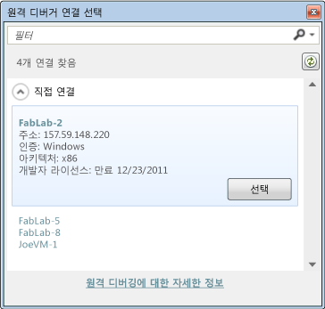
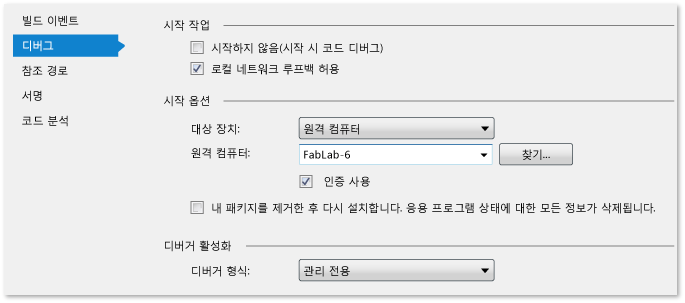

# Visual Studio에서 UWP 앱 배포
  
  
 Visual Studio 배포 기능은 작성 하 고 대상 장치에서 Visual Studio로 만든 UWP 앱을 등록 합니다. 정확히 앱이 등록되는 방법은 대상 장치가 로컬 장치인지 원격 장치인지에 따라 달라집니다.  
  
-   대상이 로컬 Visual Studio 컴퓨터인 경우 Visual Studio는 빌드 폴더에서 앱을 등록합니다.  
  
-   대상이 원격 장치인 경우 Visual Studio에서는 원격 컴퓨터로 필수 파일을 복사한 다음 해당 장치에서 앱을 등록합니다.  
  
 사용 하 여 Visual Studio에서 응용 프로그램을 디버깅할 때 배포는 자동는 **디버깅 시작** 옵션 (키보드: F5) 또는 **디버깅 하지 않고 시작** 옵션 (키보드: CTRL + F5). 또한 앱을 수동으로 배포할 수도 있습니다. 수동 배포는 다음 시나리오에서 유용합니다.  
  
-   로컬 또는 원격 컴퓨터에서 애드혹 테스트  
  
-   디버깅하려는 다른 앱을 시작할 앱 배포  
  
-   다른 앱 또는 메서드에서 시작되는 경우 디버깅할 앱 배포
  
##  UWP 앱을 배포 하는 방법  
 수동 앱 배포 프로세스는 다음과 같이 간단합니다.  
  
1.  원격 장치에 배포하는 경우 앱 시작 프로젝트의 속성 프로젝트 페이지에서 장치의 이름 또는 IP 주소를 지정합니다. 이 작업 단계는 이 항목 아래에 나열되어 있습니다.  
  
2.  디버거 Visual Studio 도구 모음의 **디버깅 시작** 단추 옆에 있는 드롭다운 목록에서 배포 대상을 선택합니다.  
  
       
  
3.  **빌드** 메뉴에서 **배포**를 선택합니다.  
  
##   원격 장치 지정 방법  

**필수 구성 요소**  
  
원격 Windows 10 장치에서 활성화 해야 [개발자 모드](/windows/uwp/get-started/enable-your-device-for-development)합니다. 작성자의 업데이트를 실행 하는 Windows 10 장치에서 이상이, 원격 도구는 자동으로 설치 되어 응용 프로그램을 배포할 때. 자세한 내용은 참조 [설치 된 응용 프로그램 패키지 디버그](../debugger/debug-installed-app-package.md)합니다.

> [!NOTE]
> Windows 8.1 및 이전 버전-작성자의 업데이트 버전의 Windows 10에서는 Visual Studio 원격 도구가 원격 장치에 설치 해야 하 고 원격 디버거를 실행 해야 합니다. Windows 8.1 개발자 라이선스를 설치 해야 합니다.
  
배포 시 원격 디버거 네트워크 채널을 사용하여 원격 장치로 앱 파일을 보냅니다.  
  
#### 원격 장치를 지정하려면  
  
1.  시작 프로젝트의 디버그 속성 페이지에서 원격 배포 대상의 이름 또는 IP 주소를 지정합니다.  
  
2.  디버그 속성 페이지를 열려면 솔루션 탐색기에서 프로젝트를 선택한 다음 바로 가기 메뉴에서 **속성** 을 선택합니다.  
  
3.  그런 다음 속성 페이지 창에서 **디버그** 노드를 선택합니다.

4. 에 대 한 **대상 장치**선택, **원격 컴퓨터**합니다.

5. 아래 **원격 컴퓨터**, 클릭 **찾을**합니다.
  
4.  이름 또는 원격 장치의 IP 주소를 입력할 수 있습니다 또는에서 장치를 선택할 수 있습니다는 **원격 연결** 대화 상자.  
  
       
  
     **원격 연결** 대화 상자에서 로컬 네트워크 서브넷 장치와 이더넷 케이블을 통해 Visual Studio 컴퓨터에 직접 연결 되어 있는 장치가 표시 됩니다.  
  
 **JavaScript 또는 Visual C++ 프로젝트 페이지에서 원격 장치 지정**  
  
   
  
1.  **실행할 디버거** 목록에서 **원격 디버거** 를 선택합니다.  
  
2.  **컴퓨터 이름** 상자에 원격 장치의 네트워크 이름을 입력합니다. 또는 상자에서 아래쪽 화살표를 선택하여 원격 디버거 연결 선택 대화 상자에서 장치를 선택할 수 있습니다.  
  
 **Visual C# 및 Visual Basic 프로젝트 페이지에서 원격 장치 지정**  
  
   
  
1.  **대상 장치** 목록에서 **원격 컴퓨터** 를 선택합니다.  
  
2.  **원격 컴퓨터** 상자에 원격 장치의 네트워크 이름을 입력하거나 **찾기** 를 클릭하여 **원격 디버거 연결 선택** 대화 상자에서 장치를 선택합니다.  
  
##   배포 옵션  
 시작 프로젝트의 디버그 속성 페이지에서 다음 배포 옵션을 설정할 수 있습니다.  
  
 **네트워크 루프백 허용**  
 보안상의 이유로 일반적인 방식으로 설치된 [!INCLUDE[win8_appname_long](../debugger/includes/win8_appname_long_md.md)] 앱은 앱이 설치된 장치에 대한 네트워크 호출을 수행할 수 없습니다. 기본적으로 Visual Studio를 배포하면 배포된 응용 프로그램에 대한 이 규칙의 예외가 만들어 집니다. 이 예외로 인해 사용자는 단일 컴퓨터에서 통신 프로시저를 테스트할 수 있습니다. 앱을 [!INCLUDE[win8_appstore_long](../debugger/includes/win8_appstore_long_md.md)]에 제출하기 전에 이 예외 없이 앱을 테스트해야 합니다.  
  
 앱에서 네트워크 루프백 예외를 제거하려면  
  
-   C# 및 VB 디버그 속성 페이지에서 **네트워크 루프백 허용** 확인란을 선택 취소합니다.  
  
-   JavaScript 및 디버그 속성 페이지에서 **네트워크 루프백 허용** 값을 **아니요**로 설정합니다.  
  
 **시작하지 않음(시작 시 코드 디버그)(C# 및 VB)/응용 프로그램 시작(JavaScript 및 C++)**  
 앱 시작 시 디버깅 세션을 자동으로 시작하도록 배포를 구성하려면  
  
-   C# 및 VB 디버그 속성 페이지에서 **시작하지 않음(시작 시 코드 디버그)** 확인란을 선택합니다.  
  
-   JavaScript 및 디버그 속성 페이지에서 **응용 프로그램 시작** 값을 **예**로 설정합니다.  
  
## 참고 항목  
 [설치 된 응용 프로그램 패키지 디버그](../debugger/debug-installed-app-package.md)합니다.   
 [Visual Studio에서 앱 실행](../debugger/run-store-apps-from-visual-studio.md)