# <a name="diagnose-problems-after-deployment"></a>배포 후 문제 진단
IntelliTrace를 사용하여 배포한 후 ASP.NET 웹앱의 문제를 진단하려면 Visual Studio에서 IntelliTrace 로그를 디버그하는 데 필요한 올바른 소스 파일과 기호 파일을 자동으로 찾을 수 있도록 릴리스에 빌드 정보를 포함합니다.  

 Microsoft Monitoring Agent를 사용하여 IntelliTrace를 제어하는 경우에는 웹 서버에서 응용 프로그램 성능 모니터링도 설정해야 합니다. 이 모니터링을 통해, 앱이 실행되는 동안 진단 이벤트가 기록되고 해당 이벤트가 IntelliTrace 로그 파일에 저장됩니다. 그런 다음 Visual Studio Enterprise(Professional 또는 Community Edition 아님)에서 이벤트를 살펴보고, 이벤트가 발생한 코드로 이동하고, 해당 시점에 기록된 값을 살펴보고, 실행된 코드의 이전이나 이후 위치로 이동할 수 있습니다. 문제를 찾아 수정한 후에는 이 사이클을 반복하여 향후 발생할 수 있는 문제를 조기에 찾아 빠르게 해결할 수 있도록 릴리스를 빌드, 릴리스, 모니터링합니다.  

 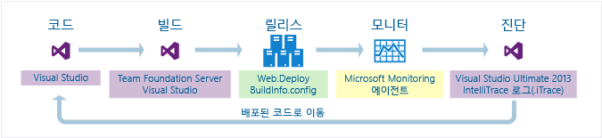  

 **이 필요 합니다.**  
  
-   Visual Studio 2017, Visual Studio 2015 또는 Team Foundation Server 2017 년 2015, 2013, 2012 또는 2010 빌드를 설정 하려면  
  
-   앱을 모니터링하고 진단 데이터를 기록하기 위한 Microsoft Monitoring Agent  

-   IntelliTrace를 사용하여 진단 데이터를 검토하고 코드를 디버그하기 위한 Visual Studio Enterprise(Professional 또는 Community Edition 아님)  

##  <a name="SetUpBuild"></a> 1 단계: 포함 정보를 릴리스에 빌드  
 빌드 프로세스를 설정하여 웹 프로젝트의 빌드 매니페스트(BuildInfo.config 파일)를 만들어 이 매니페스트를 릴리스에 포함시킵니다. 이 매니페스트에는 특정 빌드를 만드는 데 사용된 프로젝트, 소스 제어 및 빌드 시스템에 대한 정보가 포함됩니다. 기록된 이벤트를 살펴보기 위해 IntelliTrace 로그를 열면 Visual Studio가 이 매니페스트 정보를 통해 일치하는 소스 및 기호를 간단히 찾을 수 있습니다.  

###  <a name="AutomatedBuild"></a> Team Foundation Server를 사용 하 여 자동화 빌드용 빌드 매니페스트 만들기  
  
 Team Foundation 버전 제어 또는 GIT에서 다음 단계를 수행합니다.  
 
 ####  <a name="TFS2017"></a> Team Foundation Server 2017

 빌드 정의를 설정하여 소스, 빌드 및 기호의 위치를 빌드 매니페스트(BuildInfo.config 파일)에 추가합니다. Team Foundation Build가 이 파일을 자동으로 만들어 프로젝트의 출력 폴더에 저장합니다.
  
1.  ASP.NET Core (.NET Framework) 템플릿을 사용 하 여 빌드 정의 이미 있는 경우 할 수 있습니다 [빌드 정의 편집 하거나 새 빌드 정의 만듭니다.](http://msdn.microsoft.com/Library/1c2eca2d-9a65-477e-9b23-0678ff7882ee)
  
     
  
2.  새 서식 파일을 만드는 경우에 ASP.NET Core (.NET Framework) 템플릿을 선택 합니다. 
  
       
  
3.  소스가 자동으로 인덱싱되도록 기호(PDB) 파일을 저장할 위치를 지정합니다.  
  
     사용자 지정 템플릿을 사용하는 경우 해당 템플릿에 소스를 인덱싱하는 활동이 있는지 확인합니다. 나중에 기호 파일을 저장할 위치를 지정하는 MSBuild 인수를 추가합니다.
  
       
  
     기호에 대 한 자세한 내용은 [기호 데이터 게시](http://msdn.microsoft.com/Library/bd6977ca-e30a-491a-a153-671d81222ce6)합니다.  
  
4.  이 MSBuild 인수를 추가하여 TFS 및 기호 위치를 빌드 매니페스트 파일에 포함합니다.  
  
     **/p: includeservernameinbuildinfo = true**  
  
     웹 서버에 액세스할 수 있는 사용자는 누구나 빌드 매니페스트에서 이러한 위치를 참조할 수 있습니다. 원본 서버가 안전한지 확인합니다.
  
6.  새 빌드를 실행합니다.  
  
    로 이동 [2 단계: 앱 릴리스](#DeployRelease)  

####  <a name="TFS2013"></a> Team Foundation Server 2013  
 빌드 정의를 설정하여 소스, 빌드 및 기호의 위치를 빌드 매니페스트(BuildInfo.config 파일)에 추가합니다. Team Foundation Build가 이 파일을 자동으로 만들어 프로젝트의 출력 폴더에 저장합니다.  

1.  [빌드 정의 편집 하거나 새 빌드 정의 만듭니다.](http://msdn.microsoft.com/Library/1c2eca2d-9a65-477e-9b23-0678ff7882ee)  

     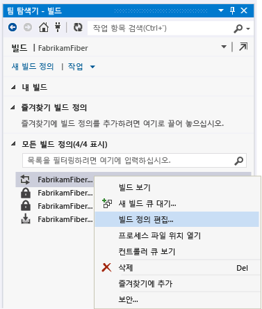  

2.  기본 템플릿(TfvcTemplate.12.xaml) 또는 사용자 지정 템플릿을 선택합니다.  

       

3.  소스가 자동으로 인덱싱되도록 기호(PDB) 파일을 저장할 위치를 지정합니다.  

     사용자 지정 템플릿을 사용하는 경우 해당 템플릿에 소스를 인덱싱하는 활동이 있는지 확인합니다. 나중에 기호 파일을 저장할 위치를 지정하는 MSBuild 인수를 추가합니다.  

     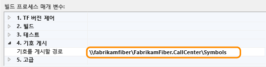  

     기호에 대 한 자세한 내용은 [기호 데이터 게시](http://msdn.microsoft.com/Library/bd6977ca-e30a-491a-a153-671d81222ce6)합니다.  

4.  이 MSBuild 인수를 추가하여 TFS 및 기호 위치를 빌드 매니페스트 파일에 포함합니다.  

     **/p: includeservernameinbuildinfo = true**  
  
     웹 서버에 액세스할 수 있는 사용자는 누구나 빌드 매니페스트에서 이러한 위치를 참조할 수 있습니다. 원본 서버가 안전한지 확인합니다.

5.  사용자 지정 템플릿을 사용하는 경우 이 MSBuild 인수를 추가하여 기호 파일을 저장할 위치를 지정합니다.  
  
     **/p:BuildSymbolStorePath =**\<*기호에 대 한 경로*>  
  
     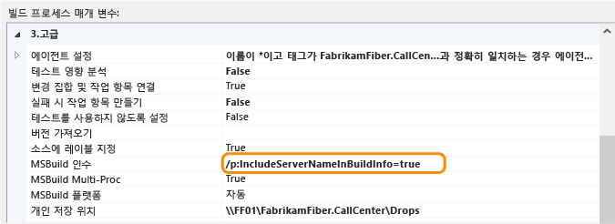  
  
     다음 줄을 웹 프로젝트 파일(.csproj, .vbproj)에 추가합니다.  
  
    ```  
    <!-- Import the targets file. Change the folder location as necessary. -->  
       <Import Project=""$(MSBuildExtensionsPath)\Microsoft\VisualStudio\v$(VisualStudioVersion)\BuildInfo\Microsoft.VisualStudio.ReleaseManagement.BuildInfo.targets" />  
  
    ```  

     웹 서버에 액세스할 수 있는 사용자는 누구나 빌드 매니페스트에서 이러한 위치를 참조할 수 있습니다. 원본 서버가 안전한지 확인합니다.  

6.  새 빌드를 실행합니다.  

    로 이동 [2 단계: 앱 릴리스](#DeployRelease)  

####  <a name="TFS2012_2010"></a> Team Foundation Server 2012 또는 2010  
 다음 단계에 따라 프로젝트에 대한 빌드 매니페스트(BuildInfo.config 파일)를 자동으로 만들고 프로젝트의 출력 폴더에 파일을 저장합니다. 이 파일은 출력 폴더에 "*ProjectName*.BuildInfo.config"로 표시되지만 앱 게시 후 배포 폴더에는 "BuildInfo.config"라는 이름으로 바뀝니다.  

1.  Team Foundation Build 서버에 임의 버전의 Visual Studio 2013을 설치합니다.  

2.  소스가 자동으로 인덱싱되도록 빌드 정의에서 기호를 저장할 위치를 지정합니다.  

     사용자 지정 템플릿을 사용하는 경우 해당 템플릿에 소스를 인덱싱하는 활동이 있는지 확인합니다.  

3.  빌드 정의에 다음과 같은 MSBuild 인수를 추가합니다.  

    -   **/p:VisualStudioVersion 12.0 =**  

    -   **/p:MSBuildAssemblyVersion 12.0 =**  

    -   **/tv:12.0**  

    -   **/p: includeservernameinbuildinfo = true**  

    -   **/p:BuildSymbolStorePath =**\<*기호에 대 한 경로*>  

4.  새 빌드를 실행합니다.  

    로 이동 [2 단계: 앱 릴리스](#DeployRelease)  

###  <a name="ManualBuild"></a> Visual Studio를 사용 하 여 수동 빌드용 빌드 매니페스트 만들기  
 다음 단계에 따라 프로젝트에 대한 빌드 매니페스트(BuildInfo.config 파일)를 자동으로 만들고 프로젝트의 출력 폴더에 파일을 저장합니다. 이 파일은 출력 폴더에 "*ProjectName*.BuildInfo.config"로 표시되지만 앱 게시 후 배포 폴더에는 "BuildInfo.config"라는 이름으로 바뀝니다.  

1.  **솔루션 탐색기**에서 웹 프로젝트를 언로드합니다.  

2.  프로젝트 파일(.csproj, .vbproj)을 엽니다. 다음 줄을 추가합니다.  

    ```xml  
    <!-- **************************************************** -->  
    <!-- Build info -->  
    <PropertyGroup>  
       <!-- Generate the BuildInfo.config file -->  
       <GenerateBuildInfoConfigFile>True</GenerateBuildInfoConfigFile>  
       <!-- Include server name in build info -->   
       <IncludeServerNameInBuildInfo>True</IncludeServerNameInBuildInfo>   
       <!-- Include the symbols path so Visual Studio can find the matching deployed code when you start debugging. -->  
       <BuildSymbolStorePath><path to symbols></BuildSymbolStorePath>  
    </PropertyGroup>  
    <!-- **************************************************** -->  
    ```  

3.  업데이트된 프로젝트 파일을 체크 인합니다.  

4.  새 빌드를 실행합니다.  

    로 이동 [2 단계: 앱 릴리스](#DeployRelease)  

###  <a name="MSBuild"></a> MSBuild.exe를 사용 하 여 수동 빌드용 빌드 매니페스트 만들기  
 빌드를 실행할 때 다음의 빌드 인수를 추가합니다.  

 **/p:GenerateBuildInfoConfigFile = true**  

 **/p: includeservernameinbuildinfo = true**  

 **/p:BuildSymbolStorePath =**\<*기호에 대 한 경로*>  

##  <a name="DeployRelease"></a> 2 단계: 앱 릴리스  
 빌드 프로세스에서 만들어진 [Web.Deploy 패키지](http://msdn.microsoft.com/library/dd394698.aspx) 를 사용하여 앱을 배포할 경우 빌드 매니페스트는 자동으로 "*ProjectName*.BuildInfo.config"에서 "BuildInfo.config"라는 이름으로 바뀌어 웹 서버에서 앱의 Web.config 파일과 같은 폴더에 저장됩니다.  

 다른 방법을 사용하여 앱을 배포할 경우에는 빌드 매니페스트가 "*ProjectName*.BuildInfo.config"에서 "BuildInfo.config"라는 이름으로 바뀌어 웹 서버에서 앱의 Web.config 파일과 같은 폴더에 저장되었는지 확인해야 합니다.  

## <a name="step-3-monitor-your-app"></a>3단계: 앱 모니터링  
 앱의 문제를 모니터링하고 진단 이벤트를 기록하고 해당 이벤트를 IntelliTrace 로그 파일에 저장할 수 있도록 웹 서버에 응용 프로그램 성능 모니터링을 설정합니다. 참조 [배포 문제에 대해 릴리스 모니터링](../debugger/using-the-intellitrace-stand-alone-collector.md)합니다.  

##  <a name="InvestigateEvents"></a> 4 단계: 문제 찾기  
 IntelliTrace를 사용하여 기록된 이벤트를 검토하고 코드를 디버그하려면 개발 컴퓨터 또는 다른 컴퓨터에 Visual Studio Enterprise가 있어야 합니다. 문제 진단을 도와주는 CodeLens, 디버거 지도 및 코드 맵 등의 도구를 사용할 수도 있습니다.  

### <a name="open-the-intellitrace-log-and-matching-solution"></a>IntelliTrace 로그 및 연결 솔루션 열기  

1.  Visual Studio Enterprise에서 IntelliTrace 로그(.iTrace 파일)를 엽니다. 같은 컴퓨터에 Visual Studio Enterprise가 설치된 경우에는 파일을 두 번 클릭합니다.  

2.  프로젝트가 솔루션에 포함되어 빌드되지 않은 경우 Visual Studio가 일치하는 솔루션이나 프로젝트를 자동으로 열도록 하려면 **솔루션 열기** 를 선택합니다. [Q: IntelliTrace 로그 배포 된 앱에 대 한 정보가 없습니다. 그 이유는 무엇입니까? 어떻게 해야 합니까?](#InvalidConfigFile)  

     Visual Studio는 일치하는 솔루션 또는 프로젝트를 열 때 보류 중인 변경 내용을 자동으로 보류하지 않습니다. 이 보류 집합에 대해 자세한 정보를 가져오려면 **출력** 창 또는 **팀 탐색기**를 확인합니다.  

     변경하기 전에 올바른 소스가 있는지 확인하세요. 분기를 사용하는 경우 Visual Studio가 일치하는 소스를 찾는 위치와 다른 분기에서 작업하는 중일 수 있습니다(예: 릴리스 분기).  

     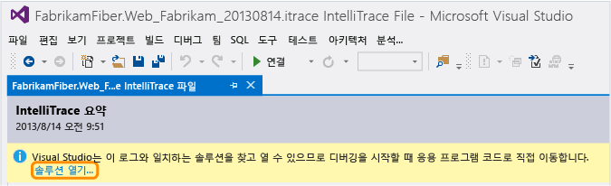  

     이 솔루션 또는 프로젝트에 매핑된 기존의 작업 영역이 있는 경우 Visual Studio는 해당 작업 영역을 선택하여 검색된 소스를 추가합니다.  

       

     그렇지 않을 경우, 다른 작업 영역을 선택하거나 새 작업 영역 만듭니다. Visual Studio가 전체 분기를 이 작업 영역에 매핑합니다.  

     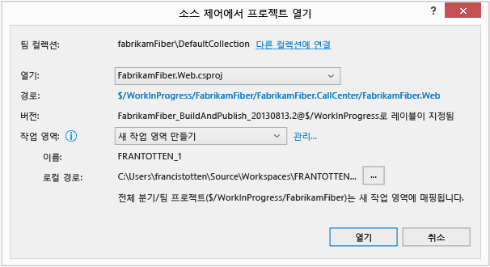  

     사용자의 컴퓨터 이름이 아닌 다른 이름 또는 특정 매핑으로 작업 영역을 만들려면 **관리**를 선택합니다.  

     [Q: 이유는 Visual Studio 예를 들어 선택한 작업 영역이 적합 하지?](#IneligibleWorkspace)  

     [팀 컬렉션이 나 다른 컬렉션을 선택할 때까지 계속할 수 없는 q](#ChooseTeamProject)  

### <a name="diagnose-a-performance-problem"></a>성능 문제 진단  

1.  **성능 위반**에서 기록된 성능 이벤트, 총 실행 시간 및 기타 이벤트 정보를 검토합니다. 그런 다음 특정 성능 이벤트 중 호출된 메서드를 자세히 살펴봅니다.  

       

     이벤트를 두 번 클릭할 수도 있습니다.  

2.  이벤트 페이지에서 이러한 호출의 실행 시간을 검토합니다. 실행 트리에서 느린 호출을 찾습니다.  

     가장 느린 호출은 여러 번 호출하거나 중첩될 때 등의 경우 자신의 섹션에 나타납니다.  

     해당 호출을 확장하여 특정 시점에 기록된 중첩 호출과 값을 검토합니다. 그런 다음 해당 호출에서 디버깅을 시작합니다.  

       

     또한 호출을 두 번 클릭할 수도 있습니다.  

     메서드가 응용 프로그램 코드에 있는 경우 Visual Studio가 해당 메서드로 이동합니다.  

       

     이제 다른 기록된 값, 호출 스택을 검토하고 코드를 단계적으로 실행하거나 **IntelliTrace** 창을 사용하여 이 성능 이벤트 동안 호출된 [다른 메서드 사이에 "in time"을 뒤나 앞으로 이동](../debugger/intellitrace.md) 합니다. [기타 모든 이벤트 및 IntelliTrace 로그의 정보는 무엇입니까? ](../debugger/using-saved-intellitrace-data.md) [다른 수행할 수 있는 여기에서?](#WhatElse) [성능 이벤트에 대 한 자세한 정보가 필요?](http://blogs.msdn.com/b/visualstudioalm/archive/2013/09/20/performance-details-in-intellitrace.aspx)  

### <a name="diagnose-an-exception"></a>예외 진단  

1.  **예외 데이터**에서 기록된 예외 이벤트, 해당 유형, 메시지 및 예외가 발생한 시간을 검토합니다. 코드를 자세히 살펴보려면 예외 그룹의 가장 최근 이벤트부터 디버깅을 시작합니다.  

       

     이벤트를 두 번 클릭할 수도 있습니다.  

     응용 프로그램 코드에서 예외가 발생하는 경우 Visual Studio가 예외가 발생한 위치로 이동합니다.  

       

     이제 다른 기록된 값, 호출 스택을 검토하거나 **IntelliTrace** 창을 사용하여 [다른 기록된 이벤트 사이의 "in time"](../debugger/intellitrace.md), 관련 코드 및 이 시점에 기록된 값을 뒤나 앞으로 이동합니다. [기타 모든 이벤트 및 IntelliTrace 로그의 정보는 무엇입니까?](../debugger/using-saved-intellitrace-data.md)  

###  <a name="WhatElse"></a> 여기에서 그 외 무엇을 수행할 수 있습니까?  

-   [이 코드에 대 한 자세한 정보를 가져올](../ide/find-code-changes-and-other-history-with-codelens.md)합니다. 이 코드에 대 한 참조를 찾으려면 변경 기록, 관련된 버그, 작업 항목, 코드 검토 또는 단위 테스트-편집기 내 all-편집기에서 CodeLens 표시기 사용 합니다.  

     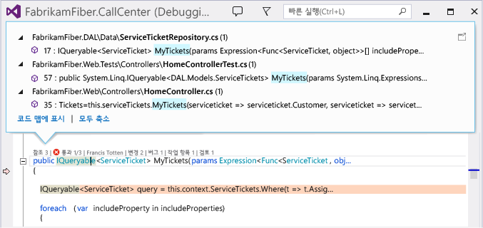  

     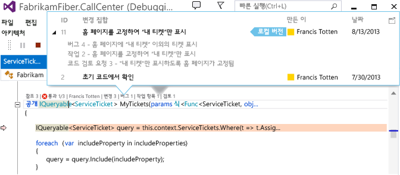  

-   [디버그할 때 코드 내에서 위치를 매핑하십시오.](../debugger/map-methods-on-the-call-stack-while-debugging-in-visual-studio.md) 디버깅 세션 중에 호출된 메서드를 시각적으로 추적하려면 호출 스택을 매핑합니다.  

     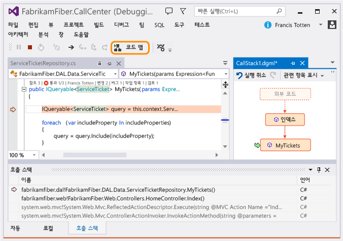  

###  <a name="FAQ"></a> Q & A  

####  <a name="WhyInclude"></a> 내 프로젝트, 소스 제어, 빌드 및 기호를 릴리스에 대 한 정보를 포함 q?  
 Visual Studio는 이러한 정보를 사용하여, 디버깅하려는 릴리스에 맞는 솔루션 및 소스를 찾아냅니다. IntelliTrace 로그를 열고 이벤트를 선택하여 디버깅을 시작하면, Visual Studio는 기호를 사용하여 이벤트가 발생한 코드를 찾아 보여줍니다. 그런 다음 기록된 값을 살펴보고 코드 실행 이전 또는 이후 위치로 이동할 수 있습니다.  

 TFS와이 정보를 사용 하는 경우 빌드 매니페스트 (BuildInfo.config 파일), 일치 하는 소스 및 기호에 현재 연결 된 TFS에 대 한 Visual Studio 검색 되지 않습니다. Visual Studio가 올바른 TFS나 일치하는 소스를 찾을 수 없는 경우에는 다른 TFS를 선택하라는 메시지가 표시됩니다.  

####  <a name="InvalidConfigFile"></a> Q: IntelliTrace 로그 배포 된 앱에 대 한 정보가 없습니다. 그 이유는 무엇입니까? 어떻게 해야 합니까?  
 개발 컴퓨터에서 배포하거나 배포 시 TFS에 연결되어 있지 않은 경우에 이러한 문제가 발생할 수 있습니다.  

1.  프로젝트의 배포 폴더로 이동합니다.  

2.  빌드 매니페스트(BuildInfo.config 파일)를 찾아 엽니다.  

3.  필요한 정보가 파일에 포함되어 있는지 확인합니다.  

-   **ProjectName**  

     Visual Studio에서의 프로젝트의 이름입니다. 예를 들어:  

    ```  
    <ProjectName>FabrikamFiber.Extranet.Web</ProjectName>  
    ```  

-   **했습니다. SourceControl**  

-   소스 제어 시스템 및 다음의 필수 속성에 대한 정보입니다.  

    -   **TFS**  

        -   **ProjectCollectionUri**: Team Foundation Server 및 프로젝트 컬렉션의 URI  

        -   **ProjectItemSpec**: 앱 프로젝트 파일(.csproj 또는 .vbproj)의 경로  

        -   **ProjectVersionSpec**: 프로젝트 버전  

         예를 들어:  

        ```  
        <SourceControl type="TFS">  
           <TfsSourceControl>  
              <ProjectCollectionUri>http://fabrikamfiber:8080/tfs/FabrikamFiber</ProjectCollectionUri>  
              <ProjectItemSpec>$/WorkInProgress/FabrikamFiber/FabrikamFiber.CallCenter/FabrikamFiber.Web/FabrikamFiber.Web.csproj</ProjectItemSpec>  
              <ProjectVersionSpec>LFabrikamFiber_BuildAndPublish_20130813@$/WorkInProgress</ProjectVersionSpec>  
           </TfsSourceControl>  
        </SourceControl>  
        ```  

    -   **Git**  

        -   **GitSourceControl**: **GitSourceControl** 스키마의 위치  

        -   **RepositoryUrl**: Team Foundation Server, 프로젝트 컬렉션 및 Git 리포지토리의 URI  

        -   **ProjectPath**: 앱 프로젝트 파일(.csproj 또는 .vbproj)의 경로  

        -   **CommitId**: 커밋 id  

         예를 들어:  

        ```  
        <SourceControl type="Git">   
           <GitSourceControl xmlns="http://schemas.microsoft.com/visualstudio/deploymentevent_git/2013/09">  
              <RepositoryUrl>http://gittf:8080/tfs/defaultcollection/_git/FabrikamFiber</RepositoryUrl>  
              <ProjectPath>/FabrikamFiber.CallCenter/FabrikamFiber.Web/FabrikamFiber.Web.csproj</ProjectPath>  
              <CommitId>50662c96502dddaae5cd5ced962d9f14ec5bc64d</CommitId>  
           </GitSourceControl>  
        </SourceControl>  
        ```  

-   **빌드**  

     빌드 시스템(`"TeamBuild"` 또는 `"MSBuild"`) 및 다음의 필수 속성에 대한 정보입니다.  

    -   **BuildLabel** (TeamBuild용): 빌드 이름 및 번호입니다. 이 레이블은 배포 이벤트의 이름으로도 사용됩니다. 빌드 번호에 대 한 자세한 내용은 참조 하십시오. [빌드 완료 된 빌드에 의미 있는 이름을 지정 하는 숫자를 사용 하 여](http://msdn.microsoft.com/Library/1f302e9d-4b0a-40b5-8009-b69ca6f988c3)합니다.  

    -   **SymbolPath** (권장): 세미콜론으로 구분한 기호(PDB 파일) 위치 URI 목록입니다. 이러한 URI는 URL 또는 UNC일 수 있습니다. 이 정보를 통해 Visual Studio에서는 사용자가 디버깅을 손쉽게 할 수 있도록 일치하는 기호를 쉽게 찾을 수 있습니다.  

    -   **BuildReportUrl** (TeamBuild용): TFS 내 빌드 보고서의 위치  

    -   **BuildId** (TeamBuild용): TFS 내 빌드 세부 정보의 URI 이 URI는 배포 이벤트의 ID로도 사용됩니다. TeamBuild를 사용하지 않을 경우 고유 ID여야 합니다.  

    -   **BuiltSolution**: Visual Studio에서 일치하는 솔루션을 찾고 열기 위해 사용하는 솔루션 파일의 경로입니다. **SolutionPath** MsBuild 속성의 내용입니다.  

     예를 들어:  

    -   **TFS**  

        ```  
        <Build type="TeamBuild">  
           <MsBuild>  
              <BuildLabel kind="label">FabrikamFiber_BuildAndPublish_20130813.1</BuildLabel>  
              <SymbolPath>\\fabrikamfiber\FabrikamFiber.CallCenter\Symbols</SymbolPath>  
              <BuildReportUrl kind="informative, url" url="http://fabrikamfiber:8080/tfs/FabrikamFiber/_releasePipeline/FindRelease?buildUri=fabrikamfiber%3a%2f%2f%2fBuild%2fBuild%2f448">Build Report Url</BuildReportUrl>  
              <BuildId kind="id">1c4444d2-518d-4673-a590-dce2773c7744,fabrikamfiber:///Build/Build/448</BuildId>  
              <BuiltSolution>$/WorkInProgress/FabrikamFiber/FabrikamFiber.CallCenter/FabrikamFiber.CallCenter.sln</BuiltSolution>  
           </MsBuild>  
        </Build>  
        ```  

    -   **Git**  

        ```  
        <Build type="MSBuild">   
           <MSBuild>  
              <SymbolPath>\\gittf\FabrikamFiber.CallCenter\Symbols</SymbolPath>  
              <BuiltSolution>/FabrikamFiber.CallCenter/FabrikamFiber.CallCenter.sln</BuiltSolution>  
           </MSBuild>  
        </Build>  
        ```  

####  <a name="IneligibleWorkspace"></a> Q: 이유는 Visual Studio 예를 들어 선택한 작업 영역이 적합 하지?  
 **A:** 선택된 작업 영역에는 소스 제어 폴더와 로컬 폴더 간의 매핑이 없습니다. 이 작업 영역에 대한 매핑을 만들려면 **관리**를 선택합니다. 그렇지 않으면, 이미 매핑된 작업 영역을 선택하거나 새 작업 영역 만듭니다.  

 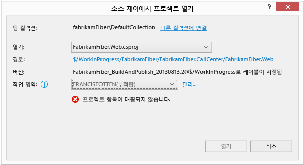  

####  <a name="ChooseTeamProject"></a> 팀 컬렉션이 나 다른 컬렉션을 선택할 때까지 계속할 수 없는 q  
 **A:** 이 문제는 다음과 같은 이유로 인해 발생할 수 있습니다.  

-   Visual Studio가 TFS에 연결되어 있지 않습니다.  

     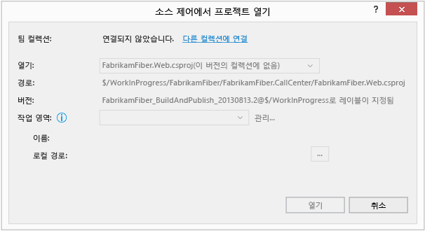  

-   Visual Studio가 사용자의 현재 팀 컬렉션에서 솔루션 또는 프로젝트를 찾지 못했습니다.  

     빌드 매니페스트 파일 (\<*ProjectName*> 합니다. BuildInfo.config) Visual Studio에서 일치 하는 소스를 찾을 수는 위치를 지정 하지 않으면 Visual Studio 현재 연결 된 TFS를 사용 하 여 일치 하는 솔루션 또는 프로젝트를 찾습니다. 현재 팀 컬렉션에 일치하는 소스가 없는 경우 Visual Studio는 다른 팀 컬렉션에 연결할 것인지 묻는 메시지를 표시합니다.  

-   Visual Studio가 빌드 매니페스트 파일에서 지정한 컬렉션에서 솔루션 또는 프로젝트를 찾지 못했습니다 (\<*ProjectName*> 합니다. BuildInfo.config)입니다.  

     새 TFS로 마이그레이션했기 때문에 지정된 TFS에는 더 이상 일치하는 소스가 없거나 존재하지 않을 수 있습니다. 지정한 TFS가 존재하지 않는 경우 Visual Studio는 1분 정도 후에 시간 초과된 다음 다른 컬렉션에 연결하라는 메시지를 표시할 수 있습니다. 계속하려면 올바른 TFS 서버에 연결합니다.  

     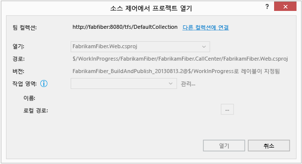  

####  <a name="WhatWorkspace"></a> Q: 작업 영역 이란?  
 **A:** 프로그램 [작업 영역은 소스 사본을 저장](http://msdn.microsoft.com/Library/1d7f6ed8-ec7c-48f8-86da-9aea55a90d5a) 을 개발 하 고 별도로 테스트 하기 전에 확인 작업에서 수 있도록 합니다. 발견된 솔루션 또는 프로젝트에 특별히 매핑된 작업 영역이 아직 없는 경우 Visual Studio는 사용 가능한 작업 영역을 선택하거나 기본 작업 영역 이름으로 사용자 컴퓨터 이름을 사용하는 새 작업 영역을 만들 것인지 묻는 메시지를 표시합니다.  

####  <a name="UntrustedSymbols"></a> 신뢰할 수 없는 기호에 대 한이 메시지는 q 습 니가?  
 ![트러스트 되지 않은 기호 경로 사용 하 여 디버그? ] (../debugger/media/ffr_ituntrustedsymbolpaths.png "FFR_ITUntrustedSymbolPaths")  

 **A:** 이 메시지를 표시 하는 경우 빌드 매니페스트 파일에 기호 경로 (\<*p r o j*> 합니다. BuildInfo.config)의 신뢰할 수 있는 기호 경로 목록에 포함 되지 않습니다. 디버거 옵션에서 기호 경로 목록에 경로를 추가할 수 있습니다.
