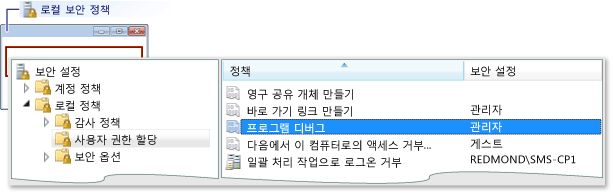
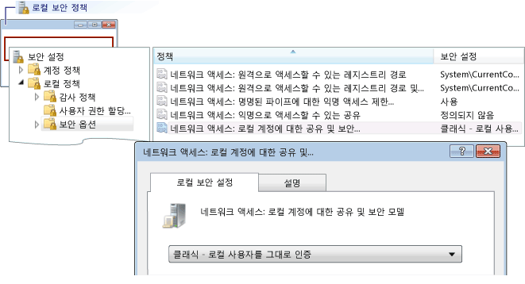

# 오류: 작업 그룹 원격 로그온 실패
[!INCLUDE[vs2017banner](../code-quality/includes/vs2017banner.md)]

이 오류의 의미는 다음과 같습니다.  
  
 로그온 실패: 사용자 이름을 알 수 없거나 암호가 잘못되었습니다.  
  
 **원인**  
  
 이 오류는 작업 그룹의 컴퓨터에서 디버깅하는 경우 원격 컴퓨터에 연결할 때 발생할 수 있습니다.  이 오류가 발생하는 원인은 다음과 같습니다.  
  
-   원격 컴퓨터에 이름과 암호가 일치하는 계정이 없습니다.  
  
-   Visual Studio 컴퓨터와 원격 컴퓨터가 둘 다 작업 그룹에 있는 경우 이 오류는 원격 컴퓨터의 기본 **로컬 보안 정책** 설정으로 인해 발생할 수 있습니다.  **로컬 보안 정책**은 **게스트 전용 \- 로컬 사용자를 게스트로 인증**으로 기본 설정되어 있습니다.  이 설정에서 디버깅하려면 원격 컴퓨터의 설정을 **일반 \- 로컬 사용자를 그대로 인증**으로 변경해야 합니다.  
  
> [!NOTE]
>  다음 작업을 수행하려면 관리자 권한이 있어야 합니다.  
  
### 로컬 보안 정책 창을 열려면  
  
1.  **secpol.msc** MMC\(Microsoft Management Console\) 스냅인을 시작합니다.  Windows 검색, Windows 실행 상자 또는 명령 프롬프트에 secpol.msc를 입력합니다.  
  
### 사용자 권한 할당을 추가하려면  
  
1.  로컬 보안 설정을 엽니다.  
  
2.  **로컬 보안 정책** 창을 엽니다.  
  
3.  **로컬 정책** 폴더를 확장합니다.  
  
4.  **사용자 권한 할당**을 클릭합니다.  
  
5.  **정책** 열에서 **프로그램 디버그**를 두 번 클릭하여 **로컬 보안 설정** 대화 상자에서 현재 로컬 그룹 정책 할당 내용을 확인합니다.  
  
       
  
6.  새 사용자를 추가하려면 **사용자 또는 그룹 추가** 단추를 클릭합니다.  
  
### 공유 및 보안 모델을 변경하려면  
  
1.  **로컬 보안 정책** 창을 엽니다.  
  
2.  **로컬 정책** 폴더를 확장합니다.  
  
3.  **보안 옵션**을 클릭합니다.  
  
4.  **정책** 열에서 **네트워크 액세스: 로컬 계정에 대한 공유 및 보안**을 두 번 클릭합니다.  
  
5.  **네트워크 액세스: 로컬 계정에 대한 공유 및 보안** 대화 상자의 값을 **일반 \- 로컬 사용자를 그대로 인증**으로 변경하고 **적용** 단추를 클릭합니다.  
  
       
  
## 참고 항목  
 [원격 디버깅 오류 및 문제 해결](../debugger/remote-debugging-errors-and-troubleshooting.md)   
 [원격 디버깅](../debugger/remote-debugging.md)