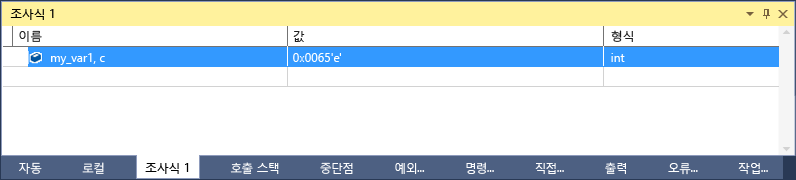

# <a name="format-specifiers-in-c-in-the-visual-studio-debugger"></a>Visual Studio 디버거에서의 c + +에서 형식 지정자
형식 지정자를 사용하여 **조사식** 창에 값이 표시되는 형식을 변경할 수 있습니다.  
  
 형식 지정자를 사용할 수도 있습니다는 **직접 실행** 창은 **명령** 창, [추적점](../debugger/using-breakpoints.md#BKMK_Print_to_the_Output_window_with_tracepoints), 및 소스 창 에서도 합니다. 이러한 창에서 식을 일시 중지 하면 결과가 DataTip에 나타납니다. DataTip 표시는 형식 지정자를 반영합니다.  
  
> [!NOTE]
>  Visual Studio 네이티브 디버거가 새로운 디버깅 엔진으로 변경 하는 경우 추가 된 몇 가지 새로운 형식 지정자 및 일부 이전 구성을 제거 되었습니다. C++/CLI를 사용하여 interop(혼합 네이티브 및 관리) 디버깅을 수행할 때 이전 디버거가 계속 사용됩니다. 이 항목의 다음 섹션에서는 각 디버그 엔진에 대한 형식 지정자를 보여 줍니다.
>   
>  -   [형식 지정자](#BKMK_Visual_Studio_2012_format_specifiers) 에서는 새로운 디버깅 엔진의 형식 지정자에 대해 설명합니다.  
> -   [C++/CLI를 사용하는 interop 디버깅의 형식 지정자](#BKMK_Format_specifiers_for_interop_debugging_and_C___edit_and_continue) 에서는 이전 디버깅 엔진의 형식 지정자에 대해 설명합니다.  
  
## <a name="using-format-specifiers"></a>형식 지정자 사용  
 다음과 같은 코드를 가정해 봅니다.  
  
```C++  
int main() {  
    int my_var1 = 0x0065;  
    int my_var2 = 0x0066;  
    int my_var3 = 0x0067;  
}  
```  
  
 추가 `my_var1` 변수를 **조사식** 창 (디버깅 하는 동안 **디버그 > Windows > 조사식 > 조사식 1**), 표시를 16 진수로 설정 합니다 (에 **시청**창에서 변수를 마우스 오른쪽 단추로 클릭 하 고 선택 **16 진수 표시**). 이제는 조사식 창에서 변수의 값이 0x0065로 표시됩니다. 정수 대신 문자로 표현된 이 값을 보려면 이름 열에서 변수 이름 뒤에 문자 형식 지정자 **, c**를 추가합니다. 이제 **값** 열에 **101 'e'**가 표시됩니다.  
  
   
  
##  <a name="BKMK_Visual_Studio_2012_format_specifiers"></a> 형식 지정자  
 다음 표에서는 Visual Studio에서 사용할 수 있는 형식 지정자를 보여 줍니다. 굵게 표시된 지정자는 C++/CLI를 사용하는 interop 디버깅에 대해 지원되지 않습니다.  
  
|지정자|서식|원래 조사식 값|표시되는 값|  
|---------------|------------|--------------------------|---------------------|  
|일|10진수 정수|0x00000066|102|  
|o|부호 없는 8진수 정수|0x00000066|000000000146|  
|x<br /><br /> **h**|16진수 정수|102|0xcccccccc|  
|X<br /><br /> **H**|16진수 정수|102|0xCCCCCCCC|  
|c|단일 문자|0x0065, c|101 'e'|  
|s|const char* 문자열|\<위치 > "hello world"|"hello world"|  
|**sb**|const char * 문자열 (인용 부호 제외)|\<위치 > "hello world"|hello world|  
|s8|UTF-8 문자열|\<위치 > "이것이 u t F-8 커피 컵 ☕"|"This is u t F-8 커피 컵 ☕"|
|**s8b**|U t F-8 문자열 (인용 부호 제외)|\<위치 > "hello world"|hello world|  
|su|유니코드 (utf-16 인코딩) 문자열|\<위치 > L "hello world"|L"hello world"<br /><br /> u"hello world"|  
|sub|유니코드 (utf-16 인코딩) 문자열 (인용 부호 제외)|\<위치 > L "hello world"|hello world|  
|bstr|BSTR 문자열|\<위치 > L "hello world"|L"hello world"|  
|env|환경 블록 (이중 null 종료 문자열)|\<location> L"=::=::\\\\"|L"=::=::\\\\\\0=C:=C:\\\\windows\\\\system32\\0ALLUSERSPROFILE=...|
|**s32**|UTF-32 문자열|\<위치 > U "hello world"|u"hello world"|  
|**s32b**|UTF-32 문자열(따옴표 제외)|\<위치 > U "hello world"|hello world|  
|**en**|enum|Saturday(6)|토요일|  
|**hv**|포인터 유형 - 검사 중인 포인터 값이 배열의 힙 할당 결과임을 나타냅니다(예: `new int[3]`).|\<위치 > {\<첫 번째 멤버 >}|\<위치 > {\<첫 번째 멤버 >, \<두 번째 멤버 >, …}|  
|**na**|개체에 대한 포인터의 메모리 주소를 표시하지 않습니다.|\<위치 >, {멤버 = value …}|{멤버 = value …}|  
|**nd**|파생된 클래스는 무시하고 기본 클래스 정보만 표시합니다.|`(Shape*) square` 에는 기본 클래스 및 파생 클래스 정보가 포함됩니다.|기본 클래스 정보만 표시합니다.|  
|hr|HRESULT 또는 Win32 오류 코드. 이제 디버거가 자동으로 HRESULT를 디코딩하므로 해당 경우에는 이 지정자가 필요하지 않습니다.|S_OK|S_OK|  
|wc|Window 클래스 플래그|0x0010|WC_DEFAULTCHAR|  
|wm|Windows 메시지 번호|16|WM_CLOSE|  
|!|원시 형식. 모든 데이터 형식 뷰의 사용자 지정을 무시합니다.|\<표시를 사용자 지정 >|4|  
  
> [!NOTE]
>  **hv** 형식 지정자가 있는 경우 디버거는 버퍼의 길이를 확인하고 적절한 요소 수를 표시하려고 합니다. 디버거에서 항상 배열의 정확한 버퍼 크기를 찾을 수는 없으므로 가능한 한 크기 지정자 `(pBuffer,[bufferSize])` 를 사용해야 합니다. **hv** 형식 지정자는 버퍼 크기를 즉시 사용할 수 없는 시나리오를 위한 것입니다.  
  
###  <a name="BKMK_Size_specifiers_for_pointers_as_arrays_in_Visual_Studio_2012"></a> 배열로 사용되는 포인터에 대한 크기 지정자  
 배열로 표시할 개체에 대한 포인터가 있는 경우 다음과 같이 정수 또는 식을 사용하여 배열 요소의 수를 지정할 수 있습니다.  
  
|지정자|서식|원래 조사식 값|표시되는 값|  
|---------------|------------|---------------------------|---------------------|  
|n|10진수 또는 **16진수** 정수|pBuffer,[32]<br /><br /> pBuffer,**[0x20]**|`pBuffer` 를 요소가 32개인 배열로 표시합니다.|  
|**[exp]**|정수로 확인되는 유효한 C++ 식입니다.|pBuffer,[bufferSize]|PBuffer를 `bufferSize` 요소의 배열로 표시합니다.|  
|**expand(n)**|정수로 확인되는 유효한 C++ 식입니다.|pBuffer, expand(2)| `pBuffer`|  
  
##  <a name="BKMK_Format_specifiers_for_interop_debugging_and_C___edit_and_continue"></a> C++/CLI를 사용하는 interop 디버깅의 형식 지정자  
 **굵게** 표시된 지정자는 네이티브 및 C++/CLI 코드 디버깅에 대해서만 지원됩니다.  
  
|지정자|서식|원래 조사식 값|표시되는 값|  
|---------------|------------|--------------------------|---------------------|  
|**d,i**|부호 있는 10진수 정수|0xF000F065|-268373915|  
|**u**|부호 없는 10진수 정수|0x0065|101|  
|o|부호 없는 8진수 정수|0xF065|0170145|  
|x,X|16진수 정수|61541|0x0000f065|  
|**l,h**|d, i, u, o, x, X에 대한 long 또는 short 접두사|00406042|0x0c22|  
|**f**|부호 있는 부동 소수점|(3./2.), f|1.500000|  
|**e**|부호 있는 과학적 표기법|(3.0/2.0)|1.500000e+000|  
|**g**|부호 있는 부동 소수점 또는 부호 있는 과학적 표기법 중에서 짧은 형식|(3.0/2.0)|1.5|  
|c|단일 문자|\<location>|101 'e'|  
|s|const char*|\<location>|"hello world"|  
|su|const wchar_t*<br /><br /> const char16_t\*|\<location>|L"hello world"|  
|sub|const wchar_t*<br /><br /> const char16_t\*|\<location>|hello world|  
|s8|const char*|\<location>|"hello world"|  
|hr|HRESULT 또는 Win32 오류 코드. 이제 디버거가 자동으로 HRESULT를 디코딩하므로 해당 경우에는 이 지정자가 필요하지 않습니다.|S_OK|S_OK|  
|wc|Window 클래스 플래그|0x00000040,|WC_DEFAULTCHAR|  
|wm|Windows 메시지 번호|0x0010|WM_CLOSE|  
|!|원시 형식. 모든 데이터 형식 뷰의 사용자 지정을 무시합니다.|\<표시를 사용자 지정 >|4|  
  
###  <a name="BKMK_Format_specifiers_memory_locations_in_interop_debugging_and_C___edit_and_continue"></a> C++/CLI를 사용하는 interop 디버깅의 형식 지정자 메모리 위치  
 다음 표에는 메모리 위치에 사용되는 형식 지정 기호가 포함되어 있습니다. 메모리 위치 지정자를 위치로 확인되는 값이나 수식에 사용할 수 있습니다.  
  
|기호|형식|원래 조사식 값|표시되는 값|  
|------------|------------|--------------------------|---------------------|  
|**ma**|ASCII 문자 64개|0x0012ffac|0x0012ffac .4...0...".0W&.......1W&.0.:W..1...."..1.JO&.1.2.."..1...0y....1|  
|**m**|16바이트 16진수 뒤에 ASCII 문자 16개|0x0012ffac|0x0012ffac B3 34 CB 00 84 30 94 80 FF 22 8A 30 57 26 00 00 .4...0...".0W&amp;.|  
|**mb**|16바이트 16진수 뒤에 ASCII 문자 16개|0x0012ffac|0x0012ffac B3 34 CB 00 84 30 94 80 FF 22 8A 30 57 26 00 00 .4...0...".0W&amp;.|  
|**mw**|워드 8개|0x0012ffac|0x0012ffac 34B3 00CB 3084 8094 22FF 308A 2657 0000|  
|**md**|더블워드 4개|0x0012ffac|0x0012ffac 00CB34B3 80943084 308A22FF 00002657|  
|**mq**|쿼드워드 2개|0x0012ffac|0x0012ffac 7ffdf00000000000 5f441a790012fdd4|  
|**mu**|2바이트 유니코드 문자|0x0012ffac|0x0012ffac 8478 77f4 ffff ffff 0000 0000 0000 0000|  
  
###  <a name="BKMK_Size_specifier_for_pointers_as_arrays_in_interop_debugging_and_C___edit_and_continue"></a> C + interop 디버깅에서 배열로 사용 되는 포인터에 대 한 크기 지정자 + CLI  
 배열로 표시할 개체에 대한 포인터가 있는 경우 다음과 같이 정수를 사용하여 배열 요소의 수를 지정할 수 있습니다.  
  
|지정자|형식|식|표시되는 값|  
|---------------|------------|----------------|---------------------|  
|n|10진수 정수|pBuffer[32]|`pBuffer` 를 요소가 32개인 배열로 표시합니다.|
