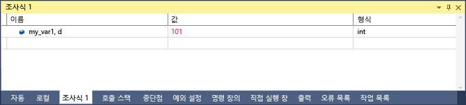

# C#의 형식 지정자
[!INCLUDE[vs2017banner](../code-quality/includes/vs2017banner.md)]

형식 지정자를 사용하여 **조사식** 창에 값이 표시되는 형식을 변경할 수 있습니다. 또한 **직접 실행** 창, **명령** 창 및 소스 창에서도 형식 지정자를 사용할 수 있습니다. 이러한 창에서 식을 일시 중지하면 결과가 DataTip에 나타납니다. DataTip 보기에는 형식 지정자에 맞는 DataTip이 표시됩니다.  
  
 형식 지정자를 사용하려면 식을 입력한 다음 쉼표를 입력합니다. 쉼표 뒤에 적절한 지정자를 추가합니다.  
  
## 형식 지정자 사용  
 다음과 같은 코드를 가정해 봅니다.  
  
```  
{ int my_var1 = 0x0065; int my_var2 = 0x0066; int my_var3 = 0x0067; }  
```  
  
 조사식 창\(디버그하는 동안 **디버그 \/ Windows \/ 조사식 \/ 조사식 1**\)에 `my_var1` 변수를 추가하고 표시를 16진수로 설정합니다\(**조사식** 창에서 변수를 마우스 오른쪽 단추로 클릭하고 **16진수 표시** 선택\). 이제는 **조사식** 창에서 변수의 값이 0x0065로 표시됩니다. 이 값을 16진수 정수 대신 10진수 정수로 표시하려면 이름 열에서 변수 이름 뒤에 10진수 형식 지정자 **, d**를 추가합니다. 이제 값 열에 10진수 값 101이 표시됩니다.  
  
   
  
## 형식 지정자  
 다음 표에서는 디버거에서 인식할 수 있는 C\# 형식 지정자를 보여 줍니다.  
  
|지정자|형식|원래 조사식 값|표시|  
|---------|--------|--------------|--------|  
|ac|식을 계산합니다. 암시적 속성 확인과 암시적 함수 호출이 해제된 경우에 유용할 수 있습니다.[파생 작업과 식](../Topic/Side%20Effects%20and%20Expressions.md)을 참조하세요.|“사용자가 암시적 함수 실행을 해제했습니다.” 메시지|\<value\>|  
|d|10진수 정수|0x0065|101|  
|dynamic|동적 뷰를 사용하여 지정된 개체를 표시합니다.|동적 뷰를 포함하여 개체의 모든 멤버를 표시합니다.|동적 뷰만 표시합니다.|  
|h|16진수 정수|61541|0x0000F065|  
|nq|따옴표 없는 문자열|"My String"|My String|  
|hidden|모든 public 멤버 및 public이 아닌 멤버를 표시합니다.|공용 멤버를 표시합니다.|모든 멤버를 표시합니다.|  
|raw|항목을 원시 항목 노드에 나타나는 대로 표시합니다. 프록시 개체에만 사용할 수 있습니다.|Dictionary\<T\>|Dictionary\<T\>의 Raw 뷰|  
|results|IEnumerable 또는 IEnumerable\<T\>를 구현하는 형식의 변수와 함께 사용되며, 일반적으로 쿼리 식의 결과입니다. 쿼리 결과가 포함된 멤버만 표시합니다.|모든 멤버를 표시합니다.|쿼리 조건에 맞는 멤버를 표시합니다.|  
  
## 참고 항목  
 [조사식 및 간략한 조사식 창](../debugger/watch-and-quickwatch-windows.md)   
 [변수 창](../Topic/Variable%20Windows.md)