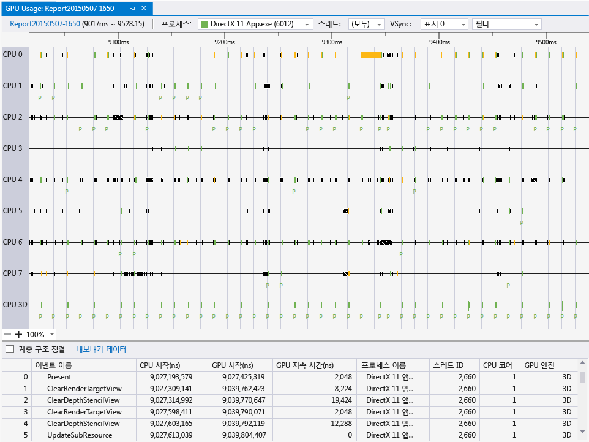
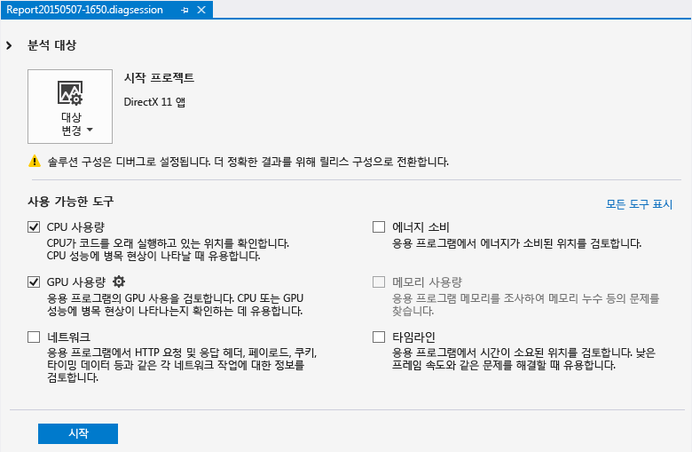
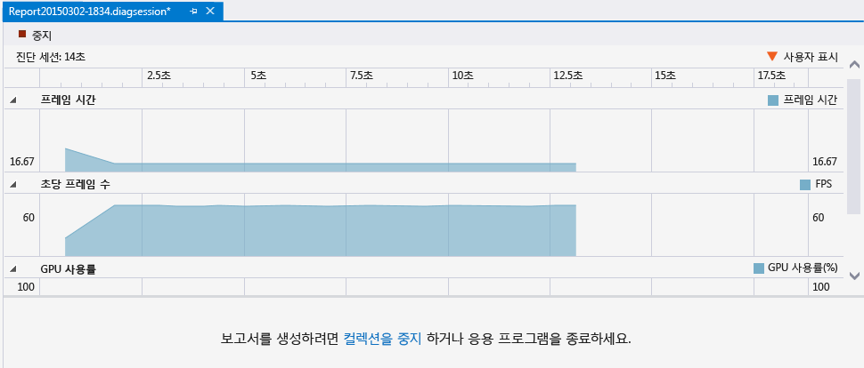
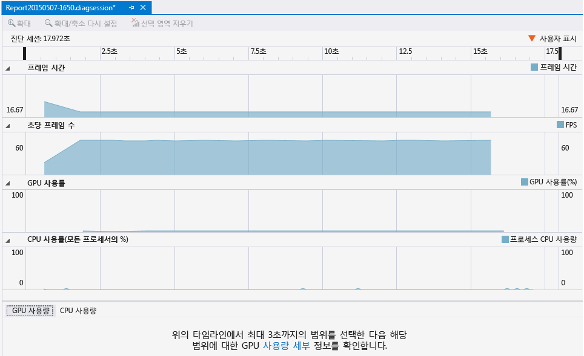
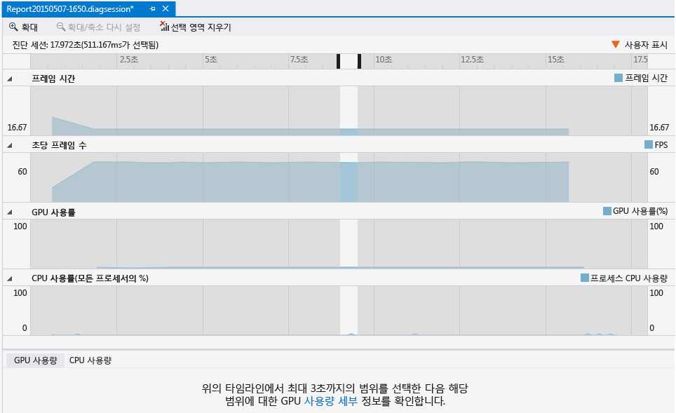
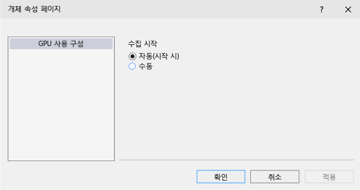

# GPU 사용량
[!INCLUDE[vs2017banner](../code-quality/includes/vs2017banner.md)]

Visual Studio 성능 및 진단 허브의 GPU 사용량 도구를 사용하여 Direct3D 앱의 개략적인 하드웨어 사용률을 더 잘 이해할 수 있습니다.  앱의 성능이 CPU에 의존하는지 아니면 GPU에 더 의존하는지를 확인하고 플랫폼 하드웨어를 더 효율적으로 사용할 수 있는 방법에 대해 통찰력을 얻을 수 있습니다.  GPU 사용량 도구는 Direct3D 12, Direct3D 11 및 Direct3D 10을 사용하는 앱을 지원하며 Direct2D 또는 OpenGL과 같은 다른 그래픽 API는 지원하지 않습니다.  
  
 다음 그림은 **GPU 사용 보고서** 창입니다.  
  
   
  
## 요구 사항  
 그래픽 진단 요구 사항 외에 GPU 사용량 도구를 사용하기 위한 요구 사항은 다음과 같습니다.  
  
-   필수적인 타이밍 계측을 지원하는 GPU 및 드라이버  
  
    > [!NOTE]
    >  지원되는 하드웨어 및 드라이버에 대한 자세한 내용은 이 문서 끝에 있는 [하드웨어 및 드라이버 지원](#hwsupport)을 참조하세요.  
  
 그래픽 진단 요구 사항에 대한 자세한 내용은 [시작](../debugger/getting-started-with-visual-studio-graphics-diagnostics.md)을 참조하세요.  
  
## GPU 사용량 도구 사용  
 GPU 사용량 도구에서 응용 프로그램을 실행하면 Visual Studio는 앱의 렌더링 성능과 GPU 사용률에 대한 개략적인 정보를 그래프로 표현하는 진단 세션을 실시간으로 만듭니다.  
  
#### GPU 사용량 도구를 시작하려면  
  
1.  주 메뉴에서 **디버그**를 선택한 다음 **성능 및 진단**을 선택합니다\(키보드: Alt\+F2 누름\).  
  
2.  성능 및 진단 허브에서 **GPU 사용량** 옆에 있는 상자를 선택합니다.  선택적으로, 사용하려는 다른 도구 옆에 있는 확인란을 선택합니다.  다수의 성능 및 진단 도구를 동시에 실행하여 앱 성능을 보다 자세히 확인할 수 있습니다.  
  
       
  
    > [!NOTE]
    >  일부 성능 및 진단 도구는 동시에 사용할 수 없습니다.  
  
3.  성능 및 진단 허브의 맨 아래에 있는 파란색 **시작** 단추를 선택하면 선택한 도구 아래에서 앱이 실행됩니다.  
  
 실시간으로 표시되는 개략적인 정보에는 프레임 타이밍, 프레임 속도 및 GPU 사용량이 포함됩니다.  이러한 각 정보 항목은 개별적으로 그래프로 표현되지만, 시간 단위를 사용하여 이 정보를 서로 연결할 수도 있습니다.  
  
 **프레임 시간\(ms\)** 및 **초당 프레임\(FPS\)** 그래프에는 초당 60개 및 30개 프레임의 성능 목표를 나타내는 두 개의 빨간색 가로줄이 있습니다.  **프레임 시간** 그래프에서 그래프가 선 아래에 있으면 앱이 성능 목표를 초과하는 것이고 그래프가 선 위에 있으면 목표에 미달하는 것입니다.  초당 프레임 그래프에서는 그 반대입니다. 즉, 그래프가 선 위에 있으면 앱이 성능 목표를 초과하는 것이고 그래프가 선 아래에 있으면 목표에 미달하는 것입니다.  기본적으로, 이러한 그래프는 앱 성능에 대한 개략적인 아이디어를 얻고 예를 들어 프레임 속도가 갑자기 떨어지거나 GPU 사용량이 급격히 증가하는 경우처럼 조사가 필요한 성능 저하를 식별하는 데 사용됩니다.  
  
 GPU 사용량 도구에서 앱이 실행 중일 때 진단 세션은 GPU에서 실행된 그래픽 이벤트에 대한 자세한 정보를 수집합니다.  이 정보는 앱이 하드웨어를 사용하는 방식에 대한 보다 세부적인 보고서를 생성하는 데 사용됩니다.  수집된 정보에서 이 보고서를 생성하는 데는 다소 시간이 걸리기 때문에, 진단 세션에서 정보 수집이 완료된 후에만 보고서를 생성할 수 있습니다.  
  
 성능 또는 사용률 문제를 보다 면밀하게 검토하려면 보고서가 생성될 수 있도록 성능 정보 수집을 중지합니다.  
  
#### GPU 사용량 보고서를 생성하고 보려면  
  
1.  진단 세션 창 하단에서 **수집 중지** 링크를 선택하거나 왼쪽 위 모서리에 있는 **중지**를 누릅니다.  
  
       
  
2.  보고서의 윗부분에서 조사하려는 문제가 표시된 그래프의 섹션을 선택합니다.  최대 3초 길이까지 선택할 수 있습니다. 이보다 긴 섹션은 끝에서 앞쪽으로 잘립니다.  
  
       
  
3.  보고서 하단에 있는 **해당 범위의 GPU 사용량을 자세히 보려면 여기를 클릭…** 메시지에서 **자세히 보기** 링크를 선택하여 선택 항목의 자세한 타임라인을 봅니다.  
  
       
  
 이렇게 하면 보고서가 포함된 새 탭 문서가 열립니다.  GPU 사용량 보고서를 사용하면 CPU에서 그래픽 이벤트가 시작된 시간, 이벤트가 GPU에 도착한 시간, 이를 GPU가 실행하는 데 걸린 시간 등을 확인할 수 있습니다.  이러한 정보는 병목 현상 및 코드 병렬 처리를 개선해야 할 부분 등을 식별하는 데 도움이 됩니다.  
  
## GPU 사용량 보고서 사용  
 GPU 사용량 보고서의 윗부분에는 CPU 처리 작업, GPU 렌더링 작업 및 GPU 복사 작업에 대한 타임라인이 표시됩니다.  이 타임라인은 디스플레이의 vsync를 나타내는 연회색 세로 막대로 나뉩니다. 이 막대의 빈도는 GPU 사용량 데이터를 수집하는 디스플레이 중 하나\(**디스플레이** 드롭다운을 사용하여 선택\)의 새로 고침 빈도와 일치합니다.  디스플레이의 새로 고침 빈도가 앱의 성능 목표보다 높을 수 있으므로, vsync와 앱에서 달성할 프레임 속도가 1:1의 관계가 되지 않을 수 있습니다.  성능 목표를 충족하려면 앱은 목표 프레임 속도로 모든 처리를 완료하고 렌더링을 수행하고 Present\(\) 호출을 수행해야 합니다. 그러나 렌더링된 프레임은 Present\(\) 이후 다음 vsync까지는 표시되지 않습니다.  
  
 하단에 보고서의 기간 동안 발생한 그래픽 이벤트의 목록이 표시됩니다.  
  
 다음 그림은 **GPU 사용량 보고서** 창입니다.  
  
   
  
 보고서의 하단에서 이벤트 중 하나를 선택하면 관련 타임라인에서 해당 이벤트에 표식이 배치됩니다. 일반적으로 CPU 스레드에서 API 호출을 나타내는 이벤트가 하나 표시되고, GPU 타임라인 중 하나에 GPU가 작업을 완료한 때를 나타내는 다른 이벤트가 표시됩니다.  마찬가지로, 타임라인에서 이벤트 중 하나를 선택하면 보고서 하단에서 해당 이벤트가 강조 표시됩니다. 보고서 상단에 있는 타임라인을 축소하면 가장 많은 시간이 소요되는 이벤트만 표시됩니다.  기간이 더 짧은 이벤트를 보려면 Ctrl 키를 누른 채로 포인팅 장치의 휠을 움직이거나 상단 패널의 왼쪽 아래 모서리에 있는 크기 조정 컨트롤을 사용하여 타임라인을 확대합니다.  타임라인 패널의 콘텐츠를 끌어 기록된 이벤트를 이동할 수도 있습니다.  
  
 원하는 내용을 쉽게 찾으려면 프로세스 이름, 스레드 ID, 이벤트 이름 등을 기준으로 GPU 사용량 보고서를 필터링할 수 있습니다. 또한 렌더링 명령을 그룹화하는 데 ID3DUserDefinedAnnotation 인터페이스를 사용하는 앱의 경우에는 어느 디스플레이의 새로 고침 빈도에 따라 vysnc 선이 결정되는지를 선택한 후 이벤트를 계층적으로 정렬할 수 있습니다.  
  
 자세한 내용은 다음과 같습니다.  
  
|필터 컨트롤|설명|  
|------------|--------|  
|**프로세스**|관심 있는 프로세스의 이름입니다.  진단 세션 도중에 GPU를 사용한 모든 프로세스가 이 드롭다운에 포함됩니다.  이 드롭다운에 있는 프로세스와 연결된 색은 아래 타임라인에 나오는 스레드 작업의 색입니다.|  
|**스레드**|관심 있는 스레드 ID입니다.  다중 스레드 앱에서는 이 컨트롤을 사용하여 관심 있는 프로세스에 속한 특정 스레드를 격리시킬 수 있습니다.  선택한 스레드와 관련 있는 이벤트는 각 타임라인에서 강조 표시됩니다.|  
|**표시**|새로 고침 빈도가 표시되는 디스플레이의 수입니다. **Note:**  일부 드라이버는 여러 개의 실제 디스플레이를 하나의 대형 가상 디스플레이로 표현되도록 구성할 수 있습니다.  컴퓨터에 여러 디스플레이가 연결되었더라도 목록에 디스플레이가 하나만 표시될 수 있습니다.|  
|**필터**|관심 있는 키워드입니다.  보고서 하단에 나오는 이벤트에는 키워드 전체 또는 일부와 일치하는 이벤트만 포함됩니다.  여러 키워드를 세미콜론\(;\)으로 구분하여 지정할 수 있습니다.|  
|**계층 정렬**|사용자 표식을 통해 정의된 이벤트 계층 구조를 유지하는지 아니면 무시하는지 나타내는 확인란입니다.|  
  
 GPU 사용량 보고서 하단에 있는 이벤트 목록은 각 이벤트의 세부 정보를 표시합니다.  
  
|열|설명|  
|-------|--------|  
|**이벤트 이름**|그래픽 이벤트의 이름입니다.  이벤트는 일반적으로 CPU 스레드 타임라인에 있는 하나의 이벤트와 GPU 타임라인에 있는 하나의 이벤트에 해당합니다.   이벤트 이름은 GPU 사용량에서 이벤트의 이름을 확인할 수 없는 경우 이벤트 이름은 'unattributed'가 될 수 있습니다.  자세한 내용은 이 표 아래의 참고 내용을 참조하세요.|  
|**CPU 시작\(ns\)**|Direct3D API 호출을 통해 이벤트가 CPU에서 시작된 시간입니다.  이 시간은 앱이 시작된 시간을 기준으로 나노초 단위로 측정됩니다.|  
|**GPU 시작\(ns\)**|이벤트가 GPU에서 시작된 시간입니다.  이 시간은 앱이 시작된 시간을 기준으로 나노초 단위로 측정됩니다.|  
|**GPU 지속 시간\(ns\)**|GPU에서 이벤트가 완료되는 데 걸린 시간입니다\(나노초 단위\).|  
|**프로세스 이름**|이벤트가 발생한 앱의 이름입니다.|  
|**스레드 ID**|이벤트가 발생한 스레드 ID입니다.|  
  
> [!IMPORTANT]
>  이벤트 특성 상속에 Windows 8.1이 필요합니다.  또한 GPU 또는 드라이버가 필수 측정 기능을 지원하지 않는 경우 모든 이벤트는 'unattributed'로 표시됩니다.  이 문제가 발생하는 경우 GPU 드라이버를 업데이트한 후 다시 시도해 봅니다.  자세한 내용은 아래에서 [하드웨어 및 드라이버 지원](#hwsupport)을 참조하세요.  
  
## GPU 사용량 설정  
 앱이 시작되자마자 정보 수집을 시작하는 대신 프로파일링 정보 수집을 연기하도록 GPU 사용량 도구를 구성할 수 있습니다.  프로파일링 정보의 크기가 상당히 클 수 있으므로, 이 옵션은 앱 성능 저하가 나중에 나타날 것임을 알고 있는 경우에 유용합니다.  
  
#### 앱 시작 이후 프로파일링을 연기하려면  
  
1.  주 메뉴에서 **디버그**를 선택한 다음 **성능 및 진단**을 선택합니다\(키보드: Alt\+F2 누름\).  
  
2.  성능 및 진단 허브에서 **GPU 사용량** 옆에 있는 **설정** 링크를 선택합니다.  
  
3.  **GPU 프로파일링 구성** 아래 **일반** 속성 페이지에서 **앱 시작 시 프로파일링 시작** 확인란의 선택을 취소하여 프로파일링을 연기합니다.  
  
       
  
> [!IMPORTANT]
>  현재 Direct3D 12 앱에 대해서는 프로파일링 연기가 지원되지 않습니다.  
  
 이 설정을 사용하여 프로파일링 정보 수집을 연기하는 경우 GPU 사용량 도구에서 앱을 실행할 때 GPU 사용량 도구 창 하단에서 추가 링크를 사용할 수 있게 됩니다.  프로파일링 정보 수집을 시작하려면 **자세한 GPU 사용량 데이터를 추가로 수집하기 시작합니다.**라는 메시지에 나오는 **시작** 링크를 선택합니다.  
  
##   하드웨어 및 드라이버 지원  
 지원되는 GPU 하드웨어 및 드라이버는 다음과 같습니다.  
  
|Vendor|GPU 설명|필요한 드라이버 버전|  
|------------|------------|-----------------|  
|Intel®|4세대 Intel® Core Processors\(‘Haswell’\)   -   Intel® HD Graphics\(GT1\) -   Intel® HD Graphics 4200\(GT2\) -   Intel® HD Graphics 4400\(GT2\) -   Intel® HD Graphics 4600\(GT2\) -   Intel® HD Graphics P4600\(GT2\) -   Intel® HD Graphics P4700\(GT2\) -   Intel® HD Graphics 5000\(GT3\) -   Intel® Iris™ Graphics 5100\(GT3\) -   Intel® Iris™ Pro Graphics 5200\(GT3e\)|\-\- \(최신 드라이버 사용\)|  
|AMD®|AMD Radeon™ HD 7000 시리즈 이후 대부분\(AMD Radeon™ HD 7350\-7670 제외\)   AMD Radeon™ GPU, AMD FirePro™ GPU 및 AMD FirePro GPU 액셀러레이터 \- Graphics Core Next\(GCN\) 아키텍처 포함   AMD® E 시리즈 및 AMD A 시리즈 Accelerated Processing Unit\(APU\) \- Graphics Core Next\(GCN\) 아키텍처\(‘Kaveri’, ‘Kabini’, ‘Temash’, ‘Beema’, ‘Mullins’\) 포함|14.7 RC3 이상|  
|NVIDIA®|NVIDIA® GeForce® 400 시리즈 이후 대부분   NVIDIA® GeForce® GPU, NVIDIA Quadro® GPU 및 NVIDIA® Tesla™ GPU 액셀러레이터 \- Fermi™, Kepler™ 또는 Maxwell™ 아키텍처 포함|343.37 이상|  
  
 NVIDIA® SLI™ 및 AMD Crossfire™ 등의 다중 GPU 구성은 현재 지원되지 않습니다.  NVIDIA® Optimus™ 및 AMD Enduro™ 등의 하이브리드 그래픽 설정이 지원됩니다.  
  
## 참고 항목  
  
-   [DirectX 도구를 사용하여 어려운 게임 그래픽 문제 해결\(비디오\)](http://channel9.msdn.com/Events/GDC/GDC-2015/Solve-the-Tough-Graphics-Problems-with-your-Game-Using-DirectX-Tools)  
  
-   [Visual Studio의 GPU 사용량 도구\(비디오\)](http://channel9.msdn.com/Events/Visual-Studio/Connect-event-2014/715)  
  
-   [Visual Studio 2013 Update 4 CTP1의 GPU 사용량 도구\(블로그\)](http://blogs.msdn.com/b/vcblog/archive/2014/09/05/gpu-usage-tool-in-visual-studio-2013-update-4-ctp1.aspx)  
  
-   [Visual Studio의 DirectX에 대한 GPU 사용량\(블로그\)](http://blogs.msdn.com/b/ianhu/archive/2014/12/16/gpu-usage-for-directx-in-visual-studio.aspx)