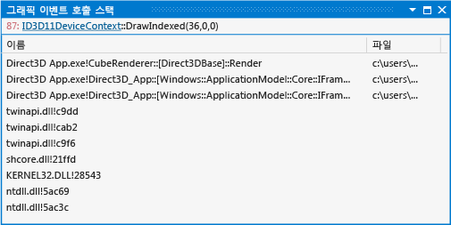

# 그래픽 이벤트 호출 스택
[!INCLUDE[vs2017banner](../code-quality/includes/vs2017banner.md)]

Visual Studio Graphics Analyzer의 그래픽 이벤트 호출 스택을 사용하면 문제가 있는 그래픽 이벤트와 앱의 소스 코드 사이의 관계를 매핑할 수 있습니다.  
  
 아래 그림은 이벤트 호출 스택 창입니다.  
  
   
  
## 그래픽 이벤트 호출 스택 이해  
 이벤트 호출 스택을 사용하면 특정 Direct3D 이벤트를 발생시킨 실행 흐름을 파악할 수 있습니다.  실행 중인 앱 내 활성 스레드의 현재 호출 스택이 표시되는 대신 선택한 Direct3D 이벤트가 발생한 시점의 호출 스택이 표시된다는 점을 제외하면 그래픽 이벤트 호출 스택은 Visual Studio 호출 스택 창과 비슷합니다.  이벤트 호출 스택에서 선택한 Direct3D 이벤트의 호출 사이트로 이동하여 주변 코드를 검사할 수 있습니다.  
  
 이벤트 호출 스택을 사용하여 문제 이벤트가 발생한 코드 경로를 파악하는 경우 코드베이스에 대한 정보를 활용해 문제 발생 가능 출처를 추론할 수 있습니다. 또는 기존의 디버깅 기술을 사용해 앱 또는 이벤트 매개 변수의 상태가 오동작 이벤트를 발생시키는 방식을 검사할 수 있도록 앱의 소스 코드에 중단점을 추가할 수도 있습니다.  이러한 검사를 통해 렌더링 문제로만 표시되는 소스 코드의 문제를 확인할 수 있습니다.  
  
### 그래픽 이벤트 호출 스택 정보  
 이 이벤트 호출 스택은 사전 프레임 이벤트 또는 사용자 정의 이벤트를 지원하지 않습니다.  그래픽 이벤트 호출 스택은 테이블 형식으로 표시됩니다.  
  
|Column|설명|  
|------------|--------|  
|**이름**|호출 사이트가 포함된 함수를 고유하게 식별하는 기호입니다.  사용 가능한 경우 함수의 디버그 기호가 표시되고 그렇지 않으면 함수 오프셋이 표시됩니다.|  
|**파일**|호출 사이트가 포함된 소스 코드 파일 또는 라이브러리 파일의 파일 이름입니다.|  
|**위치**|호출 사이트의 줄 번호입니다.|  
  
### 그래픽 개체에 대한 링크  
 선택한 그래픽 이벤트를 파악하려면 해당 이벤트와 연결된 Direct3D 개체에 대한 정보가 필요할 수 있습니다.  **그래픽 이벤트 호출 스택** 창에서 이 정보에 대한 링크를 제공합니다.  
  
## 참고 항목  
 [연습: 꼭짓점 음영으로 인해 누락된 개체](../debugger/walkthrough-missing-objects-due-to-vertex-shading.md)