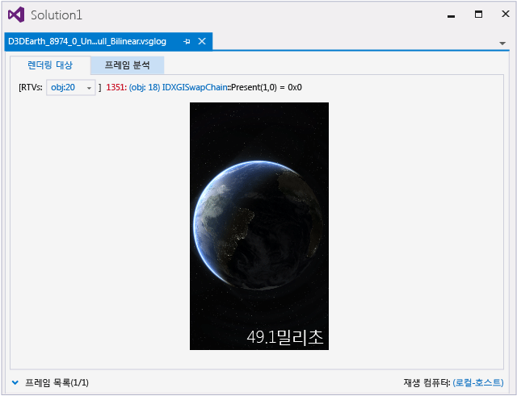
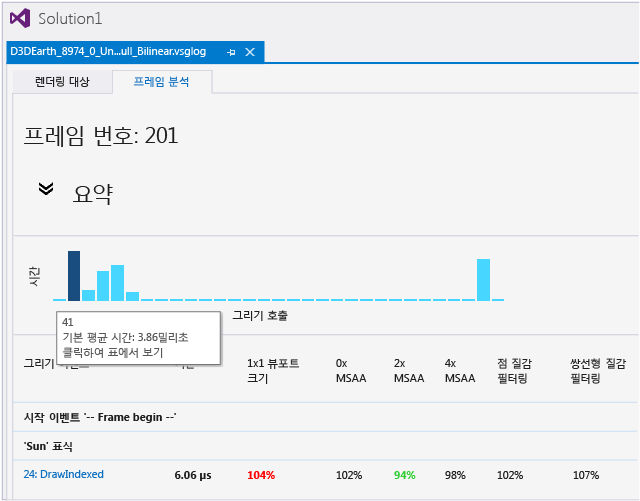
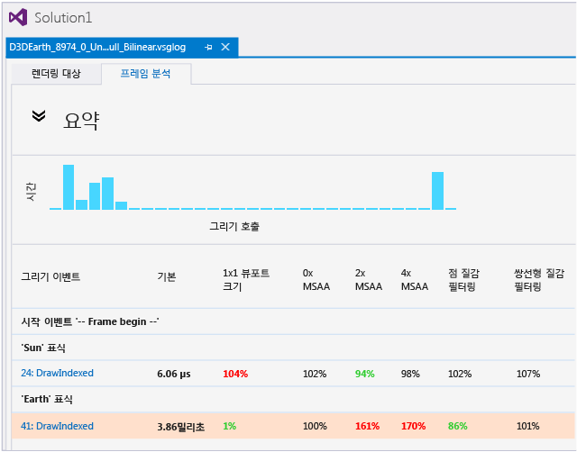
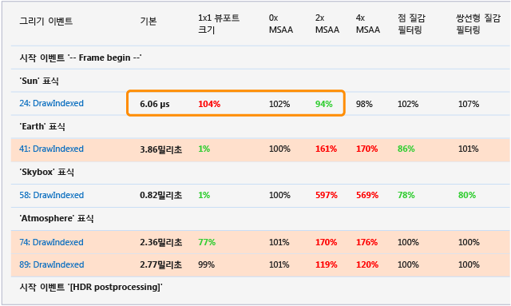
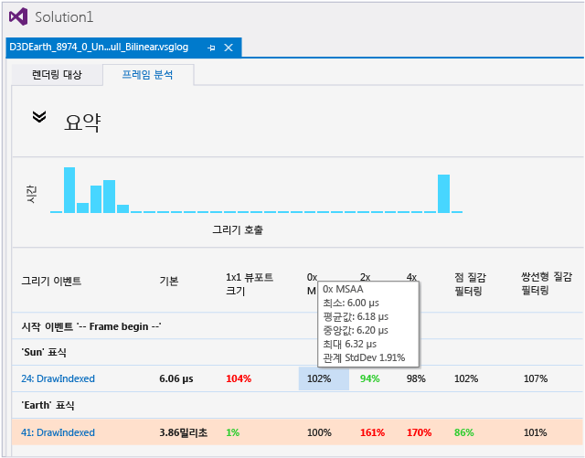
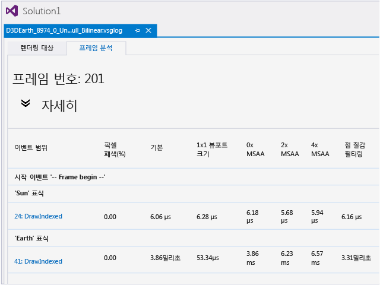
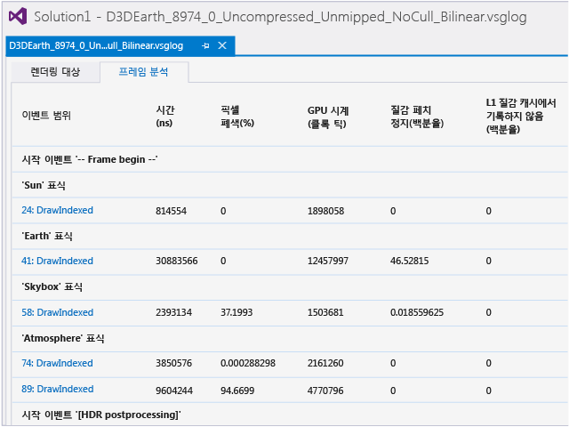

# 그래픽 프레임 분석
[!INCLUDE[vs2017banner](../code-quality/includes/vs2017banner.md)]

Visual Studio Graphics Analyzer의 그래픽 프레임 분석을 사용하여 Direct3D 게임 또는 앱의 렌더링 성능을 분석하고 최적화합니다.  
  
> [!IMPORTANT]
>  Graphics Analyzer는 Windows 10을 포함하여 지원되는 플랫폼에서 Direct3D 11을 사용하는 앱에 대해 프레임 분석을 지원합니다.  Direct3D 12를 사용하는 앱에서는 현재 프레임 분석이 지원되지 않습니다.  
  
## 프레임 분석  
 프레임 분석은 진단을 위해 그래픽 로그 파일에서 캡처한 것과 동일한 정보를 사용하지만 대신 렌더링 성능을 요약하는 데 해당 정보를 사용합니다.  캡처하는 동안 성능 정보는 로그에 기록되지 않습니다. 대신 성능 정보는 프레임 분석 중 프레임 재생 시 이벤트 타이밍 및 통계 수집을 통해 나중에 수집됩니다.  이러한 접근 방식은 캡처하는 동안 성능 정보를 기록하는 것에 비해 다음과 같은 여러 이점이 있습니다.  
  
-   프레임 분석은 동일한 프레임을 여러 번 재생하여 평균 결과를 산출할 수 있으므로 성능 요약이 통계적으로 타당합니다.  
  
-   프레임 요약은 정보가 캡처된 하드웨어 구성 및 장치 이외의 하드웨어 구성 및 장치에 대한 성능 정보를 생성할 수 있습니다.  
  
-   프레임 분석은 이전에 캡처된 정보에서 새 성능 요약을 생성할 수 있습니다\(예: GPU가 최적화되어 있거나 다른 디버깅 기능을 보이는 경우\).  
  
 이러한 이점 이외에도 프레임 분석은 재생 중 프레임이 렌더링되는 방식도 변경할 수 있습니다. 따라서 이러한 변경이 앱의 렌더링 성능에 영향을 주는 방식에 대한 정보를 제공할 수 있습니다.  이러한 정보를 사용하여 잠재적인 최적화 전략을 모두 구현해 결과를 모두 캡처한 다음 직접 비교할 필요 없이 이러한 전략 중에서 결정할 수 있습니다.  
  
 프레임 분석의 주요 용도가 더 빠른 렌더링 성능을 얻으려는 것이기는 하지만 정해진 성능 목표을 달성하기 위해 더 뛰어난 시각적 품질을 얻거나 GPU 전력 소비를 줄이는 데 똑같이 도움이 됩니다.  
  
 앱에 대해 프레임 분석이 수행할 수 있는 작업의 데모를 보려면 Channel 9에서 [Visual Studio 그래픽 프레임 분석](http://channel9.msdn.com/Shows/C9-GoingNative/GoingNative-25-Offline-Analysis-Graphics-Tool) 비디오를 시청하세요.  
  
## 프레임 분석 사용  
 프레임 분석을 사용하려면 다른 Graphics Analyzer 도구를 사용할 때처럼 앱 실행 시 앱에서 그래픽 정보를 캡처해야 합니다.  그런 다음 그래픽 로그 문서\(.vsglog\) 창에서 **프레임 분석** 탭을 선택합니다.  
  
   
  
 분석이 완료되면 결과가 표시됩니다.  프레임 분석 탭 상단에는 타임라인 및 요약 테이블이 표시됩니다.  하단에는 정보 테이블이 표시됩니다.  재생 중 오류 또는 경고가 생성되면 타임라인 위에서 요약됩니다. 여기서 링크를 클릭하여 오류 및 경고에 대해 자세히 알 수 있습니다.  
  
### 결과 해석  
 각 변형의 결과를 해석하여 앱의 렌더링 성능과 동작에 대한 유용한 정보를 추정할 수 있습니다.  렌더링 변형에 대한 자세한 내용은 이 문서의 뒷부분에 있는 [변형](#Variants)을 참조하세요.  
  
 다음과 같은 일부 결과는 변형이 렌더링 성능에 미친 영향을 직접적으로 나타냅니다.  
  
-   쌍선형 질감 필터링 변형이 성능 향상을 보인 경우 앱에서 쌍선형 질감 필터링을 사용하면 유사한 성능 향상을 얻게 됩니다.  
  
-   1x1 뷰포트 변형이 성능 향상을 보인 경우 렌더링 대상의 크기를 줄이면 렌더링 성능이 향상됩니다.  
  
-   BC 질감 압축 변형이 성능 향상을 보인 경우 앱에서 BC 질감 압축을 사용하면 유사한 성능 향상을 얻게 됩니다.  
  
-   2xMSAA 변형이 0xMSAA 변형과 거의 동일한 성능을 보이면 앱에서 2xMSAA를 사용하도록 설정하면 성능을 저하시키지 않고 렌더링 품질을 향상시킬 수 있습니다.  
  
 다음과 같은 다른 결과가 앱의 성능에 대해 더 심도 있고 예리한 결과를 제시할 수 있습니다.  
  
-   1x1 뷰포트 변형이 매우 큰 성능 향상을 보이면 아마도 앱이 사용할 수 있는 것보다 더 많은 채우기 속도를 사용하는 것입니다.  이 변형이 아무런 성능 향상을 보이지 않으면 아마도 앱이 너무 많은 꼭짓점을 처리하는 것입니다.  
  
-   16bpp 렌더링 대상 형식 변형이 상당한 성능 향상을 보이면 아마도 앱이 너무 많은 메모리 대역폭을 사용하는 것입니다.  
  
-   질감 크기를 1\/2 또는 1\/4로 줄이기 변형이 상당한 성능 향상을 보이면 아마도 질감이 너무 많은 메모리를 차지하거나 너무 많은 대역폭을 사용하거나 질감 캐시를 비효율적으로 사용하고 있는 것입니다   이 변형이 아무런 성능 향상을 보이지 않으면 성능을 저하시키지 않고 더 크고 자세한 질감을 사용할 수 있습니다.  
  
 하드웨어 카운터를 사용할 수 있는 경우 이러한 카운터를 사용하여 앱의 렌더링 성능을 떨어뜨린 이유에 대해 매우 자세한 정보를 수집할 수 있습니다.  기능 수준이 9.2 이상인 모든 장치는 깊이 폐색 쿼리\(**픽셀 폐색** 카운터\) 및 타임스탬프를 지원합니다.  GPU 제조업체에서 하드웨어 카운터를 구현하여 자사 드라이버에 노출했는지 여부에 따라 다른 하드웨어 카운터를 사용할 수 있습니다.  이러한 카운터를 사용하여 요약 테이블에 표시된 결과의 정확한 원인을 확인할 수 있습니다. 예를 들어 깊이 테스트에서 폐색된 픽셀 비율을 검사하여 overdraw가 요인인지 확인할 수 있습니다.  
  
### 타임라인 및 요약 테이블  
 기본적으로 타임라인 및 요약 테이블은 표시되어 있고 다른 섹션은 축소되어 있습니다.  
  
#### 타임라인  
 타임라인은 서로 관련된 그리기 호출에 대한 개요를 보여 줍니다.  막대가 더 클수록 그리기 시간이 더 길어지므로 타임라인을 사용하여 프레임에서 가장 긴 그리기 호출을 빠르게 찾을 수 있습니다.  캡처된 프레임에 매우 많은 수의 그리기 호출이 포함된 경우 여러 그리기 호출을 막대 하나로 결합할 수 있습니다. 이때 막대 길이는 이러한 그리기 호출의 합계를 나타냅니다.  
  
   
  
 막대가 해당하는 그리기 호출 이벤트를 표시하기 위해 막대에 포인터를 남겨 둘 수 있습니다.  막대를 선택하면 이벤트 목록이 해당 이벤트로 동기화됩니다.  
  
#### 표  
 타임라인 아래의 숫자로 구성된 테이블은 앱의 기본 렌더링과 관련하여 각 그리기 호출에 대한 각 렌더링 변형의 관련 성능을 보여 줍니다.  각 열은 여러 렌더링 변형을 표시하고 각 행은 가장 왼쪽 열에서 식별되는 여러 그리기 호출을 나타냅니다. 여기서 그래픽 이벤트 목록 창의 각 이벤트에 연결된 링크로 이동할 수 있습니다.  
  
   
  
 요약 테이블의 맨 왼쪽에서 두 번째 열에는 앱의 기본 렌더링 시간, 즉 앱의 기본 렌더링 시 그리기 호출 완료에 걸린 시간이 표시됩니다.  나머지 열은 성능이 향상되었는지 여부를 보다 쉽게 확인할 수 있도록 각 렌더링 변형의 관련 성능을 기준 대비 비율로 보여 줍니다.  비율이 100%보다 크면 기준보다 오래 걸린 것으로 성능이 떨어졌다는 의미이고 비율이 100%보다 작으면 시간이 조금 걸린 것으로 성능이 향상되었다는 의미입니다.  
  
 기준의 절대 타이밍과 렌더링 변형의 상대 타이밍 둘 모두의 값은 실제로는 여러 실행의 평균으로 기본적으로 5입니다.  이 평균은 타이밍 데이터의 신뢰성과 일관성을 보장하는 데 도움이 됩니다.  테이블의 각 셀에 포인터를 남겨 두어 그리기 호출 및 렌더링 변형에 대한 결과 생성 시 관찰된 최소, 최대, 평균 및 중앙 타이밍 값을 검사할 수 있습니다.  또한 기본 타이밍도 표시됩니다.  
  
#### "핫" 그리기 호출  
 전체 렌더링 시간의 상당 부분을 소비하거나 피할 수 있는 데도 불구하고 비정상적으로 느려질 수 있는 그리기 호출에 주의를 기울이도록 하기 위해 기준 타이밍이 표준 편차 1을 넘어 프레임에 있는 모든 그리기 호출의 평균 기본 타이밍보다 긴 경우 이러한 "핫" 그리기 호출이 포함된 행은 배경이 빨간색으로 처리됩니다.  
  
   
  
#### 통계적 중요성  
 관련성이 가장 큰 렌더링 변형에 주의를 기울이도록 하기 위해 프레임 분석에서는 각 렌더링 변형의 통계적 중요성을 확인하여 중요한 변형을 굵게 표시합니다.  성능이 향상된 변형은 녹색으로 표시되고 성능이 저하된 변형은 빨간색으로 표시됩니다.  통계적으로 중요하지 않은 결과는 일반 형식으로 표시됩니다.  
  
   
  
 통계적 관련성을 결정하기 위해 프레임 분석에서는 [스튜던트 t 테스트](http://www.wikipedia.org/wiki/Student%27s_t-test)를 사용합니다.  
  
### 정보 테이블  
 요약 테이블 아래에는 정보 테이블이 표시됩니다. 정보 테이블은 기본적으로 축소되어 있습니다.  정보 테이블의 내용은 재생 컴퓨터의 하드웨어 플랫폼에 따라 달라집니다.  지원되는 하드웨어 플랫폼에 대한 자세한 내용은 [하드웨어 지원](#HardwareSupport)을 참조하세요.  
  
#### 하드웨어 카운터를 지원하지 않는 플랫폼  
 대부분의 플랫폼에서는 하드웨어 GPU 카운터를 완벽하게 지원하지 않습니다. 여기에는 Intel, AMD 및 nVidia에서 현재 제공하는 모든 GPU가 포함됩니다.  수집할 하드웨어 카운터가 없는 경우에는 정보 테이블이 하나만 표시되며 이 테이블에는 모든 변형의 평균 절대 타이밍이 포함됩니다.  
  
   
  
#### 하드웨어 카운터를 지원하는 플랫폼  
 하드웨어 GPU 카운터를 지원하는 플랫폼\(예: nVidia T40 SOC 및 모든 Qualcomm SOC\)의 경우 각 변형에 해당하는 정보 테이블이 여러 개 표시됩니다.  사용 가능한 모든 하드웨어 카운터는 각 렌더링 변형에 대해 수집되고 해당 정보 테이블에 표시됩니다.  
  
   
  
 하드웨어 카운터 정보는 각 그리기 호출별 하드웨어 플랫폼 동작에 대한 매우 자세한 보기를 제공합니다. 이러한 보기는 성능 병목 현상의 원인을 매우 정확하게 파악하는 데 도움이 됩니다.  
  
> [!NOTE]
>  하드웨어 플랫폼마다 다른 카운터를 지원하며 여기에는 어떠한 표준도 없습니다.  카운터와 카운터가 나타내는 정보는 전적으로 각 GPU 제조업체에서 결정합니다.  
  
### 표식 영역 및 이벤트  
 프레임 분석은 사용자 정의 이벤트 표식 및 이벤트 그룹을 지원합니다.  이러한 표식과 그룹은 요약 테이블과 세부 정보 테이블에 표시됩니다.  
  
 ID3DUserDefinedAnnotation API 또는 API의 D3DPERF\_ family를 사용하여 표식 및 그룹을 만들 수 있습니다.  D3DPERF\_ API 패밀리를 사용하는 경우 각 표식 및 그룹에 색상을 지정할 수 있습니다. 프레임 분석에서는 이벤트 표식이나 이벤트 그룹 시작\/끝 표식 및 해당 콘텐츠가 포함된 열에 이러한 색상을 색상 띠로 표시합니다.  이 기능을 사용하면 중요한 렌더링 이벤트 또는 이벤트 그룹을 빠르게 식별할 수 있습니다.  
  
### 경고 및 오류  
 프레임 분석이 완료되면 경우에 따라 경고 또는 오류가 표시됩니다. 이러한 경고 또는 오류는 타임라인 위에 요약되어 있으며 자세한 내용은 프레임 분석 탭 맨 아래에 나와 있습니다.  
  
 경고와 오류는 보통 정보를 제공하기 위해서만 표시되며 특별한 작업을 수행할 필요는 없습니다.  
  
 일반적으로 경고는 하드웨어 지원이 부족하지만 해결할 수 있거나 하드웨어 카운터를 수집할 수 없거나 특정 성능 데이터를 신뢰할 수 없음을 나타냅니다\(예: 해결 방법이 부정적인 영향을 미치는 경우\).  
  
 일반적으로 오류는 프레임 분석 구현에 버그가 있거나 드라이버에 버그가 있거나 하드웨어 지원이 부족하여 해결할 수 없거나 앱에서 재생으로 지원되지 않는 작업을 시도했음을 나타냅니다.  
  
### 다시 시도  
 GPU에서 프레임 분석 중 전원 상태 전환이 발생하면 GPU 클록 속도가 변경되어 관련 타이밍 결과가 무효화되므로 해당 분석 패스를 다시 시도해야 합니다.  
  
 프레임 분석에서는 다시 시도 횟수를 10회로 제한합니다.  플랫폼에 공격적인 전원 관리 또는 클록 게이팅 기능이 있는 경우 프레임 분석에 실패할 수 있고 다시 시도 제한을 초과했으므로 오류를 보고할 수 있습니다.  플랫폼에서 설정할 수 있는 경우 플랫폼의 전원 관리와 클록 속도 제한을 보다 여유 있는 값으로 다시 설정하여 이 문제를 완화할 수 있습니다.  
  
##   하드웨어 지원  
  
### 타임스탬프 및 폐색 쿼리  
 타임스탬프는 프레임 분석을 지원하는 모든 플랫폼에서 지원됩니다.  픽셀 폐색 카운터에 필요한 깊이 폐색 쿼리는 기능 수준 9.2 이상을 지원하는 플랫폼에서 지원됩니다.  
  
> [!NOTE]
>  프레임 분석을 지원하는 모든 플랫폼에서는 타임스탬프가 지원되지만 타임스탬프의 정확도와 일관성은 플랫폼별로 다릅니다.  
  
### GPU 카운터  
 GPU 하드웨어 카운터에 대한 지원은 하드웨어에 따라 다릅니다.  
  
 Intel, AMD 또는 nVidia에서 현재 제공하는 컴퓨터 GPU는 GPU 하드웨어 카운터를 안정적으로 지원하지 않으므로 프레임 분석은 이들 업체의 카운터를 수집하지 않습니다.  그러나 프레임 분석은 하드웨어 카운터를 안정적으로 지원하는 다음 GPU에서는 하드웨어 카운터를 수집합니다.  
  
-   Qualcomm SOC\(Windows Phone을 지원하는 제품 모두\)  
  
-   nVidia T40\(Tegra4\).  
  
 프레임 분석을 지원하는 다른 플랫폼에서는 GPU 하드웨어 카운터를 수집하지 않습니다.  
  
> [!NOTE]
>  GPU 하드웨어 카운터는 하드웨어 리소스이므로 여러 패스에 걸쳐 각 렌더링 변형에 대해 전체 하드웨어 카운터 집합을 수집할 수 있습니다.  따라서 CPU 카운터가 수집되는 순서는 지정되지 않습니다.  
  
### Windows Phone  
 타임스탬프, 폐색 쿼리 및 GPU 하드웨어 카운터는 원래 Windows Phone 8.1과 함께 제공되는 Windows Phone 송수화기에서만 지원됩니다.  그래픽 로그 파일을 재생하려면 프레임 분석에는 이러한 항목이 필요합니다.  원래 Windows Phone 8과 함께 제공된 Windows Phone 송수화기는 해당 송수화기를 Windows Phone 8.1로 업데이트하더라도 프레임 분석을 지원하지 않습니다.  
  
## 지원되지 않는 시나리오  
 특정 프레임 분석 사용 방법은 지원되지 않거나 바람직하지 않습니다.  
  
### WARP  
 프레임 분석은 실제 하드웨어에서 렌더링 성능을 프로파일링 및 향상시키는 데 사용됩니다.  Windows Phone Emulator가 WARP에서 실행되고 있는데 WARP 장치에서 프레임 분석을 실행할 수는 있지만 일반적으로는 실행하지 않는 것이 좋습니다. 왜냐하면 하이엔드 CPU에서 실행 중인 WARP는 기능이 가장 떨어지는 최신 GPU보다 더 느려질 수 있고 WARP가 실행되는 특정 CPU에 따라 WARP 성능이 크게 달라질 수 있기 때문입니다.  
  
### 하위 수준 장치에서 높은 기능 수준 캡처 재생  
 Graphics Analyzer에서는 재생 컴퓨터에서 지원하는 것보다 더 높은 기능 수준을 사용하는 그래픽 로그 파일을 재생하면 자동으로 WARP로 대체됩니다.  프레임 분석에서는 명시적으로 WARP로 대체되지 않고 오류가 발생합니다. WARP는 Direct3D 앱의 정확성을 검사하는 데 유용하지만 이 앱의 성능을 검사하는 데에는 도움이 되지 않습니다.  
  
> [!NOTE]
>  기능 수준 문제를 염두에 둬야 하지만 여러 하드웨어 구성 및 장치에서 그래픽 로그 파일을 캡처 및 재생할 수 있습니다.  예를 들어 Windows Phone에서 그래픽 정보를 캡처한 다음 데스크톱 컴퓨터에서 이 정보를 재생할 수 있으며 그 반대도 가능합니다.  두 경우 모두 로그 파일에 API가 없거나 로그 파일이 재생 컴퓨터에서 지원되지 않는 기능 수준을 사용하지 않는 한 그래픽 로그를 재생할 수 있습니다.  
  
### Direct3D 10 이하  
 프레임 분석은 Direct3D 11 API에 대해서만 지원됩니다.  앱이 Direct3D 10 API를 호출하면 이러한 API를 다른 Graphics Analyzer 도구에서 인식 및 사용하더라도 프레임 분석에서는 인식 또는 프로파일링하지 않습니다.  앱에서 Direct3D11 및 Direct3D 10 API를 둘 다 사용하는 경우 Direct3D 11 호출만 프로파일링됩니다.  
  
> [!NOTE]
>  이는 기능 수준이 아니라 사용 중인 Direct3D API 호출에만 적용됩니다.  Direct3D 11, Direct3D 11.1 또는 Direct3D 11.2 API를 사용하는 한 좋아하는 기능 수준은 무엇이든 사용할 수 있고 프레임 분석이 작동합니다.  
  
##   변형  
 프레임 분석이 재생 중 프레임이 렌더링되는 방식에 대해 변경한 각 내용을 *변형*이라고 합니다.  프레임 분석에서 검사한 변형은 앱의 렌더링 성능 또는 시각적 품질을 향상시키기 위해 수행한 일반적이고 상대적으로 쉬운 변경에 해당합니다\(예: 질감 크기 줄이기, 질감 압축 사용 또는 다른 종류의 앤티앨리어싱 사용\).  변형은 앱의 일반적인 렌더링 컨텍스트와 매개 변수를 재정의합니다.  다음은 요약입니다.  
  
|변형|설명|  
|--------|--------|  
|**1x1 뷰포트 크기**|모든 렌더링 대상의 뷰포트 크기를 1x1 픽셀로 줄입니다.   자세한 내용은 [1x1 뷰포트 크기 변형](../debugger/1x1-viewport-size-variant.md)을 참조하세요.|  
|**0x MSAA**|모든 렌더링 대상에서 MSAA\(MultiSample Anti\-Aliasing\)를 사용하지 않습니다.   자세한 내용은 [0x\/2x\/4x MSAA 변형](../debugger/0x-2x-4x-msaa-variants.md)을 참조하세요.|  
|**2x MSAA**|모든 렌더링 대상에서 2x MSAA\(MultiSample Anti\-Aliasing\)를 사용합니다.   자세한 내용은 [0x\/2x\/4x MSAA 변형](../debugger/0x-2x-4x-msaa-variants.md)을 참조하세요.|  
|**4x MSAA**|모든 렌더링 대상에서 4x MSAA\(MultiSample Anti\-Aliasing\)를 사용합니다.   자세한 내용은 [0x\/2x\/4x MSAA 변형](../debugger/0x-2x-4x-msaa-variants.md)을 참조하세요.|  
|**점 질감 필터링**|적절한 모든 질감 샘플의 필터링 모드를 `DXD11_FILTER_MIN_MAG_MIP_POINT`\(점 질감 필터링\)로 설정합니다.   자세한 내용은 [Point, Bilinear, Trilinear 및 Anisotropic 텍스처 필터링 변형](../debugger/point-bilinear-trilinear-and-anisotropic-texture-filtering-variants.md)을 참조하세요.|  
|**쌍선형 질감 필터링**|적절한 모든 질감 샘플의 필터링 모드를 `DXD11_FILTER_MIN_MAG_LINEAR_MIP_POINT`\(쌍선형 질감 필터링\)로 설정합니다.   자세한 내용은 [Point, Bilinear, Trilinear 및 Anisotropic 텍스처 필터링 변형](../debugger/point-bilinear-trilinear-and-anisotropic-texture-filtering-variants.md)을 참조하세요.|  
|**3중 선형 질감 필터링**|적절한 모든 질감 샘플의 필터링 모드를 `DXD11_FILTER_MIN_MAG_MIP_LINEAR`\(3중 선형 질감 필터링\)로 설정합니다.   자세한 내용은 [Point, Bilinear, Trilinear 및 Anisotropic 텍스처 필터링 변형](../debugger/point-bilinear-trilinear-and-anisotropic-texture-filtering-variants.md)을 참조하세요.|  
|**이방성 질감 필터링**|적절한 모든 질감 샘플의 경우 `DXD11_FILTER_ANISOTROPIC` 및 `MaxAnisotropy`에 대한 필터링 모드를 `16`\(3중 이방성 질감 필터링\)으로 설정합니다.   자세한 내용은 [Point, Bilinear, Trilinear 및 Anisotropic 텍스처 필터링 변형](../debugger/point-bilinear-trilinear-and-anisotropic-texture-filtering-variants.md)을 참조하세요.|  
|**16bpp 렌더링 대상 형식**|모든 렌더링 대상과 백 버퍼의 픽셀 형식을 `DXGI_FORMAT_B5G6R5_UNORM`\(16bpp, 565 형식\)으로 설정합니다.   자세한 내용은 [16bpp 렌더링 대상 형식 변형](../debugger/16bpp-render-target-format-variant.md)을 참조하세요.|  
|**Mip 맵 생성**|렌더링 대상이 아닌 모든 질감에 대해 Mip 맵을 사용합니다.   자세한 내용은 [MIP 맵 생성 변형](../debugger/mip-map-generation-variant.md)을 참조하세요.|  
|**1\/2 질감 크기**|렌더링 대상이 아닌 모든 질감에서 질감 크기를 원래 크기의 절반으로 줄입니다.  예를 들어 256x128 질감이 128x64텍셀로 축소됩니다.   자세한 내용은 [절반\/분기 텍스처 크기 변형](../debugger/half-quarter-texture-dimensions-variant.md)을 참조하세요.|  
|**1\/4 질감 크기**|렌더링 대상이 아닌 모든 질감의 질감 크기를 원래 크기의 4분의 1로 줄입니다.  예를 들어 256x128 질감이 64x32텍셀로 축소됩니다.   자세한 내용은 [절반\/분기 텍스처 크기 변형](../debugger/half-quarter-texture-dimensions-variant.md)을 참조하세요.|  
|**BC 질감 압축**|B8G8R8X8, B8G8R8A8 또는 R8G8B8A8 픽셀 형식 변형이 있는 모든 질감에서 블록 압축을 사용합니다.  B8G8R8X8 형식 변형은 BC1을 사용하여 압축되고, B8G8R8A8 및 R8G8B8A8 형식 변형은 BC3를 사용하여 압축됩니다.   자세한 내용은 [BC 텍스처 압축 변형](../debugger/bc-texture-compression-variant.md)을 참조하세요.|  
  
 대부분 변형의 결과는 "질감 크기를 절반으로 줄이면 25% 빨라짐" 또는 "2x MSAA를 사용하면 2%만 느려짐"과 같이 규범적입니다.  다른 변형에는 더욱 자세한 해석이 필요할 수 있습니다. 예를 들어 뷰포트 크기를 1x1로 변경하는 변형이 성능을 크게 저하시키면 느린 채우기 속도로 인해 렌더링에 병목 현상이 나타났음을 나타내거나 성능에 커다란 변화가 없는 경우에는 꼭짓점 처리로 인해 병목 현상이 나타났음을 나타낼 수 있습니다.