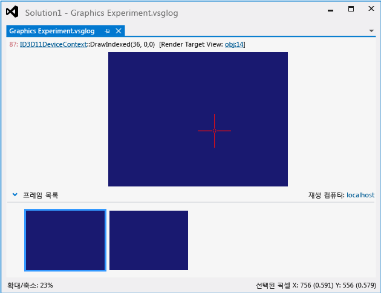

# 그래픽 로그 문서
[!INCLUDE[vs2017banner](../code-quality/includes/vs2017banner.md)]

그래픽 로그 문서는 그래픽 진단 세션에서 앱을 실행하는 동안 발생한 그래픽 이벤트의 레코드입니다.  기록된 후에는 Visual Studio Graphics Analyzer에서 이 로그를 검토하여 렌더링 및 성능 문제를 진단할 수 있습니다.  
  
 다음은 Graphics Analyzer에서 나타나는 그래픽 로그 문서입니다.  
  
   
  
## 그래픽 로그 문서 이해하기  
 Graphics Analyzer를 사용하여 그래픽 로그 문서를 검토하면 캡처 중 발생한 렌더링 대상에 대한 Direct3D 이벤트의 영향을 시각화할 수 있습니다.  렌더링 대상에서 예기치 않은 출력이 포함된 영역을 확인할 수 있습니다.  영향을 받은 영역에 있는 픽셀을 선택하면 그래픽 진단을 사용하여 선택한 픽셀, 픽셀의 셰이더, 영향을 준 Direct3D 이벤트, 이러한 이벤트로 이어진 응용 프로그램 호출 스택 및 이러한 이벤트를 지원하는 DirectX 개체를 검사할 수 있습니다.  이러한 정보를 사용하여 게임 또는 앱에서 렌더링 문제를 진단할 수 있습니다.  
  
 창의 상단 부분\(**Graphics Experiment.vsglog**\)에는 선택한 프레임의 현재 렌더링 대상 출력이 표시되고 하단 부분에는 캡처된 프레임의 미리 보기 그림 이미지가 포함된 **프레임 목록**이 표시됩니다.  
  
#### 프레임을 검사하려면  
  
-   **프레임 목록**에서 검사하려는 프레임을 선택합니다.  그러면 그래픽 로그 문서의 상단 부분에 표시된 렌더링 대상 출력이 업데이트되어 선택한 프레임이 표시됩니다.  
  
#### 픽셀을 검사하려면  
  
-   그래픽 로그 문서의 상단 부분의 렌더링 대상 출력에서 원하는 픽셀을 선택합니다.  픽셀을 선택하면 **그래픽 픽셀 기록** 창을 사용하여 선택한 픽셀에 대한 자세한 정보를 볼 수 있습니다.  자세한 내용은 [픽셀 기록](../debugger/graphics-pixel-history.md)을 참조하세요.  
  
## 재생 컴퓨터  
 **프레임 목록**의 오른쪽 위 모퉁이에는 **재생 컴퓨터**도 표시됩니다.  재생 컴퓨터는 이후 그래픽 진단 세션 중 그래픽 로그 파일에서 그래픽 이벤트를 재생하는 데 사용되는 컴퓨터 또는 장치입니다.  개발 컴퓨터 대신 다른 장치를 사용하여 캡처된 이벤트를 재생하면 문제가 발생한 실행 환경을 보다 정확하게 재현할 수 있습니다. 예를 들어 개발 컴퓨터에서 사용하는 것과 다른 그래픽 하드웨어 또는 드라이버가 있는 컴퓨터나 ARM 기반 Windows RT 태블릿 또는 Windows Phone 장치와 같은 다른 종류의 장치를 사용할 수 있습니다.  
  
 재생 컴퓨터를 지정하는 방법에 대한 자세한 내용은 [방법: 그래픽 진단 재생 컴퓨터 변경](../debugger/how-to-change-the-graphics-diagnostics-playback-machine.md)을 참조하세요.  
  
## 그래픽 로그 요약 정보  
 그래픽 로그 파일이 활성 문서인 경우 **속성** 창에는 그래픽 진단 캡처 세션을 호스팅하는 환경에 대한 정보가 표시됩니다.  여러 정보 범주가 표시됩니다.  
  
 **Direct3D 정보**  
 캡처 세션 중 사용된 디스플레이 어댑터의 하드웨어 및 드라이버 기능에 대한 정보를 나열합니다.  
  
|속성|설명|  
|--------|--------|  
|**10비트 XR 하이 컬러 형식**|10비트 XR 하이 컬러 형식이 지원되면 **True**이고 그렇지 않은 경우 **False**입니다.|  
|**DirectCompute CS 4.x**|Compute Shader 4.0이 지원되면 **True**이고 그렇지 않으면 **False**입니다.|  
|**배정밀도 셰이더**|디스플레이 어댑터에서 배정밀도\(64비트\) 부동 소수점 값을 지원하면 **True**이고 그렇지 않은 경우 **False**입니다.|  
|**드라이버 명령 목록**|드라이버에서 명령 목록을 지원하는 경우 **True**이고 그렇지 않은 경우 **False**입니다.|  
|**드라이버 동시 생성**|드라이버에서 동시\(비동기\) 생성을 지원하는 경우 **True**이고 그렇지 않은 경우 **False**입니다.|  
|**확장 형식\(BGRA 등\)**|BGRA와 같은 확장 형식이 지원되면 **True**이고 그렇지 않은 경우 **False**입니다.|  
|**최대 HW 기능 수준**|디스플레이 어댑터에서 지원되는 가장 높은 기능 수준을 표시합니다.|  
  
 **디스플레이 정보**  
 캡처 세션 중 사용된 디스플레이 어댑터에 대한 정보를 나열합니다.  
  
|속성|설명|  
|--------|--------|  
|**설명**|디스플레이 어댑터 설명 문자열입니다.|  
|**메모리 표시**|그래픽 어댑터에 설치된 메모리의 양입니다.|  
|**드라이버 이름**|그래픽 어댑터 드라이버의 이름입니다.|  
|**드라이버 버전**|그래픽 어댑터 드라이버의 버전입니다.|  
|**이름**|그래픽 어댑터의 이름입니다.|  
  
 **실험 파일**  
 캡처 세션과 연관된 실험 파일에 대한 정보를 나열합니다.  
  
|속성|설명|  
|--------|--------|  
|**경로**|.vsglog 파일의 경로입니다. **Note:**  레거시 캡처에서 이 속성은 사용되지 않습니다.|  
  
 **모듈 정보**  
 캡처 세션 중 앱에서 로드한 DLL\(동적 연결 라이브러리\)의 이름 및 버전을 나열합니다.  
  
 **시스템 정보**  
 캡처 세션 중 앱을 호스팅한 하드웨어 및 운영 체제에 대한 정보를 나열합니다.  
  
|속성|설명|  
|--------|--------|  
|**메모리**|컴퓨터에 설치된 메모리의 양입니다.|  
|**OS 아키텍처**|운영 체제의 대상 CPU 아키텍처입니다.|  
|**OS 버전**|운영 체제 버전입니다.|  
|**프로세서**|컴퓨터에 설치된 프로세서입니다.|  
|**대상 응용 프로그램 아키텍처**|앱의 대상 CPU 아키텍처입니다.  이는 **OS 아키텍처**와는 다를 수 있습니다.|  
  
 **대상 응용 프로그램**  
 캡처 세션의 제목인 앱에 대한 정보를 나열합니다.  
  
|속성|설명|  
|--------|--------|  
|**마지막으로 수정한 날짜\/시간**|앱이 빌드된 날짜 및 시간입니다.|  
|**경로**|앱의 경로입니다.|  
|**프로세스 ID**|앱에 지정된 프로세스 ID입니다.|  
|**버전**|앱 버전입니다.|  
  
 **VSG 로그 파일**  
 그래픽 로그 문서에 대한 정보를 나열합니다.  
  
|속성|설명|  
|--------|--------|  
|**만든 사람**|그래픽 로그 문서를 만든 앱의 이름입니다.  예를 들어 캡처 세션이 [!INCLUDE[vsprvs](../code-quality/includes/vsprvs_md.md)]에서 초기화된 경우\(수동 캡처\) 이 속성의 값은 [!INCLUDE[vsprvs](../code-quality/includes/vsprvs_md.md)]입니다.|  
|**세션 시작 시간**|캡처 세션이 시작된 날짜 및 시간입니다.|  
|**크기**|그래픽 로그 문서의 크기입니다.|  
  
## 참고 항목  
 [연습: 꼭짓점 음영으로 인해 누락된 개체](../debugger/walkthrough-missing-objects-due-to-vertex-shading.md)   
 [연습: 음영으로 인한 렌더링 오류 디버깅](../debugger/walkthrough-debugging-rendering-errors-due-to-shading.md)