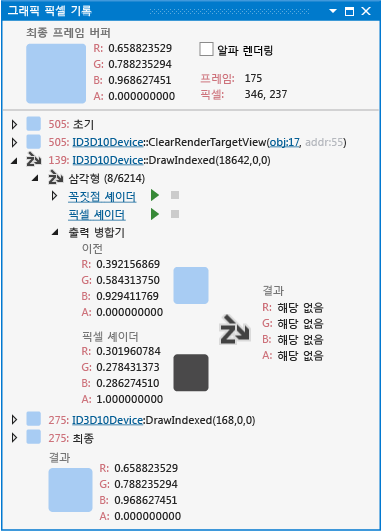

# 그래픽 픽셀 기록
[!INCLUDE[vs2017banner](../code-quality/includes/vs2017banner.md)]

Visual Studio Graphics Analyzer의 그래픽 픽셀 기록 창을 사용하면 게임 또는 앱의 프레임 중에 발생하는 Direct3D 이벤트가 특정 픽셀에 어떻게 영향을 주는지를 파악할 수 있습니다.  
  
 다음은 픽셀 기록 창입니다.  
  
   
  
## 픽셀 기록 창 이해  
 픽셀 기록을 사용하면 프레임 중 Direct3D 이벤트가 렌더링 대상의 특정 픽셀에 어떻게 영향을 주는지를 분석할 수 있습니다.  후속 이벤트 또는 동일 이벤트의 후속 기본 형식이 픽셀의 최종 색 값을 계속해서 변경하더라도 특정 Direct3D 이벤트에 대한 렌더링 문제를 확인할 수 있습니다.  예를 들어 픽셀이 잘못 렌더링되어 다른 반투명 픽셀로 가려져서 해당 색이 프레임 버퍼에서 섞이는 현상이 발생할 수 있습니다.  렌더링 대상의 최종 내용만으로는 이러한 종류의 문제를 진단하기가 어렵습니다.  
  
 픽셀 기록 창에는 선택한 프레임이 재생되는 동안 픽셀의 전체 기록이 표시됩니다.  창 위쪽의 **최종 프레임 버퍼**에는 프레임 끝에서 프레임 버퍼에 기록된 색이 표시되고, 픽셀이 포함된 프레임 및 화면 좌표와 같은 픽셀에 대한 추가 정보도 함께 표시됩니다.  이 영역에는 **알파 렌더링** 확인란도 포함되어 있습니다.  이 확인란을 선택하면 체크 무늬 패턴에 투명도가 적용된 상태로 **최종 프레임 버퍼** 색과 중간 색 값이 표시됩니다.  확인란의 선택을 취소하면 색 값의 알파 채널을 무시합니다.  
  
 창 아래쪽에는 픽셀 색에 영향을 준 이벤트가 표시되며 프레임 버퍼에서 픽셀의 초기 색 값과 최종 색 값을 나타내는 **초기** 및 **최종** 의사\(pseudo\) 이벤트도 함께 표시됩니다.  초기 색상 값은 픽셀의 색상을 변경한 첫 번째 이벤트\(일반적으로 `Clear` 이벤트\)에 의해 결정됩니다.  다른 이벤트가 픽셀에 영향을 주지 않은 경우에도 픽셀의 기록에는 항상 이 두 의사\(pseudo\) 이벤트가 포함됩니다.  다른 이벤트가 픽셀에 영향을 준 경우 **초기** 및 **최종** 이벤트 사이에 해당 이벤트가 표시됩니다.  이벤트를 확장하여 세부 정보를 표시할 수 있습니다.  렌더링 대상을 지우는 이벤트와 같은 간단한 이벤트의 경우 이벤트의 영향은 단순한 색 값입니다.  반면 그리기 호출 등의 보다 복잡한 이벤트는 픽셀 값에 영향을 줄 수 있는 기본 형식을 하나 이상 생성합니다.  
  
 이벤트에 의해 그려진 기본 형식은 해당 형식과 인덱스 및 개체의 총 기본 형식 수로 식별할 수 있습니다.  예를 들어 **삼각형 1456\/6214**와 같은 식별자는 해당 기본 형식이 6214개 삼각형으로 구성된 개체의 1456번째 삼각형에 해당함을 의미합니다.  각 기본 형식 식별자 왼쪽에는 해당 기본 형식이 픽셀에 준 영향을 요약하여 보여 주는 아이콘이 있습니다.  픽셀 색에 영향을 주는 기본 형식은 결과 색으로 채워진 모퉁이가 둥근 사각형으로 표시됩니다.  픽셀 색에 영향을 주지 않도록 제외된 기본 형식은 픽셀이 제외된 이유를 나타내는 아이콘으로 표시됩니다.  이러한 아이콘은 나중에 이 항목의 [기본 형식 제외](../debugger/graphics-pixel-history.md#exclusion) 섹션에서 설명합니다.  
  
 각 기본 형식을 확장하면 픽셀 셰이더 출력이 기존 픽셀 색과 병합되어 결과 색을 생성한 방식을 점검할 수 있습니다.  또한 여기서 기본 형식과 연결된 픽셀 셰이더를 검사하거나 디버그할 수도 있으며 꼭짓점 셰이더 노드를 더 확장하여 꼭짓점 셰이더 입력을 검사할 수도 있습니다.  
  
###   기본 형식 제외  
 여러 가지 이유로 인해 픽셀 색에 영향을 주지 않도록 기본 형식을 제외할 수 있습니다.  각 이유는 아래 테이블에서 설명하는 아이콘으로 나타냅니다.  
  
|아이콘|제외 이유|  
|---------|-----------|  
||픽셀이 깊이 테스트를 통과하지 못해 제외되었습니다.|  
||픽셀이 가위 테스트를 통과하지 못해 제외되었습니다.|  
||픽셀이 스텐실 테스트를 통과하지 못해 제외되었습니다.|  
  
### 그리기 호출 제외  
 그리기 호출의 모든 기본 형식이 테스트에 실패하여 영향을 미치는 렌더링 대상에서 제외되는 경우 그리기 호출을 확장할 수 없고 제외 이유에 해당하는 아이콘을 옆에 표시할 수 없습니다.  그리기 호출 예외가 발생하는 이유는 기본 형식 제외 원인과 유사하며 해당 아이콘도 마찬가지입니다.  
  
### 셰이더 코드 보기 및 디버그  
 셰이더와 연관된 기본 형식 아래에 있는 컨트롤을 사용하여 꼭짓점, 헐, 도메인, 기하 도형 및 픽셀 셰이더에 대한 코드를 검사하고 디버그할 수 있습니다.  
  
##### 셰이더의 소스 코드를 보려면  
  
1.  **그래픽 픽셀 기록** 창에서 검사하려는 셰이더에 해당하는 그리기 호출을 찾아 확장합니다.  
  
2.  방금 확장한 그리기 호출에서 관심 있는 문제를 보여 주는 기본 형식을 선택하고 확장합니다.  
  
3.  관심 있는 기본 형식에서 셰이더 제목 링크를 따라 이동하여 꼭짓점 셰이더 소스 코드를 확인합니다. 예를 들어 **꼭짓점 셰이더 obj:30**을 따라 이동합니다.  
  
    > [!TIP]
    >  개체 번호 **obj:30**은 개체 테이블 및 파이프라인 단계 창과 같은 Graphics Analyzer 인터페이스 전체에서 셰이더를 식별합니다.  
  
##### 셰이더를 디버그하려면  
  
1.  **그래픽 픽셀 기록** 창에서 검사하려는 셰이더에 해당하는 그리기 호출을 찾아 확장합니다.  
  
2.  그런 다음 방금 확장한 그리기 호출에서 관심 있는 문제를 보여 주는 기본 형식을 선택하고 확장합니다.  
  
3.  관심 있는 기본 형식에서 **디버깅 시작**을 선택합니다.  HLSL 디버거의 이 진입점은 해당 기본 형식에 대한 셰이더의 첫 번째 호출 즉, 셰이더에서 처리되는 첫 번째 픽셀 또는 꼭짓점으로 기본 설정됩니다.  기본 형식에는 픽셀이 하나만 연결되어 있지만 선과 삼각형의 경우 둘 이상의 꼭짓점 셰이더 호출이 있습니다.  
  
     특정 꼭짓점에 대해 꼭짓점 셰이더 호출을 디버그하려면 VertexShader 제목 링크를 확장하고 관심 있는 꼭짓점을 찾은 다음 그 옆에 있는**디버깅 시작**을 선택합니다.  
  
### 그래픽 개체에 대한 링크  
 픽셀 기록에서 그래픽 이벤트를 파악하려면 이벤트 시작 시의 장치 상태에 대한 정보 또는 이벤트가 참조하는 Direct3D 개체에 대한 정보가 필요할 수 있습니다.  **그래픽 픽셀 기록**은 픽셀 기록의 각 이벤트에 대해 이벤트 시작 당시의 장치 상태와 관련 개체 링크를 제공합니다.  
  
## 참고 항목  
 [연습: 장치 상태로 인해 누락된 개체](../debugger/walkthrough-missing-objects-due-to-device-state.md)   
 [연습: 음영으로 인한 렌더링 오류 디버깅](../debugger/walkthrough-debugging-rendering-errors-due-to-shading.md)