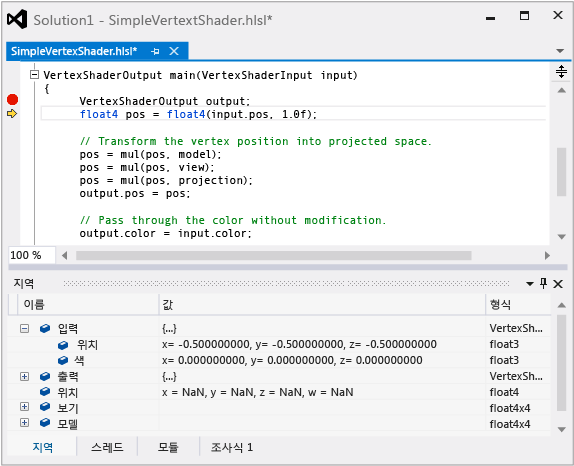

# HLSL 셰이더 디버거
[!INCLUDE[vs2017banner](../code-quality/includes/vs2017banner.md)]

Visual Studio Graphics Analyzer의 HLSL 디버거를 사용하면 앱의 실제 조건에서 HLSL 셰이더 코드가 작동하는 방식을 이해할 수 있습니다.  
  
 이것은 HLSL 디버거입니다.  
  
   
  
## HLSL 디버거 이해  
 HLSL 디버거는 셰이더 코드에서 발생하는 문제를 이해하는 데 도움을 줄 수 있습니다.  [!INCLUDE[vsprvs](../code-quality/includes/vsprvs_md.md)]에서의 HLSL 코드 디버깅은 C\+\+, C\# 또는 Visual Basic과 같은 다른 언어로 작성된 코드의 디버깅과 유사합니다.  다른 언어를 디버깅할 때와 같이 변수 내용을 검사하고 중단점을 설정하고 코드를 단계별로 실행하고 호출 스택을 탐색할 수 있습니다.  
  
 그러나, GPU는 수백 개의 스레드에서 셰이더 코드를 동시에 실행하여 고성능을 달성하므로, 이러한 모든 정보를 이해를 돕는 방식으로 보여 줄 수 있도록 HLSL 디버거는 다른 Graphics Analyzer 도구와 함께 작동하도록 설계되었습니다.  Graphics Analyzer에서는 그래픽 로그에 기록된 정보를 사용하여 캡처된 프레임을 다시 만듭니다. HLSL 디버거는 셰이더 코드를 실행하면서 실시간으로 GPU 실행을 모니터링하지 않습니다.  그래픽 로그에 출력의 일부를 다시 생성하기에 충분한 정보가 포함되어 있으며 Graphics Analysis 프로그램에서 오류가 발생한 픽셀과 이벤트의 정확한 위치를 찾을 수 있는 도구를 제공하기 때문에, HLSL 디버거에서는 정확하게 원하는 셰이더 스레드만 시뮬레이션할 수 있습니다.  이는 내부 작업이 전체 보기에 있는 CPU에서 셰이더 작업이 시뮬레이션될 수 있음을 의미합니다.  이는 HLSL 디버거에 유사 CPU 디버깅 환경을 제공합니다.  
  
 그러나 HLSL 디버거는 현재 다음 방식으로는 사용이 제한됩니다.  
  
-   HLSL 디버거는 편집하며 계속하기를 지원하지 않지만 셰이더를 변경한 다음 프레임을 다시 생성하여 결과를 확인할 수 있습니다.  
  
-   응용 프로그램과 셰이더 코드를 동시에 디버깅할 수 없습니다.  그러나 그 사이를 대체할 수는 있습니다.  
  
-   변수를 추가하고 조사식 창에 등록할 수 있지만 식은 지원되지 않습니다.  
  
 그럼에도 불구하고 HLSL 디버거는 가능한 다른 방법 대비 더욱 우수한 유사 CPU 디버깅 환경을 제공합니다.  
  
## HLSL 셰이더 편집 및 적용  
 HLSL 셰이더 디버거는 CPU 디버거와 같은 방식으로 편집하며 계속하기 기능을 지원하지 않습니다. GPU 실행 모델에서는 셰이더 상태를 실행 취소할 수 없기 때문입니다.  대신 HLSL 디버거는 편집 및 적용을 지원합니다. 이 기능을 통해 HLSL 소스 파일을 편집한 다음 **적용**을 선택하여 프레임을 다시 생성해 적용된 변경 내용을 확인할 수 있습니다.  프로젝트의 원본 HLSL 소스 파일 무결성을 보존하기 위해 수정된 셰이더 코드는 별도의 파일에 저장됩니다. 변경 내용이 올바른 경우 **복사 위치...**를 선택하여 변경 내용을 프로젝트에 복사할 수 있습니다.  이 기능을 사용하면 오류가 포함된 셰이더 코드를 빠르게 반복하여 비용이 많이 드는 다시 빌드 및 캡처 단계를 HLSL 디버깅 워크플로에서 제거할 수 있습니다.  
  
## HLSL 디스어셈블리  
 HLSL 셰이더 디버거의 HLSL 소스 코드 목록 오른쪽에는 HLSL 셰이더 어셈블리 목록이 제공됩니다.  
  
## HLSL 코드 디버깅  
 파이프라인 단계 또는 픽셀 기록 창에서 HLSL 디버거에 액세스할 수 있습니다.  
  
#### 그래픽 파이프라인 단계 창에서 HLSL 디버거를 시작하려면  
  
1.  **그래픽 파이프라인 단계** 창에서 디버깅할 셰이더와 연관된 파이프라인 단계를 찾습니다.  
  
2.  파이프라인 단계 제목 아래에서 작은 녹색 화살표로 표시되는 **디버깅 시작**을 선택합니다.  
  
    > [!NOTE]
    >  이러한 HLSL 디버거로의 진입점은 처리되는 첫 번째 꼭짓점 또는 픽셀인 해당 단계에 대한 첫 번째 셰이더 스레드만을 디버그합니다.  픽셀 기록을 사용하여 이러한 셰이더 단계의 다른 스레드에 액세스할 수 있습니다.  
  
#### 그래픽 픽셀 기록에서 HLSL 디버거를 시작하려면  
  
1.  **그래픽 픽셀 기록** 창에서 디버깅하려는 셰이더와 연관된 그리기 호출을 확장합니다.  각 그리기 호출은 여러 기본 형식에 해당될 수 있습니다.  
  
2.  그리기 호출 정보에서 결과 색 기여도가 해당 셰이더 코드의 버그를 제안하는 기본 형식을 확장합니다.  여러 기본 요소에서 버그를 제안하는 경우, 문제 진단을 더 어렵게 만들 수 있는 오류 누적을 방지할 수 있도록 오류를 제안하는 첫 번째 기본 형식을 선택합니다.  
  
3.  기본 형식 정보에서 **꼭짓점 셰이더** 또는 **픽셀 셰이더** 중에 어느 것을 디버깅할지 선택합니다.  픽셀 셰이더는 정확하지만 꼭짓점 셰이더에서 잘못된 상수를 픽셀 셰이더에 전달하기 때문에 여기서 잘못된 색 기여도를 생성하는 것으로 의심되는 경우 꼭짓점 셰이더를 디버깅합니다.  그렇지 않으면 픽셀 셰이더를 디버깅합니다.  
  
     선택한 셰이더의 오른쪽에서 작은 녹색 화살표로 표시되는 **디버깅 시작**을 선택합니다.  
  
    > [!NOTE]
    >  이러한 HLSL 디버거로의 진입점은 선택한 그리기 호출, 기본 형식 및 선택한 픽셀에 해당하는 픽셀 셰이더 스레드, 또는 그리기 호출, 기본 형식 및 선택한 픽셀로 결과가 보간되는 꼭짓점 셰이더 스레드를 디버깅합니다.  꼭짓점 셰이더의 경우, 꼭지점 셰이더 정보를 확장하여 특정 꼭짓점을 가리키도록 진입점을 더욱 구체화할 수 있습니다.  
  
 HLSL 디버거를 사용하여 셰이더 오류를 디버깅하는 방법에 대한 예제를 보려면 [그래픽 진단 예제](../debugger/graphics-diagnostics-examples.md) 또는 참고 항목 섹션에 연결된 연습을 참조하세요.  
  
## 참고 항목  
 [연습: 꼭짓점 음영으로 인해 누락된 개체](../debugger/walkthrough-missing-objects-due-to-vertex-shading.md)   
 [연습: 음영으로 인한 렌더링 오류 디버깅](../debugger/walkthrough-debugging-rendering-errors-due-to-shading.md)   
 [연습: 그래픽 진단을 사용하여 계산 셰이더 디버깅](../debugger/walkthrough-using-graphics-diagnostics-to-debug-a-compute-shader.md)