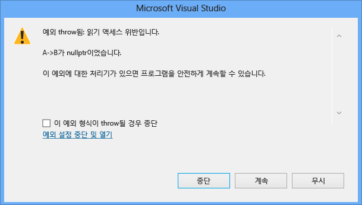

# <a name="how-can-i-debug-a-c-access-violation"></a>C + + 액세스 위반을 어떻게 디버깅할 수 있습니까?
## <a name="problem-description"></a>문제 설명  
 프로그램에 액세스 위반이 발생합니다. 어떻게 디버깅할 수 있습니까?  
  
## <a name="solution"></a>솔루션  
 여러 포인터를 역참조하는 코드 줄에서 액세스 위반이 발생하는 경우 액세스 위반을 유발한 포인터를 찾기 어려울 수 있습니다. Visual Studio 2015 업데이트 1부터 이제 예외 대화 상자가 액세스 위반을 유발한 포인터의 이름을 명시적으로 지정합니다.  
  
 예를 들어 다음과 같은 코드에서는 액세스 위반이 발생합니다.  
  
```C++  
#include <iostream>  
using namespace std;  
  
class ClassB {  
public:  
        ClassC* C;  
        ClassB() {  
                C = new ClassC();  
        }  
     void printHello() {  
                cout << "hello world";  
        }  
};  
  
class ClassA {  
public:  
    ClassB* B;  
      ClassA() {  
                B = nullptr;  
        }  
};  
  
int main() {  
    ClassA* A = new ClassA();  
      A->B->printHello();  
}  
```  
  
 Visual Studio 2015 업데이트 1에서 이 코드를 실행하는 경우 다음 예외 대화 상자가 표시됩니다.  
  
   
  
 포인터가 액세스 위반을 유발한 이유를 확인할 수 없는 경우 전체 코드를 추적하여 문제를 유발한 포인터가 올바르게 할당되었는지 확인합니다.  매개 변수로 전달 되는 경우 올바르게 전달 되 고 실수로 작성 되지 있는지 확인 한 [복사 shallow](http://stackoverflow.com/questions/184710/what-is-the-difference-between-a-deep-copy-and-a-shallow-copy)합니다. 다음 값도 변경 되지 않는다는 되 고 의도 하지 않게 어딘가에 프로그램에 프로그램에서 다른 곳에서 수정 되 고 있지 않습니다 되도록 문제의 포인터에 대 한 데이터 중단점을 만들어 확인 합니다. 데이터 중단점에 대한 자세한 내용은 [Using Breakpoints](../debugger/using-breakpoints.md)에서 데이터 중단점 섹션을 참조하세요.  
  
## <a name="see-also"></a>참고 항목  
 [네이티브 코드 디버그 FAQ](../debugger/debugging-native-code-faqs.md)