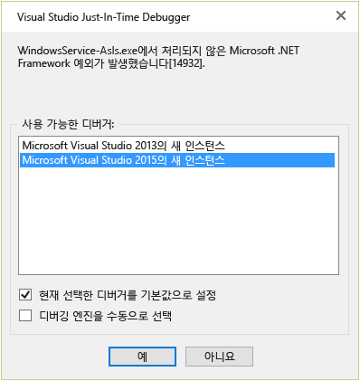

# <a name="how-to-debug-the-onstart-method"></a>방법: OnStart 메서드 디버깅
서비스를 시작하고 디버거를 서비스 프로세스에 연결하여 Windows 서비스를 디버그할 수 있습니다. 자세한 내용은 [How to: Debug Windows Service Applications](/dotnet/framework/windows-services/how-to-debug-windows-service-applications)을 참조하십시오. 그러나 Windows 서비스의 <xref:System.ServiceProcess.ServiceBase.OnStart%2A?displayProperty=fullName> 메서드를 디버그하려면 메서드 내에서 디버거를 시작해야 합니다.  
  
1.  <xref:System.Diagnostics.Debugger.Launch%2A> 서드의 시작 부분에 `OnStart()`에 대한 호출을 추가합니다.  
  
    ```csharp  
    protected override void OnStart(string[] args)  
    {  
        System.Diagnostics.Debugger.Launch();  
     }  
    ```  
  
2.  서비스를 시작합니다( `net start`를 사용하거나 **서비스** 창에서 시작할 수 있음).  
  
     다음과 같은 대화 상자가 표시됩니다.  
  
       
  
3.  선택 **예, 디버그 \<서비스 이름 >.**  
  
4.  Just-In-Time 디버거 창에서 디버깅에 사용할 Visual Studio 버전을 선택합니다.  
  
       
  
5.  Visual Studio의 새 인스턴스가 시작되고 `Debugger.Launch()` 메서드에서 실행이 중지됩니다.  
  
## <a name="see-also"></a>참고 항목  
 [디버거 보안](../debugger/debugger-security.md)   
 [관리 코드 디버그](../debugger/debugging-managed-code.md)