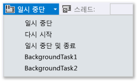
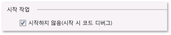
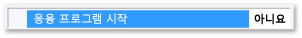
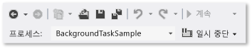

# Visual Studio에서 Windows 스토어 앱에 대한 일시 중단, 다시 시작 및 백그라운드 이벤트를 트리거하는 방법
[!INCLUDE[vs2017banner](../code-quality/includes/vs2017banner.md)]

디버깅하고 있지 않을 때는 Windows PLM\(**프로세스 수명 관리**\)에서 응용 프로그램의 실행 상태\(장치 상태 및 사용자 작업에 응답하여 응용 프로그램 시작, 일시 중단, 다시 시작 및 종료\)를 제어합니다. 디버깅하는 중에는 Windows가 이러한 활성화 이벤트를 사용하지 않도록 설정합니다. 이 항목에서는 디버거에서 이러한 이벤트를 발생시키는 방법에 대해 설명합니다.  
  
 이 항목에서는 **백그라운드 작업**을 디버깅하는 방법에 대해서도 설명합니다. 백그라운드 작업을 사용하면 응용 프로그램을 실행하고 있지 않은 경우에도 백그라운드 프로세스에서 특정 작업을 수행할 수 있습니다. 디버거를 사용하여 응용 프로그램을 디버그 모드에 둔 다음 UI를 시작하지 않고 백그라운드 작업을 시작하고 디버깅할 수 있습니다.  
  
 프로세스 수명 관리 및 백그라운드 작업에 대한 자세한 내용은 [Launching, resuming, and multitasking](http://msdn.microsoft.com/ko-kr/04307b1b-05af-46a6-b639-3f35e297f71b)을 참조하십시오.  
  
##   항목 내용  
 [프로세스 수명 관리 이벤트 트리거](#BKMK_Trigger_Process_Lifecycle_Management_events)  
  
 [백그라운드 작업 트리거](#BKMK_Trigger_background_tasks)  
  
-   [표준 디버그 세션에서 백그라운드 작업 이벤트 트리거](#BKMK_Trigger_a_background_task_event_from_a_standard_debug_session)  
  
-   [응용 프로그램이 실행 중이지 않을 때 백그라운드 작업 트리거](#BKMK_Trigger_a_background_task_when_the_app_is_not_running)  
  
 [설치된 응용 프로그램에서 프로세스 수명 관리 이벤트 및 백그라운드 작업 트리거](#BKMK_Trigger_Process_Lifetime_Management_events_and_background_tasks_from_an_installed_app)  
  
 [백그라운드 작업 활성화 오류 진단](#BKMK_Diagnosing_background_task_activation_errors)  
  
##   프로세스 수명 관리 이벤트 트리거  
 사용자가 응용 프로그램에서 벗어나거나 Windows가 절전 상태로 들어갈 때 응용 프로그램이 일시 중단될 수 있습니다.`Suspending` 이벤트에 응답하여 관련 응용 프로그램 및 사용자 데이터를 영구 저장소에 저장하고 리소스를 해제할 수 있습니다. 응용 프로그램은 **일시 중단됨** 상태에서 다시 시작되는 경우 **실행 중** 상태가 되고 일시 중단되었을 때의 위치에서 계속됩니다.`Resuming` 이벤트에 응답하여 응용 프로그램 상태를 복원하거나 새로 고치고 리소스를 회수할 수 있습니다.  
  
 Windows에서 일시 중단된 응용 프로그램을 최대한 많이 메모리에 유지하려고 해도 이를 위한 충분한 리소스가 없으면 응용 프로그램이 종료될 수 있습니다. 사용자가 응용 프로그램을 명시적으로 닫을 수도 있습니다. 사용자가 응용 프로그램을 닫았음을 나타내는 특수 이벤트는 없습니다.  
  
 Visual Studio 디버거에서 수동으로 응용 프로그램을 일시 중단, 다시 시작 및 종료하여 프로세스 수명 이벤트를 디버깅할 수 있습니다. 프로세스 수명 이벤트를 디버깅하려면 다음을 수행합니다.  
  
1.  디버깅할 이벤트의 처리기에 중단점을 설정합니다.  
  
2.  **F5** 키를 눌러 디버깅을 시작합니다.  
  
3.  **디버그 위치** 도구 모음에서 발생시킬 이벤트를 선택합니다.  
  
       
  
     **일시 중단 후 종료**을 사용하면 응용 프로그램이 닫히고 디버깅 세션이 끝납니다.  
  
##   백그라운드 작업 트리거  
 모든 응용 프로그램은 응용 프로그램이 실행되고 있지 않은 경우에도 특정 시스템 이벤트에 응답하도록 백그라운드 작업을 등록할 수 있습니다. 백그라운드 작업은 UI를 직접 업데이트하는 코드는 실행할 수 없습니다. 대신 타일 업데이트, 배지 업데이트 및 알림을 통해 사용자에게 정보를 보여 줍니다. 자세한 내용은 [Supporting your app with background tasks](http://msdn.microsoft.com/ko-kr/4c7bb148-eb1f-4640-865e-41f627a46e8e)을 참조하세요.  
  
 디버거에서 응용 프로그램의 백그라운드 작업을 시작하는 이벤트를 트리거할 수 있습니다.  
  
> [!NOTE]
>  디버거는 장치 상태의 변경을 나타내는 이벤트처럼 데이터를 포함하지 않는 이벤트만 트리거할 수 있습니다. 사용자 입력 또는 다른 데이터가 필요한 백그라운드 작업은 수동으로 트리거해야 합니다.  
  
 가장 실질적으로 백그라운드 작업 이벤트를 트리거하는 방법은 응용 프로그램이 실행되고 있지 않는 경우입니다. 그러나 표준 디버깅 세션의 이벤트 트리거도 지원됩니다.  
  
###   표준 디버그 세션에서 백그라운드 작업 이벤트 트리거  
  
1.  디버깅할 백그라운드 작업 코드에 중단점을 설정합니다.  
  
2.  **F5** 키를 눌러 디버깅을 시작합니다.  
  
3.  **디버그 위치** 도구 모음의 이벤트 목록에서 시작할 백그라운드 작업을 선택합니다.  
  
       
  
###   응용 프로그램이 실행 중이지 않을 때 백그라운드 작업 트리거  
  
1.  디버깅할 백그라운드 작업 코드에 중단점을 설정합니다.  
  
2.  시작 프로젝트에 대한 디버그 속성 페이지를 엽니다. 솔루션 탐색기에서 프로젝트를 선택합니다.**디버그** 메뉴에서 **속성**을 선택합니다.  
  
     C\+\+ 프로젝트의 경우 **구성 속성**을 확장한 다음 **디버깅**을 선택할 수 있습니다.  
  
3.  다음 작업 중 하나를 수행합니다.  
  
    -   Visual C\# 및 Visual Basic 프로젝트의 경우 **시작하지 않음\(시작 시 코드 디버그\)**을 선택합니다.  
  
           
  
    -   JavaScript 및 Visual C\+\+ 프로젝트의 경우 **응용 프로그램 시작** 목록에서 **아니요**를 선택합니다.  
  
           
  
4.  **F5** 키를 눌러 응용 프로그램을 디버그 모드에 둡니다.**디버그 위치** 도구 모음의 **프로세스** 목록에 디버그 모드에 있음을 나타내는 앱 패키지 이름이 표시됩니다.  
  
       
  
5.  **디버그 위치** 도구 모음의 이벤트 목록에서 시작할 백그라운드 작업을 선택합니다.  
  
       
  
##   설치된 응용 프로그램에서 프로세스 수명 관리 이벤트 및 백그라운드 작업 트리거  
 설치된 응용 프로그램 디버그 대화 상자를 사용하여 이미 설치된 응용 프로그램을 디버거에 로드할 수 있습니다. 예를 들어 Windows 스토어에서 설치된 응용 프로그램을 디버깅하거나 응용 프로그램의 소스 파일은 있지만 응용 프로그램에 대한 Visual Studio 프로젝트가 없는 경우에 응용 프로그램을 디버깅할 수 있습니다. 설치된 응용 프로그램 디버그 대화 상자에서는 Visual Studio 컴퓨터나 원격 장치에서 디버그 모드로 응용 프로그램을 시작하거나 디버그 모드에서 실행되도록 응용 프로그램을 설정하고 응용 프로그램을 시작하지 않을 수 있습니다. 자세한 내용은 **JavaScript** 또는 [Visual C\+\+, Visual C\# 및 Visual Basic](../debugger/start-a-debugging-session-for-store-apps-in-visual-studio-javascript.md#BKMK_Start_an_installed_app_in_the_debugger) 버전의 [디버깅 세션을 시작하는 방법](../debugger/start-a-debugging-session-for-a-store-app-in-visual-studio-vb-csharp-cpp-and-xaml.md#BKMK_Start_an_installed_app_in_the_debugger)에서 **디버거에서 설치된 응용 프로그램 시작** 단원을 참조하십시오.  
  
 응용 프로그램이 디버거에 로드되면 위에서 설명한 절차를 사용할 수 있습니다.  
  
##   백그라운드 작업 활성화 오류 진단  
 Windows 이벤트 뷰어의 백그라운드 인프라에 대한 진단 로그에는 백그라운드 작업 오류를 진단하고 문제를 해결하는 데 사용할 수 있는 자세한 정보가 포함되어 있습니다. 로그를 보려면 다음을 수행합니다.  
  
1.  이벤트 뷰어 응용 프로그램을 엽니다.  
  
2.  **작업** 창에서 **보기**를 선택하고 **분석 및 디버그 로그 표시**가 선택되어 있는지 확인합니다.  
  
3.  **이벤트 뷰어\(로컬\)** 트리에서 **Applications and Services Logs** \/ **Microsoft** \/ **Windows** \/ **BackgroundTasksInfrastructure** 노드를 확장합니다.  
  
4.  **진단** 로그를 선택합니다.  
  
## 참고 항목  
 [Visual Studio로 스토어 앱 테스트](../test/testing-store-apps-with-visual-studio.md)   
 [Visual Studio에서 앱 디버깅](../debugger/debug-store-apps-in-visual-studio.md)   
 [Application lifecycle](http://msdn.microsoft.com/ko-kr/53cdc987-c547-49d1-a5a4-fd3f96b2259d)   
 [Launching, resuming, and multitasking](http://msdn.microsoft.com/ko-kr/04307b1b-05af-46a6-b639-3f35e297f71b)