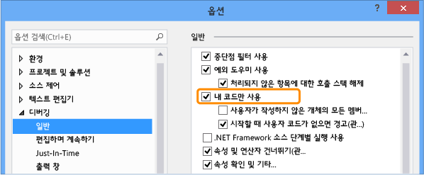

# <a name="specify-whether-to-debug-only-user-code-using-just-my-code-in-visual-studio"></a>Visual Studio에서 내 코드만 사용 하 여 사용자 코드만 디버깅 것인지 지정
자동으로 시스템, 프레임 워크 및 기타 비 사용자 호출을 건너뛸 및 호출 스택 창에서 해당 호출을 축소 하는 Visual Studio를 구성할 수 있습니다. 이 동작을 사용할지 여부를 지정 하는 기능을 라고 *내 코드만*합니다. 이 항목에서는 C#, Visual Basic, c + + 및 JavaScript 프로젝트에서 내 코드만 사용 하는 방법에 설명 합니다.

대부분의 프로그래밍 언어에 대 한 내 코드만 기본적으로 사용 됩니다.
  
##  <a name="BKMK_Enable_or_disable_Just_My_Code"></a> 사용 하도록 설정 하거나 내 코드만 사용 하지 않도록 설정  
 를 사용 하거나 내 코드만 사용 하지 않도록 설정 하려면 선택은 **도구 > 옵션** Visual Studio에서 메뉴. 에 **디버깅** > **일반** 노드를 선택 하거나 선택 취소 **내 코드만 사용**합니다.
  
   
  
> [!NOTE]
>  **내 코드만 사용** 설정은 모든 언어의 모든 Visual Studio 프로젝트에 적용 되는 전역 설정입니다.  
  
###  <a name="BKMK_Override_call_stack_filtering"></a> 호출 스택 보기에 사용자 코드가 아닌 표시  
 와 같은 호출 스택 표시는 보기에는 **호출 스택** 및 **작업** 사용자 코드가 아닌 레이블이 있는 주석이 달린된 프레임으로 축소 하는 windows에서 내 코드만 `[External Code]`합니다. 축소 된 프레임을 보려면 **외부 코드 포시** 호출 스택의 상황에 맞는 메뉴에 표시 합니다.

 
  
> [!NOTE]
>  **외부 코드 포시** 설정은 현재 사용자의 프로파일러에 저장 됩니다. 이 사용자가 여는 모든 언어의 프로젝트에 모두 적용됩니다.
  
##  <a name="BKMK__NET_Framework_Just_My_Code"></a> .NET framework 내 코드만  
  
###  <a name="BKMK_NET_User_and_non_user_code"></a> 사용자 및 사용자가 아닌 코드  
 사용자 코드를 비 사용자 코드에서 구분 하기 위해 내 코드만 기호 (.pdb) 파일 및 프로그램 최적화 살펴봅니다. 이진이 최적화되었거나 .pdb 파일을 사용할 수 없는 경우 디버거에서 코드를 사용자가 작성하지 않은 코드로 간주합니다.
  
 다음 세 가지 특성도 디버거에서 내 코드로 간주되는 항목에 영향을 줍니다.  
  
-   <xref:System.Diagnostics.DebuggerNonUserCodeAttribute>가 적용된 코드는 내 코드가 아님을 디버거에 알립니다.  
  
-   <xref:System.Diagnostics.DebuggerHiddenAttribute>가 적용된 코드는 내 코드만 옵션을 해제했더라도 디버거에서 숨겨집니다.  
  
-   <xref:System.Diagnostics.DebuggerStepThroughAttribute>가 적용된 코드는 디버거에서 한 단계씩 실행되지 않고 단계별로 실행됩니다.  
  
 다른 모든 코드는 사용자 코드로 간주됩니다.  
  
###  <a name="BKMK_NET_Stepping_behavior"></a> 단계별 실행 동작  
 때 있습니다 **한 단계씩 코드 실행** (바로 가기 키: F11) 사용자 코드가 아닌, 다음 사용자 문 하는 코드를 통해 디버거 단계입니다. 때 있습니다 **나가기** (키보드: Shift + F11), 경우 디버거가 사용자 코드의 다음 줄을 실행 합니다. 사용자 코드에 오류가 발생 하면 경우 실행이 계속 될 때까지 응용 프로그램 종료 되거나, 중단점이 적중 되거나 예외가 발생 합니다.  
  
###  <a name="BKMK_NET_Breakpoint_behavior"></a> 기본 중단점 동작  
 내 코드만 사용 하는 경우 선택할 수 있습니다 **모두 중단** (키보드: Ctrl + Alt + Break) 위치에서 실행을 중지 하 고 표시할 사용자 코드가 없습니다. 이 경우 소스 없음 창이 표시됩니다. 단계별 실행 명령을 선택하면 디버거에서 사용자 코드의 다음 줄로 이동합니다.  
  
###  <a name="BKMK_NET_Exception_behavior"></a> 예외 동작  
 사용자가 작성하지 않은 코드에서 처리되지 않은 예외가 발생할 경우 디버거는 예외가 생성된 사용자 코드의 줄에서 중단됩니다.  
  
 예외에 대해 첫째 예외가 설정된 경우 사용자 코드 줄이 녹색으로 강조 표시됩니다. 호출 스택은 레이블이 있는 주석이 달린된 프레임이 표시 **[External Code]**합니다.  
  
##  <a name="BKMK_C___Just_My_Code"></a> C + + 내 코드만  
  
###  <a name="BKMK_CPP_User_and_non_user_code"></a> 사용자 및 사용자가 아닌 코드  
 단계별 실행 동작이 호출 스택 동작과 독립적이므로 C++ 내 코드만 옵션은 .NET Framework 및 JavaScript 내 코드만 옵션과 다릅니다.  
  
 **호출 스택**  
  
 기본적으로 디버거는 호출 스택 창에서 다음 함수를 사용자가 작성하지 않은 코드로 간주합니다.  
  
-   기호 파일에서 소스 정보가 제거된 함수  
  
-   기호 파일에서 스택 프레임에 해당하는 소스 파일이 없음을 나타내는 함수  
  
-   `%VsInstallDirectory%\Common7\Packages\Debugger\Visualizers` 폴더의 `*.natjmc` 파일에 지정된 함수  
  
 **단계별 실행**  
  
 기본적으로 `%VsInstallDirectory%\Common7\Packages\Debugger\Visualizers` 폴더의 `*.natstepfilter` 파일에 지정된 함수만 사용자가 작성하지 않은 코드로 간주됩니다.  
  
 고유한 `.natstepfilter` 및 `.natjmc`를 만들어 `%USERPROFILE%\My Documents\Visual Studio 2015\Visualizers`의 단계별 실행 및 호출 스택 창 동작을 사용자 지정할 수 있습니다.  
  
###  <a name="BKMK_CPP_Stepping_behavior"></a> 단계별 실행 동작  
 때 있습니다 **한 단계씩 코드 실행** (바로 가기 키: F11) 사용자 코드가 아닌 사용자 코드에서 사용자 코드의 다음 줄을 코드 디버거 단계입니다. 때 있습니다 **나가기** (키보드: Shift + F11), 경우 디버거가 사용자 코드의 다음 줄을 실행 합니다. 사용자 코드에 오류가 발생 하면 경우 실행이 계속 될 때까지 응용 프로그램 종료 되거나, 중단점이 적중 되거나 예외가 발생 합니다.  
  
 사용자가 작성하지 않은 코드에서 디버거가 중단된 경우(예를 들어 모두 중단 명령이 사용자가 작성하지 않은 코드에서 중지된 경우) 사용자가 작성하지 않은 코드에서 단계별 실행이 계속됩니다.  
  
###  <a name="BKMK_CPP_Exception_behavior"></a> 예외 동작  
 디버거가 예외를 적중, 사용자 또는 사용자 코드가 아닌 인지에 관계 없이 예외에서 중지 됩니다. **사용자가 처리** 옵션에 **예외** 대화 상자는 무시 됩니다.  
  
###  <a name="BKMK_CPP_Customize_stepping_behavior"></a> 단계별 실행 동작을 사용자 지정  
 `*.natstepfilter` 파일에 사용자가 작성하지 않은 코드로 나열하여 프로시저 단위로 실행할 함수를 지정할 수 있습니다.  
  
-   Visual Studio 컴퓨터의 모든 사용자에 대 한 사용자가 아닌 코드를 지정 하려면.natstepfilter 파일을 추가할는 `%VsInstallDirectory%\Common7\Packages\Debugger\Visualizers` 폴더입니다.  
  
-   개별 사용자에 대 한 사용자가 아닌 코드를 지정 하려면.natstepfilter 파일을 추가할는 `%USERPROFILE%\My Documents\Visual Studio 2015\Visualizers` 폴더입니다.  
  
 .natstepfilter 파일은이 구문 사용 하 여 xml 파일:  
  
```xml  
<?xml version="1.0" encoding="utf-8"?>  
<StepFilter xmlns="http://schemas.microsoft.com/vstudio/debugger/natstepfilter/2010">  
    <Function>  
        <Name>FunctionSpec</Name>  
        <Action>StepAction</Action>  
    </Function>  
    <Function>  
        <Name>FunctionSpec</Name>  
        <Module>ModuleSpec</Module>  
        <Action>StepAction</Action>  
    </Function>  
</StepFilter>  
  
```  
  
|요소|설명|  
|-------------|-----------------|  
|함수|필수. 하나 이상의 함수를 사용자가 작성하지 않은 함수로 지정합니다.|  
|`Name`|필수. 일치시킬 전체 함수 이름을 지정하는 ECMA 262 형식의 정규식입니다. 예를 들어:<br /><br /> `<Name>MyNS::MyClass.*</Name>`<br /><br /> `MyNS::MyClass`의 모든 메서드를 사용자가 작성하지 않은 코드로 간주하도록 디버거에 지시합니다. 일치 항목 찾기에서는 대/소문자를 구분합니다.|  
|`Module`|선택 사항입니다. 함수를 포함하는 모듈의 전체 경로를 지정하는 ECMA 262 형식의 정규식입니다. 일치 항목 찾기에서는 대/소문자를 구분하지 않습니다.|  
|`Action`|필수. 대/소문자를 구분하는 다음 값 중 하나입니다.<br /><br /> -   `NoStepInto`  -일치 하는 함수를 통해 실행 되도록 디버거에 지시 합니다.<br />-   `StepInto`  -다른 재정의 일치 하는 함수를 한 단계씩 하도록 디버거에 지시 `NoStepInto` 일치 하는 함수에 대 한 합니다.|  
  
###  <a name="BKMK_CPP_Customize_call_stack_behavior"></a> 호출 스택 동작 사용자 지정  
 `*.natjmc` 파일에 지정하여 호출 스택에서 사용자가 작성하지 않은 코드로 처리할 모듈, 소스 파일 및 함수를 지정할 수 있습니다.  
  
-   Visual Studio 컴퓨터의 모든 사용자에 대 한 사용자가 아닌 코드를 지정 하려면.natjmc 파일을 추가할는 `%VsInstallDirectory%\Common7\Packages\Debugger\Visualizers` 폴더입니다.  
  
-   개별 사용자에 대 한 사용자가 아닌 코드를 지정 하려면.natjmc 파일을 추가할는 `%USERPROFILE%\My Documents\Visual Studio 2015\Visualizers` 폴더입니다.  
  
 .natjmc 파일은이 구문 사용 하 여 xml 파일:  
  
```xml  
<?xml version="1.0" encoding="utf-8"?>  
<NonUserCode xmlns="http://schemas.microsoft.com/vstudio/debugger/jmc/2015">  
  
  <!-- Modules -->  
  <Module Name="ModuleSpec" />  
  <Module Name="ModuleSpec" Company="CompanyName" />  
  
  <!-- Files -->  
  <File Name="FileSpec"/>  
  
  <!-- Functions -->  
  <Function Name="FunctionSpec" />  
  <Function Name="FunctionSpec" Module ="ModuleSpec" />  
  <Function Name="FunctionSpec" Module ="ModuleSpec" ExceptionImplementation="true" />  
  
</NonUserCode>  
  
```  
  
 **모듈 요소 특성**  
  
|특성|설명|  
|---------------|-----------------|  
|`Name`|필수. 모듈의 전체 경로입니다. Windows 와일드 카드 문자를 사용할 수 있습니다 `?` (0 개 또는 1 문자) 및 `*` (0 개 이상의 문자)입니다. 예를 들어 개체에 적용된<br /><br /> `<Module Name="?:\3rdParty\UtilLibs\*" />`<br /><br /> 는 드라이브의 `\3rdParty\UtilLibs`에 있는 모든 모듈을 외부 코드로 처리하도록 디버거에 지시합니다.|  
|`Company`|선택 사항입니다. 실행 파일에 포함된 모듈을 게시하는 회사의 이름입니다. 이 특성을 사용하여 모듈을 구분할 수 있습니다.|  
  
 **파일 요소 특성**  
  
|특성|설명|  
|---------------|-----------------|  
|`Name`|필수. 외부 코드로 처리할 소스 파일의 전체 경로입니다. 경로를 지정할 때 Windows 와일드 카드 문자 `?` 및 `*`를 사용할 수 있습니다.|  
  
 **함수 요소 특성**  
  
|특성|설명|  
|---------------|-----------------|  
|`Name`|필수. 외부 코드로 처리할 함수의 정규화된 이름입니다.|  
|`Module`|선택 사항입니다. 함수를 포함하는 모듈의 이름 또는 전체 경로입니다. 이 특성을 사용하여 동일한 이름을 가진 함수를 구분할 수 있습니다.|  
|`ExceptionImplementation`|`true`로 설정된 경우 이 함수 대신 예외를 발생시킨 함수가 호출 스택에 표시됩니다.|  
  
##  <a name="BKMK_JavaScript_Just_My_Code"></a> JavaScript 내 코드만  
  
###  <a name="BKMK_JS_User_and_non_user_code"></a> 사용자 및 사용자가 아닌 코드  
 **코드 분류**  
  
 JavaScript 내 코드만 옵션은 다음 분류 중 하나로 코드를 분류하여 단계별 실행 및 호출 스택 표시를 제어합니다.  
  
|||  
|-|-|  
|**MyCode**|사용자가 소유하고 제어하는 사용자 코드입니다.|  
|**LibraryCode**|사용자가 정기적으로 사용하며 응용 프로그램이 제대로 작동하는 데 필요한, 사용자가 작성하지 않은 라이브러리의 코드(예: WinJS 또는 jQuery)입니다.|  
|**UnrelatedCode**|수 있지만 응용 프로그램에 실행 될 수 있는 사용자 이외의 코드에서 소유 하지 않는 응용 프로그램이 제대로 작동 하는 데 직접 필요 하지 않으며 (예를 들어 여기 포함 될 수는 광고 SDK 광고를 표시 합니다.) UWP 프로젝트에서 HTTP 또는 HTTPS URI에서 응용 프로그램에 로드 되는 모든 코드는 코드도 UnrelatedCode로 간주 합니다.|  
  
 JavaScript 디버거는 이러한 유형의 코드를 자동으로 분류합니다.  
  
-   호스트에서 제공 하는 문자열을 전달 하 여 실행 되는 스크립트 `eval` 함수로 분류 됩니다 **MyCode**합니다.  
  
-   문자열을 전달 하 여 실행 되는 스크립트는 `Function` 생성자로 분류 됩니다 **LibraryCode**합니다.  
  
-   WinJS 또는 Azure SDK와 같은 프레임 워크 참조에 포함 된 스크립트를로 분류 됩니다 **LibraryCode**합니다.  
  
-   문자열을 전달 하 여 실행 되는 스크립트는 `setTimeout`, `setImmediate`, 또는 `setInterval` 기능으로 분류 **UnrelatedCode**합니다.  
  
-   `%VSInstallDirectory%\JavaScript\JustMyCode\mycode.default.wwa.json`은 모든 Visual Studio JavaScript 프로젝트에 대해 기타 사용자 코드 및 사용자가 작성하지 않은 코드를 지정합니다.  
  
 프로젝트의 루트 폴더에 `mycode.json`이라는 .json 파일을 추가하여 기본 분류를 수정하고 특정 파일 및 URL을 분류할 수 있습니다.  
  
 기타 모든 코드로 분류 됩니다 **MyCode**합니다.  
  
###  <a name="BKMK_JS_Stepping_behavior"></a> 단계별 실행 동작  
  
-   함수는 사용자가 아닌 경우 (**MyCode**) 코드를 **한 단계씩 코드 실행** (바로 가기 키: F11)로 동작 **프로시저 단위 실행** (키보드: F10).  
  
-   비 사용자의 단계를 시작 하는 경우 (**LibraryCode** 또는 **UnrelatedCode**) 코드 단계별 실행을 일시적으로 것 처럼 동작 내 코드만 해제 합니다. 내 코드만 5d;를 사용자 코드로 단계별로 단계씩 코드 실행은 다시 사용 하도록 설정 합니다.  
  
-   사용자 코드의 단계로 인해 현재 실행 컨텍스트를 벗어나는 경우(예: 이벤트 처리기의 마지막 줄에서 단계 수행) 디버거가 사용자 코드의 실행된 다음 줄에서 중지됩니다. 예를 들어에 콜백을 실행 하는 경우 **LibraryCode** 코드 디버거가 사용자 코드의 다음 줄에서 실행 될 때까지 계속 됩니다.
  
-   **프로시저 나가기** (키보드: Shift + F11) 사용자 코드의 다음 줄에서 중지 합니다. 사용자 코드에 오류가 발생 하면 경우 실행이 계속 될 때까지 응용 프로그램 종료 되거나, 중단점이 적중 되거나 예외가 발생 합니다.  
  
###  <a name="BKMK_JS_Breakpoint_behavior"></a> 기본 중단점 동작  
  
-   코드에 설정 된 중단점 해당 코드의 분류에 관계 없이 항상 적중 됩니다.  
  
-   `debugger` 키워드가  
  
    -   **LibraryCode** 코드에서 디버거가 항상 중단 합니다.  
  
    -   **UnrelatedCode** 코드에서 디버거가 중지 되지 않습니다.  
  
###  <a name="BKMK_JS_Exception_behavior"></a> 예외 동작  
 처리되지 않는 예외가  
  
-   **MyCode** 또는 **LibraryCode** 코드에서 디버거가 항상 중단 합니다.  
  
-   **UnrelatedCode** 코드 및 **MyCode** 또는 **LibraryCode** 코드는 호출 스택에 디버거가 중단 합니다.  
  
 예외 대화 상자에서 예외에 대 한 첫 번째 예외가 사용 되 고 예외가 **LibraryCode** 또는 **UnrelatedCode** 코드:  
  
-   예외를 처리 하는 경우 디버거가 중단 되지 않습니다.  
  
-   예외가 처리되지 않았으면 디버거가 중단됩니다.  
  
###  <a name="BKMK_JS_Customize_Just_My_Code"></a> 내 코드만 사용자 지정  
 단일 Visual Studio 프로젝트에 대해 사용자 코드 및 사용자가 작성하지 않은 코드를 분류하려면 프로젝트의 루트 폴더에 `mycode.json`이라는 .json 파일을 추가합니다.  
  
 분류는 다음 순서대로 수행됩니다.  
  
1.  기본 분류  
  
2.  `%VSInstallDirectory%\JavaScript\JustMyCode\mycode.default.wwa.json` 파일 분류  
  
3.  현재 프로젝트의 `mycode. json` 파일 분류  
  
 각 분류 단계는 이전 단계를 재정의합니다. 모든 키 값 쌍을 나열 하지 않아도.json 파일 및 **MyCode**, **라이브러리**, 및 **Unrelated** 값이 빈 배열일 수 있습니다.  
  
 내 코드 .json 파일은 다음 구문을 사용합니다.  
  
```json  
{  
    "Eval" : "Classification",  
    "Function" : "Classification",  
    "ScriptBlock" : "Classification",  
    "MyCode" : [  
        "UrlOrFileSpec",  
        . . .  
        "UrlOrFileSpec"  
    ],  
    "Libraries" : [  
        "UrlOrFileSpec",  
        . .  
        "UrlOrFileSpec"  
    ],  
    "Unrelated" : [  
        "UrlOrFileSpec",  
        . . .  
        "UrlOrFileSpec"  
    ]  
}  
  
```  
  
 **Eval, Function 및 ScriptBlock**  
  
 **Eval**, **함수**, 및 **ScriptBlock** 키/값 쌍 방법을 동적으로 결정 생성 된 코드 분류 됩니다.  
  
|||  
|-|-|  
|**평가 버전**|호스트에서 제공하는 `eval` 함수에 문자열을 전달하여 실행되는 스크립트입니다. 기본적으로 Eval 스크립트로 분류 됩니다 **MyCode**합니다.|  
|**Function**|`Function` 생성자에 문자열을 전달하여 실행되는 스크립트입니다. 기본적으로 Function 스크립트로 분류 됩니다 **LibraryCode**합니다.|  
|**ScriptBlock**|`setTimeout`, `setImmediate` 또는 `setInterval` 함수에 문자열을 전달하여 실행되는 스크립트입니다. 기본적으로 ScriptBlock 스크립트로 분류 됩니다 **UnrelatedCode**합니다.|  
  
 다음 키워드 중 하나로 값을 변경할 수 있습니다.  
  
-   `MyCode`  스크립트도 분류 **MyCode**합니다.  
  
-   `Library`  스크립트도 분류 **LibraryCode**합니다.  
  
-   `Unrelated`  스크립트도 분류 **UnrelatedCode**합니다.  
  
 **MyCode, Libraries 및 Unrelated**  
  
 **MyCode**, **라이브러리**, 및 **Unrelated** url 또는 파일 분류에 포함 시킬을 키/값 쌍 지정:  
  
|||  
|-|-|  
|**MyCode**|Url 또는으로 분류 되는 파일의 배열 **MyCode**합니다.|  
|**라이브러리**|Url 또는으로 분류 되는 파일의 배열 **LibraryCode**합니다.|  
|**관련 없는**|Url 또는으로 분류 되는 파일의 배열 **UnrelatedCode**합니다.|  
  
 URL 또는 파일 문자열에는 0개 이상의 문자와 일치하는 `*` 문자가 하나 이상 포함될 수 있습니다. `*`는 `.*` 정규식과 동일합니다.