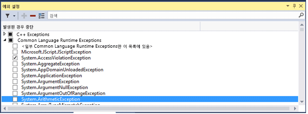
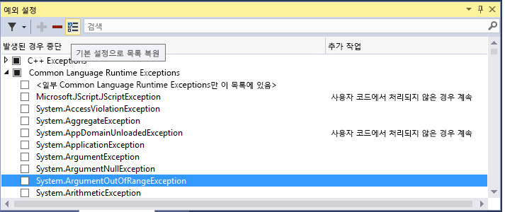
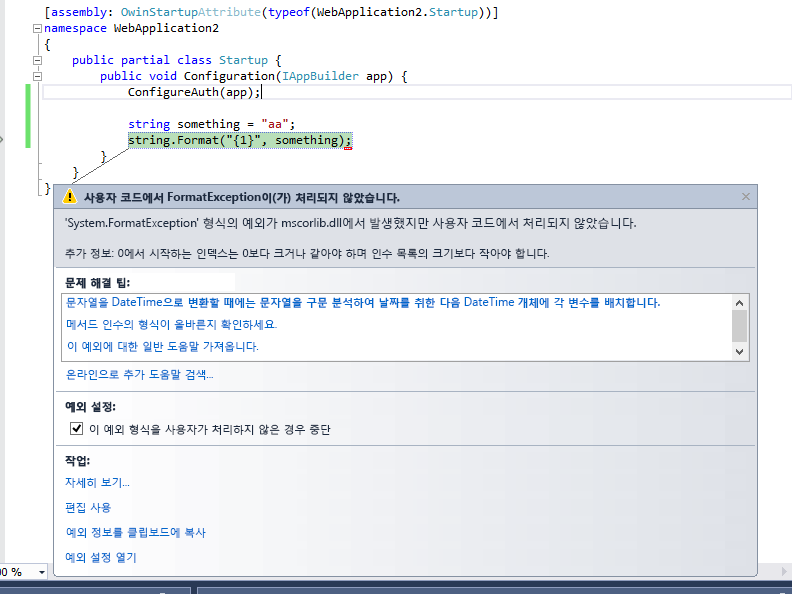
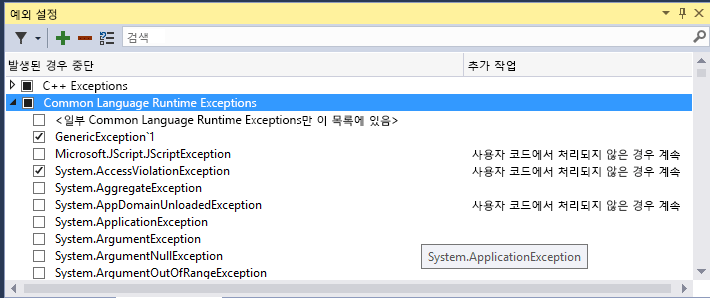

# <a name="manage-exceptions-with-the-debugger-in-visual-studio"></a>Visual Studio에서 디버거를 사용한 예외 관리

예외는 프로그램이 실행되는 동안 발생하는 오류 상태를 나타냅니다. 어떤 예외 (또는 예외 집합)에서 중단 하도록 디버거에 지시할 수 및 원하는 디버거에서 실행을 중단 시점 (하면 디버거 중단 것으로 표시 하면 예외가 throw 된). 또한 추가 하거나 예외를 삭제할 수 있습니다. Visual Studio에서 열려 있는 솔루션을 사용 하 여 **디버그 > Windows > 예외 설정** 열려는 **예외 설정** 창. 

가장 중요 한 예외에 응답 하는 처리기를 제공 해야 하 고 수 있지만 항상 몇 가지 예외에 대 한 실행을 중단 하도록 디버거를 구성 하는 방법을 파악 해야 합니다.
  
예외가 발생하면 디버거가 예외 메시지를 출력 창에 씁니다. 다음과 같은 경우에 실행이 중단될 수 있습니다.  
  
-   예외가 발생했으며 처리되지 않은 경우  
  
-   처리기가 호출 되기 전에 실행이 중단 되도록 디버거가 구성 된 경우  
  
-   설정한 경우 [내 코드만](../debugger/just-my-code.md), 디버거가 사용자 코드에서 처리 되지 않은 예외에서 중단 하도록 구성 하 고 있습니다.  
  
> [!NOTE]
>  ASP.NET에는 브라우저에 오류 페이지를 표시하는 최상위 예외 처리기가 있습니다. **내 코드만** 이 설정되지 않은 경우에는 실행이 중단되지 않습니다. 예제를 보려면 아래의 [Setting the debugger to continue on user-unhandled exceptions](../debugger/managing-exceptions-with-the-debugger.md#BKMK_UserUnhandled) 를 참조하세요.  
  
> [!NOTE]
>  Visual Basic 응용 프로그램에서 디버거 On Error 방식 오류 처리기를 사용 하는 경우에 모든 오류를 예외로 관리 합니다.    
  
## <a name="tell-the-debugger-to-break-when-an-exception-is-thrown"></a>예외가 throw 되 면 중단 하도록 디버거에 지시합니다  
디버거는 예외가 발생한 지점에서 실행을 중단하여 처리기가 호출되기 전에 예외를 검사할 수 있도록 기회를 제공합니다.  
  
에 **예외 설정** 창 (**디버그 > Windows > 예외 설정**), 예외 범주에 대 한 노드를 확장 (예를 들어 **공용 언어 런타임 예외**,.NET 예외를 의미), 해당 범주 내의 특정 예외에 대 한 확인란을 선택 하 고 (예를 들어 **System.AccessViolationException**). 전체 예외 범주를 선택할 수도 있습니다.  
  
  

> [!TIP]
> **예외 설정** 도구 모음에 있는 **검색** 창을 사용하여 특정 예외를 찾거나 검색을 사용하여 특정 네임스페이스(예: **System.IO**)를 필터링할 수 있습니다.
  
예외를 선택 하는 경우는 **예외 설정** 창, 처리 또는 처리 되지 않은 여부에 상관 없이 예외가 throw 됩니다 때마다 디버거 실행이 중단 됩니다. 여기서 이 예외를 첫째 예외라고 합니다. 예를 들어 다음은 몇 가지 시나리오입니다.  
  
*  다음 C# 콘솔 응용 프로그램에서 Main 메서드는 **try/catch** 블록 내부에서 `try/catch` 예외를 발생시킵니다.  
  
    ```csharp  
    static void Main(string[] args)  
    {  
        try  
        {  
            throw new AccessViolationException();  
            Console.WriteLine("here");  
        }  
        catch (Exception e)  
        {  
            Console.WriteLine("caught exception");  
        }  
        Console.WriteLine("goodbye");  
    }  
    ```  
  
     **try/catch** 에서 **예외 설정**을 선택한 이 코드를 디버거에서 실행하면 `throw` 줄에서 실행이 중단됩니다. 그런 다음 실행을 계속할 수 있습니다. 콘솔에 다음 두 줄이 모두 표시됩니다.  
  
    ```  
    caught exception  
    goodbye  
    ```  
  
     그러나 `here` 줄은 표시되지 않습니다.  
  
*  C# 콘솔 응용 프로그램에 두 가지 방법, 예외를 throw 하 고 처리 하는 메서드 및 동일한 예외를 throw 하 고 처리 하지 않는 하는 두 번째 메서드는 클래스와 클래스 라이브러리를 참조 합니다.  
  
    ```csharp 
    public class Class1  
    {  
        public void ThrowHandledException()  
        {  
            try  
            {  
                throw new AccessViolationException();  
            }  
            catch (AccessViolationException ave)  
            {  
                Console.WriteLine("caught exception" + ave.Message);  
            }  
        }  
  
        public void ThrowUnhandledException()  
        {  
            throw new AccessViolationException();  
        }  
    }  
    ```  
  
     콘솔 응용 프로그램의 main () 메서드는 다음과 같습니다.  
  
    ```csharp  
    static void Main(string[] args)  
    {  
        Class1 class1 = new Class1();  
        class1.ThrowHandledException();  
        class1.ThrowUnhandledException();  
    }  
    ```  
  
     있는 경우 **AccessViolationException** 체크 인 **예외 설정**를 디버거에서 실행이 코드를 실행 하면 중단 됩니다는 `throw` 줄에서  **ThrowHandledException()** 및 **ThrowUnhandledException()**합니다.  
  
 예외 설정을 기본값으로 복원하려는 경우에는 도구 모음에서 **복원** 단추를 클릭하면 됩니다.  
  
   
  
##  <a name="BKMK_UserUnhandled"></a> 사용자가 처리 하지 않은 예외에 대해 계속 하도록 디버거에 지시합니다  
 [Just My Code](../debugger/just-my-code.md)옵션을 사용하여 .NET 또는 JavaScript 코드를 디버그하는 경우 사용자 코드에서 처리되지 않았지만 다른 위치에서는 처리된 예외가 발견되면 실행을 중단하지 않도록 디버거에 지시할 수 있습니다.  
  
1.  **예외 설정** 창에서 창 내부를 마우스 오른쪽 단추로 클릭한 다음 **열 표시**를 선택하여 상황에 맞는 메뉴를 엽니다. ( **내 코드만**을 해제한 경우에는 이 명령이 표시되지 않습니다.)  
  
2.  **추가 작업**이라는 또 하나의 열이 표시됩니다. 이 열에는 특정 예외에 대해 **사용자 코드에서 처리되지 않은 경우 계속** 이 표시됩니다. 이는 예외가 사용자 코드에서 처리되지 않았지만 외부 코드에서는 처리된 경우 디버거가 중단되지 않음을 의미합니다.  
  
3.  특정 예외에 대해서나(예외를 선택하고 마우스 오른쪽 단추를 클릭한 후 **사용자 코드에서 처리되지 않은 경우 계속**선택/선택 취소) 전체 예외 범주(예: 모든 공용 언어 런타임 예외)에 대해 이 설정을 변경할 수 있습니다.  
  
 예를 들어 ASP.NET 웹 응용 프로그램은 예외를 HTTP 500 상태 코드([ASP.NET API의 예외 처리](http://www.asp.net/web-api/overview/error-handling/exception-handling))로 변환하여 예외를 처리하며, 이에 따라 예외의 소스를 확인하는 데 도움이 되지 않을 수도 있습니다. 아래 예제에서는 사용자 코드가 `String.Format()` 을 발생시키는 <xref:System.FormatException>을 호출합니다. 다음과 같이 실행이 중단됩니다.  
  
   
  
## <a name="add-and-delete-exceptions"></a>추가 하 고 예외를 삭제 합니다.  
 예외를 추가하거나 삭제할 수 있습니다. 어느 범주에서나 어떤 형식의 예외든 삭제할 수 있습니다. 예외를 선택하고 **예외 설정** 도구 모음에서 **삭제** 단추(빼기 기호)를 클릭하거나 예외를 마우스 오른쪽 단추로 클릭하고 상황에 맞는 메뉴에서 **삭제** 를 선택하면 됩니다. 예외를 삭제하는 것은 예외를 선택 취소하는 것과 같은 효과를 가집니다. 즉, 해당 예외가 발생해도 디버거가 실행을 중단하지 않습니다.  
  
 예외를 추가하려면 **예외 설정** 창에서 예외 범주 중 하나(예: **공용 언어 런타임**)를 선택하고 **추가** 단추를 클릭합니다. 예외의 이름을 입력합니다(예: **System.UriTemplateMatchException**). 예외가 목록에 추가되고(사전순) 자동으로 선택됩니다.  
  
 GPU 메모리 액세스 예외, JavaScript 런타임 예외 또는 Win32 예외 범주에 예외를 추가하려는 경우에는 설명과 함께 오류 코드를 포함해야 합니다.  
  
> [!TIP]
>  맞춤법 검사를 수행합니다. **예외 설정** 창 추가 된 예외가 있는지 검사 하지 않습니다. 따라서 입력 하는 경우 **Sytem.UriTemplateMatchException**, 해당 예외에 대 한 항목을 얻게 됩니다 (아니라 **System.UriTemplateMatchException**).  
  
 예외 설정은 솔루션의.suo 파일에 유지 되므로 특정 솔루션에 적용 합니다. 솔루션에 대해 특정 예외 설정을 다시 사용할 수 없습니다. 추가된 예외만 유지되고, 삭제된 예외는 유지되지 않습니다. 다시 말해서, 예외를 추가한 후 솔루션을 닫았다가 다시 열면 예외가 그대로 유지됩니다. 그러나 예외를 삭제한 후 솔루션을 닫았다가 다시 열면 예외가 다시 나타나지 않습니다.  
  
 **예외 설정** 창은 C#의 일반적인 예외 형식을 지원하지만 Visual Basic의 일반 예외 형식은 지원하지 않습니다. `MyNamespace.GenericException<T>`와 같은 예외에서 실행을 중단하려면 **MyNamespace.GenericException`1**과 같은 예외를 추가해야 합니다. 즉, 다음과 같은 예외를 만든 경우  
  
```csharp  
public class GenericException<T> : Exception  
{  
    public GenericException() : base("This is a generic exception.")  
    {  
    }  
}  
```  
  
 **예외 설정** 에 다음과 같이 예외를 추가할 수 있습니다.  
  
   

## <a name="add-conditions-to-an-exception"></a>예외에 조건 추가

예외 조건을 설정할 수 있습니다는 **예외 설정** 대화 상자. 현재 지원 되는 조건, 모듈 이름 포함 하거나 제외할 예외에 대 한 포함 됩니다. 모듈 이름의 조건으로 설정 하 여 특정 코드 모듈에만 예외에 대 한 중단 하도록 선택할 수 있습니다 또는 특정 모듈에 분리를 방지할 수 있습니다.

> [!NOTE]
> 예외에 조건을 추가 하는 것은 2의 새로운 기능 [!include[vs_dev15](../misc/includes/vs_dev15_md.md)]

조건부 예외를 추가 하려면 선택은 **조건 편집** 예외 설정 대화 상자에서 아이콘 상자 또는 예외를 마우스 오른쪽 단추로 클릭 하 고 선택 **조건 편집**합니다.


  
## <a name="see-also"></a>참고 항목  
 [예외 후 실행 계속](../debugger/continuing-execution-after-an-exception.md)   
 [방법: 예외 발생 후 시스템 코드 검사](../debugger/how-to-examine-system-code-after-an-exception.md)   
 [방법: 네이티브 런타임 검사 사용](../debugger/how-to-use-native-run-time-checks.md)   
 [C 런타임 라이브러리 없이 검사 실행 시 사용](../debugger/using-run-time-checks-without-the-c-run-time-library.md)   
 [디버거 기본 사항](../debugger/debugger-basics.md)