# Visual Studio에서 디버깅하는 동안 호출 스택의 맵 메서드
디버깅하는 동안 호출 스택을 시각적으로 추적할 코드 맵을 만듭니다. 맵을 기록해 두면 코드에서 어떤 작업을 하고 있는지 추적하여 버그를 찾는 데 집중할 수 있습니다.  
  
 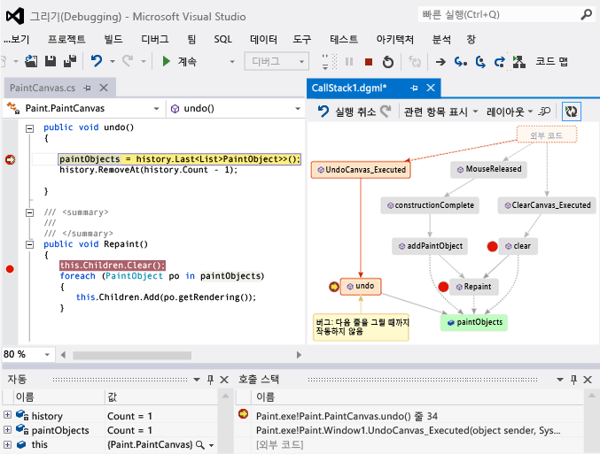  
  
 필요한 사항:  
  
-   [Visual Studio Enterprise](https://www.visualstudio.com/downloads/download-visual-studio-vs)  
  
-   Visual C# .NET, Visual Basic .NET, C++, JavaScript, X++ 등 디버그할 수 있는 코드  
  
 참고: [비디오: 코드 맵 디버거 통합 (채널 9)를 사용 하 여 시각적으로 디버그](http://go.microsoft.com/fwlink/?LinkId=293418) • [호출 스택 매핑](#MapStack) • [코드에 대 한 설명을](#MakeNotes) • [다음 호출 스택과 함께 맵 업데이트](#UpdateMap) • [맵에 관련된 코드를 추가](#AddRelatedCode) • [지도 사용 하 여 버그를 찾기](#FindBugs) • [Q & A](#QA)  
  
 명령 및 코드 맵으로 작업할 때 사용할 수 있는 작업의 세부 정보를 참조 하십시오. [찾아보기 및 다시 정렬 코드 맵](../modeling/browse-and-rearrange-code-maps.md)합니다.  
  
##  호출 스택 매핑  
  
1.  디버깅을 시작합니다. (키보드: **F5**)  
  
2.  응용 프로그램이 중단 모드를 시작 하거나 함수에 단계를 한 후 선택 **코드 맵을**합니다. (Keyboard: **Ctrl** + **Shift** + **`**)  
  
     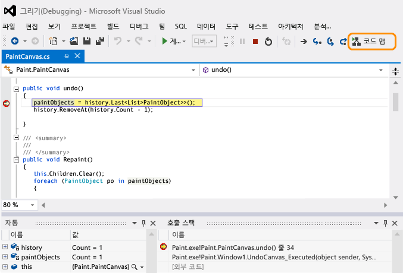  
  
     현재 호출 스택은 새 코드 맵에 주황색으로 표시됩니다.  
  
     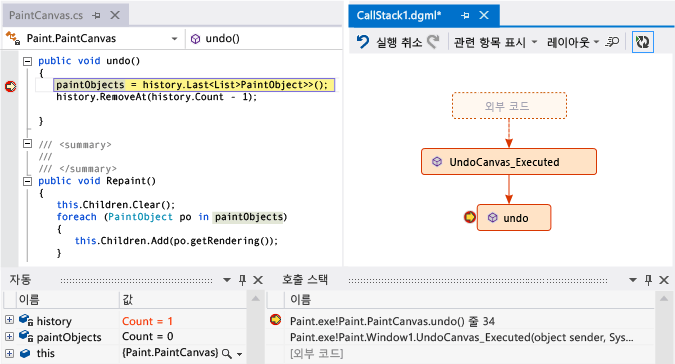  
  
     디버깅하는 동안 맵이 자동으로 업데이트됩니다. 참조 [다음 호출 스택과 함께 맵 업데이트](#UpdateMap)합니다.  
  
##  코드에 대해 메모 하기  
 코드 내용을 추적하기 위한 주석을 추가합니다. 주석에 새 줄을 추가 하려면 다음을 눌러 **Shift + Return**합니다.  
  
 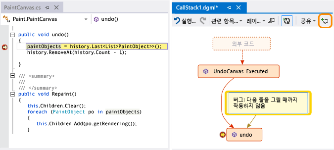  
  
##  다음 호출 스택과 함께 맵 업데이트  
 응용 프로그램을 다음 중단점까지 실행하거나 함수로 한 단계씩 실행합니다. 맵은 새로운 호출 스택을 추가합니다.  
  
 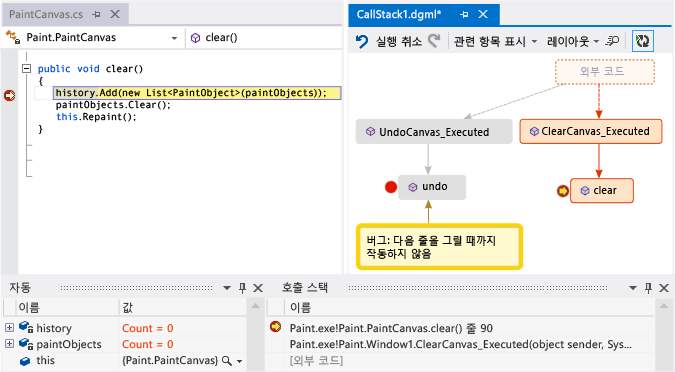  
  
##  맵에 관련된 코드 추가  
 맵이 완성되었습니다. 다음 단계는 무엇입니까? Visual C# .NET 또는 Visual Basic .NET으로 작업하는 경우 코드에서 발생한 사건을 추적하기 위해 필드, 속성 및 기타 메서드 등의 항목을 추가합니다.  
  
 메서드를 두 번 클릭하여 코드 정의를 보거나 메서드에 대한 바로 가기 메뉴를 사용합니다. (키보드: 메서드를 맵 및 키를 눌러 선택 **F12**)  
  
 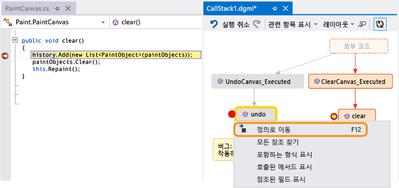  
  
 맵에서 추적할 항목을 추가합니다.  
  
 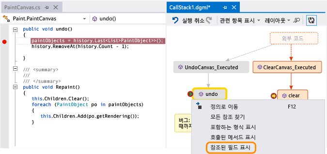  
  
> [!NOTE]
>  기본적으로 맵에 항목을 추가하면 클래스, 네임스페이스 및 어셈블리와 같은 부모 그룹 노드도 추가됩니다. 이 유용 하지만, 유지할 수 있습니다 지도 간단한 기능을 사용 하 여이 기능이 해제 된 **부모 포함** 맵 도구 모음의 단추를 눌러 **CTRL** 항목을 추가할 때.  
  
 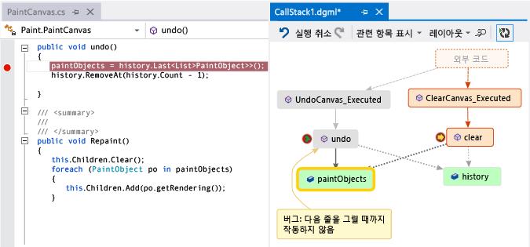  
  
 여기서 어떤 메서드가 동일한 필드를 사용하는지 쉽게 확인할 수 있습니다. 가장 최근 추가된 항목은 녹색으로 표시됩니다.  
  
 더 많은 코드를 보려면 맵 빌드를 계속합니다.  
  
 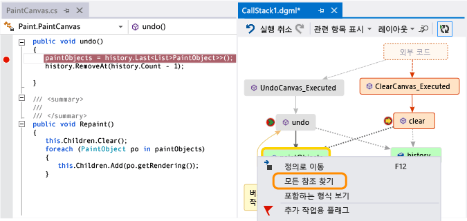  
  
 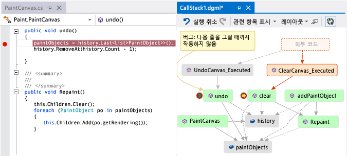  
  
##  지도 사용 하 여 버그 찾기  
 코드를 시각화하면 버그를 더 빠르게 찾을 수 있습니다. 예를 들어 드로잉 프로그램에서 버그를 조사한다고 가정하겠습니다. 선을 그렸다가 취소하려는 경우 다른 선을 그릴 때까지 아무 것도 발생하지 않습니다.  
  
 따라서 `clear`, `undo` 및 `Repaint` 메서드에서 중단점을 설정하고, 디버깅을 시작하고, 다음과 같은 맵을 빌드합니다.  
  
 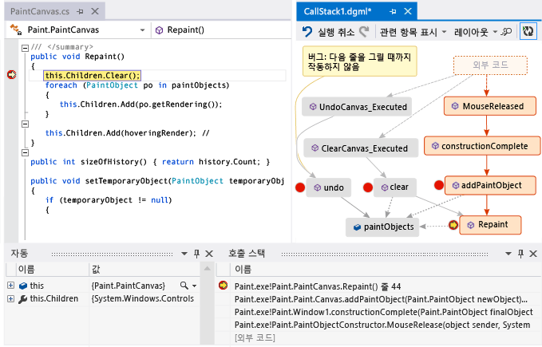  
  
 `Repaint`를 제외하고 맵 호출 `undo`에 대한 모든 사용자 제스처를 확인할 수 있습니다. `undo`가 즉시 작동하지 않는 이유를 이해할 수 있을 것입니다.  
  
 버그를 수정하고 프로그램 실행을 계속한 후에 맵은 `undo`의 새 호출을 `Repaint`에 추가합니다.  
  
 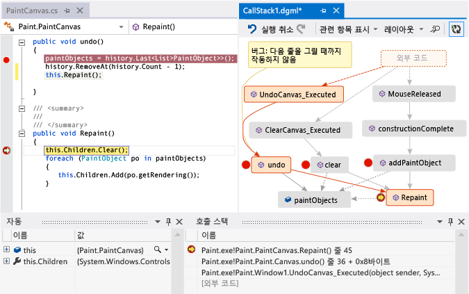  
  
##   Q & A  
  
-   **모든 호출이 지도에 표시 합니다. 이유**  
  
     기본적으로 맵에는 고유한 코드만 나타납니다. 외부 코드를 보려면에서 켜거나는 **호출 스택** 창:  
  
       
  
     설정 또는 해제 **내 코드만 사용** Visual studio 디버깅 옵션:  
  
       
  
-   **맵을 변경 영향이 코드 있습니까?**  
  
     맵 변경은 어떤 방식으로도 코드에 영향을 미치지 않습니다. 맵에서 이름 바꾸기, 이동 또는 제거 기능을 자유롭게 사용할 수 있습니다.  
  
-   **어떤이 메시지가 의미: "다이어그램이 코드의 이전 버전에 따라 설정할 수 있습니다"?**  
  
     지도를 마지막으로 업데이트한 후 코드가 변경되었을 수 있습니다. 예를 들어 맵에 대한 호출이 더 이상 코드에 없는 경우가 있습니다. 메시지를 닫은 다음 맵을 다시 업데이트하기 전에 솔루션 다시 빌드를 시도합니다.  
  
-   **맵 레이아웃을 제어 하는 방법**  
  
     열기는 **레이아웃** 맵 도구 모음에서 메뉴:  
  
    -   기본 레이아웃을 변경합니다.  
  
    -   자동으로 다시 정렬 하는 지도 중지 하려면 해제 **디버깅할 때 자동으로 레이아웃**합니다.  
  
    -   항목을 추가할 때 맵을 가능한 적게 다시 정렬 하려면 해제 **증분 레이아웃**합니다.  
  
-   **다른 사용자와 맵을 공유할 수 있습니까?**  
  
     맵을 내보내고 다른 사용자에게 전송하거나(Microsoft Outlook이 있는 경우) 솔루션에 저장하여 Team Foundation 버전 제어로 체크 인할 수 있습니다.  
  
     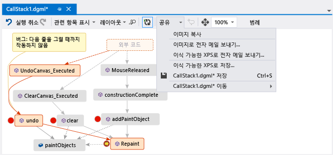  
  
-   **맵에 새 호출 스택이 자동으로 추가 되지 않게 하려면 어떻게 해야 합니까?**  
  
     선택  매핑 도구 모음입니다. 키를 눌러 현재 호출 스택을 맵에 수동으로 추가 하려면 **Ctrl** + **Shift** + **`**합니다.  
  
     디버깅하는 동안 맵은 기존 호출 스택을 맵에 계속해서 강조표시를 합니다.  
  
-   **항목 아이콘 및 화살표 의미**  
  
     항목에 대한 자세한 정보를 얻으려면 항목을 마우스 포인터로 가리켜 항목의 도구 설명을 확인합니다. 또한 볼 수 있습니다는 **범례** 각 아이콘의 의미에 대해 알아보려면 합니다.  
  
     ![호출 스택 코드 맵에 있는 아이콘은 무엇을 의미 하나요? ] (../debugger/media/debuggermap_showlegend.png "DebuggerMap_ShowLegend")  
  
 참고: [호출 스택 매핑](#MapStack) • [코드에 대 한 설명을](#MakeNotes) • [다음 호출 스택과 함께 맵 업데이트](#UpdateMap) • [맵에 관련된 코드를 추가](#AddRelatedCode) • [지도 사용 하 여 버그를 찾기](#FindBugs)  
  
## 참고 항목  
 [솔루션 전체의 종속성 매핑](../modeling/map-dependencies-across-your-solutions.md)   
 [코드 맵을 사용 하 여 응용 프로그램 디버그](../modeling/use-code-maps-to-debug-your-applications.md)   
 [코드 맵 분석기를 사용 하 여 잠재적인 문제 찾기](../modeling/find-potential-problems-using-code-map-analyzers.md)   
 [코드 맵 찾아보기 및 다시 정렬](../modeling/browse-and-rearrange-code-maps.md)
