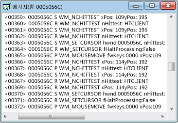

# Messages View
[!INCLUDE[vs2017banner](../code-quality/includes/vs2017banner.md)]

각 창에는 메시지 스트림이 연결되어 있습니다.  메시지 뷰 창에는 이러한 메시지 스트림이 표시되고  창 핸들, 메시지 코드 및 메시지도 표시됩니다.  이외에도 스레드나 프로세스에 대한 메시지 뷰를 만들 수도 있습니다.  이렇게 하면 특정 프로세스나 스레드가 소유하고 있는 모든 창으로 전송되는 메시지를 볼 수 있습니다. 이는 창 초기화 메시지를 캡처하는 데 특히 유용합니다.  
  
 일반적인 메시지 뷰 창은 다음과 같습니다.  첫 번째 열에는 창 핸들이 들어 있고 두 번째 열에는 메시지 코드가 들어 있습니다\([메시지 코드](../debugger/message-codes.md) 참조\).  디코딩한 메시지 매개 변수 및 반환 값은 오른쪽에 표시됩니다.  
  
   
Spy\+\+ 메시지 뷰  
  
## 절차  
  
#### 창, 프로세스 또는 스레드에 대한 메시지 뷰를 열려면  
  
1.  [창 뷰](../debugger/windows-view.md), [프로세스 뷰](../debugger/processes-view.md) 또는 [스레드 뷰](../debugger/threads-view.md) 창으로 포커스를 이동합니다.  
  
2.  해당 메시지를 검사할 항목의 노드를 찾아서 선택합니다.  
  
3.  **Spy** 메뉴에서 **로그 메시지**를 선택합니다.  
  
     [메시지 옵션 대화 상자](../debugger/message-options-dialog-box.md)가 열립니다.  
  
4.  표시할 메시지에 대한 옵션을 선택합니다.  
  
5.  **확인**을 클릭하여 메시지 로깅을 시작합니다.  
  
     메시지 뷰 창이 열리고 Spy\+\+ 도구 모음에 **메시지** 메뉴가 추가됩니다.  선택한 옵션에 따라 메시지가 활성 메시지 뷰 창으로 스트리밍되기 시작합니다.  
  
6.  메시지가 충분히 로깅되면 **메시지** 메뉴에서 **로깅 중지**를 선택합니다.  
  
## 단원 내용  
 [메시지 뷰 제어](../debugger/how-to-control-messages-view.md)  
 메시지 뷰를 관리하는 방법에 대해 설명합니다.  
  
 [창 찾기에서 메시지 뷰 열기](_asug_choosing_message_options)  
 창 찾기 대화 상자에서 메시지 뷰를 여는 방법에 대해 설명합니다.  
  
 [메시지 뷰에서 메시지 검색](../debugger/how-to-search-for-a-message-in-messages-view.md)  
 메시지 뷰에서 특정 메시지를 찾는 방법에 대해 설명합니다.  
  
 [메시지 로그 표시 시작 및 중지](../debugger/how-to-start-and-stop-the-message-log-display.md)  
 메시지 로깅을 시작하고 중지하는 방법에 대해 설명합니다.  
  
 [메시지 코드](../debugger/message-codes.md)  
 메시지 뷰에 표시되는 메시지에 대한 코드를 정의합니다.  
  
 [메시지 속성 표시](../debugger/how-to-display-message-properties.md)  
 메시지에 대한 자세한 내용을 표시하는 방법에 대해 설명합니다.  
  
## 관련 단원  
 [Spy\+\+ 뷰](../debugger/spy-increment-views.md)  
 창, 메시지, 프로세스 및 스레드의 Spy\+\+ 트리 뷰에 대해 설명합니다.  
  
 [Spy\+\+ 사용](../debugger/using-spy-increment.md)  
 Spy\+\+ 도구를 소개하고 사용 방법에 대해 설명합니다.  
  
 [메시지 옵션 대화 상자](../debugger/message-options-dialog-box.md)  
 활성 메시지 뷰에 표시되는 메시지를 선택하는 데 사용됩니다.  
  
 [메시지 검색 대화 상자](../debugger/message-search-dialog-box.md)  
 메시지 뷰에서 특정 메시지의 노드를 찾는 데 사용됩니다.  
  
 [메시지 속성 대화 상자](../debugger/message-properties-dialog-box.md)  
 메시지 뷰에서 선택한 메시지의 속성을 표시하는 데 사용됩니다.  
  
 [Spy\+\+ 참조](../debugger/spy-increment-reference.md)  
 각 Spy\+\+ 메뉴 및 대화 상자에 대해 설명하는 단원이 포함되어 있습니다.