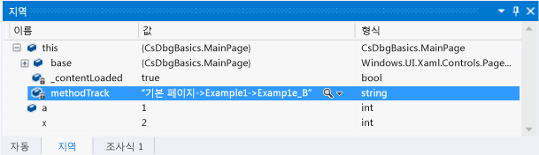
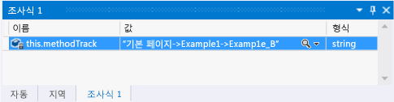
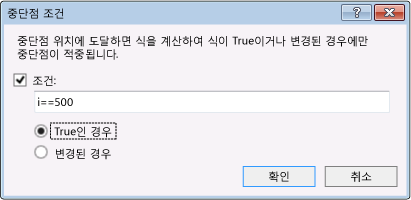
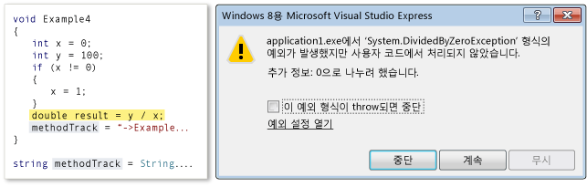
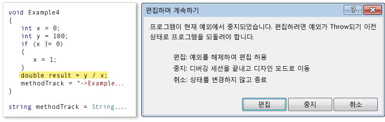
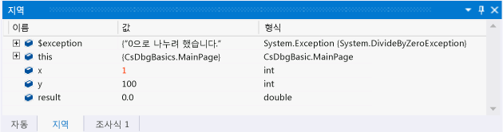

# Visual Studio에서 디버깅 세션 탐색(XAML 및 C#)
이 빠른 시작에서는 Visual Studio 디버그 세션을 탐색하는 방법 및 세션에서 프로그램 상태를 보고 변경하는 방법을 보여 줍니다.  
  
 이 빠른 시작은 처음으로 Visual Studio를 사용하여 디버깅하는 개발자 및 Visual Studio 디버그 세션 탐색에 대해 자세히 알아보려는 개발자를 위한 것이며, 디버깅 자체의 기술에 대해서는 설명하지 않습니다. 샘플 코드의 메서드는 이 항목에서 설명하는 디버깅 절차를 보여 주기 위해서만 설계되었습니다. 이 메서드는 앱 또는 함수 디자인의 모범 사례를 사용하지 않습니다. 실제로 메서드 및 앱 자체가 많은 기능을 수행하지 않는다는 것을 금방 알 수 있습니다.  
  
 이 빠른 시작의 각 섹션은 최대한 독립적으로 설계되었으므로 이미 알고 있는 정보가 포함된 섹션은 건너뛸 수 있습니다. 샘플 앱을 만들 필요도 없습니다. 그러나 샘플 앱을 만들어 프로세스를 최대한 쉽게 만드는 것이 좋습니다.  
  
 **디버거 바로 가기 키** Visual Studio 디버거 탐색은 마우스와 키보드 둘 다에 맞게 최적화되어 있습니다. 이 항목의 많은 단계에서는 키보드 액셀러레이터 또는 바로 가기 키를 괄호로 묶어 표시합니다. 예를 들어 (키보드: F5)는 F5 키를 입력하면 디버거 실행이 시작되거나 계속됨을 나타냅니다.  
  
## 항목 내용  
 배울 방법:  
  
-   [샘플 앱 만들기](#BKMK_CreateTheApplication)  
  
-   [중단점을 설정하고 중단점까지 실행, 메서드 한 단계씩 코드 실행 및 프로그램 데이터 검사](#BKMK_StepInto)  
  
-   [한 단계씩 코드 실행, 프로시저 단위 실행 및 메서드 프로시저 나가기](#BKMK_StepIntoOverOut)  
  
-   [조건부 중단점 설정, 커서까지 실행 및 변수 시각화](#BKMK_ConditionCursorVisualize)  
  
-   [편집하며 계속하기, 예외에서 복구](#BKMK_EditContinueRecoverExceptions)  
  
##   샘플 앱 만들기  
 디버깅은 코드에 있으므로 샘플 앱은 UWP 앱의 프레임 워크를 사용 하 여 디버그 세션 탐색의 작동 방식 및 검토 하 고 프로그램 상태를 변경 하는 방법을 확인할 수 있는 소스 파일을 만들 때에 합니다. 호출될 모든 코드가 기본 페이지의 생성자에서 호출되고 컨트롤이 추가되지 않으며 이벤트도 처리되지 않습니다.  
  
 **기본 C# UWP 앱을 만듭니다.** Visual Studio를 엽니다. 홈페이지에서 **새 프로젝트** 링크를 선택합니다. 새 프로젝트 대화 상자에서 선택 **Visual C#** 에 **설치 됨** 목록을 열고 다음 **Windows 유니버설**합니다. 프로젝트 템플릿 목록에서 선택 **비어 있는 앱 (유니버설 Windows)**합니다. Visual Studio에서 새 솔루션 및 프로젝트를 만들고 MainPage.xaml 디자이너 및 XAML 코드 편집기를 표시합니다.  
  
 **MainPage.xaml.cs 소스 파일을 엽니다.** XAML 편집기의 아무 곳이나 마우스 오른쪽 단추로 클릭하고 **코드 보기**를 선택합니다. MainPage.xaml.cs 코드 숨김 파일이 표시됩니다. 하나의 메서드인 `MainPage()` 생성자만 파일에 나열되어야 합니다.  
  
 **MainPage 생성자를 샘플 코드로 바꿉니다.** MainPage() 메서드를 삭제합니다. 이 링크를 따름: [디버거 탐색 샘플 코드 (Xaml 및 C#)](https://github.com/MicrosoftDocs/visualstudio-docs/raw/master/docs/debugger/samples/debugger-navigation-sample-code-xaml-and-csharp.cs), 클립보드에 C# 섹션에 나열 된 코드를 복사 합니다. (선택 **다시** 브라우저 또는 도움말 뷰어에서이 빠른 시작 페이지로 돌아갑니다.) Visual Studio 편집기에서 코드를 `partial class MainPage` 블록에 붙여넣습니다. Ctrl+s를 선택하여 파일을 저장합니다.  
  
 이제 이 항목의 예제도 함께 수행할 수 있습니다.  
  
##   중단점을 설정하고 중단점까지 실행, 메서드 한 단계씩 코드 실행 및 프로그램 데이터 검사  
 디버그 세션을 시작할 수 있는 가장 일반적인 방법은 **디버그** 메뉴에서 **디버깅 시작** 을 선택하는 것입니다(키보드: F5). 실행이 시작되고 중단점에 도달하거나, 실행을 수동으로 일시 중단하거나, 예외가 발생하거나, 앱이 종료될 때까지 계속됩니다.  
  
 실행이 디버거에서 일시 중단되면 변수 위로 마우스를 이동하여 데이터 팁에서 활성 변수의 값을 확인할 수 있습니다. 지역 및 자동 창을 열어 활성 변수와 해당 현재 값 목록을 확인할 수도 있습니다. 하나 이상의 변수를 조사식 창에 추가하면 앱이 계속 실행될 때 변수의 값에 초점을 맞출 수 있습니다.  
  
 앱의 실행을 일시 중단(디버거 중단이라고도 함)한 후 나머지 프로그램 코드가 실행되는 방식을 제어합니다. 한 줄씩 계속하여 메서드 호출에서 메서드 자체로 이동하거나 호출된 메서드를 단일 단계에서 실행할 수 있습니다. 이러한 프로시저를 앱 단계별 실행이라고 합니다. 또한 앱의 표준 실행을 다시 시작하여, 설정된 다음 중단점까지 또는 커서가 있는 줄까지 실행할 수 있습니다. 디버그 세션은 언제든지 중지할 수 있습니다. 디버거는 필요한 정리 작업을 수행하고 실행을 종료하도록 설계되었습니다.  
  
### 예제 1  
 이 예제에서는 MainPage.xaml.cs 파일의 MainPage 생성자에 중단점을 설정하고 첫번째 메서드를 한 단계씩 코드 실행하고 변수 값을 확인한 다음 디버깅을 중지합니다.  
  
 **중단점을 설정합니다.** MainPage 생성자의 `methodTrack = "Main Page";` 문에서 중단점을 설정합니다. 소스 코드 편집기의 음영 처리된 여백에서 줄을 선택합니다(키보드: 줄에 커서를 놓고 F9 키 선택).  
  
   
  
 여백에 중단점 아이콘이 나타납니다.  
  
 **중단점까지 실행합니다.** **디버그** on the **디버깅 시작** (키보드: F5)을 선택하는 것입니다.  
  
 앱이 실행되기 시작하고 중단점을 설정한 문 바로 앞에서 실행을 일시 중단합니다. 여백에 있는 현재 줄 아이콘은 위치를 식별하고 현재 문이 강조 표시됩니다.  
  
   
  
 이제 앱의 실행을 제어하고 프로그램 문을 단계별로 실행하면서 프로그램 상태를 검사할 수 있습니다.  
  
 **메서드를 한 단계씩 코드 실행합니다.** On the **디버깅 시작** 메뉴에서 **한 단계씩 코드 실행** 을 선택합니다(키보드: F11).  
  
   
  
 디버거가 Example1 메서드를 호출하는 다음 줄로 이동합니다. 한 단계씩 코드 실행을 다시 선택합니다. 디버거가 Example1 메서드의 진입점으로 이동합니다. 이는 메서드가 호출 스택에 로드되었으며 로컬 변수에 대한 메모리가 할당되었음을 나타냅니다.  
  
 코드 줄을 한 단계씩 코드 실행하면 디버거가 다음 작업 중 하나를 수행합니다.  
  
-   다음 문이 솔루션의 함수를 호출하지 않을 경우 디버거는 문을 실행하고 다음 문으로 이동한 후 실행을 일시 중단합니다.  
  
-   문이 솔루션의 함수를 호출할 경우 디버거는 호출된 함수의 진입점으로 이동한 후 실행을 일시 중단합니다.  
  
 끝내기 점에 도달할 때까지 Example1 문의 한 단계씩 코드 실행을 계속합니다. 디버거는 메서드의 닫는 중괄호를 강조 표시합니다.  
  
 **데이터 팁에서 변수 값을 검사합니다.** 변수 이름 위로 마우스를 이동하면 변수의 이름, 값 및 형식이 데이터 팁에 표시됩니다.  
  
   
  
 변수 `a`위로 마우스를 이동합니다. 이름, 값 및 데이터 형식을 확인합니다. 변수 `methodTrack`위로 마우스를 이동합니다. 이름, 값 및 데이터 형식을 다시 확인합니다.  
  
 **지역 창에서 변수 값을 검사합니다.** On the **디버깅 시작** 메뉴에서 **창**을 가리킨 다음 **지역**를 선택합니다. (키보드: Alt + 4).  
  
   
  
 지역 창은 함수의 매개 변수 및 변수의 트리 뷰입니다. 개체 변수의 속성은 개체 자체의 자식 노드입니다. `this` 변수는 모든 개체 메서드에서 개체 자체를 나타내는 숨겨진 매개 변수입니다. 이 경우는 MainPage 클래스를 나타냅니다. `methodTrack` 은 MainPage 클래스의 멤버이므로 해당 값 및 데이터 형식이 `this`아래의 줄에 나열됩니다. `this` 노드를 확장하여 `methodTrack` 정보를 확인합니다.  
  
 **methodTrack 변수에 대한 조사식을 추가합니다.** `methodWatch` 변수는 이 빠른 시작 전체에서 예제에서 호출된 메서드를 표시하는 데 사용됩니다. 변수의 값을 더 쉽게 확인하려면 조사식 창에 추가합니다. 지역 창에서 변수 이름을 마우스 오른쪽 단추로 클릭한 다음 **조사식 추가**를 선택합니다.  
  
   
  
 조사식 창에서 여러 변수를 조사할 수 있습니다. 지역 창 및 데이터 팁 창의 값과 같이 조사 변수의 값은 실행이 일시 중단될 때마다 업데이트됩니다. 코드 편집기에서 조사식 창에 변수를 추가할 수도 있습니다. 조사할 변수를 선택하고 마우스 오른쪽 단추로 클릭한 다음 **조사식 추가**를 선택합니다.  
  
##   한 단계씩 코드 실행, 프로시저 단위 실행 및 메서드 프로시저 나가기  
 부모 메서드에 의해 호출된 메서드를 한 단계씩 코드 실행하는 것과 달리 메서드를 프로시저 단위로 실행하면 자식 메서드가 실행된 다음 부모가 다시 시작될 때 메서드 호출에서 실행이 일시 중단됩니다. 메서드 작동 방식을 잘 알고 있고 메서드 실행이 조사하고 있는 문제에 영향을 주지 않을 것을 확신하는 경우 메서드를 프로시저 단위로 실행할 수 있습니다.  
  
 메서드 호출을 포함하지 않는 코드 줄을 프로시저 단위로 실행하면 줄을 한 단계씩 코드 실행하는 것처럼 줄이 실행됩니다.  
  
 자식 메서드의 프로시저에서 나가면 메서드의 실행이 계속된 다음 메서드에서 호출 메서드를 반환한 후에 실행이 일시 중단됩니다. 나머지 함수가 중요하지 않은 것으로 확인된 경우 긴 함수의 프로시저에서 나갈 수 있습니다.  
  
 함수의 프로시저 단위 실행과 프로시저에서 나가지 모두 함수를 실행합니다.  
  
   
  
### 예제 2  
 이 예제에서는 메서드의 한 단계씩 코드 실행, 프로시저 단위 실행 및 프로시저 나가기를 수행합니다.  
  
 **MainPage 생성자에서 Example2 메서드를 호출합니다.** MainPage 생성자를 편집하고 `methodTrack = String.Empty;` 다음 줄을 `Example2();`를 선택합니다.  
  
   
  
 **중단점까지 실행합니다.** **디버그** on the **디버깅 시작** (키보드: F5)을 선택하는 것입니다. 디버거는 중단점에서 실행을 일시 중단합니다.  
  
 **코드 줄을 프로시저 단위로 실행합니다.** On the **디버깅 시작** 메뉴에서 **프로시저 단위 실행** 을 선택합니다(키보드: F10). 디버거는 문을 한 단계씩 코드 실행하는 것과 동일한 방식으로 `methodTrack = "MainPage";` 문을 실행합니다.  
  
 **Example2 및 Example2_A를 한 단계씩 코드 실행합니다.** F11 키를 선택하여  Example 2 메서드를 한 단계씩 코드 실행합니다. `int x = Example2_A();`줄에 도달할 때까지 Example2 문을 계속 한 단계씩 코드 실행합니다. 다시 이 줄을 한 단계씩 코드 실행하여 Example2_A의 진입점으로 이동합니다. Example2로 돌아갈 때까지 Example2_A의 각 문을 계속 한 단계씩 코드 실행합니다.  
  
   
  
 **함수를 프로시저 단위로 실행합니다.** Example2의 다음 줄 `int y = Example2_A();` 는 기본적으로 이전 줄과 동일합니다. 이 줄을 안전하게 프로시저 단위로 실행합니다. F10 키를 선택하여 Example2의 다시 계속에서 Example2_A의 이 두번째 호출로 이동합니다. F10 키를 선택하여 이 메서드를 프로시저 단위로 실행합니다. `methodTrack` 문자열은 Example2_A 메서드가 두 번 실행되었음을 나타냅니다. 또한 디버거가 바로 다음 줄로 이동하는 것을 확인할 수 있습니다. 디버거가 Example2가 다시 시작되는 지점에서 실행을 일시 중단하지 않습니다.  
  
 **함수의 프로시저에서 나갑니다.** F11 키를 선택하여 Example2_B 메서드를 한 단계씩 코드 실행합니다. Example2_B는 Example2_A와 크게 다르지 않습니다. 메서드의 프로시저에서 나가려면 **디버그** 메뉴에서 **프로시저 나가기** 를 선택합니다(키보드: Shift+F11). `methodTrack` 변수는 Example2_B가 실행되었으며 디버거는 Example2가 다시 시작되는 지점으로 돌아갔음을 나타냅니다.  
  
 **디버깅을 중지합니다.** 디버그 메뉴에서 디버깅 중지를 선택합니다(키보드: Shift+F5). 이렇게 하면 디버그 세션이 종료됩니다.  
  
##   조건부 중단점 설정, 커서까지 실행 및 변수 시각화  
 조건부 중단점은 디버거가 실행을 일시 중단하도록 하는 조건을 지정합니다. 조건은 true 또는 false로 평가될 수 있는 모든 코드 식으로 지정됩니다. 예를 들어 조건부 중단점을 사용하면 변수가 특정 값에 도달하는 경우에만 자주 호출되는 메서드에서 프로그램 상태를 검사할 수 있습니다.  
  
 커서까지 실행은 일회용 중단점 설정과 유사합니다. 실행이 일시 중단되면 소스에서 줄을 선택하고 선택한 줄에 도달할 때까지 실행을 다시 시작할 수 있습니다. 예를 들어 메서드의 루프를 단계별로 실행하고 루프의 코드가 올바르게 수행되는지 확인할 수 있습니다. 루프의 모든 반복을 단계별로 실행하는 대신 루프가 실행된 후에 배치되는 커서까지 실행할 수 있습니다.  
  
 경우에 따라 데이터 팁 또는 변수 창의 행에서 변수 값을 확인하기가 어려울 수 있습니다. 디버거는 스크롤 가능한 창에서 값의 서식이 지정된 보기를 표시하는 텍스트 시각화 도우미에 문자열, HTML 및 Xml을 표시할 수 있습니다.  
  
### 예제 3  
 이 예제에서는 조건부 중단점을 설정하여 루프의 특정 반복에서 중단한 다음 루프 후 배치되는 커서까지 실행합니다. 또한 텍스트 시각화 도우미에서 변수의 값을 확인합니다.  
  
 **MainPage 생성자에서 Example3 메서드를 호출합니다.** MainPage 생성자를 편집하고 `methodTrack = String.Empty;` 다음 줄을 `Example3();`를 선택합니다.  
  
   
  
 **중단점까지 실행합니다.** **디버그** on the **디버깅 시작** (키보드: F5)을 선택하는 것입니다. 디버거가 MainPage 메서드의 중단점에서 실행을 일시 중단합니다.  
  
 **Example3 메서드를 한 단계씩 코드 실행합니다.** **한 단계씩 코드 실행** 메뉴에서 **디버깅 시작** 을 선택(키보드: F11)하여 Example3 메서드의 진입점으로 이동합니다. `for` 블록의 루프 하나 또는 두 개를 반복할 때까지 메서드를 계속 한 단계씩 코드 실행합니다. 1000개 루프를 모두 단계별로 실행하려면 시간이 오래 걸릴 수 있습니다.  
  
 **조건부 중단점을 설정합니다.** 코드 창의 왼쪽 여백에서 `x += i;` 줄을 마우스 오른쪽 단추로 클릭한 다음 **조건**를 선택합니다. **조건** 확인란을 선택한 다음 텍스트 상자에 `i == 500;` 을 입력합니다. **참인 경우** 옵션을 선택하고 **확인**을 선택합니다. 중단점을 사용하면 `for` 루프의 500번째 반복에서 값을 확인할 수 있습니다.  
  
   
  
 조건부 중단점 아이콘은 해당 흰색 십자 표시로 식별할 수 있습니다.  
  
   
  
 **중단점까지 실행합니다.** 디버그 메뉴에서 계속을 선택합니다(키보드: F5). 지역 창에서 `i` 의 현재 값이 500인지 확인합니다. `s` 변수가 한 줄로 표시되고 창보다 훨씬 깁니다.  
  
 **문자열 변수를 표시합니다.** 돋보기 아이콘을 클릭는 **값** 의 열은 `s`합니다.  
  
 텍스트 시각화 도우미 창이 나타나고 문자열의 값이 여러 줄로 된 문자열로 표시됩니다.  
  
 **커서까지 실행합니다.** `methodTrack += "->Example3";` 줄을 마우스 오른쪽 단추로 클릭한 다음 **커서까지 실행** 을 선택합니다(키보드: 커서를 줄로 이동, Ctrl+F10). 디버거가 루프 반복을 완료하고 줄에서 실행을 일시 중단합니다.  
  
 **디버깅을 중지합니다.** 디버그 메뉴에서 디버깅 중지를 선택합니다(키보드: Shift+F5). 이렇게 하면 디버그 세션이 종료됩니다.  
  
##   편집하며 계속하기, 예외에서 복구  
 일부 환경에서는 Visual Studio 디버거에서 코드를 중단할 경우 변수의 값을 변경하고 문의 논리까지도 변경할 수 있습니다. 이러한 기능을 편집하며 계속하기라고 합니다.  
  
 편집하며 계속하기는 예외에서 중단된 경우에 특히 유용할 수 있습니다. 예외를 방지하기 위해 관련된 긴 프로시저 디버깅을 중지하고 다시 시작하는 대신 예외를 "해제"하여 예외가 발생하기 바로 전 지점까지 실행을 이동한 다음 문제가 되는 변수 또는 문을 변경하고 예외를 throw하지 않는 상태로 현재 디버깅 세션을 계속할 수 있습니다.  
  
 편집하며 계속하기는 매우 다양한 상황에서 사용할 수 있지만, 편집하며 계속하기를 지원하지 않는 특정 조건을 지정하기는 어렵습니다. 프로그래밍 언어, 프로그램 스택의 현재 상태, 프로세스를 손상시키지 않고 상태를 변경하는 디버거의 기능에 따라 조건이 달라질 수 있기 때문입니다. 편집 변경이 지원되는지 확인하는 가장 좋은 방법은 직접 시도해 보는 것입니다. 디버거를 사용하면 변경이 지원되지 않는 경우 바로 알 수 있습니다.  
  
### 예제 4  
 이 예제에서는 디버거를 예외까지 실행하고 예외를 해제한 후 메서드의 논리를 수정한 다음 메서드를 계속 실행할 수 있도록 변수의 값을 변경합니다.  
  
 **MainPage 생성자에서 Example4 메서드를 호출합니다.** MainPage() 생성자를 편집하고 `methodTrack = String.Empty;` 다음 줄을 `Example4();`를 선택합니다.  
  
   
  
 **예외까지 실행합니다.** **디버그** on the **디버깅 시작** (키보드: F5)을 선택하는 것입니다. F5 키를 다시 눌러 실행을 다시 시작합니다. 디버거가 Example4 메서드의 예외에서 실행을 일시 중단하고 예외 대화 상자를 표시합니다.  
  
   
  
 **프로그램 논리를 변경합니다.** 분명히 `if` 조건에 실수가 있습니다. `x` 의 값은 `x` 가 0과 같지 않을 때가 아니라 `x` 가 0과 같을 때 변경해야 합니다. **중단** 을 선택하여 메서드의 논리를 수정합니다. 줄을 편집하려고 하면 다른 대화 상자가 나타납니다.  
  
   
  
 **편집** 을 선택하고 `if (x != 0)` 줄을 `if (x == 0)`으로 변경합니다. 디버거가 프로그램 논리 변경 사항을 소스 파일에 유지합니다.  
  
 **변수 값을 변경합니다.** 데이터 팁 또는 지역 창에서 `x` 의 값을 조사합니다. 여전히 0(영)입니다. 원래 예외를 발생시킨 문을 실행하려고 하면 예외만 다시 throw됩니다. `x`의 값을 변경할 수 있습니다. 지역 창에서 **x** 행의 **값** 열을 두 번 클릭합니다. 값을 0에서 1로 변경합니다.  
  
   
  
 F11 키를 선택하여 이전에 예외를 throw한 문을 한 단계씩 코드 실행합니다. 줄이 오류 없이 실행됩니다. F11 키를 다시 선택합니다.  
  
 **디버깅을 중지합니다.** On the **디버깅 시작** 메뉴에서 **디버깅 중지** 를 선택합니다(키보드: F5). 이렇게 하면 디버그 세션이 종료됩니다.  
  
## 참고 항목  
 [(VB, C#, c + + 및 XAML) 디버그 세션 시작](../debugger/start-a-debugging-session-for-a-store-app-in-visual-studio-vb-csharp-cpp-and-xaml.md)   
 [트리거 일시 중단, 다시 시작 및 백그라운드 이벤트를 UWP 앱 용)](../debugger/how-to-trigger-suspend-resume-and-background-events-for-windows-store-apps-in-visual-studio.md)   
 [Visual Studio에서 앱 디버깅](../debugger/debug-store-apps-in-visual-studio.md)