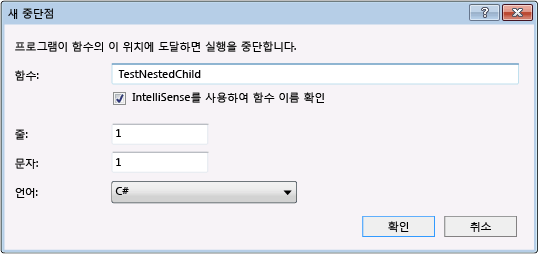
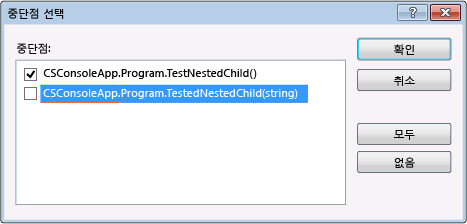

# 디버거로 코드 탐색
[!INCLUDE[vs2017banner](../code-quality/includes/vs2017banner.md)]

디버거에서 코드 사이를 이동하는 데는 여러 방법이 있습니다. 예를 들어 메서드를 단계별로 실행하거나 프로시저 단위로 실행하거나, 중단점 또는 지정 위치까지 실행하거나, 고유 코드로 디버깅을 제한할지 아니면 외부 코드를 디버그하는 기호를 포함할지를 지정할 수 있습니다.  
  
##  <a name="BKMK_Step_into__over__or_out_of_the_code"></a> 한 단계씩 코드 실행, 프로시저 단위 실행 또는 프로시저 나가기  
 가장 일반적인 디버깅 절차 중 하나는 *단계별 실행*입니다. 단계별 실행은 한 번에 한 줄씩 코드를 실행합니다. 중단점까지 디버거를 실행하는 등의 방법으로 실행을 중단한 경우 다음 세 가지 **디버그** 메뉴 명령을 사용하여 코드를 단계별로 실행할 수 있습니다.  
  
|메뉴 명령|바로 가기 키|설명|  
|-----------|-------------|--------|  
|**한 단계씩 코드 실행**|**F11**|코드 줄에 함수 호출이 포함되어 있는 경우 **한 단계씩 코드 실행**은 호출 자체만 실행한 다음 함수 안에 있는 코드의 첫째 줄에서 중단합니다. 그렇지 않은 경우에는 **한 단계씩 코드 실행**은 다음 문을 실행합니다.|  
|**프로시저 단위 실행**|**F10**|코드 줄에 함수 호출이 포함된 경우 **프로시저 단위 실행**은 호출된 함수를 실행한 다음 호출하는 함수 내의 첫 번째 코드 줄에서 중단됩니다. 그렇지 않은 경우에는 **한 단계씩 코드 실행**은 다음 문을 실행합니다.|  
|**프로시저 나가기**|**Shift\+F11**|**프로시저 나가기**는 함수가 반환될 때까지 코드 실행을 계속한 다음 호출 함수의 반환점에서 중단합니다.|  
  
-   중첩된 함수 호출인 경우 **한 단계씩 코드 실행** 명령은 가장 안쪽에 중첩된 함수를 한 단계씩 실행합니다.`Func1(Func2())`와 같은 호출에 **한 단계씩 코드 실행**을 사용하면 디버거에서 함수 `Func2`를 한 단계씩 실행합니다.  
  
-   실제로 디버거는 실제 줄이 아닌 코드 문을 단계별로 실행합니다. 예를 들어 한 줄에 `if` 절을 작성할 수 있습니다.  
  
    ```c#  
    int x = 42;  
    string s = "Not answered";  
    if( int x == 42) s = "Answered!";  
    ```  
  
    ```vb  
    Dim x As Integet = 42  
    Dim s As String = "Not answered"  
    If x = 42 Then s = "Answered!"  
    ```  
  
     이 줄을 한 단계씩 실행하면 디버거는 조건을 한 단계로 처리하고 결과를 다른 단계로 처리합니다\(이 예에서는 조건이 참임\).  
  
 함수를 한 단계씩 실행하는 동안 호출 스택을 시각적으로 추적하려면 [디버깅하는 동안 호출 스택의 맵 메서드](../debugger/map-methods-on-the-call-stack-while-debugging-in-visual-studio.md)을 참조하세요.  
  
##  <a name="BKMK_Break_into_code_by_using_breakpoints_or_Break_All"></a> 중단점 또는 모두 중단을 사용하여 코드 중단  
 VS 디버거를 사용하여 응용 프로그램을 디버깅할 때 응용 프로그램은 실행 중이거나 중단 모드에 있습니다.  
  
 실행이 중단점에 도달하거나 예외가 발생하면 디버거에서 응용 프로그램 실행을 중단합니다. 언제든지 수동으로 실행을 중단할 수도 있습니다.  
  
 중단점은 특정 위치에서 응용 프로그램 실행을 일시 중단하도록 디버거에 지시하는 신호입니다. 프로그램 실행이 중단점에서 중단되면 프로그램은 중단 모드에 있는 것입니다. 중단 모드가 시작되어도 프로그램 실행이 중지되거나 종료되지는 않으며, 언제라도 실행을 다시 시작할 수 있습니다.  
  
 지역 창에서 변수 값 보기 또는 조사식 창에서 식 계산과 같은 대부분의 디버거 기능은 중단 모드에서만 사용할 수 있습니다. 응용 프로그램의 모든 요소가 유지되지만\(예: 함수, 변수 및 개체가 메모리에 유지됨\) 이동과 작업은 일시 중단됩니다. 중단 모드에서는 요소의 위치와 상태를 검사하여 위반이나 버그를 찾아낼 수 있습니다. 중단 모드에 있는 동안 응용 프로그램을 조정할 수도 있습니다.  
  
 다양한 조건을 기준으로 실행을 일시 중단하도록 중단점을 구성할 수 있습니다.[중단점 사용](../debugger/using-breakpoints.md)을 참조하세요. 이 단원에서는 코드를 중단하는 두 가지 기본적인 방법을 설명합니다.  
  
1.  **코드에 중단점 설정**  
  
     코드에 간단한 중단점을 설정하려면 Visual Studio 편집기에서 소스 파일을 엽니다. 중단하려는 코드 줄에 커서를 설정한 다음 상황에 맞는 메뉴에서 **중단점**, **중단점 삽입**을 선택합니다\(키보드: **F9**\). 디버거는 해당 줄이 실행되기 바로 전에 실행을 중단합니다.  
  
       
  
     Visual Studio에서 중단점은 조건부 중단점 및 추적점과 같은 다양한 추가 기능을 제공합니다.[중단점 사용](../debugger/using-breakpoints.md)을 참조하세요.  
  
2.  **수동으로 코드 중단**  
  
     실행 중인 응용 프로그램의 사용 가능한 다음 코드 줄에서 중단하려면 **디버그**, **모두 중단**을 선택합니다\(키보드: **Ctrl\+Alt\+Break**\).  
  
-   내 코드만 옵션을 사용하여 디버깅하는 경우 프로젝트의 다음 코드 줄에서 중단합니다.[단계별 코드 실행을 내 코드만으로 제한](#BKMK_Restrict_stepping_to_Just_My_Code)을 참조하세요.  
  
-   여러 프로그램을 디버깅하는 경우 중단점 또는 모두 중단 명령은 기본적으로 디버깅 중인 모든 프로그램에 적용됩니다.[여러 프로세스의 실행 동작 구성](../debugger/debug-multiple-processes.md#BKMK_Configure_the_execution_behavior_of_multiple_processes)을 참조하세요.  
  
-   해당 소스 또는 기호\(.pdb\) 파일 없이 코드를 실행하는 동안 중단하는 경우 디버거에서 적절한 파일을 찾는 데 도움이 될 수 있는 **소스 파일을 찾을 수 없음** 또는 **기호를 찾을 수 없음** 페이지가 표시됩니다.[기호 파일\(.pdb\) 및 원본 파일 지정](../debugger/specify-symbol-dot-pdb-and-source-files-in-the-visual-studio-debugger.md)을 참조하세요.  
  
     지원 파일에 액세스할 수 없는 경우에도 디스어셈블리 창에서 어셈블리 명령을 디버깅할 수 있습니다.  
  
##  <a name="BKMK_Run_to_a_specified_location_or_function"></a> 지정된 위치 또는 함수까지 실행  
 코드의 특정 위치까지 실행한 다음 실행을 중단할 수도 있습니다. 중단하려는 위치에 중단점을 설정한 경우, 디버깅을 시작하지 않았으면 **디버그**, **디버깅 시작**을 선택하고 그렇지 않으면 **디버그**, **계속**을 선택합니다. 두 경우 모두 바로 가기 키는 **F5**입니다. 코드 실행의 다음 중단점에서 디버거가 중지됩니다. 원하는 중단점에 도달할 때까지 **디버그**, **계속**을 선택합니다.  
  
 코드 편집기에서 커서를 놓은 위치까지 실행하거나 지정된 함수까지 실행할 수도 있습니다.  
  
 **커서 위치까지 실행**  
  
 커서 위치까지 실행하려면 소스 창에서 실행 가능한 코드 줄에 커서를 놓습니다. 편집기의 상황에 맞는 메뉴에서 **커서까지 실행**을 선택합니다.  
  
 **호출 스택에 있는 함수까지 실행**  
  
 **호출 스택** 창에서 함수를 선택하고 상황에 맞는 메뉴에서 **커서까지 실행**을 선택합니다. 호출 스택을 시각적으로 추적하려면 [디버깅하는 동안 호출 스택의 맵 메서드](../debugger/map-methods-on-the-call-stack-while-debugging-in-visual-studio.md)을 참조하세요.  
  
 **이름으로 지정된 함수까지 실행**  
  
 지정한 함수에 도달할 때까지 응용 프로그램을 실행하도록 디버거에 명령할 수 있습니다. 함수 이름을 지정하거나 호출 스택에서 함수를 선택할 수 있습니다.  
  
 함수 이름을 지정하려면 **디버그**, **새 중단점**, **함수에서 중단**을 선택한 다음 함수의 이름과 기타 식별 정보를 입력합니다.  
  
   
  
 함수가 오버로드되거나 여러 네임스페이스에 있는 경우 **중단점 선택** 대화 상자에서 원하는 함수를 선택할 수 있습니다.  
  
   
  
##  <a name="BKMK_Set_the_next_statement_to_execute"></a> 다음에 실행할 문 설정  
 디버거를 중단한 후 실행 지점을 이동하여 다음에 실행할 코드의 문을 설정할 수 있습니다. 소스 또는 디스어셈블리 창의 여백에 있는 노란색 화살표는 다음에 실행할 문의 위치를 나타냅니다. 코드의 일부를 건너뛰거나 이전에 실행한 줄로 돌아가려면 이 화살표를 이동합니다. 알려진 버그를 포함하는 코드 섹션을 건너뛰려는 경우 등에 이 방법을 사용할 수 있습니다.  
  
   
  
 다음에 실행할 문을 설정하려면 다음 절차 중 하나를 사용합니다.  
  
-   소스 창에서 노랑 화살표를 같은 소스 파일에서 다음 문을 설정할 위치로 끌어 놓습니다.  
  
-   소스 창에서 다음에 실행할 줄에 커서를 설정하고 상황에 맞는 메뉴에서 **다음 문 설정**을 선택합니다.  
  
-   디스어셈블리 창에서 다음에 실행할 어셈블리 명령에 커서를 설정하고 상황에 맞는 메뉴에서 **다음 문 설정**을 선택합니다.  
  
> [!CAUTION]
>  다음 문을 설정하면 프로그램 카운터가 새 위치로 바로 이동하게 됩니다. 이 명령은 주의해서 사용해야 합니다.  
>   
>  -   기존 실행 위치와 새 실행 위치 사이에서는 명령이 실행되지 않습니다.  
> -   실행 위치를 뒤로 이동하면 그 사이에서 실행된 명령이 실행 취소되지 않습니다.  
> -   다음 문을 다른 함수나 범위로 이동하면 호출 스택이 손상되어 런타임 오류나 예외가 발생할 수 있습니다. 다음 문을 다른 범위로 이동하려고 하면 디버거에서 대화 상자가 열리고 여기서 작업을 취소할 수 있습니다. Visual Basic의 경우 다음 문을 다른 범위나 함수로 이동할 수 없습니다.  
> -   네이티브 C\+\+에서 런타임 검사를 활성화한 경우 다음 문을 설정하면 실행이 메서드의 끝에 도달할 때 예외가 throw될 수 있습니다.  
> -   편집하며 계속하기를 활성화한 경우 편집하며 계속하기에서 즉시 다시 매핑할 수 없는 종류의 편집을 수행하면 **다음 문 설정**이 실패합니다. 예를 들어 catch 블록 내의 코드를 편집하면 이 문제가 발생합니다. 이 경우 작업이 지원되지 않음을 알리는 오류 메시지가 나타납니다.  
  
> [!NOTE]
>  관리 코드의 경우 다음과 같은 조건에서는 다음 문을 이동할 수 없습니다.  
>   
>  -   다음 문이 현재 문과 다른 메서드에 있는 경우  
> -   Just\-In\-Time 디버깅을 사용하여 디버깅을 시작한 경우  
> -   호출 스택 해제를 진행 중인 경우  
> -   System.StackOverflowException 또는 System.Threading.ThreadAbortException 예외가 throw된 경우  
  
 응용 프로그램을 실행하는 동안에는 다음 문을 설정할 수 없습니다. 다음에 실행할 문을 설정하려면 디버거가 중단 모드에 있어야 합니다.  
  
##  <a name="BKMK_Restrict_stepping_to_Just_My_Code"></a> 단계별 코드 실행을 내 코드만으로 제한  
 디버깅하는 동안 사용자가 작성한 코드만 확인하고 시스템 호출 등의 다른 코드는 무시할 수 있습니다. 이렇게 하려면 내 코드만 디버깅 옵션을 사용합니다. 내 코드만 옵션을 사용하면 사용자가 작성하지 않은 코드는 디버거 창에 표시되지 않도록 숨겨집니다. 단계별로 실행할 때 디버거에서는 사용자가 작성하지 않은 코드도 실행하지만 이 단계에서는 실행을 중단하지 않습니다.[내 코드만](../debugger/just-my-code.md)을 참조하세요.  
  
> [!NOTE]
>  장치 프로젝트에 대해서는 내 코드만 옵션이 지원되지 않습니다.  
  
##  <a name="BKMK_Step_into_system_calls"></a> 한 단계씩 시스템 호출 실행  
 시스템 코드에 대한 디버깅 기호를 로드했고 내 코드만이 설정되지 않은 경우 다른 모든 호출과 마찬가지로 시스템 호출을 한 단계씩 실행할 수 있습니다.  
  
 Microsoft 기호 파일에 액세스하려면 [기호 파일\(.pdb\) 및 원본 파일 지정](../debugger/specify-symbol-dot-pdb-and-source-files-in-the-visual-studio-debugger.md) 항목의 [기호 서버를 사용하여 로컬 컴퓨터에 없는 기호 파일 찾기](../debugger/specify-symbol-dot-pdb-and-source-files-in-the-visual-studio-debugger.md#BKMK_Use_symbol_servers_to_find_symbol_files_not_on_your_local_machine)\(영문\)을 참조하세요.  
  
 디버깅하는 동안 특정 시스템 구성 요소에 대한 기호를 로드하려면  
  
1.  모듈 창을 엽니다\(키보드: **Ctrl\+Alt\+U**\).  
  
2.  기호를 로드하려는 모듈을 선택합니다.  
  
     **기호 상태** 열을 보면 기호가 로드된 모듈을 확인할 수 있습니다.  
  
3.  상황에 맞는 메뉴에서 **기호 로드**를 선택합니다.  
  
##  <a name="BKMK_Step_into_properties_and_operators_in_managed_code"></a> 한 단계씩 관리 코드의 속성 및 연산자 실행  
 기본적으로 디버거는 관리 코드의 속성과 연산자를 건너뜁니다. 대부분의 경우 이렇게 하면 더 나은 디버깅 환경이 제공됩니다. 속성이나 연산자를 한 단계씩 실행하려면 **디버그**, **옵션 및 설정**을 선택합니다.**디버깅**, **일반** 페이지에서 **속성 및 연산자 건너뛰기\(관리 전용\)** 확인란의 선택을 취소합니다.