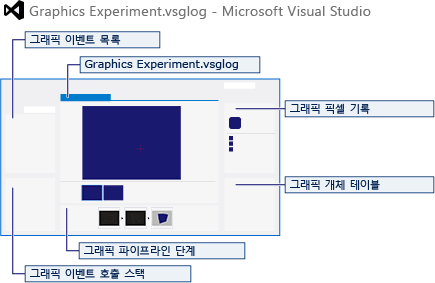

# Visual Studio 그래픽 진단 개요
[!INCLUDE[vs2017banner](../code-quality/includes/vs2017banner.md)]

Visual Studio *그래픽 진단*은 Direct3D 앱의 렌더링 및 성능 문제를 기록한 후 분석하기 위한 도구 집합입니다.  Windows PC에서 로컬로 실행 중이거나 Windows 장치 에뮬레이터 또는 원격 PC나 장치에서 실행 중인 앱에서 그래픽 진단을 사용할 수 있습니다.  
  
## 그래픽 진단을 사용하여 렌더링 문제 디버깅  
 그래픽이 많은 응용 프로그램에서 렌더링 문제를 디버깅하는 것은 디버거를 시작하고 몇몇 코드를 단계적으로 실행하는 것처럼 간단하지가 않습니다.  각 프레임에는 수십만 개의 고유한 픽셀이 생성되어 있고 상태, 데이터, 매개 변수 및 코드의 복잡한 집합에 따라 이러한 픽셀들 중 아마도 수 픽셀에만 진단하려는 문제가 발생할 것입니다.  각 픽셀을 생성하는 코드는 수백 개의 픽셀을 병렬로 처리하는 특수한 하드웨어에서 실행되므로 문제는 더욱 복잡해질 수 있습니다.  가벼운 스레드 코드에서조차 활용하기 어려운 일반적인 디버깅 도구와 기술은 많은 양의 데이터를 처리하는 경우에는 비효율적입니다.  
  
 [!INCLUDE[vsprvs](../code-quality/includes/vsprvs_md.md)]의 그래픽 진단 도구는 문제를 표시하는 시각적 아티팩트로 시작하여 응용 프로그램 자체의 소스 코드에서 관련 셰이더 코드, 파이프라인 단계, 그리기 호출, 리소스 및 장치 상태에만 중점을 두고 문제의 원인을 추적함으로써 렌더링 문제를 찾도록 설계되었습니다.  
  
## DirectX 버전 호환성  
 그래픽 진단은 Direct3D 12, Direct3D 11 및 Direct3D 10을 사용하는 앱을 지원하고, Direct2D를 사용하는 앱에 대해 제한된 지원을 제공합니다.  이전 버전의 Direct3D, DirectDraw 또는 다른 그래픽 API를 사용하는 응용 프로그램은 지원하지 않습니다.  
  
### Windows 10 및 Direct3D 12  
 Windows 10에서는 Direct3D 10 및 Direct3D 11과 상당히 다른 Direct3D의 다음 버전인 *Direct3D 12*가 도입되었습니다.  이러한 차이는 DirectX를 최신 그래픽 하드웨어에 맞게 다시 조정하고 모든 잠재력을 발휘할 수 있게 하지만 대규모 API 변경으로 인해 리소스 수명 및 경합을 관리하는 프로그래머의 책임도 커졌습니다.  유용한 디버깅 도구를 사용하면 그래픽 프로그래머가 이러한 전환을 수행하는 데 도움이 되므로 Visual Studio 2015의 그래픽 진단은 처음부터 Direct3D12를 지원합니다.  차이는 있지만 Direct3D 12를 사용한 그래픽 진단은 프레임 분석 기능의 현재 예외와 함께 Direct3D 11.2를 사용한 그래픽 진단과 기능 패리티를 유지합니다.  Direct3D 12의 프레임 분석 지원이 곧 추가될 예정이며, Direct3D 12에서 발생할 수 있는 새로운 종류의 버그 해결에 도움이 되는 새 진단 도구도 제공될 것입니다.  
  
 Windows 10에서는 이전 버전의 Direct3D와 이러한 버전을 사용하는 게임 및 응용 프로그램에 대한 지원도 유지됩니다.  Visual Studio 2015의 그래픽 진단은 Windows 8.1 및 Windows 10에서 Direct3D 10과 Direct3D 11을 계속 지원합니다.  
  
### Windows 8.1 및 Direct3D 11.2  
 [!INCLUDE[win81](../debugger/includes/win81_md.md)]에서 DirectX 11.2는 런타임을 통한 그래픽 정보 캡처를 지원하는 새 기능을 도입했습니다.  [!INCLUDE[win81](../debugger/includes/win81_md.md)]에서는 *강력한 캡처*에서 지원하는 모든 버전의 DirectX를 위해 새로운 런타임 기반 캡처\([!INCLUDE[win81](../debugger/includes/win81_md.md)]라고 함\)를 단독으로 사용합니다.  강력한 캡처는 Direct3D 11.2의 새로운 기능이기도 합니다.  
  
### 제한된 Direct2D 지원  
 Direct2D는 Direct3D를 기반으로 빌드된 사용자 모드 API이므로, Direct2D를 사용하는 응용 프로그램의 렌더링 문제를 디버깅하는 데 그래픽 진단을 사용할 수 있습니다.  그러나 더 높은 수준의 Direct2D 이벤트 대신 기본 Direct3D 이벤트만 기록되므로 Direct2D 이벤트는 그래픽 이벤트 목록에 나타나지 않습니다.  또한 Direct2D 이벤트 및 결과 Direct3D 이벤트 간의 관계가 항상 명확하지는 않으므로, Direct2D를 사용하는 응용 프로그램의 렌더링 문제를 디버깅하는 데 그래픽 진단을 사용하는 것은 간단하지가 않습니다.  그러나 Direct2D를 사용하는 응용 프로그램에서 낮은 수준의 렌더링 문제에 대한 정보를 가져오는 데 그래픽 진단을 사용할 수 있습니다.  
  
## Visual Studio의 그래픽 진단 기능  
 그래픽 진단에는 렌더링 문제 진단을 위한 전용 인터페이스인 그래픽 분석기 창이 있지만 Visual Studio 인터페이스에도 일부 도구가 추가됩니다.  
  
### 그래픽 도구 모음\(Visual Studio\)  
 그래픽 도구 모음을 통해 그래픽 진단 명령에 빠르게 액세스할 수 있습니다.  
  
 **진단 시작** 단추는 그래픽 진단 모드로 응용 프로그램을 실행합니다.  그래픽 진단 모드로 앱을 실행하는 경우 **렌더링된 다음 프레임 캡처** 단추를 사용할 수 있습니다.  
  
### 진단 캡처 인터페이스  
 그래픽 진단 모드로 앱을 실행하는 경우 프레임을 캡처하는 데 사용할 수 있고 현재 CPU 및 GPU 부하도 표시하는 진단 세션 인터페이스가 표시됩니다.  CPU 및 GPU 부하 표시는 렌더링 오류가 아니라 성능 특성 때문에 캡처하려는 프레임을 식별하는 데 도움이 됩니다.  
  
 하지만 이것이 프레임을 캡처하는 유일한 방법은 아닙니다.  프로그래밍 방식의 캡처 인터페이스를 사용하거나 명령줄 캡처 프로그램인 dxcap.exe를 사용하여 프레임을 캡처할 수도 있습니다.  
  
 자세한 내용은 [그래픽 정보 캡처](../debugger/capturing-graphics-information.md)를 참조하세요.  
  
### GPU 사용량  
 그래픽 진단은 Direct3D 앱의 성능을 프로파일링할 수도 있습니다.  그래픽 이벤트의 세부 정보를 기록하여 프로파일링 데이터가 왜곡되므로 그래픽 분석기로 검사할 프레임 캡처와는 분리됩니다.  
  
 자세한 내용은 [GPU 사용량](../debugger/gpu-usage.md)을 참조하세요.  
  
### DirectX 제어판  
 DirectX 제어판은 DirectX가 작동하는 방식을 변경하는 데 사용할 수 있는 DirectX의 구성 요소입니다. 예를 들어, DirectX 런타임 구성 요소의 디버그 버전을 사용하고, 보고된 디버그 메시지의 종류를 선택하며, 기능이 적은 하드웨어를 에뮬레이트하는 데 사용 중인 특정 그래픽 하드웨어 기능을 허용하지 않습니다.  DirectX에 대한 이러한 제어 수준은 DirectX 응용 프로그램을 디버깅하고 테스트하는 데 도움이 될 수 있습니다.  Visual Studio에서 DirectX 제어판에 액세스할 수 있습니다.  
  
##### DirectX 제어판을 열려면  
  
-   메뉴 모음에서 **디버그**, **그래픽**, **DirectX 제어판**을 선택합니다.  
  
## 그래픽 분석기  
 Visual Studio 그래픽 분석기는 이미 캡처한 프레임의 렌더링 및 성능 문제를 검사하기 위한 전용 인터페이스입니다.  그래픽 분석기 내에서 앱의 렌더링 동작을 탐색 및 이해하는 데 도움이 되는 여러 도구를 찾을 수 있습니다.  각 도구는 검사 중인 프레임에 대한 다른 종류의 정보를 노출하며, 도구를 함께 사용하여 프레임 버퍼의 해당 모양부터 렌더링 문제의 소스에 직관적으로 접근할 수 있습니다.  
  
 이 그림에서는 그래픽 분석기 도구의 일반적인 레이아웃을 보여 줍니다.  
  
   
  
### 그래픽 도구 모음\(그래픽 분석기\)  
 그래픽 도구 모음을 통해 그래픽 분석기 도구 창에 빠르게 액세스할 수 있습니다.  
  
   
  
### 그래픽 로그 문서  
 그래픽 로그 문서는 그래픽 분석기 내에서 가장 두드러진 도구 창입니다.  이 창은 그래픽 진단 모드로 앱을 실행하여 캡처된 모든 프레임을 나타냅니다.  여기서 검사할 다른 프레임을 선택하거나 픽셀 기록 도구로 검사할 특정 픽셀을 선택할 수 있습니다.  이 문서에 표시된 프레임 버퍼 이미지는 시간에 따라 프레임 버퍼에 어떤 영향을 주는지 확인할 수 있도록 현재 선택한 이벤트를 반영하여 변경됩니다.  
  
 [그래픽 로그 문서](../debugger/graphics-log-document.md)는 렌더링의 특정 측면이 구성된 방식을 변경하고 원본과 비교할 벤치마크 결과를 제공하여 프레임 성능을 이해하도록 돕는 프레임 분석 도구의 진입점이기도 합니다.  
  
### 이벤트 목록  
 그래픽 이벤트는 각 Direct3D API 호출 및 사용자 정의 이벤트를 표시합니다.  
  
 [이벤트 목록](../debugger/graphics-event-list.md)은 검사 중인 프레임 동안 기록된 그래픽 이벤트를 모두 보여 줍니다.  중요한 사항을 찾기 쉽도록 이벤트 목록을 계층적으로\(최근 상태 변경이 후속 그리기 호출 아래에 표시됨\) 표시하거나 타임라인으로 표시할 수 있습니다.  또한 이벤트는 속해 있는 큐에 따라 색으로 구분되며, 관심 있는 이벤트만 포함되도록 목록을 필터링할 수 있습니다.  
  
 목록에서 이벤트를 선택하면 Graphics Analysis 도구의 나머지 부분에 해당 이벤트 시간의 프레임 상태가 반영됩니다.  이러한 방식으로 GPU에서 이벤트의 효과를 확인할 수 있습니다.  예를 들어 후속 그리기 호출에 의해 가려지는 경우에도 프레임 버퍼에 대한 그리기 호출의 직접적인 영향을 확인할 수 있습니다.  일부 이벤트에는 해당 매개 변수 또는 관련된 리소스 개체에 대한 세부 정보를 확인하기 위해 따라갈 수 있는 하이퍼링크도 있습니다.  
  
### 파이프라인 단계  
 앱의 각 그리기 호출은 Direct3D에서 제공하는 그래픽 파이프라인을 통해 전달됩니다.  파이프라인의 각 단계에서 이전 단계의 출력은 셰이더라는 작은 프로그램에 의해 변환된 다음 최종적으로 화면에 렌더링될 때까지 다음 단계로 전달됩니다.  출력 형식이 다음 단계의 예상과 다르거나 한 단계에서 단순히 잘못된 결과가 생성되는 경우 파이프라인 단계 사이의 경계에서 많은 렌더링 오류가 발생합니다.  일반적으로 화면에 표시되는 최종 결과만 얻게 되며 오류가 발생한 파이프라인 내 위치를 쉽게 알 수 없습니다.  
  
 [파이프라인 단계](../debugger/graphics-pipeline-stages.md) 창에서는 렌더링 문제가 처음 나타나는 단계를 보다 쉽게 확인할 수 있도록 각 단계의 결과가 독립적으로 시각화됩니다.  해당 단계를 확인한 후에는 파이프라인 단계 창에서 바로 셰이더 디버깅을 시작할 수 있습니다.  
  
### 그래픽 상태  
 렌더링 작업은 일반적으로 여러 개체에 분산된 많은 상태에 따라 달라집니다.  많은 종류의 렌더링 문제가 잘못 구성된 상태로 인해 발생합니다.  
  
 [상태](../debugger/graphics-state.md) 창에서는 찾기 쉽도록 각 그리기 호출과 관련된 상태 정보를 한 장소에 수집하고 이전 그리기 호출 이후 발생한 상태 변경을 강조 표시합니다.  
  
### 픽셀 기록  
 복잡한 장면에서는 한 픽셀이 단일 프레임에서 여러 번 음영 처리되는 경우가 흔히 발생합니다.  이전 색을 단순히 덮어쓰는 경우도 있지만 투명도와 같은 효과를 얻기 위해 색이 함께 결합되는 경우도 있습니다.  결합하여 얻은 결과가 올바른 모양이 아니면 색 중 하나가 잘못되었기 때문인지 또는 결합 방식에 문제가 있는지 쉽게 알 수 없습니다.  경우에 따라 픽셀에 대한 기여도가 어떤 이유로든 거부되어 한 개체가 누락된 것처럼 나타날 수도 있습니다.  
  
 [픽셀 기록](../debugger/graphics-pixel-history.md) 창에서는 거부된 기여도를 포함하여 프레임의 각 픽셀에 대한 전체 셰이더 기록을 시각화합니다.  거부되지 않은 기여도의 경우 원시 셰이더 결과 및 각각의 새로운 색이 이전 색과 결합된 방식이 표시됩니다.  이 정보를 통해 셰이더 결과를 혼합하는 픽셀에서 또는 픽셀에 대한 기여도가 잘못 거부되어 렌더링된 개체가 누락되었을 때 오류 소스를 쉽게 찾을 수 있습니다.  
  
### 이벤트 호출 스택  
 셰이더 코드가 Direct3D 앱에서 발생하는 렌더링 문제의 유일한 소스는 아닙니다. 앱의 소스 코드가 잘못된 매개 변수를 전달하거나 Direct3D를 제대로 구성하지 않는 경우도 있습니다.  앞에서 논의한 기능인 픽셀 기록을 통해 찾을 수 있는 한 종류의 오류는 해당 픽셀이 모두 거부되어 렌더링된 개체가 누락된 경우입니다.  이러한 종류의 오류는 일반적으로 깊이 테스트 수행 방법을 제어하는 설정과 같은 설정을 잘못 구성하는 경우에 발생하며, 대체로 누락된 개체의 그리기 호출에 대한 호출 스택에서 실수를 찾을 수 있습니다.  
  
 [이벤트 호출 스택](../debugger/graphics-event-call-stack.md) 창에서는 이벤트 목록에 있는 모든 그래픽 이벤트의 전체 호출 스택이 표시되며 디버깅 정보를 사용할 수 있는 경우 앱의 소스 코드로 바로 이동할 수 있습니다.  이 창은 GPU에서 오류가 처음 나타난 위치로부터 앱의 소스 코드에서 오류가 발생한 위치까지 역방향으로 오류를 따라가는 강력한 도구입니다.  
  
### 개체 테이블  
 앱이 렌더링하는 각 프레임은 대체로 수백 또는 수천 개의 리소스 개체에 의해 지원됩니다.  여기에는 백 버퍼 및 렌더링 대상, 텍스처, 꼭짓점 버퍼, 인덱스 버퍼, 일반 버퍼 등이 포함될 수 있으며 Direct3D에 저장되는 거의 모든 항목은 개체입니다.  
  
 [개체 테이블](../debugger/graphics-object-table.md)에는 이벤트 목록에서 선택한 그래픽 이벤트 시간에 존재하는 모든 개체가 표시됩니다.  일반적인 앱의 개체는 대부분 텍스처이므로 이벤트 목록은 이미지와 관련된 세부 정보를 한눈에 표시하도록 최적화되었습니다.  유형 열은 각 행에 있는 개체 종류를 알려주고, 형식 열은 개체의 하위 유형 또는 버전을 추가로 표시합니다.  기타 세부 정보도 표시됩니다.  일부 개체에는 텍스처\(텍스처를 이미지로 볼 수 있음\) 또는 버퍼\(버퍼 형식을 정의하여 버퍼 뷰어에서 원시 버퍼 바이트를 구문 분석하고 표시하는 방법을 선택할 수 있음\)와 같은 보다 특수한 뷰어를 사용하여 개체를 보기 위해 따라갈 수 있는 하이퍼링크도 있습니다.  
  
### 프레임 분석  
 앱의 그래픽은 정확할 뿐만 아니라 빨라야 합니다.  통합 그래픽이 있는 노트북이나 휴대폰과 같은 덜 강력한 장치에서도  제대로 표시되어야 합니다.  
  
 [프레임 분석](../debugger/graphics-frame-analysis.md) 도구는 앱이 Direct3D를 사용하는 방식을 자동으로 변경하고 비교할 벤치마크 결과를 제공하여 잠재적인 성능 최적화를 탐색합니다.  예를 들어 프레임 분석은 모든 텍스처에 mip 매핑을 사용하도록 설정하여 mip 매핑에서 혜택을 얻을 수 있지만 현재 mip 매핑이 사용하도록 설정되지 않은 텍스처를 드러낼 수 있습니다.  지원하는 하드웨어에서 프레임 분석은 GPU의 성능 카운터에서 수집된 정보도 제공합니다. 이 수준의 정보는 높은 텍스처 페치 정지 또는 캐시 누락 수와 같은 하드웨어 수준 성능 문제를 식별할 수 있습니다.  
  
 그러나 프레임 분석은 단순한 속도 향상이 아니라 최소한의 시각적 품질을 포기하여 최대한의 성능 향상을 얻는 것입니다.  대형 디스플레이에서 큰 비용을 들여 얻은 멋진 효과가 휴대폰의 작은 화면에서 볼 때는 동일하게 나타나지 않고 더 간단한 효과를 통해 배터리 소모 없이 동일한 결과를 얻을 수 있는 경우도 있습니다.  Graphics Analysis에서 제공하는 자동 변경 및 벤치마크는 다양한 장치에서 앱에 적합한 균형을 찾는 데 도움이 될 수 있습니다.  
  
## 참고 항목  
 [명령줄 캡처 도구](../debugger/command-line-capture-tool.md)   
 [HLSL 디버거](../debugger/hlsl-shader-debugger.md)