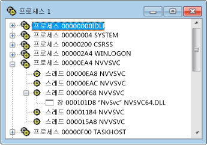

# Processes View
[!INCLUDE[vs2017banner](../code-quality/includes/vs2017banner.md)]

프로세스 뷰에는 시스템에 있는 모든 활성 프로세스의 트리가 표시됩니다.  여기에는 프로세스 ID와 모듈 이름이 표시됩니다.  프로세스 뷰는 특정 시스템 프로세스를 검색하려는 경우에 사용합니다. 일반적으로 시스템 프로세스는 실행 중인 프로그램을 의미합니다.  프로세스는 모듈 이름으로 식별되거나 "시스템 프로세스"로 지정됩니다.  
  
 Microsoft Windows에서는 여러 프로세스를 지원합니다.  각 프로세스에는 하나 이상의 스레드가 있고 각 스레드에는 하나 이상의 최상위 창이 연결되어 있을 수 있습니다.  각 최상위 창에는 여러 창이 있을 수 있습니다.  \+ 기호는 수준이 축소되었음을 나타냅니다.  축소된 뷰는 프로세스당 한 줄로 구성됩니다.  \+ 기호를 클릭하면 수준이 확장됩니다.  
  
 프로세스 뷰는 특정 시스템 프로세스를 검색하려는 경우에 사용합니다. 일반적으로 시스템 프로세스는 실행 중인 프로그램을 의미합니다.  프로세스는 모듈 이름으로 식별되거나 "시스템 프로세스"로 지정됩니다. 프로세스를 찾으려면 트리를 축소하고 목록을 검색합니다.  
  
## 절차  
  
#### 프로세스 뷰를 열려면  
  
1.  **Spy** 메뉴에서 **프로세스**를 선택합니다.  
  
   
Spy\+\+ 프로세스 뷰  
  
 위의 그림에서는 프로세스 노드와 스레드 노드가 확장된 프로세스 뷰를 보여 줍니다.  
  
### 단원 내용  
 [프로세스 뷰에서 프로세스 검색](../debugger/how-to-search-for-a-process-in-processes-view.md)  
 프로세스 뷰에서 특정 프로세스를 찾는 방법에 대해 설명합니다.  
  
 [프로세스 속성 표시](../debugger/how-to-display-process-properties.md)  
 메시지 대한 자세한 내용을 표시하는 방법에 대해 설명합니다.  
  
### 관련 단원  
 [Spy\+\+ 뷰](../debugger/spy-increment-views.md)  
 창, 메시지, 프로세스 및 스레드의 Spy\+\+ 트리 뷰에 대해 설명합니다.  
  
 [Spy\+\+ 사용](../debugger/using-spy-increment.md)  
 Spy\+\+ 도구를 소개하고 사용 방법에 대해 설명합니다.  
  
 [프로세스 검색 대화 상자](../debugger/process-search-dialog-box.md)  
 프로세스 뷰에서 특정 프로세스의 노드를 찾는 데 사용됩니다.  
  
 [프로젝트 속성 대화 상자](../debugger/process-properties-dialog-box.md)  
 프로세스 뷰에서 선택한 프로세스의 속성을 표시합니다.  
  
 [Spy\+\+ 참조](../debugger/spy-increment-reference.md)  
 각 Spy\+\+ 메뉴 및 대화 상자에 대해 설명하는 단원이 포함되어 있습니다.