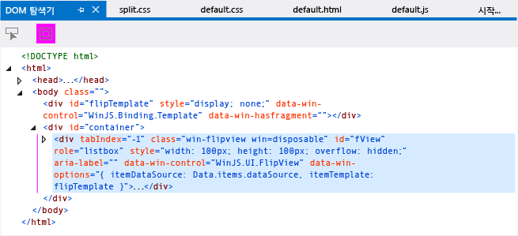
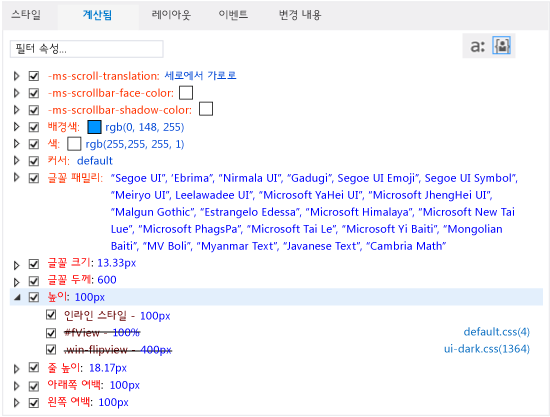
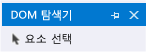

# <a name="debug-html-and-css-in-uwp-apps-in-visual-studio"></a>Visual Studio에서 UWP 앱에서 HTML 및 CSS 디버그
  
 JavaScript 앱의 경우 Visual Studio에서 Internet Explorer 및 Visual Studio 개발자에게 익숙한 기능이 포함된 포괄적인 디버깅 환경을 제공합니다. 이러한 기능은 UWP 앱 및 Apache Cordova 용 도구 Visual Studio를 사용 하 여 만든 앱에 대 한 지원 됩니다.  
  
 DOM 검사 도구에서 제공된 대화형 디버깅 모델을 사용하여 렌더링된 HTML 및 CSS 코드를 보고 수정할 수 있습니다. 디버거를 중지했다 다시 시작하지 않고도 이 모든 작업을 수행할 수 있습니다.
  
 다른 JavaScript 디버깅 JavaScript 콘솔 창 사용 및 중단점 설정, 같은 기능에 대 한 정보 참조 [퀵 스타트: JavaScript 디버그](../debugger/quickstart-debug-javascript-using-the-console.md) 및 [Visual Studio에서 앱 디버깅](../debugger/debug-store-apps-in-visual-studio.md)합니다.  
  
##  <a name="InspectingDOM"></a> 라이브 DOM 검사  
 DOM 탐색기는 렌더링된 페이지의 뷰를 보여 주고, DOM 탐색기를 사용하여 값을 변경하고 변경 결과를 바로 확인할 수 있습니다. 그러면 디버거를 중지했다가 다시 시작하지 않고도 변경 내용을 테스트할 수 있습니다. 이 방법을 사용하여 페이지와 상호 작용할 때 프로젝트의 소스 코드는 변경되지 않으므로 원하는 코드 수정 내용을 찾으면 소스 코드를 변경합니다.  
  
> [!TIP]
>  소스 코드를 변경할 때 디버거를 중지했다가 다시 시작하지 않으려면 디버그 도구 모음에서 **Windows 앱 새로 고침** 단추를 사용하거나 F4 키를 눌러 앱을 새로 고치면 됩니다. 자세한 내용은 참조 하십시오. [(JavaScript) 앱 새로 고침](../debugger/refresh-an-app-javascript.md)합니다.  
  
 DOM 탐색기를 사용하면 다음 작업을 수행할 수 있습니다.  
  
-   DOM 요소 하위 트리를 탐색하고 렌더링된 HTML, CSS 및 JavaScript 코드를 검사합니다.  
  
-   렌더링된 요소에 대한 특성과 CSS 스타일을 동적으로 편집하고 결과를 바로 확인합니다.  
  
-   페이지 요소에 CSS 스타일이 적용된 방식을 검사하고 적용된 규칙을 추적합니다.  
  
 응용 프로그램을 디버깅할 때 주로 DOM 탐색기에서 요소를 선택해야 합니다. 요소를 선택하면 DOM 탐색기 오른쪽 탭에 나타나는 값이 DOM 탐색기에서 선택된 요소를 반영하도록 자동으로 업데이트됩니다. 이러한 탭으로는 **스타일**, **계산됨**, **레이아웃**탭이 있습니다. UWP 앱도 지원 합니다.는 **이벤트** 및 **변경** 탭 합니다. 요소를 선택하는 방법에 대한 자세한 내용은 [Selecting elements](#SelectingElements)을 참조하세요.  
  
> [!TIP]
>  DOM 탐색기 창이 닫혀 있는 경우 **디버그**>**창** > **DOM 탐색기** 를 선택하여 창을 다시 엽니다. 창은 스크립트 디버깅 세션 중에만 나타납니다.  
  
 이후에 나오는 절차에서 DOM 탐색기를 사용하여 응용 프로그램을 대화형으로 디버깅하는 과정을 살펴봅니다. 이때 `FlipView` 컨트롤을 사용하는 응용 프로그램을 만든 다음 디버깅합니다. 앱에는 여러 개의 오류가 포함되어 있습니다.  
  
> [!WARNING]
>  다음 샘플 앱은 UWP 앱입니다. Cordova에 대해서도 동일한 기능이 지원되지만 앱이 다릅니다.  
  
#### <a name="to-debug-by-inspecting-the-live-dom"></a>라이브 DOM을 검사하여 디버그하려면  
  
1.  선택 하 여 Visual Studio에서 새 솔루션을 만들어 **파일** > **새 프로젝트**합니다.  
  
2.  선택 **JavaScript** > **Windows 유니버설**를 선택한 후 **WinJS 앱**합니다.  
  
3.  프로젝트의 이름(예: `FlipViewApp`)을 입력하고 **확인** 을 클릭하여 앱을 만듭니다.  
  
4.  Index.html의 BODY 요소에서이 코드를 추가 합니다.  
  
    ```html  
    <div id="flipTemplate" data-win-control="WinJS.Binding.Template"  
             style="display:none">  
        <div class="fixedItem" >  
              
        </div>  
    </div>  
    <div id="fView" style="width:100px;height:100px"  
        data-win-control="WinJS.UI.FlipView" data-win-options="{  
        itemDataSource: Data.items.dataSource, itemTemplate: flipTemplate }">  
    </div>  
    ```  
  
5.  default.css를 열고 다음 CSS를 추가합니다.  
  
    ```css  
    #fView {  
        background-color:#0094ff;  
        height: 100%;  
        width: 100%;  
        margin: 25%;  
    }  
    ```  
  
6.  default.js의 코드를 다음 코드로 바꿉니다.  
  
    ```javascript  
    (function () {  
        "use strict";  
  
        var app = WinJS.Application;  
        var activation = Windows.ApplicationModel.Activation;  
  
        var myData = [];  
        for (var x = 0; x < 4; x++) {  
            myData[x] = { flipImg: "/images/logo.png" }  
        };  
  
        var pages = new WinJS.Binding.List(myData, { proxy: true });  
  
        app.onactivated = function (args) {  
            if (args.detail.kind === activation.ActivationKind.launch) {  
                if (args.detail.previousExecutionState !==  
                activation.ApplicationExecutionState.terminated) {  
                    // TODO: . . .  
                } else {  
                    // TODO: . . .  
                }  
                args.setPromise(WinJS.UI.processAll());  
  
                updateImages();  
            }  
        };  
  
        function updateImages() {  
  
            pages.setAt(0, { flipImg: "http://public-domain-photos.com/free-stock-photos-1/flowers/cactus-76.jpg" });  
            pages.setAt(1, { flipImg: "http://public-domain-photos.com/free-stock-photos-1/flowers/cactus-77.jpg" });  
            pages.setAt(2, { flipImg: "http://public-domain-photos.com/free-stock-photos-1/flowers/cactus-78.jpg" });  
        };  
  
        app.oncheckpoint = function (args) {  
        };  
  
        app.start();  
  
        var publicMembers = {  
            items: pages  
        };  
  
        WinJS.Namespace.define("Data", publicMembers);  
  
    })();  
    ```  
  
     다음은이 응용 프로그램을 실행 하는 경우 참조 하려는 작업입니다. 하지만 응용 프로그램을 이 상태로 만들려면 먼저 여러 가지 버그를 수정해야 합니다.  
  
       
  
7.  선택 **로컬 컴퓨터** 옆에 있는 드롭다운 목록에서 **디버깅 시작** 단추는 **디버그** 도구 모음:  
  
       
  
8.  **디버그** > **Start 디버그ging**을 선택하거나 F5 키를 눌러 디버그 모드에서 앱을 실행합니다.  
  
     그러면 앱을 실행 되지만 스타일 지정에 몇 가지 버그가 있으므로 대부분 빈 화면이 표시 됩니다. 첫 번째 `FlipView` 이미지가 화면 가운데에 작은 사각형 안에 나타납니다.  
  
10. Visual Studio로 전환하고 **DOM 탐색기** 탭을 다시 선택합니다.  
  
    > [!TIP]
    >  Alt+Tab 또는 F12 키를 눌러 Visual Studio와 실행 중인 응용 프로그램 간에 전환할 수 있습니다.  
  
11. DOM 탐색기 창에서 `"fView"`의 ID가 있는 섹션에 대한 DIV 요소를 선택합니다. 화살표 키를 사용하여 올바른 DIV 요소를 보고 선택합니다. (오른쪽 화살표 키 통해 요소의 자식을 볼 수 있습니다.)  
  
       
  
    > [!TIP]
    >  >> 입력 프롬프트에서 `select(fView)`를 입력한 다음 Enter 키를 눌러 JavaScript 콘솔 창 왼쪽 아래에서 DIV 요소를 선택할 수도 있습니다.  
  
     DOM 탐색기 창의 오른쪽 탭에 나타나는 값이 DOM 탐색기의 현재 요소를 반영하도록 자동으로 업데이트됩니다.  
  
12. 오른쪽의 **계산됨** 탭을 선택합니다.  
  
     이 탭에는 선택한 DOM 요소의 각 속성에 대한 계산된 값 또는 최종 값이 표시됩니다.  
  
13. 높이 CSS 규칙을 엽니다. 표시에 대해 설정 된 100% 높이 값과 일치 하지 않는 100px로 설정 된 인라인 스타일은는 `#fView` CSS 선택기입니다. `#fView` 선택기의 취소선 텍스트는 인라인 스타일이 이 스타일보다 우선함을 나타냅니다.  
  
     다음 그림에는 **계산됨** 탭이 나와 있습니다.  
  
       
  
14. 주 DOM 탐색기 창에서 `fView` DIV 요소의 높이와 너비에 대한 인라인 스타일을 두 번 클릭합니다. 이제 여기에서 값을 편집할 수 있습니다. 이 시나리오에서는 값을 완전히 제거하고자 합니다.  
  
15. 주 창에서 두 번 클릭 `width: 100px;height: 100px;`를 눌러는 **삭제** 키를 누릅니다 **Enter**합니다. Enter를 누르면 디버깅 세션을 중지 하지 않았더라도 새 값 앱에서 다음을 즉시 반영 됩니다.  
  
    > [!IMPORTANT]
    >  DOM 탐색기 창에서 특성을 업데이트할 수 있듯이 **스타일**, **계산됨**및 **레이아웃** 탭에 표시되는 값도 업데이트할 수 있습니다. 자세한 내용은 참조 하십시오. [DOM 탐색기를 사용 하 여 디버그 하는 CSS 스타일](../debugger/debug-css-styles-using-dom-explorer.md) 및 [DOM 탐색기를 사용 하 여 디버그 레이아웃](../debugger/debug-layout-using-dom-explorer.md)합니다.  
  
16. 선택 하거나 Alt + Tab을 사용 하 여 앱을 전환 합니다.  
  
     이제 `FlipView` 컨트롤이 시뮬레이터 또는 Phone 에뮬레이터의 화면 크기보다 크게 보입니다. 그러나 이러한 결과를 의도한 것이 아닙니다. 확인하려면 Visual Studio로 다시 전환합니다.  
  
17. DOM 탐색기에서 **계산됨** 탭을 다시 선택하고 높이 규칙을 엽니다. CSS에서 예상 대로 fView 요소 100% 값이 여전히 표시 되지만 계산 된 값은 응용 프로그램의 화면 높이 (예를 들어 800px 667.67px, 또는 기타 다른 값), 즉,이 응용 프로그램에 원하는 대로 되지 않습니다. 다음 단계에서 확인 하려면 주소에 대 한 너비와 높이 제거는 `fView` DIV 요소입니다.  
  
18. **스타일** 탭에서 `#fView` CSS 선택기의 높이 및 너비 속성의 선택을 취소합니다.  
  
     **계산됨** 탭에 이제 높이가 400px로 표시됩니다. 이는 이 값이 플랫폼 CSS 파일인 ui-dark.css에서 지정한 .win-flipview 선택기에서 왔음을 나타냅니다.  
  
19. 앱으로 다시 전환합니다.  
  
     문제가 많이 해결되었지만 여백이 너무 넓기 때문에 이 문제를 하나 더 해결해야 합니다.  
  
20. 를 조사 하려면 Visual Studio로 전환 하 고 선택 된 **레이아웃** 탭 요소의 상자 모델을 확인 합니다.  
  
     에 **레이아웃** 탭을 다음에 표시 됩니다.  
  
    -   255px (오프셋) 및 255px (여백) 또는 장치 해상도 따라 유사한 값입니다. 
  
     다음 그림에서는 방법을 **레이아웃** 오프셋, 여백 100px와 에뮬레이터를 사용 하는 탭의 모양이).  
  
       
  
     이렇게 하지 않는 올바르지 않은 것 같습니다. **계산됨** 탭에 같은 여백 값도 표시됩니다.  
  
21. **스타일** 탭을 선택하고 `#fView` CSS 선택기를 찾습니다. 여기에 **여백** 속성의 값 25%가 있습니다.  
  
22. 25%를 선택하여 25px로 변경하고 Enter 키를 누릅니다.  
  
23. **스타일** 탭에서도 .win-flipview 선택기에 대한 높이 규칙을 선택하고 400px를 500px로 변경한 후 Enter 키를 누릅니다.  
  
24. 앱으로 다시 전환하여 요소의 위치가 올바르게 표시됨을 확인합니다. 디버거를 중지한 후 다시 시작하지 않고 소스를 고치고 앱을 다시 시작하려면 다음 절차를 참조하세요.  
  
#### <a name="to-refresh-your-app-while-debugging"></a>디버깅하는 동안 응용 프로그램을 새로 고치려면  
  
1.  응용 프로그램이 실행 중인 동안 Visual Studio로 전환합니다.  
  
2.  default.html을 열고 `"fView"` DIV 요소의 높이와 너비를 100%로 변경하여 소스 코드를 수정합니다.  
  
3.  디버그 도구 모음에서 **Windows 앱 새로 고침** 단추를 선택하거나 F4 키를 누릅니다. 단추는 다음과 같습니다: 합니다.  
  
     응용 프로그램 페이지가 다시 로드되고 시뮬레이터 또는 Phone 에뮬레이터가 전경으로 돌아갑니다.  
  
     새로 고침 기능에 대 한 자세한 내용은 참조 하십시오. [(JavaScript) 앱 새로 고침](../debugger/refresh-an-app-javascript.md)합니다.  
  
##  <a name="SelectingElements"></a> Selecting elements  
 응용 프로그램을 디버깅할 때 세 가지 방법으로 DOM 요소를 선택할 수 있습니다.  
  
-   DOM 탐색기 창에서 직접 요소를 클릭하거나 화살표 키 사용  
  
-   **요소 선택** 단추(Ctrl+B) 사용  
  
-   사용 하 여는 `select` 하나인 명령의는 [JavaScript 콘솔 명령](../debugger/javascript-console-commands.md)합니다.  
  
 DOM 탐색기 창을 사용하여 요소를 선택하고 요소에 마우스 포인터를 놓으면 해당 요소가 실행 중인 응용 프로그램에서 강조 표시됩니다. DOM 탐색기에서 요소를 클릭하여 선택해야 합니다. 또는 화살표 키를 사용하여 요소를 강조 표시하고 선택할 수 있습니다. **요소 선택** 단추를 사용하여 DOM 탐색기에서 요소를 선택할 수도 있습니다. 다음 그림에서는 **요소 선택** 단추를 보여 줍니다.  
  
   
  
 **요소 선택** 을 클릭하거나 Ctrl+B를 누르면 실행 중인 응용 프로그램에서 항목을 클릭하여 DOM 탐색기에서 항목을 선택할 수 있도록 선택 모드가 변경됩니다. 이 모드는 한 번 클릭 후에 다시 일반 선택 모드로 변경됩니다. **요소 선택**을 클릭하면 응용 프로그램은 전경으로 돌아가고 커서는 새 선택 모드를 반영하도록 변경됩니다. 윤곽선이 그려진 요소를 클릭하면 지정된 요소가 선택된 상태로 DOM 탐색기가 전경으로 돌아갑니다.  
  
 **요소 선택**을 선택하기 전에 **웹 페이지 하이라이트 표시** 단추를 설정/해제하여 실행 중인 앱의 요소를 강조 표시할 것인지 지정할 수 있습니다. 다음 그림에서는 이 단추를 보여 줍니다. 강조 표시는 기본적으로 표시됩니다.  
  
   
  
 요소를 강조 표시할 경우 시뮬레이터에서 마우스로 가리키는 요소가 강조 표시됩니다. 하이라이트된 요소의 색은 DOM 탐색기의 **레이아웃** 탭에 나타나는 상자 모델과 일치합니다.  
  
> [!NOTE]
>  요소를 마우스로 가리키면 강조 표시되는 기능은 Windows Phone 에뮬레이터에서만 일부 지원됩니다.  
  
## <a name="see-also"></a>참고 항목  
 [Debug apps in Visual Studio](../debugger/debug-store-apps-in-visual-studio.md)   
 [(JavaScript) 앱 새로 고침](../debugger/refresh-an-app-javascript.md)   
 [WebView 컨트롤 디버깅](../debugger/debug-a-webview-control.md)   
 [바로 가기 키](../debugger/keyboard-shortcuts-html-and-javascript.md)   
 [JavaScript 콘솔 명령](../debugger/javascript-console-commands.md)   
 [HTML, CSS 및 JavaScript 샘플 코드 디버깅](../debugger/debug-html-css-and-javascript-sample-code.md)   
 [기술 지원 및 접근성](http://msdn.microsoft.com/library/tzbxw1af\(VS.120\).aspx)